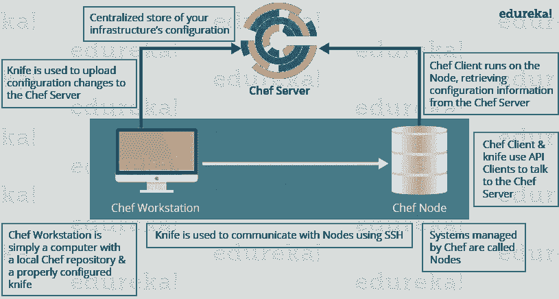

# 顶级厨师面试问题——关于 2021 年的厨师，你需要知道的一切

> 原文：<https://medium.com/edureka/chef-interview-questions-d3efb1f7ccf6?source=collection_archive---------2----------------------->


# 厨师面试问题

chef 是用于配置管理的工具，与 Puppet 竞争激烈。许多大型基础设施组织都使用 chef。所以很有可能你打算面试的公司正在使用它，你可能会被要求回答很多关于 Chef 的问题。如果你想在主厨面试中过上奢华的生活，相信我，这篇关于主厨面试问题的文章是你成功面试的关键。经过与专家的长时间讨论，我列出了最常见的问题。这篇文章一定会让你为你的厨师面试做好准备。

如果您很想知道 Chef 是如何工作的，以及它是如何实现配置管理的，让我们从 Chef 面试问题开始，所以第一个问题必须是:

## Q1。厨师是什么？

从定义厨师开始回答这个问题。

它是一个强大的自动化平台，提供了一种将基础设施转化为代码的方法。chef 是一个工具，您可以为它编写用于自动化流程的脚本。什么流程？几乎所有与之相关的东西。

现在你可以解释 Chef 的架构了，它包括:


Chef Architecture Components



## Q2。什么是 Chef 中的资源？

我的建议是先定义资源。

资源表示一个基础结构及其所需的状态，例如应该安装的包、应该运行的服务或应该生成的文件。一块资源可以被认为是一个配方。

现在你应该解释一下资源的功能，包括以下几点:

*   描述配置项所需的状态。
*   声明使该项达到所需状态所需的步骤。
*   指定资源类型，如包、模板或服务。
*   根据需要列出其他详细信息(也称为资源属性)。
*   被分组到配方中，配方描述了工作配置。

*记住，你在之前的回答中提到了菜谱这个词，所以这篇厨师面试问题文章中的下一个问题必须与菜谱有关。*

## Q3。《大厨》里的菜谱是什么？

这里我也建议你使用上述流程，首先定义配方。

配方是描述特定配置或策略的资源的集合。配方描述了配置部分系统所需的一切。

现在，在定义之后，我将通过包括以下几点来解释配方的功能:

*   安装和配置软件组件。
*   管理文件。
*   部署应用程序。
*   执行其他配方。

## Q4。Chef 中的节点是什么？

这可能是你能遇到的最简单的问题，你可以这样回答:

一个节点代表一个服务器，通常是一个虚拟机、容器实例或物理服务器，基本上是基础架构中由 Chef 管理的任何计算资源。

## Q5。烹饪书和《大厨》中的食谱有什么不同？

这个问题的答案很直接，我的建议是简单地告诉:

配方是资源的集合，主要配置软件包或一些基础设施。一本食谱把食谱和其他信息组织在一起，比只有食谱更容易管理。

*现在，以下一组厨师面试问题将测试您的厨师经验:*

## Q6。如果在 Chef 中没有指定资源的动作，会发生什么？

我的建议是先直接回答。

当您没有指定资源的动作时，Chef 会应用默认动作。

现在用一个例子来解释这一点，下面的资源:

```
file 'C:UsersAdministratorchef-reposettings.ini' do
content 'greeting=hello world'
end
```

与以下资源相同:

```
file 'C:UsersAdministratorchef-reposettings.ini' do
action :create
content 'greeting=hello world'
end
```

因为:创建是文件资源的默认操作。

## Q7。这两个厨师食谱一样吗？

```
package 'httpd' service 'httpd' do action [:enable, :start] end
```

**& &**

```
service 'httpd' do action [:enable, :start] end package 'httpd'
```

不，他们不是。请记住，Chef 按照资源出现的顺序应用资源。所以第一个方法确保安装了 httpd 包，然后配置服务。第二个方法配置服务，然后确保安装软件包。

## Q8。编写一个服务资源，当系统在 Chef 中启动时，该资源会停止然后禁止 httpd 服务启动。

当系统启动时，使用以下资源停止并禁止 httpd 服务启动。

```
service 'httpd' do action [:stop, :disable] end
```

## Q9。厨师应聘和厨师客户有什么不同？

建议你按照下面提到的流程来回答这个问题:

Chef-apply 是一个可执行程序，它从命令行运行单个配方。它是 Chef 开发工具包的一部分，也是一种探索资源的好方法。

Chef-apply 的语法是:

```
chef-apply name_of_recipe.rb
```

厨师-客户应用食谱。它用于生产目的，您通常运行 Chef-client 来应用一个或多个食谱。

## Q10。Chef 中的运行列表是什么？

我的建议是首先解释运行列表的用途

运行列表允许您指定运行哪些配方，以及运行它们的顺序。当你有多本食谱时，运行列表很重要，它们的运行顺序很重要。

根据讨论情况，如果你认为需要更多的解释，只需提及以下几点

运行列表是:

*   按照运行列表中定义的确切顺序运行的角色和/或配方的有序列表；如果一个食谱在运行列表中出现不止一次，厨师客户端将不会运行它两次。
*   总是特定于它运行的节点；节点可以具有与其他节点使用的运行列表相同的运行列表。
*   存储为 Chef 服务器上节点对象的一部分。
*   使用小刀维护，然后从工作站上传到 Chef 服务器，或者使用 Chef 管理控制台维护。

## Q11。在 Chef 中引导需要哪些信息？

只需提及引导所需的信息:

*   您节点的主机名或公共 IP 地址。
*   您可以用来登录节点的用户名和密码。
*   或者，您可以使用基于密钥的身份验证，而不是提供用户名和密码。

## Q12。如何将更新后的 Cookbook 应用到 Chef 中的节点？

有三种方法可以将更新的 Cookbook 应用到一个节点，您可以提到所有人或任何人，我建议您提到这三种方法:

*   从您的工作站运行刀 ssh。
*   SSH 直接进入您的服务器并运行 chef-client。
*   您还可以将 chef-client 作为一个守护进程或服务来运行，以定期检查 chef 服务器，比如每 15 或 30 分钟一次。

## Q13。《大厨》入门套件的作用是什么？

在回答这个问题时，首先要提到初学者工具包的功能。

初学者工具包将创建必要的配置文件，如 chef 目录、knife.rb、ORGANIZATION-validator.pem 和 USER.pem 文件等。提供与 Chef 服务器交互所需的正确信息。

现在告诉如何使用初学者工具包，您可以简单地下载初学者工具包，然后将其移动到工作站上的所需位置。

## Q14。您使用什么命令将菜谱上传到 Chef 服务器？

可以直接提上传菜谱到厨师服务器的命令**“刀菜谱上传”**。

## Q15。一旦你的食谱可以用于生产，你会把它的版本设置成什么？

根据语义版本化，一旦可以在生产中使用，您应该将您的 cookbook 的版本号设置为 1.0.0。

## Q16。《大厨》中使用试吃厨房的地方开发有什么价值？

我会提到以下几点，这会让面试官清楚地了解你对测试厨房的理解。

*   Test Kitchen 使您能够使用各种虚拟化提供者，这些提供者在您的工作站或云中本地创建虚拟机或容器实例。
*   它使您能够在类似于您在生产中使用的服务器上运行您的食谱。
*   它通过自动提供和删除临时实例、解决 cookbook 依赖关系以及将 cookbook 应用于实例来加速开发周期。

## Q17。哪里可以找到由厨师社区编写和维护的可重复使用的烹饪书？

你可以直接回答这个问题，说厨师超市有可重复使用的烹饪书，

一旦你准备好了上面的厨师面试问题，那么你的梦想工作就不远了。

在这篇**厨师面试问题**的文章中，我试图涵盖几乎所有与厨师相关的问题。如果你有任何其他问题，你可以在下面的评论区提出来，你会尽快得到答案。我也会建议在面试之前。

如果你想查看更多关于人工智能、Python、道德黑客等市场最热门技术的文章，你可以参考 [Edureka 的官方网站。](https://www.edureka.co/blog/?utm_source=medium&utm_medium=content-link&utm_campaign=chef-interview-questions)

请留意本系列中解释 DevOps 各个方面的其他文章。

> *1。* [*DevOps 教程*](/edureka/devops-tutorial-89363dac9d3f)
> 
> *2。* [*Git 教程*](/edureka/git-tutorial-da652b566ece)
> 
> *3。* [*詹金斯教程*](/edureka/jenkins-tutorial-68110a2b4bb3)
> 
> *4。* [*码头工人教程*](/edureka/docker-tutorial-9a6a6140d917)
> 
> *5。* [*Ansible 教程*](/edureka/ansible-tutorial-9a6794a49b23)
> 
> *6。* [*木偶教程*](/edureka/puppet-tutorial-848861e45cc2)
> 
> *7。* [*厨师教程*](/edureka/chef-tutorial-8205607f4564)
> 
> *8。* [*Nagios 教程*](/edureka/nagios-tutorial-e63e2a744cc8)
> 
> *9。* [*如何编排 DevOps 工具？*](/edureka/devops-tools-56e7d68994af)
> 
> *10。* [*连续交货*](/edureka/continuous-delivery-5ca2358aedd8)
> 
> *11。* [*持续集成*](/edureka/continuous-integration-615325cfeeac)
> 
> *12。* [*连续部署*](/edureka/continuous-deployment-b03df3e3c44c)
> 
> *13。* [*持续交付 vs 持续部署*](/edureka/continuous-delivery-vs-continuous-deployment-5375642865a)
> 
> *14。* [*CI CD 管道*](/edureka/ci-cd-pipeline-5508227b19ca)
> 
> *15。* [*Docker 作曲*](/edureka/docker-compose-containerizing-mean-stack-application-e4516a3c8c89)
> 
> *16。* [*码头工人群*](/edureka/docker-swarm-cluster-of-docker-engines-for-high-availability-40d9662a8df1)
> 
> *17。* [*Docker 联网*](/edureka/docker-networking-1a7d65e89013)
> 
> *18。* [*易变拱顶*](/edureka/ansible-vault-secure-secrets-f5c322779c77)
> 
> *19。* [*岗位职责*](/edureka/ansible-roles-78d48578aca1)
> 
> 20。 [*可用于 AWS*](/edureka/ansible-for-aws-provision-ec2-instance-9308b49daed9)
> 
> *21。* [*詹金斯管道*](/edureka/jenkins-pipeline-tutorial-continuous-delivery-75a86936bc92)
> 
> *22。* [*顶级 Docker 命令*](/edureka/docker-commands-29f7551498a8)
> 
> *23。*[*Git vs GitHub*](/edureka/git-vs-github-67c511d09d3e)
> 
> *24。* [*顶级 Git 命令*](/edureka/git-commands-with-example-7c5a555d14c)
> 
> *二十五。* [*DevOps 面试问题*](/edureka/devops-interview-questions-e91a4e6ecbf3)
> 
> *二十六。* [*谁是 DevOps 工程师？*](/edureka/devops-engineer-role-481567822e06)
> 
> *27。* [*DevOps 生命周期*](/edureka/devops-lifecycle-8412a213a654)
> 
> *28。*[*Git ref log*](/edureka/git-reflog-dc05158c1217)
> 
> *29。* [*易变条款*](/edureka/ansible-provisioning-setting-up-lamp-stack-d8549b38dc59)
> 
> *30。* [*组织正在寻找的顶尖 DevOps 技能*](/edureka/devops-skills-f6a7614ac1c7)
> 
> *30。* [*瀑布 vs 敏捷*](/edureka/waterfall-vs-agile-991b14509fe8)
> 
> *31。* [*詹金斯小抄*](/edureka/jenkins-cheat-sheet-e0f7e25558a3)
> 
> *32。* [*不可译的备忘单*](/edureka/ansible-cheat-sheet-guide-5fe615ad65c0)
> 
> *33。* [*Ansible 面试问答*](/edureka/ansible-interview-questions-adf8750be54)
> 
> *34。* [*50 码头工人面试问题*](/edureka/docker-interview-questions-da0010bedb75)
> 
> *35。* [*敏捷方法论*](/edureka/what-is-agile-methodology-fe8ad9f0da2f)
> 
> *36。* [*詹金斯面试问题*](/edureka/jenkins-interview-questions-7bb54bc8c679)
> 
> *37。* [*Git 面试问题*](/edureka/git-interview-questions-32fb0f618565)
> 
> 38。 [*码头建筑*](/edureka/docker-architecture-be79628e076e)
> 
> 39。[*devo PS 中使用的 Linux 命令*](/edureka/linux-commands-in-devops-73b5a2bcd007)
> 
> *四十。* [*詹金斯 vs 竹子*](/edureka/jenkins-vs-bamboo-782c6b775cd5)
> 
> *41。* [*Nagios 教程*](/edureka/nagios-tutorial-e63e2a744cc8)
> 
> 42。 [*Nagios 面试问题*](/edureka/nagios-interview-questions-f3719926cc67)
> 
> 43。 [*DevOps 实时场景*](/edureka/jenkins-x-d87c0271af57)
> 
> 44。 [*詹金斯和詹金斯 X 的区别*](/edureka/jenkins-vs-bamboo-782c6b775cd5)
> 
> *45。*[*Windows Docker*](/edureka/docker-for-windows-ed971362c1ec)
> 
> *46。*[*Git vs Github*](http://git%20vs%20github/)

*原载于 2019 年 3 月 29 日*[*https://www.edureka.co*](https://www.edureka.co/blog/interview-questions/chef-interview-questions/)*。*