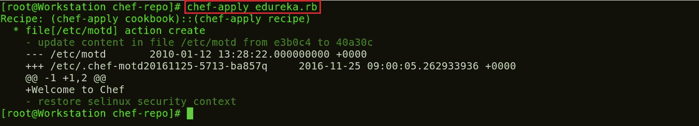

# Chef 教程-将基础设施转化为代码

> 原文：<https://medium.com/edureka/chef-tutorial-8205607f4564?source=collection_archive---------1----------------------->


Chef Tutorial - Edureka

Chef 是一个用于配置管理的工具，与 Puppet 竞争激烈。Chef 是一个自动化工具，它提供了一种将基础设施定义为代码的方式。

本厨师教程将涵盖以下主题:

*   厨师建筑
*   动手演示

本主厨教程博客第一节将为您详细讲解主厨架构，为您扫清所有疑惑。

# 厨师建筑

如下图所示，有三个主要的 Chef 组件:

*   工作站
*   计算机网络服务器
*   节点


Chef Architecture - Chef Tutorial

## **工作站**

工作站是管理所有 Chef 配置的位置。这台机器保存所有的配置数据，这些数据可以在以后推送到中央 Chef 服务器。在将这些配置推送到 Chef 服务器之前，会在工作站中对其进行测试。工作站由一个名为**刀、**的命令行工具组成，用于与 Chef 服务器进行交互。可以有多个工作站一起管理中央 Chef 服务器。


Workstations in Chef - Chef Tutorial

工作站负责执行以下功能:

*   **写烹饪书和食谱，稍后将被推送到中央厨师服务器**
*   **管理中央 Chef 服务器上的节点**

现在，让我们逐一了解上述几点。

## **编写随后将被推送到中央厨师服务器的烹饪书和食谱**

**配方:**配方是描述特定配置或策略的资源的集合。它描述了配置部分系统所需的一切。用户编写食谱，描述 Chef 如何管理应用程序和实用程序(如 Apache HTTP Server、MySQL 或 Hadoop)以及如何配置它们。

这些配方描述了一系列应该处于特定状态的资源，即应该安装的包、应该运行的服务或应该编写的文件。

*稍后在博客*中，我将通过在 Chef Workstation 中编写 ruby 代码，向您展示如何编写在 Chef 节点上安装 Apache2 包的食谱。

**食谱:**多个食谱可以组合在一起形成一本食谱。菜谱定义了一个场景，并包含支持该场景所需的一切:

*   Recipes，指定要使用的资源和应用它们的顺序
*   属性值
*   文件分发
*   模板
*   Chef 的扩展，如库、定义和定制资源

**管理中央 Chef 服务器上的节点**

工作站系统将具有所需的命令行实用程序，以控制和管理中央 Chef 服务器的各个方面。诸如向中央 Chef 服务器添加新节点、从中央 Chef 服务器删除节点、修改节点配置等。，都可以从工作站本身进行管理。

现在让我们看看，执行上述功能需要工作站的哪些组件。

## **工作站有两个主要组件:**

**刀具实用程序:**该命令行工具可用于从工作站与中央厨师服务器通信。添加、删除、更改中央 Chef 服务器中的节点配置将通过使用此刀工具来执行。使用 Knife 工具，可以将食谱上传到中央 Chef 服务器，还可以管理角色和环境。基本上，中央厨师服务器的每一个方面都可以从工作站使用小刀工具进行控制。

**本地 Chef 存储库:**这是存储中央 Chef 服务器的每个配置组件的地方。这个 Chef 存储库可以与中央 Chef 服务器同步(再次使用小刀工具本身)。

## **主厨服务器**

Chef 服务器充当配置数据的中心。Chef 服务器存储 Cookbooks、应用于节点的策略以及描述由 Chef-Client 管理的每个注册节点的元数据。

节点使用 Chef-Client 向 Chef 服务器请求配置细节，比如食谱、模板和文件分发。然后，Chef-Client 在节点本身(而不是在 Chef 服务器上)完成尽可能多的配置工作。每个节点都安装了一个 Chef 客户端软件，该软件将从适用于该节点的中央 Chef 服务器下载配置。这种可扩展的方法将配置工作分布在整个组织中。

## **厨师节点**

节点可以是基于云的虚拟服务器，也可以是您自己的数据中心中的物理服务器，使用 central Chef Server 进行管理。需要出现在节点上的主要组件是一个代理，它将与中央 Chef 服务器建立通信。这叫厨师客户端。

Chef 客户端执行以下功能:

*   它负责与中央 Chef 服务器进行交互。
*   它管理节点到中央 Chef 服务器的初始注册。
*   它下载 Cookbooks 并将其应用到节点上，以对其进行配置。
*   定期轮询中央 Chef 服务器以获取新的配置项目(如果有)。

**厨师的优势:**

如果我不包括 Chef 的主要优点，本 Chef 教程将是不完整的:

*   您可以使用 Chef 自动化整个基础设施。所有手动完成的任务现在都可以通过 Chef 工具完成。
*   您可以使用 Chef 在几分钟内配置数千个节点。
*   Chef automation 可与大多数公共云产品配合使用，如 *AWS* 。
*   Chef 不仅会使事情自动化，还会对系统进行一致的检查，并确认系统确实按照要求的方式进行了配置(Chef 代理/客户完成这项工作)。如果有人在修改文件时犯了错误，Chef 会更正它。
*   整个基础设施可以以 Chef 存储库的形式记录下来，该存储库可以用作从零开始重新创建基础设施的蓝图。

# 亲自动手

在这里，我将向您介绍如何在厨师工作站中创建*菜谱、* *菜谱、*和*模板*。我还将向您解释如何将 Cookbook 从工作站部署到 Chef-Client (Chef 节点)。

我使用两个虚拟映像，一个用于 Chef 工作站，另一个用于 Chef 节点。对于 Chef 服务器，我将使用托管版本的 Chef(在云上)。您也可以使用物理机作为 Chef 服务器。

**第一步:**在你的 Chef 工作站上安装 Chef DK(开发套件)。

Chef DK 是一个包，包含了编写 Chef 代码时需要的所有开发工具。这里是下载 [***厨师 DK***](https://downloads.chef.io/chef-dk/) 的链接。


在这里，选择您正在使用的操作系统。我用的是 CentOS 6.8。所以，我会点击**红帽企业 Linux** 。


根据您使用的 CentOS 版本复制链接。我用的是 CentOS 6，你可以看到我在上面的截图中高亮显示了。

转到您的工作站终端，使用 wget 命令下载 Chef DK 并粘贴链接。

**执行这个:**

```
wget https://packages.chef.io/stable/el/6/chefdk-1.0.3-1.el6.x86_64.rpm
```


该包现在已经下载完毕。是时候使用 rpm 安装这个包了。

**执行此命令:**

```
rpm -ivh chefdk-1.0.3-1.el6.x86_64.rpm
```


厨师 DK 现在已经安装在我的工作站上了。

第二步:在工作站中创建一个配方

让我们从在工作站中创建一个配方开始，并在本地测试它以确保它正常工作。创建一个名为 chef-repo 的文件夹。我们可以在这个文件夹中创建我们的食谱。

**执行这个:**

```
mkdir chef-repo 
cd chef-repo
```


在这个 chef-repo 目录中，我将创建一个名为 edureka.rb 的菜谱。rb 是 ruby 使用的扩展。我将使用 vim 编辑器，你可以使用任何其他编辑器，如 gedit，emac，vi 等。

**执行这个:**

```
vim edureka.rb
```

在此添加以下内容:

```
file '/etc/motd' do
content 'Welcome to Chef'
end
```


这个菜谱 **edureka.rb** 创建一个名为/etc/motd 的文件，内容为“欢迎来到厨师”。

现在我将使用这个食谱来检查它是否有效。

**执行这个:**

```
chef-apply edureka.rb
```



因此在 chef-repo 中创建了一个文件，其内容为**欢迎来到 chef。**

**步骤 3:** 修改配方文件安装 httpd 包

我将修改这个方法，在我的工作站上安装 httpd 包，并将一个 index.html 文件复制到默认的文档根目录，以确认安装。包资源的默认动作是安装，因此我不需要单独指定那个动作。

**执行这个:**

```
vim edureka.rb
```

在这里添加以下内容:

```
package 'httpd'
service 'httpd' do
action [:enable, :start]
end
file '/var/www/html/index.html' do
content 'Welcome to Apache in Chef'
end
```


现在，我将通过执行以下命令来应用这些配置:

**执行这个:**

```
chef-apply edureka.rb
```


命令执行清楚地描述了配方中的每个实例。它安装 Apache 包，在工作站上启用并启动 httpd 服务。它在默认文档根目录下创建一个 index.html 文件，内容为“欢迎使用 Chef 中的 Apache”。

现在，通过打开 web 浏览器来确认 Apache2 的安装。键入您的公共 IP 地址或主机名称。在我的例子中，它是 localhost。


**第四步:**现在我们将创作我们的第一本食谱。

创建一个名为 cookbooks 的目录，并执行下面的命令来生成 Cookbook。

**执行这个:**

```
mkdir cookbooks
cd cookbooks
chef generate cookbook httpd_deploy
```

httpd_deploy 是 Cookbook 的一个名称。你可以给任何你想要的名字。


让我们转到这个新目录 httpd_deploy。

**执行这个:**

```
cd httpd_deploy
```

现在让我们看看创建的 Cookbook 的文件结构。

**执行这个:**

```
tree
```


**第五步:**创建模板文件。

早些时候，我创建了一个包含一些内容的文件，但是这不符合我的食谱和烹饪书的结构。因此，让我们看看如何才能创建一个 index.html 网页模板。

**执行此命令:**

```
chef generate template httpd_deploy index.html
```


现在，如果你看到我的 Cookbook 文件结构，有一个名为 templates with index . html . erb file 的文件夹。我将编辑这个 index.html.erb 模板文件，并将我的食谱添加到其中。参考下面的例子:

转到默认目录

**执行这个:**

```
cd /root/chef-repo/cookbook/httpd_deploy/templates/default
```

在这里，使用您熟悉的任何编辑器编辑 index.html.erb 模板。我将使用 vim 编辑器。

**执行此命令:**

```
vim index.html.erb
```

现在添加以下内容:

```
Welcome to Chef Apache Deployment
```

第六步:用这个模板创建一个食谱。

转到食谱目录。

**执行这个:**

```
cd /root/chef-repo/cookbooks/httpd_deploy/recipes
```

现在，使用您想要的任何编辑器编辑 default.rb 文件。我将使用 vim 编辑器。

**执行这个:**

```
vim default.rb
```

在这里添加以下内容:

```
package 'httpd'
service 'httpd' do
action [:enable, :start]
end
template '/var/www/html/index.html' do
source 'index.html.erb'
end
```


现在，我将返回到我的 chef-repo 文件夹，在我的工作站上运行/测试我的食谱。

**执行这个:**

```
cd /root/chef-repo 
chef-client --local-mode --runlist 'recipe[httpd_deploy]'
```


根据我的食谱，Apache 安装在我的工作站上，服务在引导时被启动和启用。此外，在我的默认文档根目录下创建了一个模板文件。

现在我已经测试了我的工作站。是时候设置 Chef 服务器了。

**步骤 7:** 设置 Chef 服务器

我将在云上使用 Chef 服务器的托管版本，但是您也可以使用物理机。该主厨-服务员出现在[***manage . Chef . io***](http://manage.chef.io/)


如果您没有帐户，请在这里创建一个帐户。创建帐户后，使用您的登录凭据登录。


这就是 Chef 服务器的样子。

如果您是第一次登录，您要做的第一件事就是创建一个组织。组织基本上是您将使用 Chef 服务器管理的一组机器。

首先，我将转到“管理”选项卡。在那里，我已经创建了一个名为 edu 的组织。所以我需要在我的工作站上下载初学者工具包。该初学者工具包将帮助您将文件从工作站推送到 Chef 服务器。单击右侧的设置图标，然后单击初学者工具包。


当您单击那里时，您会看到一个下载初学者工具包的选项。只需单击它即可下载初学者工具包 zip 文件。


将此文件移动到您的根目录。现在在终端中使用 unzip 命令解压这个 zip 文件。您会注意到它包括一个名为 chef-repo 的目录。

**执行这个:**

```
unzip chef-starter.zip
```


现在将这个初学者工具包移动到 chef-repo 目录中的 cookbook 目录。

**执行这个:**

```
mv starter /root/chef-repo/cookbook
```

厨师烹饪书可以在烹饪书超市买到，我们可以去厨师超市。从 ***超市. chef.io*** 下载需要的食谱。我正在下载一本安装 Apache 的食谱。

**执行此命令:**

```
cd chef-repo
knife cookbook site download learn_chef_httpd
```


有为 Apache 食谱下载的 Tar ball。现在，我们需要从这个下载的 Tar 文件中提取内容。为此，我将使用 tar 命令。

```
tar -xvf learn_chef_httpd-0.2.0.tar.gz
```


所有需要的文件都在这个 Cookbook 下自动创建。没有必要做任何修改。让我们检查一下我的食谱文件夹里的食谱描述。

**执行这个:**

```
cd /root/chef-repo/learn_chef_httpd/recipes
cat default.rb
```


现在，我会把这本食谱上传到我的厨师服务器上，因为它看起来很完美。

**步骤 8:** 上传菜谱到厨师服务器。

为了上传我下载的 Apache Cookbook，首先将这个 learn_chef_httpd 文件移动到 chef-repo 中的 Cookbooks 文件夹。然后将您的目录更改为 cookbooks。

执行这个:

```
mv /root/chef-repo/learn_chef_httpd /root/chef-repo/cookbooks
```

现在转到这个 cookbooks 目录。

**执行这个:**

```
cd cookbooks
```

现在在这个目录中，执行下面的命令来上传 Apache Cookbook:

**执行这个:**

```
knife cookbook upload learn_chef_httpd
```


从 Chef 服务器管理控制台验证食谱。在策略部分，您将找到您上传的食谱。参考下面的截图:


现在我们的最后一步是添加 Chef 节点。我已经设置了一个工作站和一个 Chef 服务器，现在我需要将我的客户端添加到 Chef 服务器以实现自动化。

**第九步:**向 Chef 服务器添加 Chef 节点。

出于演示目的，我将使用一台 CentOS 机器作为 Chef 节点。一台 Chef 服务器上可能会连接数百个节点。我的节点机器的终端颜色与工作站不同，这样您就能够区分两者。

我只需要我的节点的 IP 地址，因为我将在我的节点机器上执行下面的命令。

**执行这个:**

```
ifconfig
```


我将通过执行 Knife Bootstrap 命令将我的 Chef 节点添加到服务器，在该命令中，我将指定 Chef 节点的 IP 地址及其名称。执行如下所示的命令:

**执行这个:**

```
knife bootstrap 192.168.56.102 --ssh-user root --ssh-password edureka --node-name chefNode
```


该命令还将初始化 Chef 节点中 Chef-Client 的安装。您可以在工作站的 CLI 中使用 knife 命令进行验证，如下所示:

**执行这个:**

```
Knife node list
```


您也可以从 Chef 服务器进行验证。转到服务器管理控制台中的 nodes 选项卡，在这里您会注意到您添加的节点已经存在。参考下面的截图。


**第十步:**管理节点运行列表

让我们看看如何向节点添加一个 Cookbook，并从 Chef 服务器管理它的运行列表。正如您在下面的屏幕截图中看到的，单击 Actions 选项卡并选择 Edit Run list 选项来管理运行列表。


在可用的食谱中，您可以看到我们的 learn_chef_httpd 食谱，您可以将它从可用的包中拖到当前运行列表中，并保存运行列表。


现在登录到您的节点，运行 chef-client 来执行运行列表。

**执行这个:**

```
chef-client
```


我希望您喜欢这篇 Chef 教程，并了解了如何使用 Chef 来配置数百个节点。厨师在许多组织中发挥着至关重要的作用，以实现发展目标。有了 Chef，组织可以更频繁、更可靠地发布应用程序。

关于厨师教程的博客到此结束。如果你想查看更多关于人工智能、Python、道德黑客等市场最热门技术的文章，你可以参考 Edureka 的官方网站。

请留意本系列中的其他文章，它们将解释 DevOps 的各个方面。

> *1。* [*DevOps 教程*](/edureka/devops-tutorial-89363dac9d3f)
> 
> *2。* [*饭桶教程*](/edureka/git-tutorial-da652b566ece)
> 
> *3。* [*詹金斯教程*](/edureka/jenkins-tutorial-68110a2b4bb3)
> 
> *4。* [*Docker 教程*](/edureka/docker-tutorial-9a6a6140d917)
> 
> *5。* [*Ansible 教程*](/edureka/ansible-tutorial-9a6794a49b23)
> 
> *6。* [*傀儡教程*](/edureka/puppet-tutorial-848861e45cc2)
> 
> *7。* [*Nagios 教程*](/edureka/nagios-tutorial-e63e2a744cc8)
> 
> *8。* [*如何编排 DevOps 工具？*](/edureka/devops-tools-56e7d68994af)
> 
> 9。 [*连续交货*](/edureka/continuous-delivery-5ca2358aedd8)
> 
> *10。* [*持续集成*](/edureka/continuous-integration-615325cfeeac)
> 
> *11。* [*连续部署*](/edureka/continuous-deployment-b03df3e3c44c)
> 
> *12。* [*连续交付 vs*](/edureka/continuous-delivery-vs-continuous-deployment-5375642865a)
> 
> *13。* [*CI CD 管道*](/edureka/ci-cd-pipeline-5508227b19ca)
> 
> *14。* [*Docker 作曲*](/edureka/docker-compose-containerizing-mean-stack-application-e4516a3c8c89)
> 
> *15。* [*码头工人群*](/edureka/docker-swarm-cluster-of-docker-engines-for-high-availability-40d9662a8df1)
> 
> *16。* [*Docker 联网*](/edureka/docker-networking-1a7d65e89013)
> 
> *17。* [*可能的角色*](/edureka/ansible-roles-78d48578aca1)
> 
> *18。* [*天穹*](/edureka/ansible-vault-secure-secrets-f5c322779c77)
> 
> *19。* [*适用于 AWS*](/edureka/ansible-for-aws-provision-ec2-instance-9308b49daed9)
> 
> *20。* [*詹金斯*](/edureka/jenkins-pipeline-tutorial-continuous-delivery-75a86936bc92)
> 
> *21。* [*顶级 Git 命令*](/edureka/git-commands-with-example-7c5a555d14c)
> 
> *22。* [*顶级 Docker 命令*](/edureka/docker-commands-29f7551498a8)
> 
> *23。*[*Git vs GitHub*](/edureka/git-vs-github-67c511d09d3e)
> 
> *24。* [*DevOps 面试题*](/edureka/devops-interview-questions-e91a4e6ecbf3)
> 
> 25。 [*谁是 DevOps 工程师？*](/edureka/devops-engineer-role-481567822e06)
> 
> *26。* [*DevOps 生命周期*](/edureka/devops-lifecycle-8412a213a654)
> 
> *27。*[*Git ref log*](/edureka/git-reflog-dc05158c1217)
> 
> 28。 [*不可预见的准备*](/edureka/ansible-provisioning-setting-up-lamp-stack-d8549b38dc59)
> 
> *29。* [*组织正在寻找的顶尖 DevOps 技能*](/edureka/devops-skills-f6a7614ac1c7)
> 
> 三十。 [*瀑布 vs 敏捷*](/edureka/waterfall-vs-agile-991b14509fe8)
> 
> *31。* [*Maven 用于构建 Java 应用*](/edureka/maven-tutorial-2e87a4669faf)
> 
> *32。* [*詹金斯小抄*](/edureka/jenkins-cheat-sheet-e0f7e25558a3)
> 
> *33。* [*易答备忘单*](/edureka/ansible-cheat-sheet-guide-5fe615ad65c0)
> 
> *34。* [*Ansible 面试问答*](/edureka/ansible-interview-questions-adf8750be54)
> 
> *35。* [*50 码头工人面试问题*](/edureka/docker-interview-questions-da0010bedb75)
> 
> *36。* [*敏捷方法论*](/edureka/what-is-agile-methodology-fe8ad9f0da2f)
> 
> *37。* [*詹金斯面试问题*](/edureka/jenkins-interview-questions-7bb54bc8c679)
> 
> *38。* [*Git 面试问题*](/edureka/git-interview-questions-32fb0f618565)
> 
> *39。* [*Docker 架构*](/edureka/docker-architecture-be79628e076e)
> 
> *40。*[*devo PS 中使用的 Linux 命令*](/edureka/linux-commands-in-devops-73b5a2bcd007)
> 
> *41。* [*詹金斯 vs 竹子*](/edureka/jenkins-vs-bamboo-782c6b775cd5)
> 
> *42。* [*Nagios 面试问题*](/edureka/nagios-interview-questions-f3719926cc67)
> 
> *43。* [*DevOps 实时场景*](/edureka/jenkins-x-d87c0271af57)
> 
> 44。 [*詹金斯和詹金斯 X 的区别*](/edureka/jenkins-vs-bamboo-782c6b775cd5)
> 
> *45。*[*Windows Docker*](/edureka/docker-for-windows-ed971362c1ec)
> 
> *46。*[*Git vs Github*](http://git%20vs%20github/)

*原载于 2016 年 12 月 7 日*[*www.edureka.co*](https://www.edureka.co/blog/chef-tutorial/)*。*