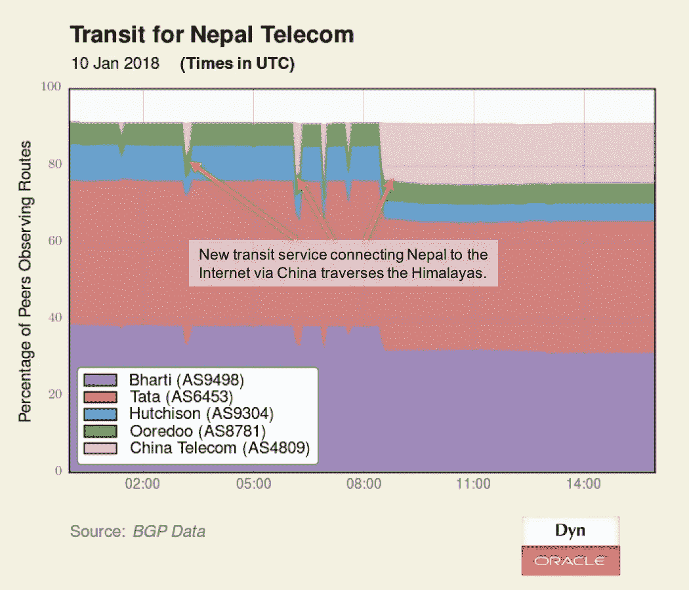
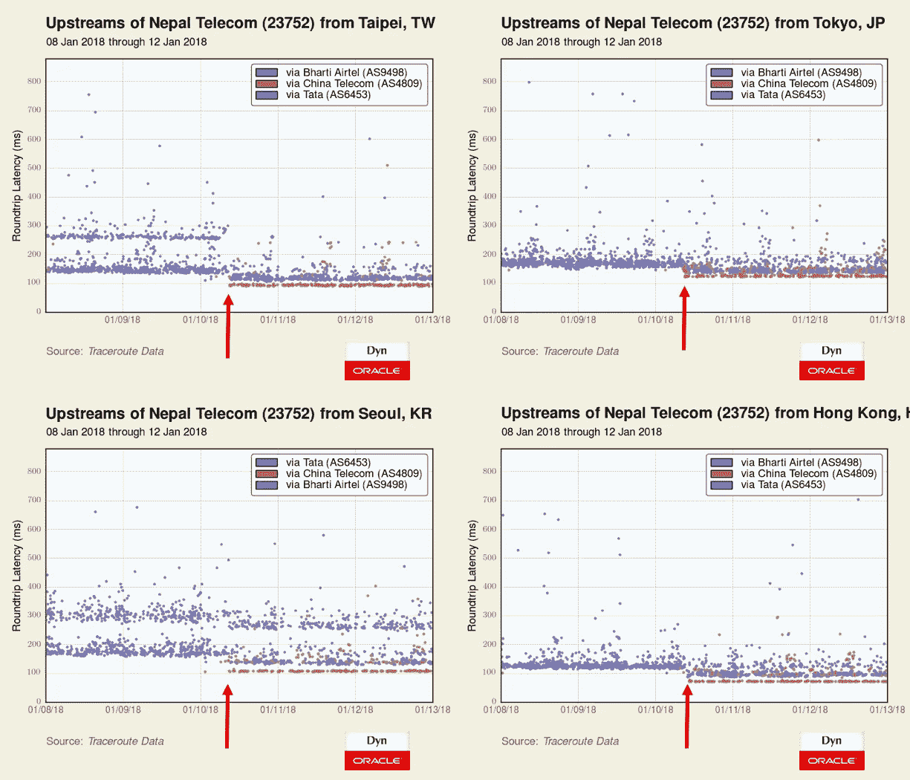
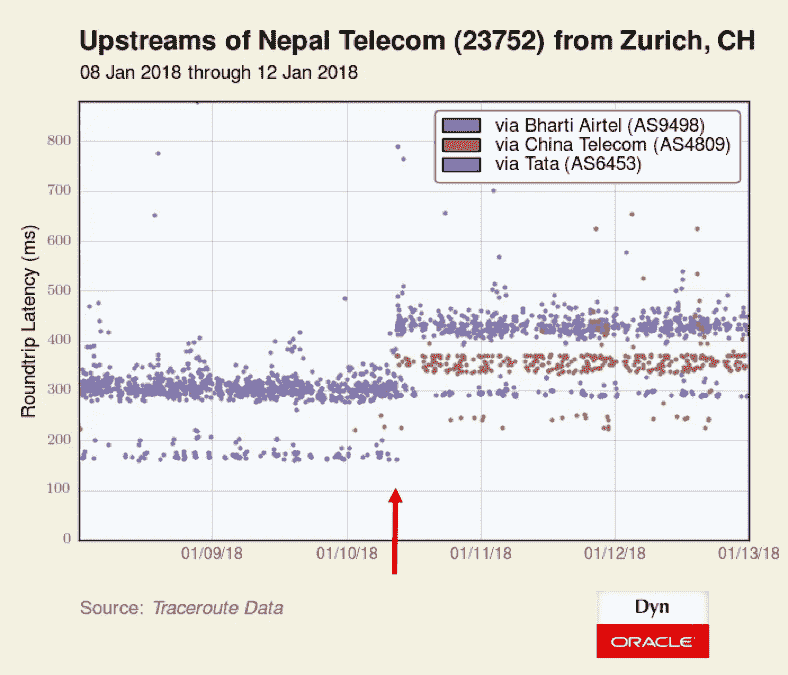

# 中国激活喜马拉雅山与尼泊尔的历史联系

> 原文：<https://medium.com/oracledevs/china-activates-historic-himalayan-link-to-nepal-becfca0c3c15?source=collection_archive---------7----------------------->

2018 年 1 月 10 日，中国电信[开通了](http://lirneasia.net/2018/01/nepal-ends-indian-monopoly-nepal-telecoms-monopoly-next/)一条[期待已久的通往内陆国家尼泊尔的陆地链路](https://www.telegeography.com/products/commsupdate/articles/2010/06/21/nt-plans-fibre-optic-link-with-china/)。新的光纤连接穿越喜马拉雅山脉，改变了尼泊尔对印度的独家依赖的一个重要方面，使力量平衡(至少在国际连接方面)向加德满都倾斜。

> *中国成为尼泊尔第二大服务提供商，打破了印度对尼泊尔互联网接入的垄断。*[*#中国*](https://twitter.com/hashtag/China?src=hash&ref_src=twsrc%5Etfw)*[*#互联网*](https://twitter.com/hashtag/Internet?src=hash&ref_src=twsrc%5Etfw)[*https://t.co/sQEM7aqCms*](https://t.co/sQEM7aqCms)*
> 
> **—印度教徒(@ The _ Hindu)*[*2018 年 1 月 13 日*](https://twitter.com/the_hindu/status/952062671167385601?ref_src=twsrc%5Etfw)*

*自 11 月中旬以来进行了多次短暂的尝试后，尼泊尔电信于 2018 年 1 月 10 日 08:28 UTC 从中国电信全面激活互联网中转，如下所示。*

**

***背景***

*在我们 2015 年关于摧毁尼泊尔的地震的报道中，我写道:*

> *尼泊尔和不丹都是南亚内陆国家，夹在印度和中国之间，许多服务都依赖印度，包括电信。因此，每个国家都在争取中国的参与，这将提供一个冗余的互联网连接来源。*

*2016 年 12 月，中国电信全球(CTG)的高管燕鸥和尼泊尔电信的高管洛昌·拉尔·阿玛蒂亚(如下图)[签署了一项协议](https://www.gadgetsinnepal.com.np/nepal-telecom-china-telecom-global-agreement/)，通过一条连接中国吉隆县和尼泊尔拉苏瓦区的新地面电缆路由 IP 服务。*

**

*上周，连接中国的光纤终于开通，并建立了尼泊尔第一个冗余的国际中转源。穿过中国的光纤线路将为尼泊尔带来几个明显的好处。*

*首先，如果到印度的链路出现故障，无论是由于地震、光纤中断还是任何其他灾难性的技术故障，它都能提供弹性。其次，它为尼泊尔提供了额外的带宽，尽管目前尚不清楚带宽不足是否限制了该国的互联网发展。最后，由于有了第二个国际中转来源，尼泊尔在服务条款和价格谈判方面比完全受制于印度航空公司时处于更有利的地位。*

***性能变化***

*从对尼泊尔电信的性能影响来看，我们可以看到，来自远东地区的流量通常会沿着香港到尼泊尔的链路加速，而来自一些西欧国家的连接可能会变慢。*

*下图描绘了我们在台北、东京、首尔和香港的测量服务器到尼泊尔电信的延迟。在每种情况下，当新的中国电信服务于 1 月 10 日启动时，延迟时间都有所减少。*

**

*令人惊讶的是，苏黎世的延迟增加了(如下图)。*

**

*在本例中，由于通过 Bharti Airtel 的延迟在传输激活时增加，我们可以推测这可能是由于这些往返测量的不可观察的返回路径的变化。新的返回路径最有可能是通过中国电信，因为前向路径保持不变。*

*尽管如此，尼泊尔已经出现了一种全新的穿越中国的交通模式。*

***结论***

*这一发展对尼泊尔的好处是显而易见的:更便宜、更有弹性的国际互联网带宽。但是中国也有收获。*

*中国传统贸易路线沿线国家的基础设施投资是其[一带一路](https://en.wikipedia.org/wiki/One_Belt_One_Road_Initiative)外交政策议程的核心。通过在周边国家投资(比如一条通往尼泊尔的光缆)，中国希望在获得政治和军事影响力的同时，也能在贸易中获益。*

*当许多美国人关注美国和中国争夺地区影响力的时候，中国和印度却陷入了争夺南亚影响力的争斗。中国将互联网直接连接到尼泊尔，迈出了重要的一步。*

*尽管地理位置相似的不丹也将从与其北部邻国的直接互联网连接中受益，但最近世界上两个人口最多的国家因小国不丹而加剧的紧张局势使得这一技术进步暂时不太可能。还好不丹的[国民幸福总值](http://www.grossnationalhappiness.com/articles/)指标没有衡量互联网的弹性。至少，还没有。*

**原载于 2018 年 1 月 16 日*[*blogs.oracle.com*](https://blogs.oracle.com/internetintelligence/china-activates-historic-himalayan-link-to-nepal)*。**