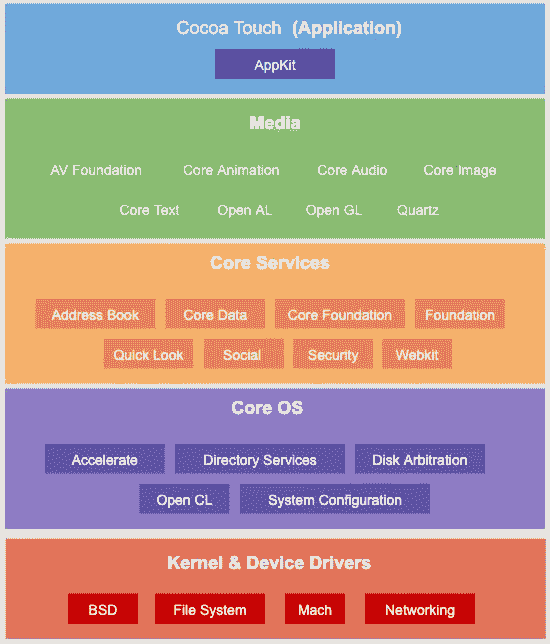
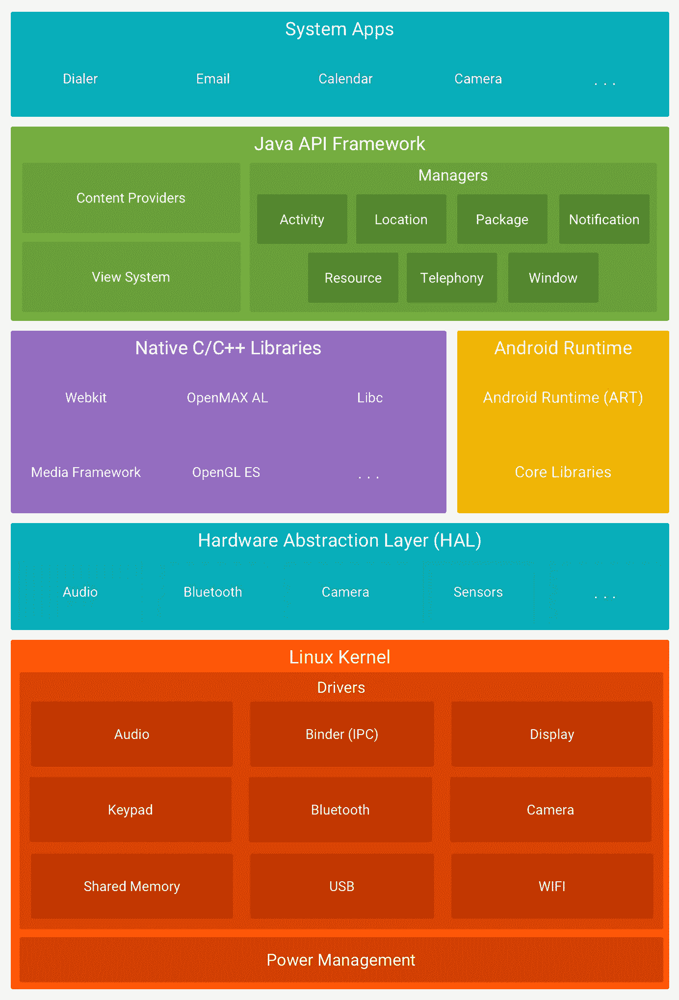
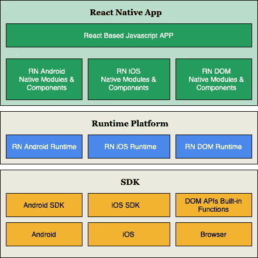
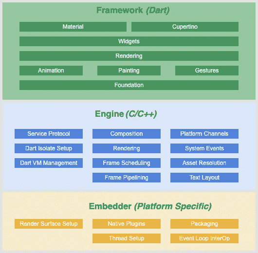

# 为您的下一个应用选择合适的移动技术

> 原文：<https://medium.com/globant/choose-the-right-mobile-technology-for-your-next-application-a96bc1fbfcfa?source=collection_archive---------6----------------------->

随着全球服务的数字化和面向移动用户，我们每天都会看到越来越多的应用程序被发布。在创建移动应用时，最重要的问题是使用哪种技术。我们应该使用原生应用、交叉编译的原生应用还是混合应用？在本文中，我们将根据以下标准比较本地应用和交叉编译应用(ReactNative 和 Flutter ):

1.  编程语言和技术架构
2.  UI 组件和开发 API
3.  开发人员生产力
4.  其他一些方面，如成本、性能等。

# 编程语言和技术架构

## ios

iOS Architecture Diagram

原生 iOS 应用使用 Objective C 或 Swift 开发。虽然 Swift 易于学习和使用，但 Objective C 的学习曲线相当陡峭。Swift 可与 Objective C 互操作。

应用程序代码使用 Cocoa Touch 框架，该框架依赖于音频、视频、图形等的媒体层。核心服务提供基础，核心操作系统处理分区、系统配置等底层功能。内核处理硬件通信，如网络、文件系统等等。

## 机器人

Android Architecture Diagram

原生 Android 应用程序是使用 Java 或 Kotlin 开发的。Java 非常庞大，而 Kotlin 易于学习和使用，并且在 Android 应用程序开发方面提供了更多。Kotlin 可与 Java 互操作。

应用程序代码依赖于提供视图系统和各种管理器的 Java 框架 API。当代码被编译时，它被转换成。HAL 层提供访问硬件的接口，Linux 内核负责硬件通信和执行命令。

## 反应物

ReactNative Architecture Diagram

RN apps 是用 Javascript 和 React 框架开发的。JS 代码运行在 Javascript VM 上，并使用 Javascript 核心引擎通过 RN bridge 与本机组件进行交互。RN 可以被认为是一组 React 组件，其中每个组件代表相应的本地视图和组件。自定义协议用于消息传递。

## 摆动

Flutter Architecture Diagram

Flutter 使用 Dart 作为编程语言。Dart 不像 Java、Kotlin 或 Swift 那样完美，但它的发展速度非常快。Dart 也是 Fuschia(谷歌的新操作系统)的官方语言。

框架层提供了在 Flutter 中开发应用程序所需的一切。框架层与负责事件、渲染、虚拟机管理等的引擎(底层代码)交互。Embedder 在创建应用程序时提供了本机插件、事件循环处理、线程和打包。像 ReactNative 一样，你可以使用 Flutter 获得原生应用，并可以上传到商店。

# UI 组件和开发 API

本地平台提供了大量的 UI 组件和它们的 SDK。开发应用程序可能需要的几乎所有类型的 UI 组件都是可用的。如果愿意，您还可以创建自己的自定义 UI 组件。Android UI 主要是在 XML 文件中创建的(虽然你也可以用代码创建 UI)，iOS 使用 Xib 和 StoryBoard(拖拽)。你现在也可以在 Android 中使用类似故事板的功能，但是如果你习惯了 XML，有时会感到困惑。类似地，在 iOS 中通过检查元素来修改故事板是乏味且容易出错的。Android 和 iOS 现在都分别提供了使用 Jetpack Compose 和 Swift UI 的声明式 UI。

Flutter 也有一个非常好的 UI 元素集合，称为小部件。您可以将多个小部件组合成彼此的子部件，并根据自己的意愿创建和定制您的小部件。Flutter 提供了使用材料设计或 Cupertino 的选项，方便您使用，UI 元素非常类似于原生应用程序。然而，Flutter 使用 Skia Canvas 直接使用 GPU 以 60fps 的速度渲染 UI，从而实现快速流畅的渲染。声明式 UI 是标准(没有 XML 或故事板)

RN 的 UI 组件非常有限。但是有大量的第三方元素可用。RN 依赖于桥来将 UI 转换为本地 UI，并且在复杂 UI 的情况下，该事务会导致延迟呈现。React 可能是第一个采用声明式 UI 方式的。

谈到开发 API，原生 SDK 提供了开发应用程序以及与平台和硬件交互的所有基本 API。Flutter/Dart 和 RN 提供非常丰富的 SDK 和第三方集成来与原生平台通信，它们在竞赛中大多落后于原生平台。这通过包含本地特定代码和创建桥来补偿，以便将它们暴露给 RN/Flutter 模块。

# 开发人员生产力

我们将根据安装和设置、文档和社区支持、测试和调试来衡量开发人员的生产力。

## 安装和设置

虽然本地应用程序开发的安装和设置非常简单(使用 IDE 中的内置插件下载 IDE——iOS 的 XCode 或 Android Studio for Android 和相应的 SDK ),但 Flutter 和 RN 的设置需要额外的步骤和 CLI 命令。Flutter 插件可用于 Android Studio，并且比 RN 更容易。

## 文档和社区支持

在开始应用程序开发时，开发人员非常依赖文档，而 iOS 和 Android 在这方面都很出色。从安装到设置，从 API 到应用程序部署，您可以在各自的商店中找到开发过程所需的一切。Flutter 也有很好的文档，RN 最近开始做得更好。他们都以出色的社区支持而自豪。考虑到相对较新，Flutter 在这方面有所欠缺，但它正在一天天变得更好。RN 严重依赖于第三方库和集成，因此更新到新版本会导致不同库中的版本冲突，并且变得非常混乱。

## 测试和调试

Native 提供了内置的测试框架和调试工具，Flutter 也是如此。RN 在这个部门有点欠缺。要进行调试，你需要依赖 Chrome 浏览器调试控制台(因为 RN 也可以与 web 一起工作),并且测试有第三方框架。

他们都有良好的 CI/CD 支持，使用各种平台，如浪子，詹金斯，CodeMagic 等。

# 一些其他方面

## 费用

使用原生技术为 Android 和 iOS 构建应用程序的成本翻了一番，因为个人开发人员需要用各自的语言创建 UI 和编写代码。在 RN 或 Flutter 中开发应用程序可以大大减少这种情况，因为几乎所有的业务逻辑和 UI 组件都是共享的。虽然与思维过程相反，但并不完全变成一半。如果 RN 或 Flutter 中没有提供支持，人们可能会以本地代码编写部分应用程序。这两种跨平台技术都支持 Web 应用程序(Flutter 还在实验阶段),因此如果 Web 也是目标的话，可以进一步降低成本。加上维护和支持成本，跨平台优于本地平台。

## 表演

尽管跨平台技术被编译为本地技术(在很大程度上)，但是在本地技术中开发的应用程序的性能更好。对于小而简单的应用程序，性能是相同的，很难注意到。但是如果你想要高性能的应用程序，native 是个不错的选择。在 RN 和颤振之间，在简单 ui 的情况下，裕度非常小。对于复杂的 UI，Flutter 似乎比 RN 更有优势，因为 Flutter 使用 Skia 直接在画布上渲染，而 RN 使用 bridge 来渲染原生 UI 组件，因此有时会滞后。

## 空中更新

这只适用于注册护士。ReactNative 可以提供 OTA 更新，而不是每次修改源代码就发布应用。这意味着，当你修复了小问题或决定改变主题或一些资产时，你不需要在各自的商店发布新版本的应用程序。JS 捆绑包可以在后台下载，版本控制可以在新的捆绑包可用时进行，从而减少了存储库中的候选版本。[查看此](/react-native-training/understanding-react-native-deployments-6e54157920b7)了解更多详情。

有很多方法可以为 Flutter 和原生技术提供新的主题、图片和一些资源，但是需要做很多工作。但是，逻辑更改和源代码更改需要在各自的存储上发布新版本。

## 即时应用

Android 支持即时应用。它不需要用户安装应用程序来使用它。该应用程序的一部分可以使用，一旦完成就可以丢弃，不会在设备中留下任何痕迹。然而，在开发应用程序时，创建即时应用程序需要非常健壮的模块化架构。

# 结论

没有灵丹妙药。在选择技术之前，你需要决定最重要的因素。本机架构旨在提供高性能和硬件支持，易于安装和使用。跨平台提供一次编写随处运行(包括网络)，因此大大降低了成本，使其成为 MVP(最小可行产品)和简单应用程序的绝佳选择。

在跨平台之间做出选择是一个更难的选择。对于一个已经精通 React 和 Javascript 的开发团队来说，RN 更有意义。如果应用程序在这段时间变得复杂，你可能会发现自己陷入困境，因为 Airbnb 经历了惨痛的教训。本地移动开发团队可以很容易地学习 Dart (Flutter ),因为它主要是面向对象的语言。Flutter 即将推出，Dart 的目标是 Java(前端、后端、嵌入式)等一切，也是 Fushcia 的首选(如果它看到了曙光)。

这是你考虑所有因素后做出的选择。明智地选择更适合你的。这关系到你的产品。