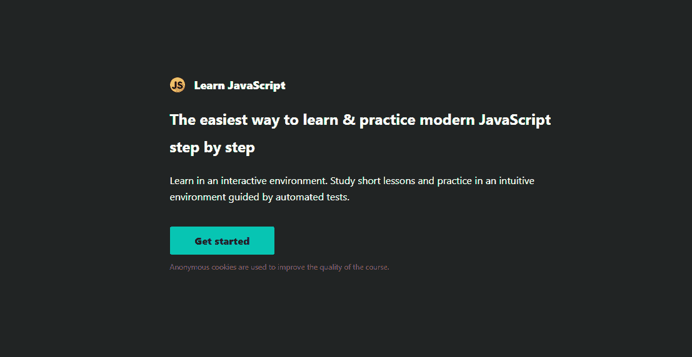
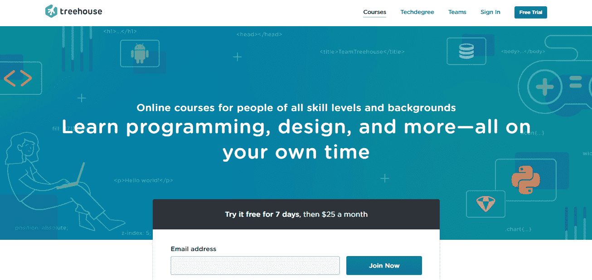
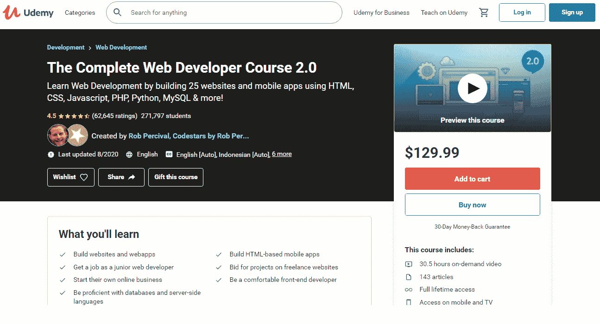

# 选择符合你目的的编程课程

> 原文：<https://medium.com/quick-code/choosing-a-programming-course-matching-your-purposes-f48610c60e1c?source=collection_archive---------1----------------------->

Photo by [Timothy Dykes](https://unsplash.com/@timothycdykes?utm_source=unsplash&utm_medium=referral&utm_content=creditCopyText) on [Unsplash](https://unsplash.com/?utm_source=unsplash&utm_medium=referral&utm_content=creditCopyText)

你知道有人愿意把时间和金钱花在可能根本不起作用的东西上吗？我也是。

同样的方法也适用于编程课程。事实是，没有完美的教育计划——当一个学生发现课程最适合和最有效时，另一个学生不会认真对待它。这完全取决于你开始学习编程时设定的目标和个人喜好。那么，你怎样才能找到满足你特殊需求的课程呢？

在这篇文章中，我将减轻你的痛苦，并分享一些技巧，帮助你确定什么课程最适合你。你会知道在选择学习网站时要考虑哪些事情。除此之外，为了让你省去在网上搜索最适合的课程的麻烦，我列出了一个小小教育平台的清单。

# 为什么要学编程？

所以，你决定成为一名开发人员，但不知道从哪里开始？如果我是你，我会确定我想成为什么类型的程序员。

你创建网站和网络应用程序的意图将引导你进行网络编程，而制作客户端软件(如 Microsoft Office)或图形编辑器(如 Adobe Ps)需要桌面应用程序开发人员的技能。如果你想交付高负载的企业软件，考虑为你未来的职业选择分布式应用或系统编程。最后，创建移动应用和游戏需要你掌握相应的移动或游戏开发者的技能。

当然，有特定的想法会让你的选择更容易。然而，我也认识许多对编程感兴趣的新手，但仍然不知道是哪种类型的。这就是我建议从头脑风暴开始做出明智决定的地方。问问你自己:

*   我学编程是为了什么——职业还是常识？
*   如果一个职业是你选择的，那就决定你想去什么样的公司工作。
*   这类公司用的是什么编码语言？
*   在其他领域有多受欢迎？
*   有足够的资源来学习那种语言吗？
*   这种语言已经存在多久了？它上面建了多少知名项目？

回答这些问题会让你更好地知道下一步该怎么走，而下面列出的用于不同领域的编程语言可能会理清细节。

*   企业级服务器应用——Java。
*   移动应用——Java/kot Lin/Swift。
*   游戏——c++和虚幻引擎，C#配 Unity 引擎。
*   驱动程序、操作系统— C 语言。
*   网站——JavaScript 或 TypeScript 用于前端，Python 或 Ruby 用于后端。
*   大数据、金融、交易——Java。

# 选择编程课程时要考虑的事情

所以，你已经确定了你想成为什么类型的程序员，并选择了合适的编程语言。下一步是什么？在选择一门完美的学习课程时，坚持以下清单。

# 理论与实践之间的平衡

在学习编码时，理论是至关重要的，然而，如果没有后续的实践，理论是不那么有效的。虽然许多课程都有这样或那样的方式，但我强烈建议努力找到一个理想的 20/80 比例的项目，其中理论占 20%，实践占 80%。对你来说意味着你会花 20%的时间看书，听播客，或者看 YouTube 上的视频。剩下的 80%的时间将花在编码上。

当选择正确的课程时，也要确保它允许解决问题和实践经验。如果没有编码和解决问题的实际技能，当涉及到实际项目时，您可能会遇到困难。解决问题的能力让你能够分析原因和结果，理解层次结构，调试和重构，这些在编程领域都很重要。所以，在选择编程类的时候，要确保它能让你自己解决问题。

我的另一个个人建议是坚持每周编程 3 到 6 次。在一天中选择一个特定的时间来做这件事，并坚持这个时间表。这样在自学编码的同时，可以避免倦怠，不会失去动力。

# 课程结构

好的课程是结构良好的课程。它应该有逻辑地构建，按部分排序，并提供一个基准 aka 课程地图。后者将帮助你跟踪你的进度，看看还有多少部分需要完成。除此之外，确保课程结构是公开的，每个人都可以方便地访问。如果没有，这应该会提醒您—请联系客户服务代理进行澄清。

# 创造者是谁？

学习编程最好的方法就是向从业者学习。除了获得的知识之外，他们更了解什么有用，什么没用，或者什么对你更有用。他们有智慧，你可以从中获得洞察力。因此，确保你找到的编程课程是由专业开发人员创建的，这样你就可以成为你渴望成为的人。

这种信息并不总是可用的，但如果可用，这将增加课程的价值。关于创建者的详细信息可以在“关于我们”页面或课程描述中找到。

# 要添加到列表中的附加功能

虽然课程结构及其创建者是需要考虑的重要标准，但在寻找教育资源时，您也应该记住一些可选功能。

*   代码验证。每次你写代码的时候都需要检查，以避免任何错误或者及时识别错误。这样，您可以从错误中吸取教训，并在下次使您的代码更整洁。最常用的验证代码的方法包括由机器人或指派给你的指导者进行检查。
*   移动应用。每个人都在移动中，并不总是有机会接触到电脑，将欣赏使用手机完成课程的能力。
*   开发环境集成。没有多少教育项目在他们的课程中实现集成开发环境。然而，它将常见的活动(如编辑源代码、构建可执行代码和调试)合并到一个应用程序中，从而提高了程序员的生产率。
*   认证。检查你选择的课程是否能让你在完成后获得证书，这样你就可以将它添加到你的 LinkedIn 个人资料中，或者在面试时提供给招聘人员。

# 社区

当你知道在绝望或面临问题时有人可以依靠时，这条路会变得更容易。这就是为什么选择有一个强大的、支持性的社区将学生聚集在一起的课程是很重要的。也检查一下这个平台是否有一个论坛，在那里你可以迅速得到你的问题的答案，并且在需要的时候寻求帮助。

# 传递一些建议

当你刚刚开始学习编程时，找一个有丰富经验的人给你推荐一门课程总是一个好主意。今天，我将为你做这个人，分享一些极其有用的课程，带你从零到英雄。

在开始概述之前，先看一下表格。

# CodeGym

认识一下 CodeGym，这是一门在线 Java 编程课程，它将迫使你从最早的课程中编写大量代码。CodeGym 有一个 IntelliJ IDEA 插件，旨在帮助你完成任务。它是许多 Java 编码人员最受欢迎的集成开发环境之一。在申请工作时，您很可能会使用这种类型的 IDE 来编写代码，这种 IDE 旨在提高您的工作效率并帮助建立良好的编码风格。

*   课程结构/理论与实践的平衡。Java 课程分为 40 级。一旦你完成了上一关的作业，你就可以进入下一关。在 [CodeGym](http://codegym.cc) 注册后，你将获得超过 1200 个需要完成的实践任务来提升你的技能。这意味着你将花 80%的时间在这个网站上练习，剩下的 20%是理论。

# 学习 JavaScript

[Learn JavaScript](https://learnjavascript.online) 是一个教育平台，旨在向你展示如何在互动环境中学习编程。适合任何编码语言有基础经验的初学者。

*   课程结构/理论与实践的平衡。该计划结构良好——你首先阅读课程，然后开始解决挑战。此外，您将获得 11 个真实项目、实际案例和用例，通过实践巩固学习成果。

# 代码战争

Codewars 似乎设定了一个目标，提醒专家们编程可能是有趣和令人兴奋的。在这里，你可以通过与同龄人一起进行名为 kata 的真实代码挑战来掌握任何编程语言。

*   课程结构/理论与实践的平衡。该网站迫使学生通过形挑战自己。只有在你完成一个形之后，你才能进入一个更高等级的形。只要您按级别晋升，系统就会为您匹配相关的分配。这个课程更侧重于实际工作，所以适合有基本功的程序员。

# 代码集

如果你已经寻找编程教育资源很久了，试试 [Codecademy](https://www.codecademy.com) 。在这里，你会发现大量的认证课程，其中大部分是免费的。

*   课程结构/理论与实践的平衡。交付到该平台的课程结构良好，允许您将所学知识应用到现实世界的项目中。除此之外，它还能让你用定制的测验和挑战来测试你在课堂上学到的知识。

# 树屋

[Treehouse](https://teamtreehouse.com) 学习网站可以让你在业余时间学习编程、设计和其他科目。在这里，您可以掌握实现不同设计所需的技能，无论是应用程序还是基于 CMS 的博客。

*   课程结构/理论与实践的平衡。该平台提供了一千多个简短的以练习为重点的视频，让你保持忙碌和动力。为了巩固你的知识，你要完成测验和其他代码挑战。

# 自由代码营

[freeCodeCamp](https://www.freecodecamp.org) 项目的使命是帮助人们不花一分钱就能获得编程技能。成千上万的视频、文章和交互式编码任务都可以免费提供给公众。然而，我不会向没有任何技术经验的初学者推荐这种资源——对于他们来说，处理实际操作和基于项目的任务可能很有挑战性。

*   课程结构/理论与实践的平衡。实践是与这个网站联系在一起的一个词。在这里，您将通过完成编码挑战和建立真实世界的项目来自学编码。

# 站点点

SitePoint 是一个技术书籍、文章和课程的图书馆，由包括设计师、程序员和产品创作者在内的 web 专业人士为开始学习编码的 web 专业人士开发。该网站还因其易于使用的搜索栏而闻名，搜索栏可以快速显示所有与您的查询相关的资料。

*   课程结构/理论与实践的平衡。该平台更侧重于理论，提供了一个关于框架、语言和其他技术项目的庞大图书馆。

# Udemy:完整的 Web 开发者课程 2.0

作者发现它是网络上最深刻、最相关的课程。无论你是刚刚开始你的旅程，还是已经有了技术方面的经验，它都同样适合你。

*   课程结构/理论与实践的平衡。课程从基础开始，然后带你使用更先进的技术建立响应网站，用 WordPress 开发博客和电子商务网站，并添加动态内容。像许多其他课程一样，这门课程坚持“边做边学”的原则，所以你将在每个部分完成网站挑战。

# 一锤定音

当开始学习编程时，新手经常会在选择理想的课程上遇到困难。鉴于我也在某个地方开始了，我决定写这篇文章来帮助你。我真的希望我关于如何选择最佳编程课程的建议和其中一些建议给你带来了很大的价值。如果你发现帖子中没有提到的东西或者有其他问题，请在相应的栏中留下你的评论。