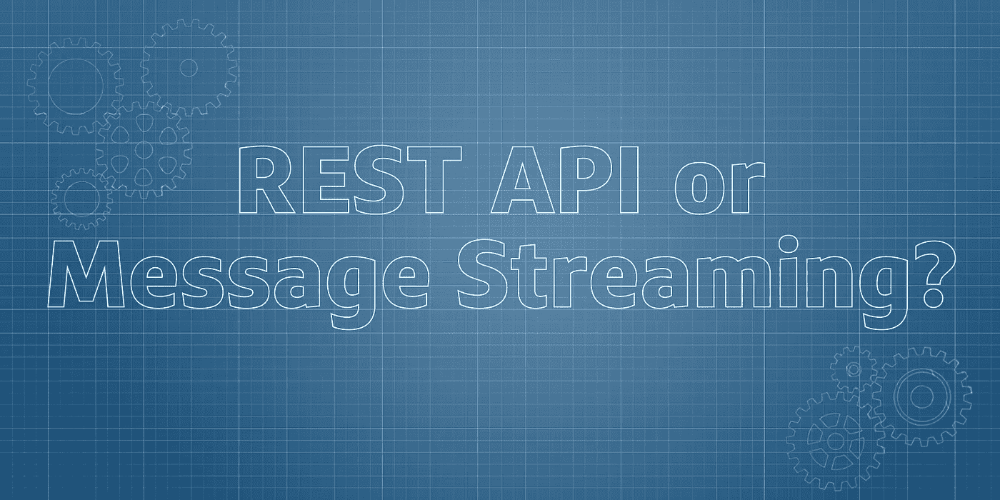
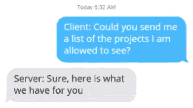
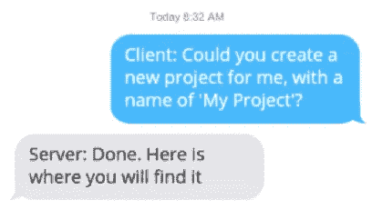
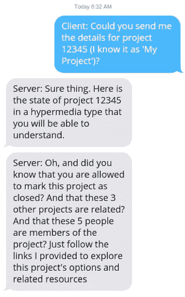
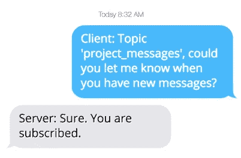
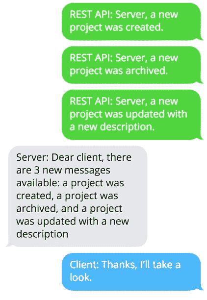

# 在 Web APIs 和消息流之间选择

> 原文：<https://medium.com/capital-one-tech/choosing-between-rest-web-apis-and-message-streaming-8e2f4813a058?source=collection_archive---------0----------------------->



当面临多种选择时，开发人员如何构建 API 来知道哪一个适合他们的解决方案呢？在本文中，我将概述 REST APIs 和消息流的共同特征，以便开发人员能够更好地理解何时(以及何时不)使用它们。

# **基于 REST 的 Web APIs 的特征-**

基于 REST 的 web APIs 在客户机(API 消费者)和 API 服务器(后端)之间创建了一个对话。当我们在 Capital One 中构建基于 REST 的 API 时，我们使用 HTTP 作为我们的协议。我们的设计在很大程度上依赖于 HTTP，从方法(例如 GET、POST、PUT、PATCH、DELETE)到帮助我们在客户端和服务器之间通信的头(例如 Authorization、Accept、Content-Type)。



```
 **GET /projects
 Accept: application/json****200 OK
 Content-Type: application/json**

 [
 { “Id”:”…”, “name”:”…” },
 { “Id”:”…”, “name”:”…” },
 { “Id”:”…”, “name”:”…” },
 …
 ]
```



```
POST**/projects
 Content-Type: application/json** { “name”:”…”, … }**201 Created
 Content-Type: application/json**

 { “Id”:”…”, “name”:”…”, … }
```

客户端(或 API 消费者)是应用程序，它在需要时向 API 发送消息(即 HTTP 请求)。然后，服务器回复响应，其中包括一个状态代码，指示请求是处理成功(2xx 错误代码)、由于客户端错误而失败(4xx 错误代码)还是由于服务器错误而失败(5xx 错误代码)。所有通信都从消费者流向 API 后端。

当我们添加超媒体链接时，我们用一些可能对客户有帮助的附加信息来扩展对话:



```
**GET /projects/12345
 Accept: application/json****200 OK
 Content-Type: application/json**

 { 
 “name”:”…”, …,
 “_links”: {
 { ”self” :”/projects/1234” }, 
 { “related_projects”: [
 { ”4567” :”/projects/4567” }, 
 { ”8901” :”/projects/8901” }, 
 { ”9012” :”/projects/9012” } 
 ] 
 }, 
 { “members”: [
 { ”1” :”/users/1” }, 
 { ”2” :”/users/2” }, 
 { ”3” :”/users/3” }, 
 { ”4” :”/users/4” }, 
 { ”5” :”/users/5” } 
 ] 
 }
 }
```

基于 REST 的 API 有一组特定的特征，总结如下:

*   **请求/响应模型** — API 消费者向 API 服务器发送请求并接收响应。
*   **基于拉的交互** — API 消费者在需要数据或功能时发送 API 请求(例如，用户界面，在预先安排的时间)。
*   **同步** — API 消费者在请求发送后收到响应。
*   **多种内容类型** —由于 REST APIs 是基于 HTTP 构建的，因此响应可以是 JSON、XML 或支持消费者需求所需的其他内容类型(例如 CSV、PDF)。
*   **灵活的交互**——基于可用的 HTTP 动词，消费者可以通过资源以多种方式与基于 REST 的 API 交互:查询/搜索、创建新资源、修改现有资源和删除资源。我们还可以通过将这些交互结合到更高层次的流程中来构建复杂的工作流。
*   **缓存和并发协议支持** — HTTP 具有内置的缓存语义，允许在消费者和 API 服务器之间放置缓存服务器，以及用于并发控制的响应和 eTags 的缓存控制，以防止覆盖内容。
*   **内部和外部访问**—REST API 可能仅限于合作伙伴或公共开发者内部使用或外部使用。

> 对于大多数解决方案，提供基于 REST 的 API 是一个很好的起点，允许任何应用程序或自动化脚本通过 HTTP 与您的 API 进行交互。

# **消息流的特征**

与 REST APIs 不同，消息流更擅长在新消息到达时提供通知。订阅后，当有新消息时，会通知客户端:



```
POST**/projects
 Content-Type: application/json** { “name”:”…”, … }**201 Created
 Content-Type: application/json** 
```

既然客户端已经订阅了主题，那么当有新消息时，它将会收到通知。这可能是 REST API 处理来自 web 或移动应用程序的传入请求，然后将消息添加到消息流主题中以通知任何感兴趣的人的结果:



```
**<<publish message to project_messages:****project created>>****<<publish message to project_messages:****project archived>>****<<publish message to project_messages:****project updated>>****<<notify client1234:****3 new messages>>**
```

注意我们的谈话变得越来越有趣。现在，当事情发生变化或关键业务事件发生时，我们可以收到通知；而不需要修改和重新部署 API 来支持未来出现的新集成。这被称为*松耦合*，它帮助我们的系统以新的方式被使用，而消息的发起者甚至不知道当前和未来的订户。

熟悉消息代理的人会意识到这很熟悉。消息代理和消息流的区别在于*消息流也允许我们按顺序重新访问过去的消息*:


```
**<<request last 12 messages from project_messages topic>>****<<retrieve and send last 12 messages from project_messages topic>>**
```

当我们需要聚合值或执行我们以前没有意识到需要的新计算时，这个特性很有用。

> ***注意——我们不能在请求消息时过滤消息或执行其他聚合查询——只有客户端在从主题请求消息后才能这样做。REST APIs 比消息流更适合执行特殊查询。***

正如您所发现的，消息流是一种不同于基于 REST 的 API 的交互风格。消息流的其他特征总结如下:

*   **发布/订阅模型** —应用程序或 API 向主题发布消息，该主题可能有零个、一个或多个订阅者，而不是请求/响应模型。
*   **订阅者通知交互** —当有新消息可用时，应用程序会收到通知，例如当数据被修改或有新数据可用时。
*   **异步** —与 REST APIs 不同，没有各方之间复杂的协调，应用程序无法使用消息流提交请求和接收响应。
*   **单一内容类型** —在 Capital One，我们的消息流建立在 Avro 之上，这是一种用于数据序列化的紧凑二进制格式。与 HTTP 不同，Avro 不支持其他内容类型(例如 CSV、PDF)。
*   **可回放性** —在 Capital One，我们的消息流建立在 Kafka 的基础上，订户可以按顺序重温和回放之前的消息。
*   **没有缓存或并发协议支持** —消息流不提供缓存语义、缓存控制或发布者和订阅者之间的并发控制。
*   **仅限内部访问** —订户必须是组织内部的，不像 HTTP 可能会被外部化为合作伙伴或公共消费者。

消息流提供了一些基于 REST 的 API 所没有的额外的通信选项——当新的数据或状态发生变化时基于推送的通知，以及重新访问流中过去的消息以执行新的计算或重新执行以前失败的逻辑的选项。当结合在一起时，REST-API 使消费应用程序能够很容易地与 HTTP API 集成，而消息流允许消费者在不需要先检查 REST API 的情况下得到更改通知。这可能是一个强大的组合，可以满足当前存在的用例，同时允许未来处理新出现的用例，而无需修改现有系统来适应新的解决方案。

# **总结**

正如您可能已经意识到的，在 web API 和消息流之间做出选择并不困难，只要您了解每一种的特性。REST APIs 最适合请求/响应交互，其中客户端应用程序通过 HTTP 向 API 后端发送请求。消息流最适合在出现新数据或事件时发出通知，您可能希望对其采取措施。只是要确保用一种或多种方法来满足消费者的需求，为您的解决方案功能提供一个健壮的界面。

[](https://medium.com/capital-one-tech/api/home)

*声明:这些观点仅代表作者个人观点。除非本帖中另有说明，否则 Capital One 不属于所提及的任何公司，也不被其认可。使用或展示的所有商标和其他知识产权都是其各自所有者的所有权。本文为 2018 首都一。*