# 和弦辅助:为盲人、聋哑人打造无障碍智能吉他

> 原文：<https://medium.com/google-developer-experts/chord-assist-building-an-accessible-smart-guitar-for-the-mute-deaf-and-blind-4f81669ab663?source=collection_archive---------2----------------------->

和弦辅助已被提名为 Lovie 奖！如果你有时间，我会感谢你的投票！

 [## 人民的爱奖需要你

### 我刚刚投票让这位决赛选手赢得了人民的爱奖。你也应该。

vote.lovieawards.eu](https://vote.lovieawards.eu/PublicVoting?_ga=2.26442685.1079804164.1569255774-1559960393.1567579618#/2019/apps-mobile-podcasts-voice/apps-mobile-sites-features/experimental-innovation) 

2017 年，我创建了一个名为 BrailleBox 的 Android 项目，这是一个为弱视人群提供的盲文新闻阅读器。

 [## Joe Birch 的 braille box |谷歌的实验

### 用 Android Things 构建一个盲文新闻阅读器

experiments.withgoogle.com](https://experiments.withgoogle.com/braillebox) 

我真的很热衷于帮助别人，并利用我所掌握的知识来帮助别人，即使这意味着学习新的东西来帮助实现这个目标。这是创造盲文盒子的主要驱动力，但我觉得我可以更进一步，创造一些可以帮助其他人参与我自己找到乐趣的领域的东西，这些领域目前可能不太容易实现(无论是完全实现，还是现在不太负担得起)。这个项目的成果是和弦辅助吉他——这种吉他将有助于改善聋哑人和盲人学习吉他的体验。

我一直喜欢玩音乐。我 10 岁开始弹吉他，14 岁开始弹贝斯——从那以后，我在很多乐队和音乐会/音乐节上演奏过。我在青少年和受教育期间演奏了相当多的音乐，老实说可能太多了…但这是我成长过程中很重要的一部分。音乐既是一种很好的创意，也是一种很好的精神发泄方式——它不仅有助于建立我的创意思维，也是一种很好的释放。在压力大或情绪低落的时候，播放音乐能让我暂时忘却烦恼，进入自己的小世界。

但我这么做是因为我可以。我可以拿起一把吉他开始学习，无论是从一本书上读和弦或琴谱，还是看视频告诉我如何演奏某些东西，甚至是去找我的吉他导师。学习吉他是一个非常顺利的过程，因为在我的学习过程中没有任何阻碍。

据估计，世界上大约有 2 . 85 亿人视力不全。对于患有致残性听力损失的人，我们估计大约有 4 . 66 亿人。说到人们是聋哑人，我很难找到世界范围的统计数据。我发现英国有大约 390，000 人，占英国人口的 0.6%，而在世界范围内，这个数字可能会更大。

当我们一起看这些数字时，它们是相当高的。现在，如果我是部分失明、丧失听力或者两者兼而有之——我还能拿起一把吉他并以同样的方式学习弹奏吗？我能读懂那个琴谱吗？我能够观看和收听那些教程视频吗？我能找到我的吉他导师并听取他的指导吗？谁知道呢，也许我能找到一种方法让它为我工作。但公平地说，我可能错过了一些或所有的方面。这反过来意味着我会错过生活中相当大且有影响力的一部分，不能通过这条途径投资于我的创造性思维，也不能在我需要休息的时候用这个爱好作为出口。

当我想到这个的时候，感觉很糟糕。为什么这些东西不是每个人都可以轻易获得的呢？演奏音乐给我的生活带来了如此多的东西，我讨厌别人因为其中一种情况而错过这样的事情。虽然它目前可能有点容易实现，但我们如何利用我们拥有的所有这些伟大和开放的技术，使它变得更好，并探索一种学习音乐的新方法？

这正是和弦辅助吉他的灵感来源。和弦辅助已经是我为 Google home 构建的 Google 项目中的一个动作，现在我想把它放在一个由语音、视觉和盲文驱动的吉他上。所有这三者加在一起将有望帮助减少在学习乐器的整个过程中可能经历的摩擦。

起初，我不知道从哪里开始，但几件事激励我推进这个想法。首先，在我的家庭中看到这种情况以及它可能从某人身上带走的东西是一种非常接近家庭的体验——虽然我意识到这些残疾并希望帮助人们，但看到这种影响在你身边使事情变得更加明显。看着桑德尔·皮帅在#io18 上谈论莫尔斯电码技术，我真的有点激动，看到它给一些人的生活带来了多大的改变——以及背后的激情。我从来没有真正做过大型的硬件项目，所以我缺乏信心——但是最近在 youtube 上看到[西蒙·吉尔兹](https://medium.com/u/db3baca50913?source=post_page-----4f81669ab663--------------------------------)，我对自己能做什么有了更大的信心。

这就是结果。记得阅读上面的 chordassist.com 和附加的 youtube 视频。这篇文章更深入一点，如果你想了解更多，请继续阅读:)

# 这把吉他是做什么的？

这个项目的主要目的是给所有人带来学习音乐的快乐，我希望这一部分将向你展示我是如何努力实现这一目标的:

## 请教如何学习和弦

使用吉他上的麦克风，用户可以请求学习如何弹奏和弦——如果支持所需的和弦，则信息将被返回并呈现给用户。出于原型目的，需要按下一个按钮来触发收听过程，但是可以根据需要简单地使用一个开关来启用和禁用麦克风。

## 选择如何学习和弦

使用由吉他上的 LED 段显示器支持的**左**、**右**和**选择**按钮，用户可以请求学习如何演奏和弦——如果期望的和弦得到支持，则信息将被返回并呈现给用户。这是在用户无法说话的情况下作为麦克风的替代物提供的——可能他们有残疾使他们无法说话，或者他们所在的地方使他们很难说话。

## 在屏幕上显示请求的和弦

一旦我们被返回关于如何演奏所选择的和弦的信息，如果屏幕被打开，那么这将被用于以可视格式显示和弦表示。这一功能允许用户想要和弦的可视化表示；无论是因为首选的学习方法还是因为听不到说话者说出的和弦。

## 用盲文显示请求的和弦

一旦我们返回如何演奏所选和弦的信息，如果启用了盲文阅读器，那么这将用于以盲文格式向用户朗读和弦表示。这使得可能失明的用户能够读出已经返回到吉他的和弦。

## 重复先前请求的和弦

在某些情况下，用户可能想要请求再次显示、朗读或朗读先前的和弦。在这些情况下，用户可以:

*   使用麦克风请求再次朗读和弦
*   使用吉他上的按钮重复上一个和弦

当执行上述任一项时，和弦将通过吉他使用请求时启用的功能来呈现。

## 启用/禁用扬声器、屏幕或盲文阅读器

吉他上也有 3 个开关，每个都可以用来禁用吉他上的任何输出方法。

*   禁止盲文阅读器显示所选和弦
*   关闭显示器
*   禁止扬声器输出任何音频内容

每个开关都包含一个 LED，当开关启用时，它会亮起，从而更容易表示给定的输出类型何时启用。

## 显示所有使用类型的装载状态

也有一些想法放入不同的输出类型被表示为加载的方式。当设备处于加载状态时:

*   当启用盲文输出时，振动电机将振动，让用户知道设备当前处于加载状态
*   启用扬声器时，会有一个进度声音输出，让用户知道设备当前处于加载状态
*   当屏幕打开时，屏幕上会显示一个进度微调按钮，让用户知道设备当前处于加载状态

# 操作流程

在吉他中有很多功能，很多复杂性隐藏在吉他的主体和软件本身的逻辑中。有许多不同的活动部件组合在一起实现不同的功能。目前，基于用户交互的操作流程如下所示:

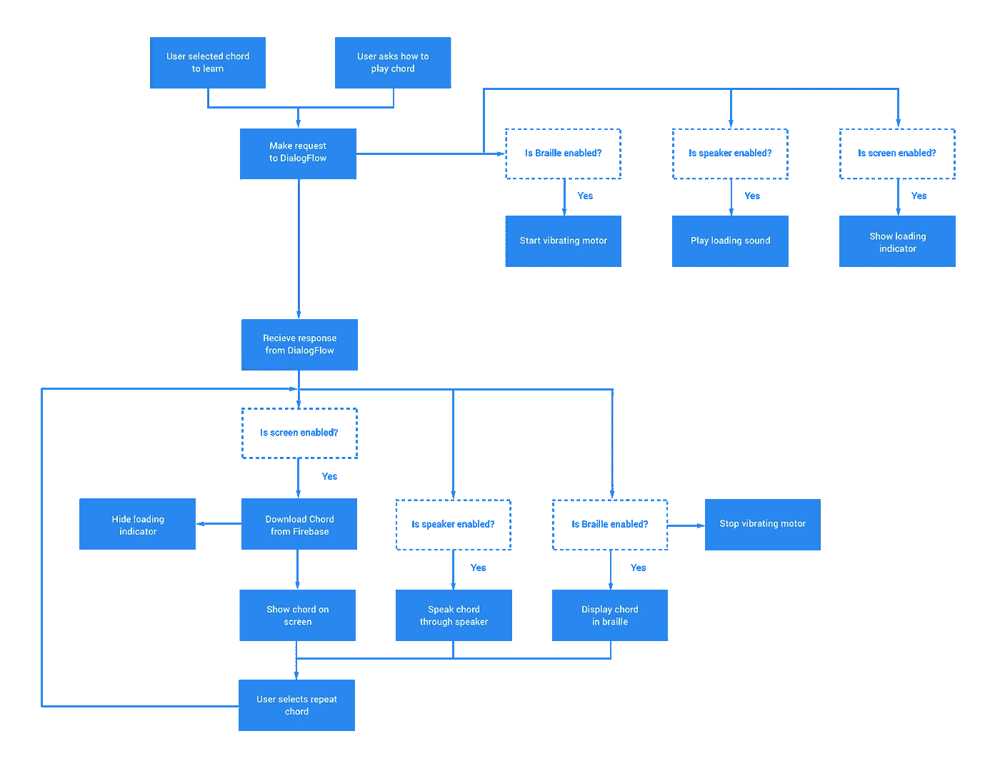

# 技术

现在，正如我们已经看到的，在制作智能吉他时，有许多活动部件。虽然我们的大部分逻辑将来自谷歌本身的行动(因为这是我们“智能”模型的一部分)，但我们需要一种沟通的方式，这不是一个超级简单的过程。

## 对 Google SDK / DialogFlow 的操作

这些技术用于处理设备的对话方面。有几个不同的目的可以启动——主要的一个是请求如何演奏和弦的能力。这些 SDK 只是用来与这些云服务中托管的对话后端进行通信。因此，该设备需要网络连接。

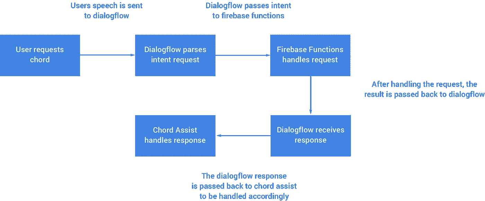

## 燃料库

当打开屏幕并加载和弦时，将从 Firebase 存储中请求和弦的图像。一旦提取，该和弦将在屏幕上显示给用户。

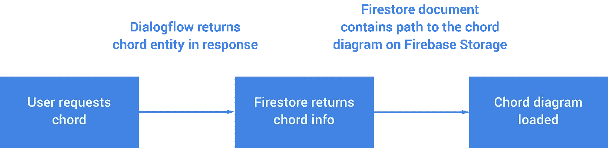

## Firebase 远程配置

在吉他上，用户能够使用 4 位数段显示从和弦集合中进行选择。为了使这个显示的内容能够是动态的，我使用了 Firebase 远程配置来允许动态地改变和弦，并且如果我决定建立这部分功能的话，还可以对其进行扩展。

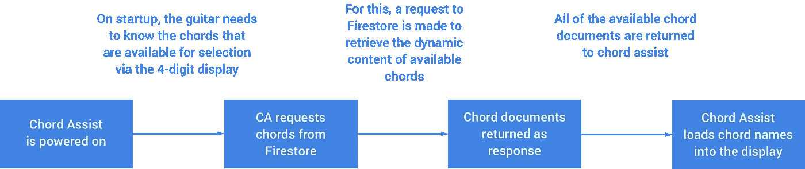

## 谷歌云文本到语音转换

因为我们使用 google / dialogflow 上的动作来处理吉他的对话逻辑，所以我们可以访问返回给吉他的数据中的文本响应。然而，我们需要将它转换成音频输出格式——这就是谷歌云文本到语音转换服务派上用场的地方。

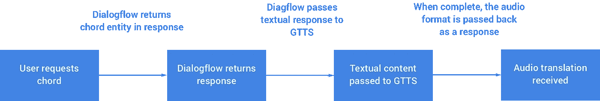

# 成分

除了这些技术，还有许多组件组合在一起，使吉他能够满足所有这些不同的需求。吉他总共花费了大约 260- 300 英镑——在这个过程中，我损坏了一些组件，但能够重用以前项目中的一些东西来帮助我实现一些功能。

## 树莓派(39.99 英镑)

这是吉他的核心部分——所有的软件都在树莓派上运行。这使我能够将产品的“大脑”保持足够小，以适合吉他，也让我能够接触到许多可以在低功耗下工作的组件。尽管这台电脑在吉他内部，我还是把它设置成远程访问，以防需要进行任何调试。

## 吉他(二手，40)

如果我们要用吉他弹奏，我们需要一把吉他！这对我来说是一个令人担忧的部分，因为我不想在木工过程中把吉他弄得太乱。因为如果我有，换一个也不便宜。我在当地买了一把足够好的二手吉他来做这个实验。

## 德雷梅尔(19.99 英镑)

吉他上需要钻很多小洞，还需要安装一些长方形的显示器。我意识到了一个 Dremel drill，这似乎是一个完美的解决方案——如果你曾经做过类似的工作，那么值得一试！

## 开关(5 个 3.99 英镑)

这些只是一些简单的 5v 开关来控制事物的开关状态。我做了一些搜索，专门寻找那些在“开”的位置有一个“能感觉到的”凹口的开关，它也会亮。

如果用户是盲人，那么他们将能够感觉到开关的接通位置并知道其状态。对于所有有一些视觉能力的人来说，光也将是一种快速的方式，让他们知道某个东西是开着还是关着，而不需要触摸它就能发现这一点。我还确保我买的开关是一种令人愉快的颜色，我觉得绿色是积极的，不是太亮，比红色等消极的颜色更好的选择。

## 5v 电磁阀(每个 5 个)

电磁阀是一个部件，它提供了一个杆，当它接收到电源时，可以推入/推出。我在创建[盲文框](https://experiments.withgoogle.com/braillebox)时使用了相同的组件——螺线管允许我获取一些单词，将其转换为盲文表示(浮雕或不浮雕)，并根据需要显示的盲文序列将 pin 设置为高或低。

## 5 英寸液晶显示屏(19.99 英镑)

因为我们希望向用户显示所选和弦的可视化表示，所以我们需要某种形式的显示。我选择了一个简单的带 HDMI 连接的 LCD 显示器，这样它就可以很容易地连接到 raspberry pi。显示器还需要通过 micro-usb 连接器供电——还有一堆其他组件也需要电源，所以这里没有额外的工作。

## 4 位数段显示(9.99)

我们希望能够在屏幕上显示和弦的选择，允许用户浏览和弦并选择他们想知道如何演奏的和弦。使用 pHat 板的原因是，它允许我们只使用 2 个 IC 输入，而不是几个 GPIO 引脚。

## 按钮(3.99 英镑)

按钮是一个简单的组件，它们是按下时不会锁定状态的按钮。这些用于触发对话动作，也用于在段显示上浏览可用的和弦。在这些情况下，我们不需要按钮来锁定，所以按钮是一个合适的解决方案。

## 5v 8 通道继电器(7.99)

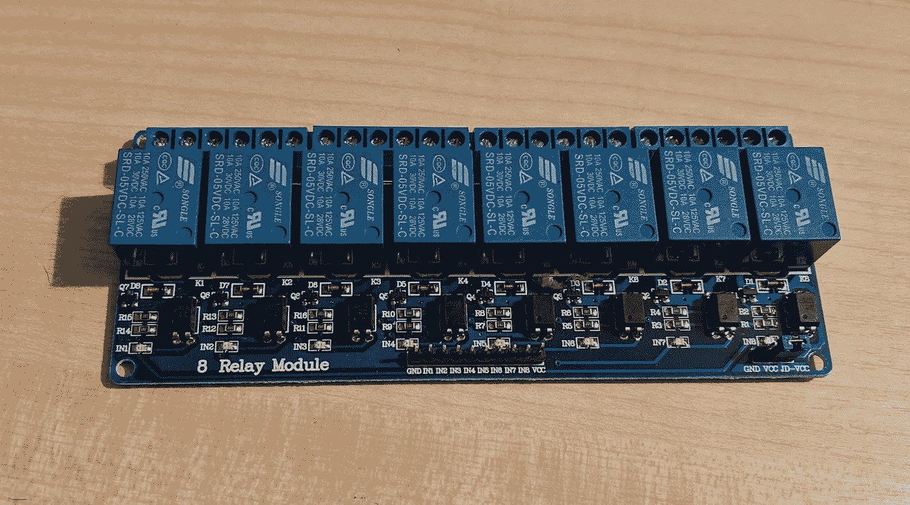

我们需要一种方法来打开/关闭电路中的螺线管，唯一的问题是 raspberry pi GPIO 引脚只能在 3.3v 下供电，而螺线管需要 5v。有了这个 5v 继电器板，3.3v 就足以触发继电器的开关，同时也允许我们向螺线管提供 5v 电压。

## 麦克风(6.49 英寸)

我拿起一个 USB 麦克风，这样我就可以利用 pi 的内置录音功能，而不必在电路中添加另一个组件。在这里，您所要做的就是调整一些 pi 配置，使其成为默认的输入法，然后就可以了！

## 扬声器和烤架(9.99 英镑)

扬声器不需要什么特别的东西——只需要一些可以连接到树莓派耳机插孔的东西。它可能需要一个放大器来使声音大一点，但我计划在这里重复一些工作时增加一个。

## 便携式电池组(23.99 英镑)

我不想每次想用吉他的时候都要插上电源——因此我选择了一个能够提供 5v 电源的便携式充电器。我得到的那个有很大的电量，可以给 pi 供电很长一段时间。我有一个丢失的 USB 线，现在可以从吉他的音孔出来，但这可能会在未来得到改善:)

## 项目箱(5 个 9.99 英镑)

吉他的每一个功能都有很多线路，并且都将被放在一个非常小的地方(吉他内部)。出于这个原因，我拿起了一些[项目盒](https://www.amazon.co.uk/VGEBY-100x60x25mm-Waterproof-Electronic-Instrument-Black/dp/B074Z7TZYP/ref=sr_1_8?ie=UTF8&qid=1549813671&sr=8-8&keywords=project+box)，这样每个试验板都不会受到其他电线的伤害，整个内部保持整洁——这将使未来的维护更加容易！

## f 形夹钳和夹具(20)

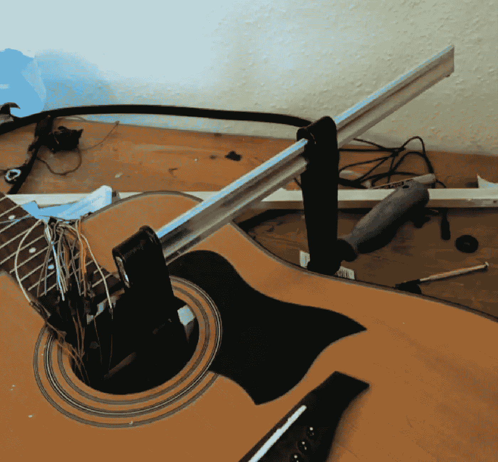

当涉及到固定吉他内部盲文阅读器的螺线管时，我需要一些东西来固定它们。我创建了 2 列 3 个螺线管——我在这里用夹子将每个螺线管固定在它们的列上，同时木胶变干。然后用 F-clamp 固定

## 杂项(~ 30)

我还用过很多其他的东西，其实不需要在上面列出来，但是如果你感兴趣的话:

*   试验板(用于原型制作)
*   可焊接试验板(用于原型制作后的最终工作)
*   电阻
*   单芯电缆
*   木材胶
*   强力胶
*   木头(用于固定吉他内部的东西)

# 将组件连接在一起

每个组件都是独立的，这意味着它们需要连接起来，这样它们和 raspberry pi 之间才能进行通信。总的来说，这些连接看起来像这样:

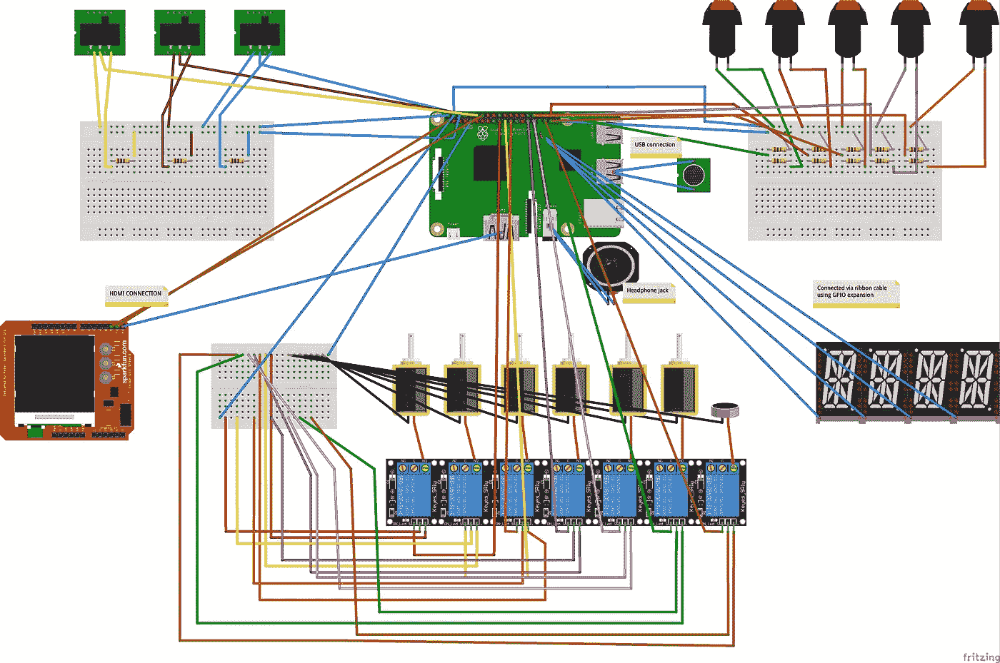

我知道这看起来很难理解，所以让我们快速分解一下:

## LCD HDMI 屏幕

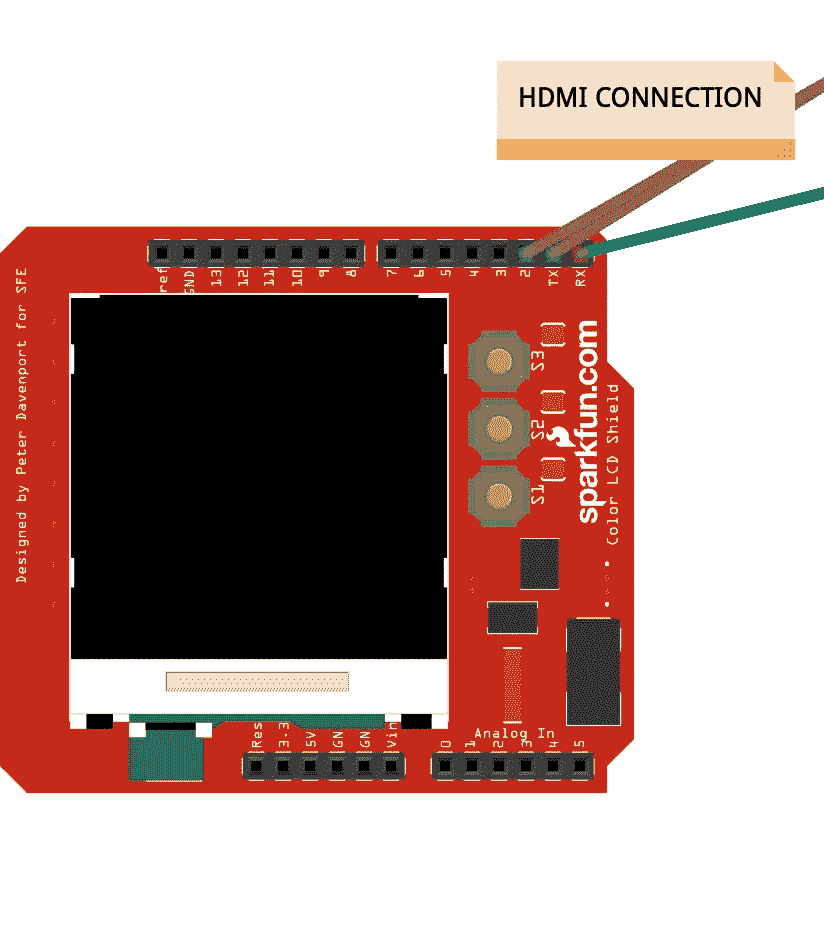

项目中使用的 LCD 屏幕看起来不完全像这个，但它是我在原型软件中能得到的最接近的。我的屏幕有一个 HDMI 连接，一个接地引脚和一个电源引脚。

HDMI 直接连接到 raspberry pi 的 HDMI 输出。接地需要连接到一个接地引脚，然后电源引脚连接到 raspberry pi 上的一个 3.3v 输出引脚。

## 4 位数段显示

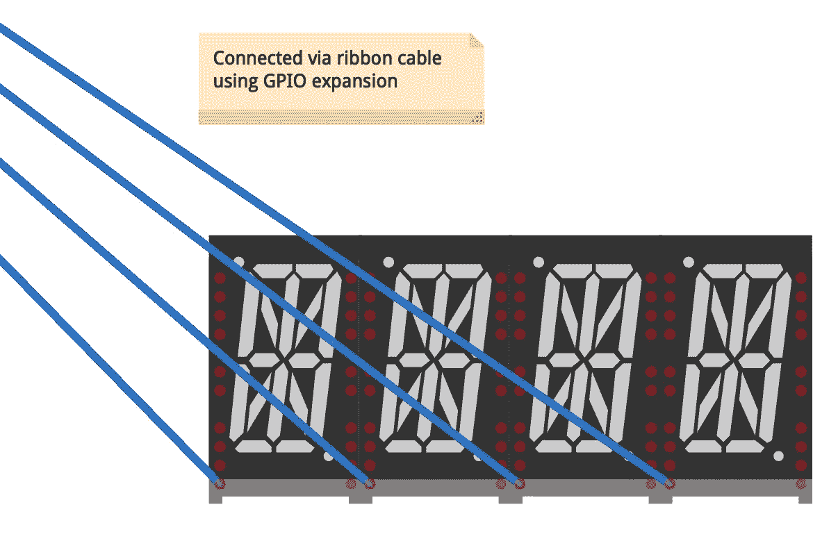

为了显示可供选择的和弦，使用了 4 位数的段显示。为此，我实际上从[皮莫尔尼](https://medium.com/u/32ccfaf39253?source=post_page-----4f81669ab663--------------------------------)那里拿起了[四个字母的 pHAT](https://shop.pimoroni.com/products/four-letter-phat) 。它使用 GPIO 带状电缆连接到 raspberry pi，但实际上只有少数连接被使用。它利用 I2C 来处理与 pi 之间的通信，这意味着不需要额外的 GPIO 引脚来设置该段显示的内容。

## 螺线管

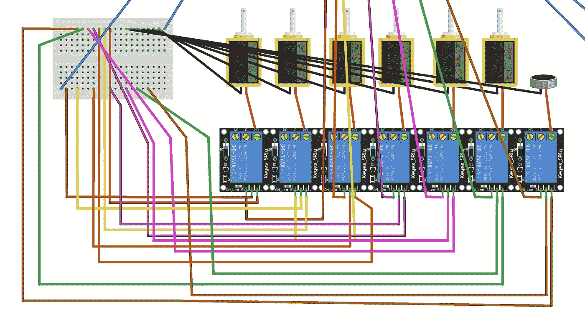

螺线管用于驱动盲文显示器。pi 的 GPIO 引脚仅提供 3.3v 电源，因此不足以触发 5v 螺线管。为了解决这个问题，我使用了 5v 继电器通道——这可以由 3.3v 触发，并能够提供 5v 电源(因为继电器本身由 5v 供电)。虽然该图看起来非常复杂，但实际上只包括:

*   每个螺线管需要连接到**地**和**继电器通道**的**电源**输出
*   每个继电器需要将其通道输入连接到电源(在顶部，靠近螺线管连接的位置)，当开关启用时，这将依次为螺线管供电
*   每个继电器需要连接到地源、电源以及 raspberry pi 的 GPIO 引脚。该 GPIO 连接将用于启用和禁用中继通道。

## 按钮

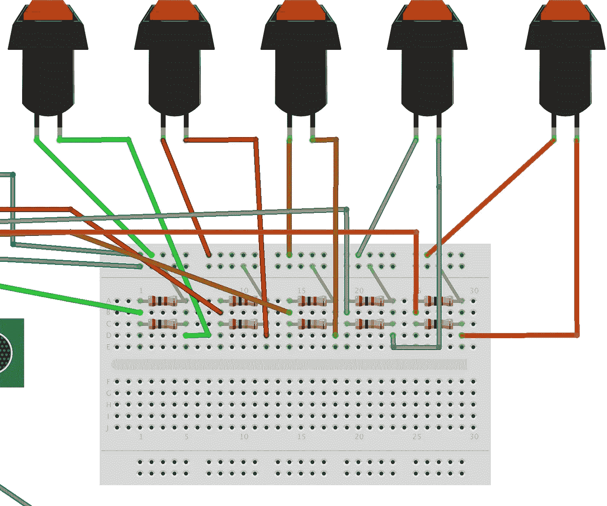

每个按钮都有一个**接地**和**电源**连接。对于电源，这是直接连接到树莓派的电源。然后，接地连接需要通过 GPIO 触发电缆布线，并回到 raspberry pi 的地源。当按下此按钮时，该接地将向连接的 GPIO 引脚发送信号，然后可在软件中处理该信号。

## 拨动开关

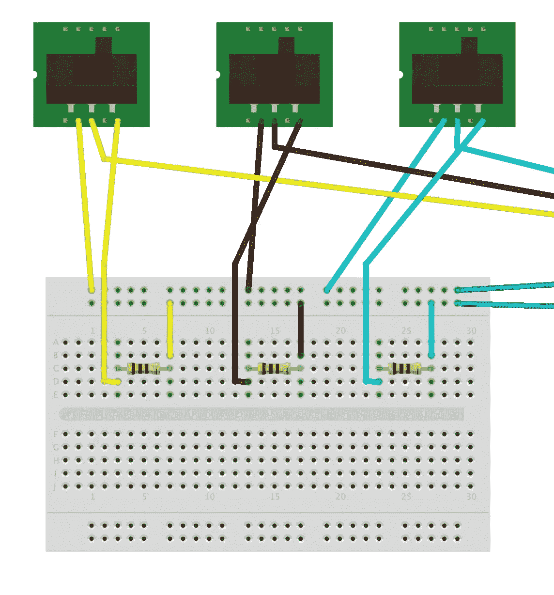

拨动开关的工作方式与按钮相似，但它们的行为略有不同。每个开关都需要直接连接到 raspberry pi 的电源，并有一个 GPIO 引脚直接连接到其中一个连接点。

对于开关的接地连接，需要通过一个电阻连接到试验板的接地点。当开关的状态改变时，信号将被发送到连接的 GPIO 引脚。

# 软件编码

你可能对这个项目的代码很好奇，所以我在这里分享一些。我不会概述整个软件，因为很多东西在工作方式上非常相似，但希望下面给出了一个东西是如何构建的想法。

## 盲文显示器

已经使用的盲文格式由 6 个单元组成，任何文本内容都需要转换成这种格式，以便可以在盲文引脚上显示。为此，我们首先需要根据给定的盲文表示来定义字母表和任何符号:

既然我们已经为上面的每一个定义了盲文表示，我们就可以获取给定的文本，并构建一个需要打印出来的盲文序列集合。下面的函数获取我们对 google textual response 的操作，遍历每个字符，然后将该字符的盲文表示添加到我们的结果数组中。

现在我们有了盲文表示，我们需要使用螺线管来显示它们。因为我们的螺线管是通过 GPIO 引脚连接的，所以我们只需要在每个盲文序列中取 6 个单元中的每一个，并根据该值将相应的螺线管设置为高或低。你可以在下面的函数中看到，我们循环通过每个盲文序列，在引脚上显示盲文序列，睡眠一小段时间，然后对集合中的每个序列重复。

## 4 位数段显示+导航

对于显示导航，我们简单地使用 [RPI。GPIO](https://pypi.org/project/RPi.GPIO/) 库允许我们连接到 GPIO 通信。在这里，我们为每个导航按钮设置一个监听器，链接到其中一个触发的事件处理程序。

对于显示，我们利用为四个字母 phat 提供的[库，这允许我们在段显示上容易地显示文本序列。](https://github.com/pimoroni/fourletter-phat)

当按下每个导航按钮时，我们只需设置所选和弦的位置，然后调用 display_chord 函数，以便更新我们的段显示。

当提交按钮被按下时，我们简单地触发意图文本检测功能。这将触发一个 dialogflow 请求，使用所选的和弦作为句子的参数。

## 对 Google 文本查询的操作

我们使用 python 的 dialogflow 客户端库执行文本查询。我们在这里需要提供的只是项目 ID、会话 ID(用于在当前上下文中继续对话)、所需的语言代码和用于对话的输入文本。这是一个阻塞请求，一旦请求完成，客户端就会返回响应。

一旦我们有了这个响应，我们就可以访问它的数据，以我们想要的方式使用。在这里可以看到，我访问了 **query_result** ，以及**fulfillment _ text**，它给出了 dialogflow 提供的文本响应。

## 对谷歌语音查询的操作

语音查询的工作方式与上面略有不同，但是，我们能够重用文本履行功能的代码！这里，我们利用了 Google Cloud 的文本到语音转换功能中的 Google Cloud CloudSpeechClient 类。我们在这里所做的就是开始监听语音输入(一旦按钮被按下触发它)，然后一旦检测到文本，我们就以文本格式将解析的音频内容传递给 **detect_intent_texts** 函数。

## 显示和弦图像

在 firebase 的 chord 文档中，我们获得了显示 chord 图像所需的细节。我们首先需要从 Google 云存储中获取该图像。在这里，我使用了为我处理这些请求的库——我只需提供所需的 ID 和要检索的文件的信息。然后，该图像可以用于在屏幕的 UI 组件内部显示。

## 启用/禁用功能

输出模式的启用和禁用方式很简单。我保存了一个由三个布尔标志组成的集合，这些标志表示输出模式是否启用——如果输出模式未启用，那么当接收到响应时，该输出模式将被忽略。对于每个交换机，当与交换机交互时，会设置一个 GPIO 监听器。发生这种情况时，会调用一个切换函数来设置相应布尔标志的值。

# 最后

这是一个非常有趣的项目——当你混合了一些你最大的热情时，你知道你将会建造一些有意义的东西，并享受这样做的过程。我真的希望在不久的将来，我们会在市场上看到越来越多这样的想法和技术。在我的研究过程中，音乐是一个没有被过多探索的领域，正如我之前所说的——音乐已经成为我生活中的一个巨大部分，每个人都应该能够体验它。

这个项目目前是一个概念验证，或原型。很可能我会在此基础上改进吉他本身的一些东西。我还计划将 Google app 上的动作发布到 app store，这样就可以通过 Google Home 设备使用了。与此同时，虽然，我很想听到任何想法/反馈或对这个项目的一般意见🙂

 [## 乔·伯奇(@hitherejoe) |推特

### 乔伯奇的最新推文(@hitherejoe)。Android Lead @Buffer。谷歌开发专家为@Android，@GooglePay &…

twitter.com](https://twitter.com/hitherejoe)