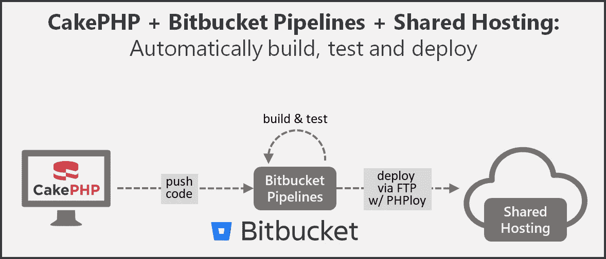

# CakePHP 的 CI/CD，带有 Bitbucket 管道和通过 FTP 共享的托管服务器

> 原文：<https://medium.com/quick-code/ci-cd-of-cakephp-with-bitbucket-pipelines-shared-hosting-server-via-ftp-9815f4e59dc1?source=collection_archive---------2----------------------->

## 使用 Bitbucket 管道通过 FTP 和 PHPloy 自动构建、测试和部署一个 CakePHP 应用程序到一个共享的主机服务器。



# 先决条件

*   [Bitbucket](https://bitbucket.org) 账号
*   [Git](https://git-scm.com/) 安装在开发机上
*   安装在开发机器上的 PHP
*   [安装在开发机上的 Composer](https://getcomposer.org/)

# 创建位存储库

首先，我们创建一个新的[位存储库](https://bitbucket.org/)。


Create new Bitbucket repository

# 初始化并提交 CakePHP 应用程序

在本演示中，我们通过在命令行中键入以下命令来创建一个 [skeleton CakePHP 应用程序](https://github.com/cakephp/app):

```
composer create-project --prefer-dist cakephp/app cakephp-ci-demo
```

如果您对刚刚创建的内容感兴趣，请使用内置服务器启动它，并启动您最喜欢的浏览器:

```
cd cakephp-ci-demo
bin/cake server -p 8765
```


Demo app in browser

现在我们可以将本地 git 存储库与我们的 Bitbucket 存储库共享(也称为链接)。您可以在 Bitbucket 存储库概述中找到您的 git URL。对我来说，这些命令看起来像这样:

```
# switch to porject folder in ./cakephp-ci-demogit init
git remote add origin [https://kainiklas@bitbucket.org/kainiklas/cakephp-ci-demo.git](https://kainiklas@bitbucket.org/kainiklas/cakephp-ci-demo.git)git add -A
git commit -m "Initial commit"
git push origin master
```

现在代码应该在我们的 Bitbucket 存储库中可见了。

# 初始化位桶管道

我们在[bitbucket.org](https://bitbucket.org/)上导航到我们的存储库，并在左侧导航菜单中点击 Pipelines。我们第一次点击它，需要一些时间，直到我们看到一些东西(大约 5-10 秒)。我们向下滚动页面并选择 PHP。然后我们提交文件，管道自动启动。

起初，它看起来很好，但后来管道出现了一些问题，我们将在以后修复这些问题。

```
#1: cakephp/cakephp 3.5.11 requires ext-intl * -> the requested PHP extension intl is missing from your system.#2: symfony/debug v4.0.3 requires php ^7.1.3 -> your PHP version (7.1.1) does not satisfy that requirement.And 5 more.
```


First Pipeline run fails

# 使用 PHPloy 通过 FTP 的部署策略

我们想通过 FTP 将我们的代码部署到共享主机服务器上。这可以通过几种方式实现。一个非常通用的方法是使用工具 [git-ftp](https://github.com/git-ftp/git-ftp) 。但是我们将使用 [PHPloy](https://github.com/banago/PHPloy) ，我更喜欢它，因为它有一些方便的附加功能。对我来说最重要的是以下几点:

1.  本地 PHP 支持，因为我们有一个 PHP 项目
2.  定义几个暂存环境的配置文件`phploy.ini`。
3.  传输 git 忽略的文件，例如运行应用程序所需的`/vendor`文件夹。
4.  忽略 git 中的版本文件，例如生产服务器上不需要的`/test`文件夹。
5.  删除服务器上的文件，例如清理`/cache`文件夹。

## 为生产部署安装和配置 PHPloy

首先，我们需要使用 composer 的 PHPloy 依赖关系:

```
# switch to ./cakephp-ci-demo
composer require "banago/phploy"
```

然后，我们为生产环境创建包含以下内容的`phploy.ini`文件。不要忘记用你的价值观来改变`user`和`host`。我们稍后作为环境变量设置的密码。

## 补充 composer.json 描述符

我们希望有一个可以通过 composer 调用的部署命令。这可以通过在`scripts`部分的`composer.json`文件中添加以下行来轻松实现:

```
"scripts": {
  ... "deploy-to-production": "phploy -s production"
}
```

在我们将任何东西部署到产品中之前，我们希望运行所有的单元测试，以确保一切正常。因此，我们需要将它包含在我们的 composer 文件中:

```
composer require --dev phpunit/phpunit
```

# 为 CakePHP 配置位桶管道

我们的目标是，如果代码构建和所有测试都通过，通过 FTP 将更新的代码推送到共享主机提供商。因此，我们首先需要将凭证(安全地)存储到我们的构建服务器(Bitbucket 中的管道)。我们将在构建脚本中使用环境变量而不是硬编码值来实现这一点。

## 设置密码环境变量

我们设置的环境变量叫做`PHPLOY_PASS`，包含 FTP 用户的密码。

**重要提示:**切勿将密码存储在任何代码库中。


## 配置管道

让我们检查一下我们之前在 Bitbucket 中生成的管道文件，并为 CakePHP 配置它:

```
# switch to ./cakephp-ci-demogit pull origin master
```

打开文件`bitbucket-pipelines.yml`进行配置。

## 已配置管道的说明

通过`image: edbizarro/bitbucket-pipelines-php7`，我们告诉我们的 piepline 哪个 docker 容器应该用于构建。对于 CakePHP，我们需要默认 PHP 映像提供的更高版本的 PHP 7。此外，我们需要使用默认的 php 7 容器安装`composer`和 PHP 扩展`intl`。否则我们的构建将会失败，就像我们之前看到的那样。docker image[edbizarro/bit bucket-pipelines-php 7](https://github.com/edbizarro/bitbucket-pipelines-php7)包含工具和 PHP 扩展(以及演示中不需要的更多内容)。

使用`branches: master:`我们定义，一旦我们将代码签入主分支，管道就应该运行。

使用`caches: -composer`我们缓存所有下载的 composer 包，这些包是在依赖项的安装过程中下载的。这将加快后续运行的速度。

最后一部分是`script:`部分的脚本。我们 1)安装所有需要的模块，2)测试应用程序，3)将其部署到服务器。如果任何命令失败，整个管道都会失败。这意味着，失败的测试将阻止部署到服务器上(这很好，因为我们不想中断生产)。

# 测试管道

测试我们的管道非常容易。我们只需要更改一个文件，并将其推送到主分支。由于我们还没有将任何文件签入到我们的存储库中，我们现在可以通过签入我们的工作来测试管道:

```
# switch to ./cakephp-ci-demogit add -A
git push origin master
```

# 最后的想法

所展示的管道是一个简单的演示，可以通过多种方式进行增强。跟进主题包括:

*   部署到多个阶段(开发、QA、生产)
*   使用不同的 git 分支传播稳定的代码
*   执行包括数据库在内的测试
*   数据库迁移测试
*   卷回

# 进一步阅读

[](http://books.dev-insights.com/books/link/0321336380)[](http://books.dev-insights.com/books/link/0321601912)[](http://books.dev-insights.com/books/link/0470872497)

Further readings

# 想多读点？

订阅我的现代软件架构 [**简讯**](https://mailchi.mp/7f46c21dfc63/better-software-architect) 。增长您的技能，成为更好的软件架构师。

支持我的工作，看看我的书“[成为一个更好的软件架构师——实践经验中的行动和见解](http://bit.ly/betterSoftwareArchitect)”。


[Become a Better Software Architect — Actions and insights from practical experience](http://bit.ly/betterSoftwareArchitect)

*原载于 2018 年 1 月 27 日*[*kai-niklas . de*](https://kai-niklas.de/68/ci-cd-of-cakephp-with-bitbucket-pipelines-shared-hosting-server-via-ftp/)*。*