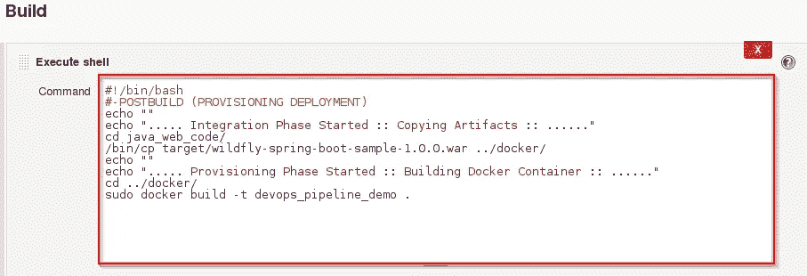
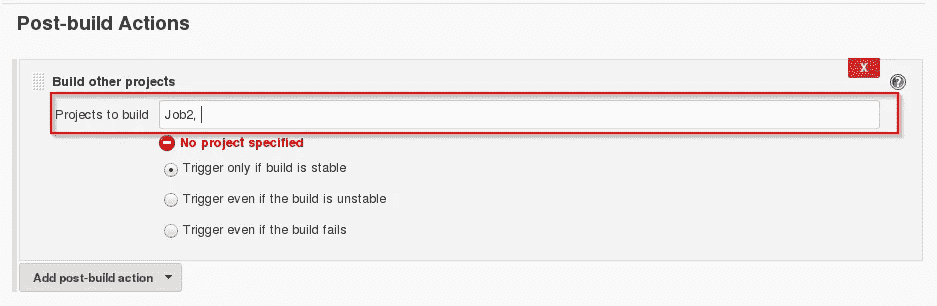

# CI CD 管道:了解如何从头开始设置 CI CD 管道

> 原文：<https://medium.com/edureka/ci-cd-pipeline-5508227b19ca?source=collection_archive---------0----------------------->

CI CD Pipeline - Edureka

CI CD 管道实施或持续集成/持续部署软件是现代 DevOps 环境的支柱。你可以在数据工程师、云架构师、数据科学家等各种工作角色中找到*持续集成&持续部署技能*的要求。CI/CD 通过自动化应用程序的构建、测试和部署，在开发和运营团队之间架起了一座桥梁。在这篇博客中，我们将了解什么是 CI CD 管道以及它是如何工作的。

在讨论 CI CD 管道的工作之前，让我们先来了解一下 DevOps。

# DevOps 是什么？

DevOps 是一种软件开发方法，涉及软件在其整个开发生命周期中的持续开发、持续测试、持续集成、持续部署和持续监控。这正是所有顶级公司开发高质量软件和缩短开发生命周期所采用的流程，从而提高客户满意度，这是每个公司都希望的。

# DevOps 阶段

如果不了解 DevOps 的生命周期，你对它的理解是不完整的。现在让我们看看 DevOps 生命周期，并探索它们与软件开发阶段的关系。

# 什么是 CI CD 管道？

CI 代表持续集成，CD 代表持续交付和持续部署。你可以把它看作是一个类似于软件开发生命周期的过程。
现在让我们看看它是如何工作的。

上面的管道是软件在交付给客户或投入生产之前，如何在生命周期的各个阶段进行的逻辑演示。

让我们以 CI CD 管道为例。假设您要构建一个 web 应用程序，它将部署在实时 web 服务器上。你将拥有一组开发人员，他们负责编写代码，这些代码将进一步用于构建 web 应用程序。现在，当这个代码被开发团队提交到一个版本控制系统(比如 [git](https://www.edureka.co/blog/git-tutorial/?utm_source=medium&utm_medium=content-link&utm_campaign=ci-cd-pipeline) ，svn)的时候。接下来，它经过**构建阶段**，这是流水线的第一个阶段，在这里开发人员放入他们的代码，然后代码再次进入具有适当版本标签的版本控制系统。

假设我们有一个 Java 代码，它需要在执行前编译。因此，通过版本控制阶段，它再次进入编译阶段。您从存储库的不同分支获得该代码的所有特性，存储库将它们合并，并最终使用编译器对其进行编译。这整个过程被称为**构建阶段**。

# 测试阶段:

一旦构建阶段结束，您就可以进入**测试阶段**。在这一阶段，我们有各种各样的测试，其中之一是*单元测试*(测试软件的块/单元或其健全性测试)。

# 部署阶段:

当测试完成后，您将进入**部署阶段**，在此阶段，您将把它部署到一个中转或测试服务器中。在这里，您可以查看代码或在模拟器中查看应用程序。

# 自动测试阶段:

一旦代码成功部署，您就可以运行另一组健全性测试。如果一切都被接受，那么它可以被部署到生产中。

# 部署到生产环境:

同时，在每一步中，如果有一些错误，您可以向开发团队发送一封邮件，以便他们可以修复它们。然后，他们将把它推入版本控制系统，并返回到管道中。

再一次，如果在测试过程中报告了任何错误，反馈会再次发送给开发团队，在那里他们会修复它，如果需要，过程会重新迭代。

# 测量+验证:

因此，这个生命周期一直持续到我们得到一个代码或一个产品，可以部署到生产服务器中，在那里我们测量和验证代码。

我们已经了解了 CI CD Pipeline 及其工作原理，现在我们将继续了解 Jenkins 是什么，以及我们如何使用 Jenkins 部署演示的代码并使整个过程自动化。

# Jenkins——终极 CI 工具及其在 CI CD 管道中的重要性

我们的任务是自动化整个过程，从开发团队给我们代码并提交到我们投入生产。

我们的任务是自动化管道，以便使整个软件开发生命周期处于开发-操作模式/自动化模式。为此，他们需要自动化工具。

Jenkins 为我们提供了各种界面和工具，以便自动化整个过程。

接下来会发生什么，我们有一个 git 存储库，开发团队将在那里提交代码。然后，Jenkins 从那里接手，这是一个前端工具，您可以在其中定义您的整个工作或任务。我们的工作是确保特定工具或特定应用的持续集成和交付过程。

从 Git，Jenkins 提取代码，然后将其移动到**提交阶段**，在该阶段，代码从每个分支提交。然后，Jenkins 将其转移到**构建阶段**，在此我们编译代码。如果是 Java 代码，我们使用 Jenkins 中的 maven 这样的工具，然后编译该代码，我们可以部署该代码来运行一系列测试。这些测试用例再次由 Jenkins 监督。

然后，它移动到转移服务器，使用 Docker 进行部署。在一系列单元测试或健全性测试之后，它会进入生产阶段。

这就是交付阶段如何被一个叫做 **Jenkins，**的工具处理的，它自动化了所有的事情。现在，为了部署它，我们需要一个复制生产环境的环境，即 **Docker** 。

# 码头工人

Docker 就像一个虚拟环境，我们可以在其中创建一个服务器。创建一个完整的服务器并部署我们想要测试的工件需要几秒钟时间。但是问题来了，

***我们为什么要用 docker？***

如前所述，您可以在几秒钟内运行整个集群。我们有图像存储注册表，您可以在其中构建您的图像并永久存储。你可以在任何可以自我复制的环境中随时使用它。

# 实践:使用 Docker 和 Jenkins 构建 CI CD 管道

**第一步:**在虚拟机中打开终端。使用命令“ **systemctl start jenkins** ”、“ **systemctl enable jenkins** ”、“ **systemctl start docker** ”启动 Jenkins 和 Docker。

> **注意:**如果显示“权限错误”，在命令前使用 **sudo** 。

第二步:在你指定的端口上打开你的詹金斯。点击**新项目**创建作业。

**第三步:**选择 **freestyle** 项目，提供项目名称(这里我给了 Job1)，点击确定。

**第四步:**选择**源代码管理**，提供 **Git** 库。点击**应用**和**保存**按钮。

**第五步:**然后点击**构建- >选择执行 Shell** 。

**第六步:**提供 shell 命令。在这里，它将构建归档文件以获得 war 文件。在那之后，它将获得已经下载的代码，然后使用 maven 来安装包。因此，它只是安装依赖项并编译应用程序。

**第 7 步:**点击新项目，创建新的**工单**。

**第 8 步:**选择 **freestyle** 项目并提供项目名称(这里我已经给了 Job2)并点击 OK。

**第九步:**选择**源代码管理**，提供 **Git** 库。点击**应用**和**保存**按钮。

**第十步:**然后点击 **Build- >选择执行 Shell** 。

**步骤 11:** 提供 shell 命令。在这里，它将开始集成阶段，**构建**Docker 容器。

**第 12 步:**点击新项目，创建新的**任务**。

**步骤 13:** 选择 **freestyle** 项目并提供项目名称(这里我已经给了 Job3)并点击 OK。

**步骤 14:** 选择**源代码管理**并提供 **Git** 库。点击**应用**和**保存**按钮。

**第十五步:**然后点击 **Build- >选择执行 Shell** 。

**步骤 16:** 提供 shell 命令。在这里，它将检查 Docker 容器文件，然后将其部署在端口号 8180 上。点击保存按钮。

**第 17 步:**现在点击 **Job1 - >配置**。

**步骤 18:** 点击**后期构建动作- >构建其他项目**。

**第 19 步:**提供要在 Job1(这里是 Job2)后构建的项目名称，然后点击**保存**。

**第 20 步:**现在点击 **Job2 - >配置**。

**步骤 21:** 点击**后期构建动作- >构建其他项目**。

**步骤 22:** 提供 Job2(这里是 Job3)后要构建的项目名称，然后点击**保存**。

第 23 步:现在我们将创建一个管道视图。点击“+”号。

**步骤 24:** 选择**构建管道视图**并提供视图名称(这里我已经提供了 CI CD 管道)。

**第 25 步:**选择**初始** **工单**(这里我已经提供了工单 1)，点击 OK。

**步骤 26:** 点击**运行**按钮，启动 CI CD 流程。

**第 27 步:**构建成功后打开**localhost:8180/sample . text**。它将运行应用程序。

到目前为止，我们已经学习了如何使用 Docker 和 Jenkins 创建 CI CD 管道。DevOps 的目的是更快、更可靠地创建更高质量的软件，同时促进团队之间的交流和协作。如果你想查看更多关于人工智能、Python、道德黑客等市场最热门技术的文章，你可以参考 Edureka 的官方网站。

请留意本系列中的其他文章，它们将解释 DevOps 的各个方面。

> *1。* [*DevOps 教程*](/edureka/devops-tutorial-89363dac9d3f)
> 
> *2。* [*Git 教程*](/edureka/git-tutorial-da652b566ece)
> 
> *3。* [*詹金斯教程*](/edureka/jenkins-tutorial-68110a2b4bb3)
> 
> *4。* [*码头工人教程*](/edureka/docker-tutorial-9a6a6140d917)
> 
> *5。* [*Ansible 教程*](/edureka/ansible-tutorial-9a6794a49b23)
> 
> *6。* [*木偶教程*](/edureka/puppet-tutorial-848861e45cc2)
> 
> *7。* [*厨师教程*](/edureka/chef-tutorial-8205607f4564)
> 
> *8。* [*Nagios 教程*](/edureka/nagios-tutorial-e63e2a744cc8)
> 
> *9。* [*如何编排 DevOps 工具？*](/edureka/devops-tools-56e7d68994af)
> 
> *10。* [*连续交货*](/edureka/continuous-delivery-5ca2358aedd8)
> 
> *11。* [*持续集成*](/edureka/continuous-integration-615325cfeeac)
> 
> *12。* [*连续部署*](/edureka/continuous-deployment-b03df3e3c44c)
> 
> *13。* [*持续交付 vs 持续部署*](/edureka/continuous-delivery-vs-continuous-deployment-5375642865a)
> 
> *14。* [*Docker 作曲*](/edureka/docker-compose-containerizing-mean-stack-application-e4516a3c8c89)
> 
> *15。* [*码头工人群*](/edureka/docker-swarm-cluster-of-docker-engines-for-high-availability-40d9662a8df1)
> 
> 16。 [*码头工人联网*](/edureka/docker-networking-1a7d65e89013)
> 
> 17。
> 
> *18。*
> 
> ***19。*[*Ansible for AWS*](/edureka/ansible-for-aws-provision-ec2-instance-9308b49daed9)**
> 
> **20。 [*詹金斯管道*](/edureka/jenkins-pipeline-tutorial-continuous-delivery-75a86936bc92)**
> 
> ***21。* [*顶级 Git 命令*](/edureka/git-commands-with-example-7c5a555d14c)**
> 
> ***二十二。* [*顶级 Docker 命令*](/edureka/docker-commands-29f7551498a8)**
> 
> ***23。*[*Git vs GitHub*](/edureka/git-vs-github-67c511d09d3e)**
> 
> ***24。* [*DevOps 面试问题*](/edureka/devops-interview-questions-e91a4e6ecbf3)**
> 
> ***25。* [*谁是 DevOps 工程师？*](/edureka/devops-engineer-role-481567822e06)**
> 
> ***26。* [*DevOps 生命周期*](/edureka/devops-lifecycle-8412a213a654)**
> 
> ***27。*[*Git Reflog*](/edureka/git-reflog-dc05158c1217)**
> 
> ***28。***
> 
> ****29。* [*组织正在寻找的顶尖 DevOps 技能*](/edureka/devops-skills-f6a7614ac1c7)***
> 
> **三十。 [*瀑布 vs 敏捷*](/edureka/waterfall-vs-agile-991b14509fe8)**
> 
> ***31。* [*Maven 用于构建 Java 应用*](/edureka/maven-tutorial-2e87a4669faf)**
> 
> ***32。* [*詹金斯小抄*](/edureka/jenkins-cheat-sheet-e0f7e25558a3)**
> 
> ***33。* [*Ansible 备忘单*](/edureka/ansible-cheat-sheet-guide-5fe615ad65c0)**
> 
> ***34。* [*Ansible 面试问答*](/edureka/ansible-interview-questions-adf8750be54)**
> 
> **35。 [*50 码头工人面试问题*](/edureka/docker-interview-questions-da0010bedb75)**
> 
> **36。 [*敏捷方法论*](/edureka/what-is-agile-methodology-fe8ad9f0da2f)**
> 
> ***37。* [*詹金斯面试问题*](/edureka/jenkins-interview-questions-7bb54bc8c679)**
> 
> ***38。* [*Git 面试问题*](/edureka/git-interview-questions-32fb0f618565)**
> 
> **39。 [*Docker 架构*](/edureka/docker-architecture-be79628e076e)**
> 
> **40。[*devo PS 中使用的 Linux 命令*](/edureka/linux-commands-in-devops-73b5a2bcd007)**
> 
> **41。 [*詹金斯 vs 竹子*](/edureka/jenkins-vs-bamboo-782c6b775cd5)**
> 
> ***42。* [*Nagios 面试问题*](/edureka/nagios-interview-questions-f3719926cc67)**
> 
> ***43。* [*DevOps 实时场景*](/edureka/jenkins-x-d87c0271af57)**
> 
> ***44。* [*詹金斯和詹金斯 X*](/edureka/jenkins-vs-bamboo-782c6b775cd5) 的区别**
> 
> ***45。*[*Windows Docker*](/edureka/docker-for-windows-ed971362c1ec)**
> 
> ***46。*[*Git vs Github*](http://git%20vs%20github/)**

***原载于 2018 年 8 月 9 日*[*www.edureka.co*](https://www.edureka.co/blog/ci-cd-pipeline/)*。***