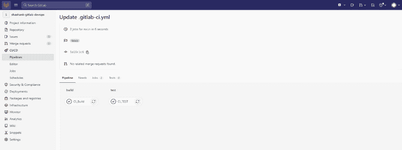

# 使用 GitLab 设置 CI/CD 管道

> 原文：<https://medium.com/globant/ci-cd-pipeline-setup-with-gitlab-46c36bc58eb3?source=collection_archive---------0----------------------->

**CI/CD with GitLab**

# ***CI/CD 带 GitLab:***

*这篇文章将指导你如何用 GitLab 设置 CI/CD 管道。*

*持续集成和持续交付(CI/CD)是一种自动构建和部署代码的方法，为您提供更高的速度和可靠性。它分两部分完成:持续集成(CI)和持续交付(CD)。持续集成是将代码持续集成到您的存储库的主要分支中，并自动测试它的实践。连续交付就是让您的代码进入可交付状态，这样只需点击一个按钮就可以部署它。或者，在连续部署的情况下，如果所有测试都通过了，就自动部署您的代码。*

***在本文中，我们将涉及下述主题。***

*   *在 GitLab 上注册*
*   *设置 GitLab 运行程序*
*   *设置 GitLab CI 管道*

# 假设:

1.  *你对基于 Linux 和 Unix 的平台有基本的了解。*
2.  *你对 docker &的图像有基本的了解。*

如果满足以上所有假设，让我们开始 GitLab 项目及其管道设置。

# 在 GitLab 上注册:

一旦我们成功注册 GitLab 门户网站，我们将会看到以下页面。

*git lab 的欢迎页面*

现在我们需要创建一个项目，并在项目存储库中创建一个分支。

*这里项目已经创建成功。*

# 设置 GitLab 运行程序:

*GitLab Runner 是一个与 GitLab CI/CD 配合使用的应用程序，用于在管道中运行作业。*

***各级跑者范围:***

*根据您想联系的人，您可以找到跑步者:*

1.  *git lab 实例中的所有组和项目都可以使用共享的 runners。*
2.  *组跑步者可用于组中的所有项目和子组。*
3.  *特定跑者与特定项目关联。通常，特定的转轮一次用于一个项目。*

***更多详情，请前往***[***https://docs.gitlab.com/***](https://docs.gitlab.com/)

***这里我要设置具体的跑步者。***

在设置特定的 runner 之前，我假设您有一台 Ubuntu Linux 机器来在这台机器上设置 Runner。

***第一步:先通过 putty 登录 Ubuntu 机器。***

***第二步:只需为您的系统下载一个二进制文件:***

*Linux x86–64 sudo*

*# curl-L—output/usr/bin/git lab-runner " https://git lab-runner-downloads . S3 . Amazon AWS . com/latest/binaries/git lab-runner-Linux-amd64 "*

***第三步:给它执行的权限:***

*# sudo chmod+x/usr/bin/git lab-runner*

***第四步:创建 GitLab CI 用户:***

*# sudo useradd—comment ' git lab Runner '—create-home git lab-Runner—shell/bin/bash*

***第五步:安装并作为服务运行:***

*# sudo git lab-runner install—user = git lab-runner—working-directory =/home/git lab-runner*

*#sudo gitlab-runner 开始*

***注意:*** *确保你在* ***【路径】*** *中有****/usr/local/bin****，否则你可能会得到一个* ***【命令未找到】*** *的错误。或者，您可以将****git lab-runner****安装在不同的位置，比如****/usr/bin****。*

## 下一步是将 GitLab Runner 注册到 GitLab:

***启用 GitLab 项目的运行者:***

*第一步:在顶栏上选择* ***主菜单>组*** *，找到你的组。*

*第二步:在左侧栏选择* ***设置> CI/CD*** *。*

*第三步:展开* ***转轮*** *。*

*GitLab 跑步者*

在此图中，我们可以看到没有特定的跑步者注册。

***在 Linux 下注册一个 runner:***

*登录 Ubuntu 机器，运行以下命令:*

***sudo gitlab-runner 寄存器***

*运行该命令后，它将询问下述细节，提供这些细节，您的跑步者就准备好了。*

*a .输入您的 GitLab 实例 URL(也称为 gitlab-ci 协调器 URL)。*

*b .输入您获得的令牌来注册跑步者(这些细节您可以从您的 GitLab 项目>设置> CI/CD > Runners】中获得)*

输入跑步者的描述。您可以稍后通过 GitLab 用户界面更改该值。

*d .输入与跑步者相关的标签，用逗号分隔。您可以稍后通过 GitLab 用户界面更改该值。*

e .为转轮输入任何可选的维护说明。

*f .提供亚军遗嘱执行人。对于大多数用例，输入 docker。*

*g .如果您输入 docker 作为您的执行人，您将被要求输入默认图像，用于在中没有定义图像的项目。gitlab-ci.yml.*

*提供这些详细信息后，我们可以看到我们的特定跑步者已经成功配置。*

*现在我们需要将 gitlab runner 设置为 runner 机器上的 sudo 用户，并将 docker 设置为 runner 机器上的后端。*

*将 gitlab-runner 用户添加到 sudoers 文件中。*

*#apt-get -y 更新*

*#apt-get -y 安装 docker*

*#apt-get -y 安装 docker.io*

# 设置 Gitlab CI 管道:

***现在我们来设置管道:***

为了运行管道，首先我们需要编写。gitlab-ci.yml YML 文件。

***本文件说明:***

第 1 行:我们可以使用' # '在 yml 文件中输入注释。

*第 2–4 行:此处流程将分两个阶段执行:构建&部署。*

*第 6–7 行:我们可以在 docker 上指定运行代码的节点版本的映像。*

*第 9–16 行:工作是创建一个构建。*

第 18–25 行:工作是做测试。

*在这里我们可以为作业指定任何我们想要的名称，阶段名称必须与阶段中定义的相同。*

*在主分支中添加此 yml 文件后，我们可以检查管道。*

*我们提交后。gitlab-ci.yml 文件，管道执行开始。*

*提交。gitlab-ci.yml 文件。*

*提交后，我们的管道已成功执行和完成，有关更多详细信息，请单击作业，然后单击特定作业以查看其日志和详细信息。*

*这里，GitLab 管道已经执行成功。*

*快乐学习:)*

# ***总结:***

*通过本文，我们能够了解到，如何使用特定的 gitlab-runner 创建 GitLab 管道并运行管道。*

# 参考资料:

*以下链接是创建本文档的一部分。*

*   [*https://docs.gitlab.com/ee/ci/quick_start/index.html*](https://docs.gitlab.com/ee/ci/quick_start/index.html)
*   [*https://docs.gitlab.com/ee/ci/yaml/gitlab_ci_yaml.html*](https://docs.gitlab.com/ee/ci/yaml/gitlab_ci_yaml.html)
*   [*https://docs.gitlab.com/runner/install/*](https://docs.gitlab.com/runner/install/)