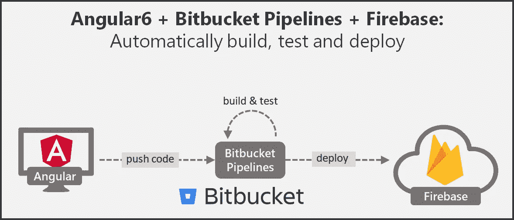
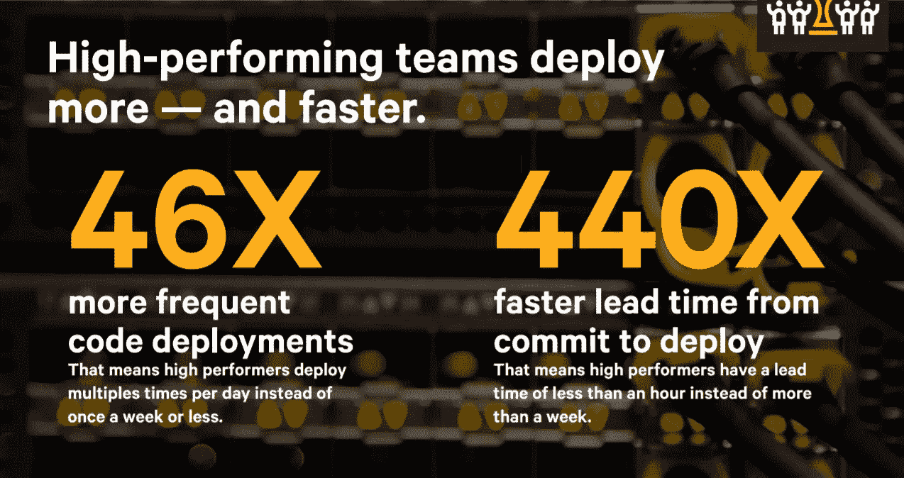
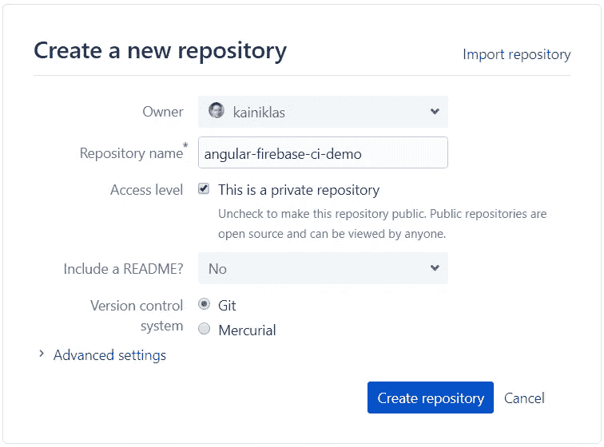
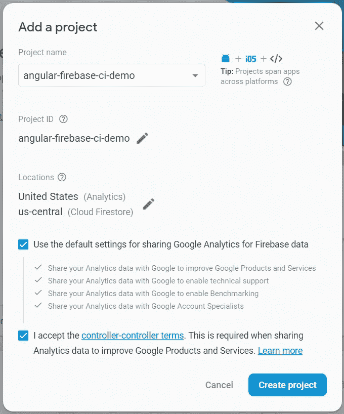
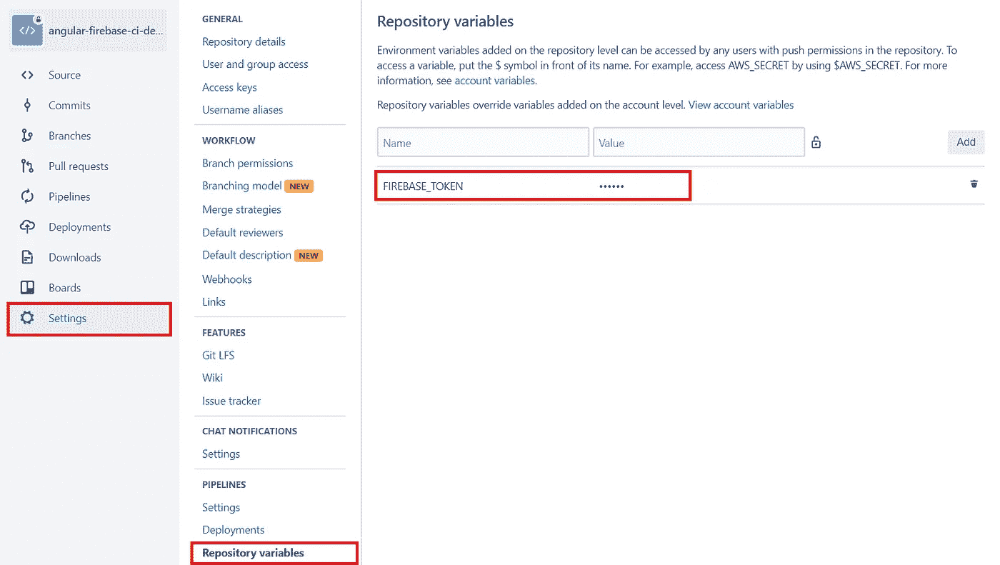

# CI/CD，带角度 6 & Firebase & Bitbucket 管道

> 原文：<https://medium.com/quick-code/ci-cd-with-angular-6-firebase-bitbucket-pipelines-a72a5445ef6f?source=collection_archive---------0----------------------->

## 使用位桶管道自动构建、测试和部署



# 投资 CI/CD 的动机

现代开发实践大大减少了工作的批量大小，例如，加快上市时间或更早获得客户反馈。一年一次或两次的经典发布节奏不再适用，无法跟上越来越多行业的市场步伐。相反，在极端情况下，亚马逊会每隔 [11.6 秒发布一次(截至 2011 年)。手动构建版本，执行手动测试，通过票证系统将代码移交给运营部门，然后运营部门尝试手动部署，这些方式显然不再有效。](https://news.ycombinator.com/item?id=2971521)

> **持续集成(CI)** 是一种开发实践，它要求开发人员频繁地将他们的代码集成到一个共享的存储库中，通常一天几次。每次签入都通过构建代码和执行测试来验证，以便尽早发现问题。【对比:[思想作品](https://www.thoughtworks.com/de/continuous-integration)
> 
> **连续部署(CD)** 是在 CI 阶段通过所有自动化测试后，自动将代码部署到生产环境中的策略。[比较: [Techtarget](https://searchitoperations.techtarget.com/definition/continuous-deployment) ]

[2017 年开发运营状况报告](https://puppet.com/blog/2017-state-devops-report-here)解释了为什么与传统方法相比，CI/CD 更有利于应用:

*   质量:变更失败率降低 5 倍
*   交付:从提交到部署的交付时间缩短了 440 倍
*   交付:代码部署频率提高 46 倍
*   快乐的团队:花在新特性和代码上的时间增加了 44%



Excerpt of 2017 State of DevOps Report [Infograph](https://puppet.com/system/files/2017-06/puppet-2017-State-of-DevOps-Report_0.pdf)

构建、测试和部署的自动化是可以自动化的最典型的步骤。在本文中，我们将在每次提交到主分支时，自动构建、测试和部署一个 Angular 6 应用程序到 Firebase hosting。为了使这个过程自动化，我们使用位桶流水线。

在之前的文章中，我已经演示了使用 Bitbucket 管道的 CI/CD，用于 1) [CakePHP 通过 FTP 到共享主机服务器](/quick-code/ci-cd-of-cakephp-with-bitbucket-pipelines-shared-hosting-server-via-ftp-9815f4e59dc1)和 2) [CakePHP 到 Heroku](/quick-code/ci-cd-of-cakephp-with-bitbucket-pipelines-heroku-81005ae70ff8) 。

# 概述

1.  创建位存储库
2.  创建 Angular 6 演示应用程序
3.  创建 Firebase 项目
4.  配置位桶管道

# 先决条件

*   [Bitbucket](https://bitbucket.org) 和 [Firebase](https://firebase.google.com/) 账号
*   安装在本地开发机器上的 [Git](https://git-scm.com/) 和 [Node.js](https://nodejs.org) 10.x

# (1)创建比特桶储存库

首先，我们创建一个新的[位存储库](https://bitbucket.org/)。你可以在这里找到我的演示库:[https://bitbucket.org/kainiklas/angular-firebase-ci-demo](https://bitbucket.org/kainiklas/angular-firebase-ci-demo)



Create new Bitbucket repository

# (2)初始化角度应用

在这个演示中，我们用 [Angular CLI](https://angular.io/guide/quickstart) 创建我们的 Angular 应用程序。如果您尚未安装 CLI，请使用以下命令进行安装:

```
npm install -g @angular/cli
```

如果您已经安装了旧版本的 angular CLI，请使用以下命令升级到最新版本，如这里的[所述](https://www.npmjs.com/package/@angular/cli):

```
npm uninstall -g @angular/cli
npm cache verifynpm install -g @angular/cli@latest
```

然后，我们可以创建我们的角骨架应用程序:

```
ng new angular-firebase-ci-demo
```

如果您对刚刚创建的内容感兴趣，请从内置服务器开始:

```
cd angular-firebase-ci-demo 
ng serve -o
```

该命令应该会自动启动您的浏览器并导航到 [http://localhost:4200/](http://localhost:4200/) 。

## 使用木偶师配置测试

默认的测试行为是启动 Chrome 并执行测试。在我们的 CI 环境中，我们没有安装 Chrome，我们也不想启动基于安贵的应用程序。因此，我们使用了包含 chrome 的木偶剧包，然后我们可以在无头模式下启动，这意味着没有 GUI。

首先，我们包含了对木偶师的开发依赖性:

```
npm install --save-dev puppeteer
```

然后我们配置我们的`karma.conf.js`用 ChromeHeadless 代替 Chrome。此外，我们需要使用`— no-sandbox`选项，让它在我们的 CI 环境中工作。此外，我们只想让测试用例运行一次，我们可以用标志`singleRun`进行配置。

```
# ./angular-firebase-ci-demo/**src/karma.conf.js****const puppeteer = require('puppeteer');
process.env.CHROME_BIN = puppeteer.executablePath();**module.exports = function (config) {
  config.set({
    (...)
    **browsers: [
      'ChromeHeadlessNoSandbox'
    ],
    customLaunchers: {
      ChromeHeadlessNoSandbox: {
        base: 'ChromeHeadless',
        flags: ['--no-sandbox']
      }
    },
    singleRun: true** });
};
```

## 提交到位桶

现在我们可以在 Bitbucket 中与远程存储库共享我们的本地代码。您可以在 Bitbucket 存储库概述中找到 git URL。对我来说，这些命令看起来像这样:

```
# switch to project folder in ./angular-firebase-ci-demogit remote add origin [https://kainiklas@bitbucket.org/kainiklas/angular-firebase-ci-demo.git](https://kainiklas@bitbucket.org/kainiklas/angular-firebase-ci-demo.git)git push origin master
```

代码现在应该在我们的 Bitbucket 存储库中可见了。

# (3)创建 Firebase 应用程序

在 https://console.firebase.google.com/的[上创建一个新项目。](https://console.firebase.google.com/)



New Firebase Project

## 安装 Firebase 工具

因为我们想要部署到 firebase，所以我们需要 [firebase 工具](https://www.npmjs.com/package/firebase-tools)。让我们将它们添加到我们的开发依赖项中，并在我们的机器上全局安装它们:

```
npm install --save-dev firebase-tools
npm install -g firebase-tools
```

## 添加构建和部署命令

在我们的`package.json`中，我们添加了以下两个用于生产构建和部署的命令。我们将在稍后的管道中使用它们。

```
"scripts": {
  "build-prod": "ng build --prod",
  "deploy": "firebase deploy --token $FIREBASE_TOKEN --non-interactive"
},
```

## 添加 Firebase 的配置

常规 Firebase 项目配置:

```
# ./angular-firebase-ci-demo/**.firebaserc**{
  "projects": {
    "default": "angular-firebase-ci-demo"
  }
}
```

Firebase 托管配置。让我们只部署在生产构建期间创建的 dist 文件夹中的内容。

```
# ./angular-firebase-ci-demo/**firebase.json**{
  "hosting": {
    "public": "dist/angular-firebase-ci-demo",
    "rewrites": [
      {
        "source": "**",
        "destination": "/index.html"
      }
    ]
  }
}
```

## 提交 Firebase 配置

我们现在需要将所有变更推送到我们的主分支。

```
git add -A
git commit -m "firebase config"
git commit git push origin master
```

# (4)设置位桶流水线

## 配置管道

我们在[位桶](https://bitbucket.org)上导航到我们的存储库，并在左侧导航菜单中导航到**管道**。我们第一次点击它时，可能需要一些时间，直到我们看到一些东西(大约 5-10 秒)。我们向下滚动页面并选择 JavaScript。用以下内容替换自动生成的`bitbucket-pipelines.yml`文件的内容，并提交文件:

*注意:*我们会得到一些错误，因为我们还没有配置环境变量。

## 已配置管道的说明

通过`image: node:10`,我们告诉管道哪个 docker 容器应该用于构建。对于角度 6，我们需要节点 10.x。

使用`branches: master:`我们定义，一旦我们将代码签入主分支，管道就应该运行。

使用`caches: -node`,我们缓存所有在依赖项安装期间下载的节点模块。这将加快后续运行的速度。

为了跟踪部署，我们使用命令`deployment: production`，该命令告诉 Bitbucket 将该管道视为生产部署。点击此处了解关于[位存储桶部署](https://confluence.atlassian.com/bitbucket/bitbucket-deployments-940695276.html)的更多信息。

最后一部分是`script:`部分的脚本。

1.  安装`package.json`中描述的所有所需模块
2.  按照[木偶师的故障排除文档](https://github.com/GoogleChrome/puppeteer/blob/master/docs/troubleshooting.md)中所述，安装所需的库以在 docker 映像上运行 chrome
3.  执行测试用例
4.  构建生产就绪工件
5.  将工件部署到 Firebase

如果任何命令失败，整个管道都会失败。这意味着，失败的测试将阻止部署到服务器上(这很好，因为我们不想中断生产)。

## 在 Bitbucket 中设置环境变量

在我们的管道脚本中，我们定义了环境变量`FIREBASE_TOKEN`,该变量用于针对 Firebase 对我们进行身份验证。我们通过在命令行上键入以下命令来获取令牌:

```
firebase login:ci
```

我们在**设置>管道>存储库变量**中放入 out 管道的令牌。

**重要提示:**切勿在 git 中存储密码或其他机密信息。相反，利用例如安全存储的环境变量作为密码。



现在提交 master 或重新运行管道，您将看到一个到 Firebase 的部署。

## 替代 Docker 图像

该管道目前正被一个为 chrome 安装所需库的声明“毒害”。如果没有这些库，chrome 将无法运行，并出现以下错误:

```
Cannot start ChromeHeadless /opt/atlassian/pipelines/agent/build/node_modules/puppeteer/.local-chromium/linux-609904/chrome-linux/chrome: error while loading shared libraries: libX11-xcb.so.1: cannot open shared object file: No such file or directory
```

更干净的方法是使用包含这些库的自定义 docker 容器。这样维护起来更友好，并且加快了流水线的速度。在[木偶师的故障排除文档](https://github.com/GoogleChrome/puppeteer/blob/master/docs/troubleshooting.md)中描述了这种情况。

# 最后的想法

此外，我们可以定义在代码被合并到一个特定的分支之后，我们所部署的测试或测试环境。

# 想多读点？

订阅我的 [**现代软件架构**](https://mailchi.mp/7f46c21dfc63/better-software-architect) 时事通讯。增长您的技能，成为更好的软件架构师。

支持我的工作，看看我的书“[成为一个更好的软件架构师——实践经验中的行动和见解](http://bit.ly/betterSoftwareArchitect)”。

[](http://bit.ly/betterSoftwareArchitect)

[Become a Better Software Architect — Actions and insights from practical experience](http://bit.ly/betterSoftwareArchitect)

*原载于 2018 年 12 月 14 日*[*kai-niklas . de*](https://kai-niklas.de/160/ci-cd-with-angular-6-firebase-bitbucket-pipelines/)*。*