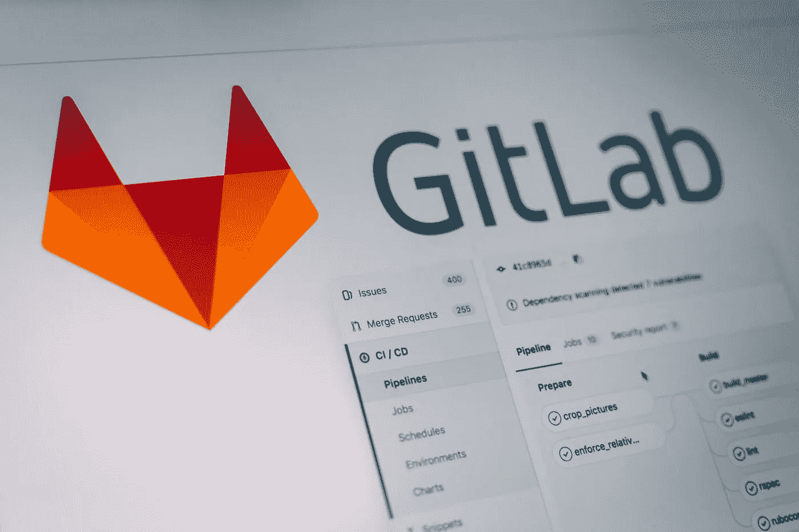
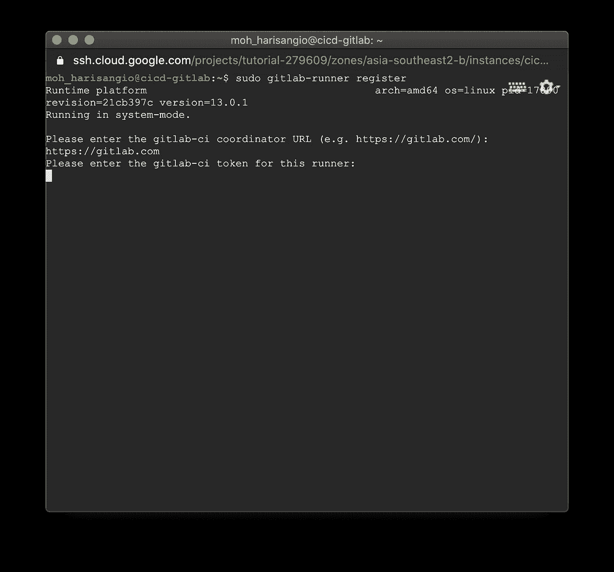
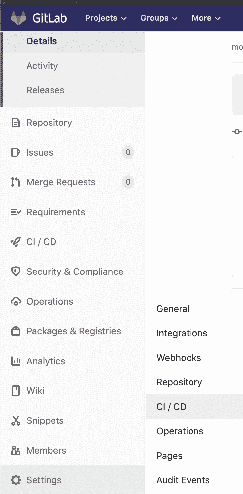
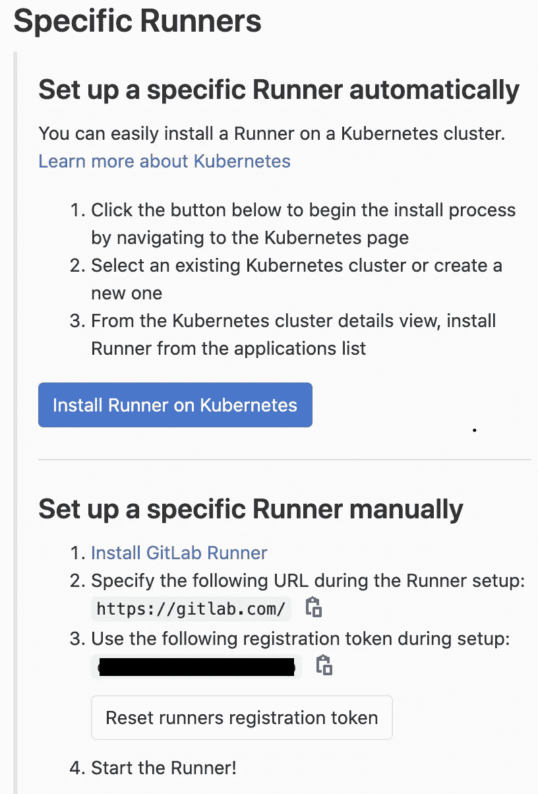
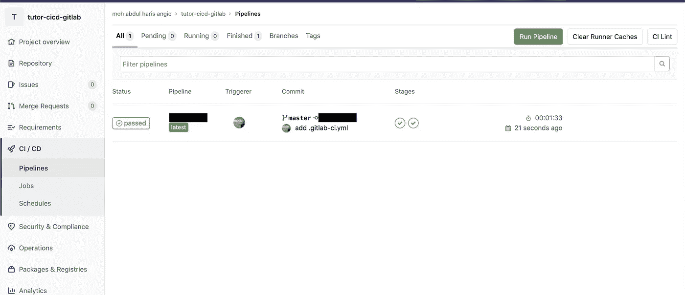
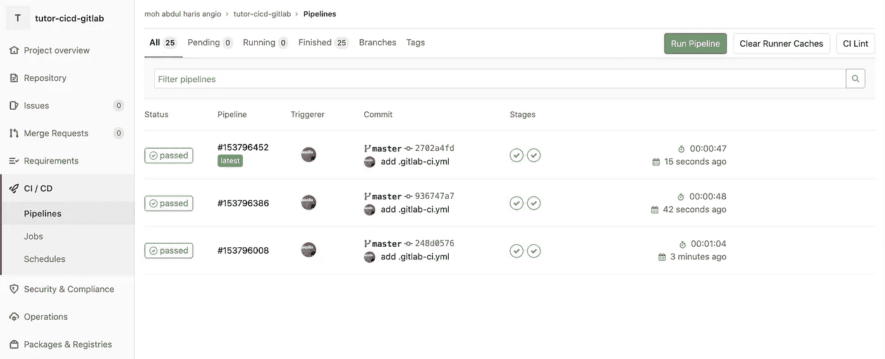

# CI/CD with Gitlab

> 原文：<https://medium.easyread.co/ci-cd-with-gitlab-5d095b65c8f7?source=collection_archive---------0----------------------->



From [Unsplash](https://unsplash.com/photos/ZV_64LdGoao) By [Pankaj Patel](https://unsplash.com/@pankajpatel)

Hallo teman-teman semua pada kesempatan ini saya akan membahas langkah-langkah membuat CI/CD dengan gitlab.

Pada Tulisan ini saya menggunakan beberapa alat dan bahan hehehe udah kayak masakan ya, Oke ini dia alat dan bahan yang saya gunakan :

# Prerequisite Server

*   Virtual Machine: [Google Cloud Platform](https://cloud.google.com/)
*   Sistem Operasi Server : Ubuntu 18.04 LTS With 2GB Ram
*   Gitlab-Runner Version 13.0.0.1
*   Node Version 10.x Or Newer
*   Yarn Version 1.21.x Or Newer
*   Docker Version 19.3.x Or Newer
*   Docker-Compose Version 1.26.x Or Newer

# Installation Gitlab-Runner

Pada langkah pertama ini kita akan menginstall gitlab-runner tools dari [Gitlab](http://gitlab.com) untuk CICD, Langsung saja kita eksekusi

*   Pertama kita masuk ke server yang akan kita jadikan CICD servernya dengan menggunakan SSH.
*   Selanjutnya kita install Gitlab-runner nya sesuai dengan arsitektur dari Sistem Operasi teman-teman. Silahkan Pilih sesuai dengan arch Sistem Operasi teman-teman dan Copy linknya

```
# Linux x86-64
sudo curl -L --output /usr/local/bin/gitlab-runner https://gitlab-runner-downloads.s3.amazonaws.com/latest/binaries/gitlab-runner-linux-amd64

# Linux x86
sudo curl -L --output /usr/local/bin/gitlab-runner https://gitlab-runner-downloads.s3.amazonaws.com/latest/binaries/gitlab-runner-linux-386

# Linux arm
sudo curl -L --output /usr/local/bin/gitlab-runner https://gitlab-runner-downloads.s3.amazonaws.com/latest/binaries/gitlab-runner-linux-arm

# Linux arm64
sudo curl -L --output /usr/local/bin/gitlab-runner https://gitlab-runner-downloads.s3.amazonaws.com/latest/binaries/gitlab-runner-linux-arm64
```

*   Setelah itu ganti permission folder dari gitlab-runner

```
sudo chmod +x /usr/local/bin/gitlab-runner
```

*   Tambahkan User gitlab-runner

```
sudo useradd --comment 'GitLab Runner' --create-home gitlab-runner --shell /bin/bash
```

*   Install Gitlab-runner dan config untuk working-directory

```
sudo gitlab-runner install --user=gitlab-runner --working-directory=/home/gitlab-runner
```

*   Start Gitlab-Runner

```
sudo gitlab-runner start
```

Proses instalasi sudah selesai.

*   Daftarkan User gitlab-runner agar bisa mengeksekusi perintah sudo

```
sudo nano /etc/sudoers
```

*   Tambahkan perintah ini dalam filenya

```
gitlab-runner ALL=(ALL) NOPASSWD: ALL
```

Selanjutnya kita akan masuk tahap registrasi repository yang akan diimplementasikan CICD.

# Registration

Sebelum teman-teman ketahap ini teman-teman saya harap sudah menyiapkan repositorynya, jika belum silahkan buat dulu project react-js sederhana, cukup frontend saja tidak perlu backend.

Pada Tahap ini kita akan meregistrasi reposirtory pada server cicd.

*   Tahap registrasi ini kita mulai dengan commad

```
sudo gitlab-runner register
```

*   Masukan URL Gitlab



Console GCP

*   Setelah itu buka repository gitlab kalian, kemudian masuk ke setting seperti pada gambar dibawah ini



CICD Setting

*   Kemudian ***expand*** pada bagian runners dan copy token-nya yang ada pada bagian Specific Runners



Gitlab-Runner Token

*   Masukan Description *(kalau mau diskip tinggal enter saja)*
*   Masukan Tag *(kalau mau diskip tinggal enter saja)*
*   Setelah itu masukan executor, pada tulisan ini saya hanya menggunakan shell sebagai executor, jika kalian ingin menambahakn docker, dan yang lainnya juga tidak masalah.

Registrasi Repository nya sudah selesai, kita lanjutkan dengan membuat file .gitlab-ci.yml

# Add .gitlab-ci.yml

pada tahap terakhir kita akan menambahkan file yml pada repository yang berguna sebagai file config untuk dijalankan oleh gitlab-runner yang telah kita install di server.

*   Pindah ke direktory repository kalian

```
cd <repository directory>
```

*   Buat file .gitlab-ci.yml

```
touch .gitlab-ci.yml
```

*   Edit file .gitlab-ci.yml

```
sudo nano .gitlab-ci.yml
```

*   Copy paste configurasi ini

.gitlab-ci.yml

*   Setelah itu kalian push ke gitlab.com
*   Setelah kalian push maka akan muncul seperti ini pada menu CI/CD pipelines kalian



CI/CD Pipelines Menu

Konfigurasi CI/CD kalian sudah jadi tapi ini belum bisa live karena File buildnya belum kalian delivery.

# Delivery

Pada Tahap ini pastikan teman-teman sudah menginstall dan mengkonfigurasi web server ya.

***(OPTIONAL)***

Jika Kalian belum setting web server nya bisa mengikuti langkah ini kalau sudah ada web server bisa di skip.

Pastikan diserver sudah terinstall docker dan docker-compose.

*   Kalian Buat sebuah file docker-compose.yml dan folder build untuk menampung file hasil build pada file root server kalian, boleh pada */home/ < username >*
*   setelah itu masukan konfigurasi dibawah ini pada docker-compose.yml

docker-compose.yml

*   Buat folder bernama config untuk menyimpan file config Nginx
*   Buat file nginx.conf di folder yang dibuat sebelumnya dan copy config dibawah ini

nginx.conf

**CAUTION**

```
- Pada File ***docker-compose.yml*** ubah line 9 dengan /home/<username>/config/nginx.conf- Pada file ***nginx.con*f** Ubah line 4 dengan ip atau domain server kalian
```

*   Pindah ke folder root lagi

```
cd /home/<username>
```

*   Jalankan Docker-Compose

```
sudo docker-compose up -d
```

Langkah selanjutnya kembali ke repository kalian

*   Edit file .gitlab-ci.yml pada command “ ***sudo \cp -R build/ < directory yang dikenal oleh webserver >*** ”

> <directory yang="" dikenal="" oleh="" webserver="">=> /home/ <username>/</username></directory>

*   Push ke gitlab kalian
*   Pipeline akan dijalankan dan jika berhasil seperti ini



CI/CD Pipelines Menu

*   Lihat Perubahan yang terjadi pada situs yang kalian.

Proses CICD menggunakan Gitlab sudah selesai

Pada kesempatan kali ini cukup sampai disini ya, jika kalian mendapat kendala silahkan response tulisan ini sebisa mungkin saya akan bantu.

Terima kasih teman-teman kurang lebih mohon maaf Wasallam

Reference :

*   [https://docs.gitlab.com/runner/install/linux-manually.html](https://docs.gitlab.com/runner/install/linux-manually.html)
*   [https://docs.gitlab.com/runner/register/](https://docs.gitlab.com/runner/register/)