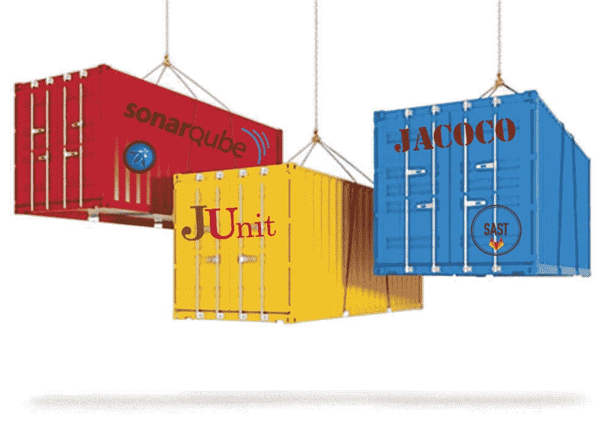

# CI/CD worker 节点作为虚拟机还是 K8s 容器？

> 原文：<https://medium.com/oracledevs/ci-cd-worker-nodes-as-virtual-machines-or-k8s-containers-486bc0ab3a87?source=collection_archive---------0----------------------->

当涉及到 CI/CD 部署时，文档中通常没有提到在 [Kubernetes](https://kubernetes.io) 环境中作为容器运行您的工作节点，或者在云环境中作为(虚拟)机器运行您的工作节点的优缺点。

您不需要采用微服务解决方案，就可以从使用 Kubernetes 环境构建应用程序中受益。同样，如果你使用像 [Argo](https://argoproj.github.io/) 、 [Tekton](https://tekton.dev/) 和 [Jenkins X](https://jenkins-x.io) 这样的具有 K8s 意识的 CI/CD 工具，你将无法最大限度地利用它们的特性。

CI/CD 管道中使用的许多工具，如[sonar cube、](https://www.sonarqube.org/)都有预构建的容器。为工具提供容器映像是一种很好的方式，可以帮助人们在不进行安装投资的情况下试用工具。但是拥有一个容器只是故事的一半。理想情况下，您需要 K8s config 来确保代码覆盖率数据和来自 lint 的输出等(次要)工件也被保留。

如果不考虑这些因素，那么 CI/CD 管道是否能够加速交付并帮助消除首次错误？

我们的选择是更高级的 K8s 配置，它确保我们不会丢失来自我们工具的覆盖率数据，*但是*工作/临时文件夹，比如 [maven 的(. m2)存储库](https://maven.apache.org/guides/introduction/introduction-to-repositories.html)不会被持久化。即使这样，我们也不能把容器当成牲口，同时降低暂时依赖的风险，等等。在处理构建需求方面也有更大的弹性潜力。我们可以保持简单，牺牲容器提供的好处，但这种方法意味着唯一的好处是预装软件。大多数 CI/CD 工具都可以轻松地自动部署，或者手动部署和映像。

作为一个观察，请注意 [GitHub Actions](https://github.com/features/actions) 倾向于引导人们拥有虚拟机，而不是工人的容器。当然，通过一些努力，您可以将工人实现为容器，但是用于 GitHub 操作的 K8s 操作符将是一个强大的解决方案(在这里可以找到一个非官方的实现[)](https://github.com/evryfs/github-actions-runner-operator)。

显然，这两种方法的好处都非常明显。那么怎么决定呢？我们可以使用压力测试，有时也称为决策矩阵——这是我以前写过的一个想法([决策矩阵也称为“压力测试”)，作为一种使决策更容易的工具](https://blog.mp3monster.org/2022/09/02/decision-matrix-aka-stress-test-as-a-vehicle-to-make-decisions-easier/)。

正如您从我们的矩阵图中看到的，这是一个公平的案例，但是需要解决一些重要的问题。

作为 Oracle 参考架构(RA)团队的一员，我们进一步阐述了这些想法，然后将它们映射到不同的云 CI/CD 架构上，以帮助轻松确定哪种 RA 最适合您的需求。这允许您利用创建的指导和自动化来引导流程。看一看[建筑中心](https://docs.oracle.com/en/solutions/select-cicd-architecture)中充实的景观。