# 使用 Unity CLI 发布 Android 应用程序的 CICD 自动化

> 原文：<https://medium.com/globant/cicd-automation-using-unity-cli-for-publishing-android-app-752f3e85ec10?source=collection_archive---------0----------------------->

Unity 是一个广泛使用的游戏开发引擎，被许多人用来为各种平台开发游戏。

本文包含以下几个部分:

*   介绍
*   先决条件
*   步骤 1:使用命令行在本地服务器上构建和测试
*   步骤 2:使用 CI/CD 工具构建、测试和发布
*   结论
*   参考

# 介绍

在本文中，我们将看到如何通过命令行使用 unity 命令来自动构建和测试我们的 android 项目，并将其发布到应用中心。虽然在本文中，我们将在步骤中使用 Jenkins pipeline 的屏幕截图作为参考，但您可以选择使用您选择的任何其他 CI/CD 工具，因为所有工具的方法都是相同的。

我们将要使用的命令由 Unity Technologies 提供，可以使用 [Unity 命令行文档](https://docs.unity3d.com/Manual/CommandLineArguments.html)访问。

文章分为两个主要部分。在第一部分中，我们将使用命令行实用程序在本地构建 apk，在第二部分中，我们将了解如何使用 DevOps 工具来构建、测试和部署同一个项目。

# 先决条件

*   安装在具有有效许可证的本地计算机上的 Unity Hub。Unity hub 可以从其官方网站[下载](https://unity3d.com/get-unity/download)。
*   Unity 版本应该与在所需目标支持下安装的项目版本相同。示例—如果构建 apk 文件，应该安装和配置 Android SDK 和 NDK。
*   应用中心帐户。没有的话可以[免费造](https://appcenter.ms/signup?utm_source=Azure%20Marketing&utm_medium=Azure)一个。

# 步骤 1:使用命令行在本地服务器上构建和测试

*   创建一个执行方法文件:
    为了通过命令行构建一个项目，需要一个执行方法。首先调用这个 execute 方法，它将一个接一个地构建 execute 方法中列出的场景。
    下面是一个包含在您的项目中的示例执行方法，它定义了三个场景、输出文件的位置和平台目标(本例中为 Android):

```
using UnityEditor;
class AndroidBuilder
{
 static void ProductionBuild()
 {
  BuildPlayerOptions buildPlayerOptions = new BuildPlayerOptions();
  buildPlayerOptions.scenes = new[] { "Assets/Scenes/Scene1.unity", "Assets/Scenes/Scene2.unity", "Assets/Scenes/Scene3.unity" };
  buildPlayerOptions.locationPathName = "/builds/OutputApkName.apk";
  buildPlayerOptions.target = BuildTarget.Android;
  buildPlayerOptions.options = BuildOptions.None;
  BuildPipeline.BuildPlayer(buildPlayerOptions);
 }
}
```

*   接下来，您需要在 repo 中提交该文件。您可以创建以下目录结构，将文件保存为项目中的 AndroidBuilder.cs:

```
Assets/Editor/Builder/AndroidBuilder.cs
```

*   打开命令提示符，将目录更改为包含您的项目版本的 Unity.exe 的文件夹:

```
cd C:\Program Files\Unity\Hub\Editor\<EditorVersion>\Editor
```

*   使用以下参数运行 build 命令:

```
Unity.exe -batchmode -quit -projectPath “<path to your project>” -buildTarget Android -executeMethod AndroidBuilder.ProductionBuild -logfile “<path to your project>/logfileName.log”
```

*   快速浏览一下这些参数:
    -batchmode:在后台执行 Unity。
    -quit:命令执行完毕后退出 Unity。
    -projectPath:项目的路径。
    -build Target:Android/web GL/iOS 等目标平台。
    -logfile:在提到的目录中创建一个构建日志文件。
*   使用以下命令运行单元测试:

```
Unity.exe -batchmode -quit -runTests -testPlatform editmode -projectPath “<path to your project>” -testResults “<Output folder for test file>\TestResults.xml”
```

-runTests 和-testPlatform 是两个特定于运行单元测试的参数。测试可以在“播放模式”或“编辑模式”下运行。

# 步骤 2:使用 CI/CD 工具构建、测试和发布

既然我们已经了解了如何通过命令来构建 Unity 项目，我们就可以利用 DevOps 工具来持续构建代码，并将其分发给测试人员，然后最终分发给生产环境，而不必每次都手动构建。

让我们看看配置发布应用程序的端到端系统所需的步骤。我们在这里使用了 Jenkins pipeline 的截图，但是对于其他工具来说方法也是一样的。

下图显示了将 apk 文件发布到 Visual Center 的步骤流程。开发人员将在 git 存储库中提交他们的代码。构建管道将连接到 git 存储库，并将构建和测试代码，并将 apk 作为构建工件输出。发布管道将获取构建工件，并将其发布到相应环境的分发组。

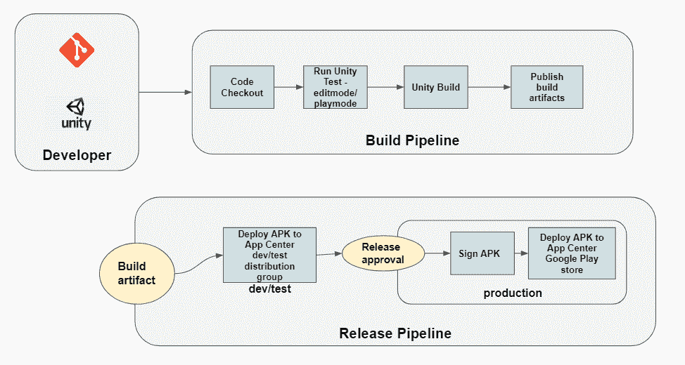

Build and Release Flow

## 构建步骤:

*   **创建新的构建管道**。我选择了詹金斯的自由式项目。

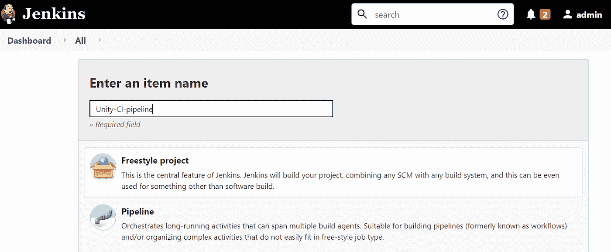

Creating New Item in Jenkins

*   **将你的代码库链接到管道**。如果您的代码在本地机器上，您必须首先将它推送到一个代码存储库，比如 Git，并使用 repo 链接连接到管道。

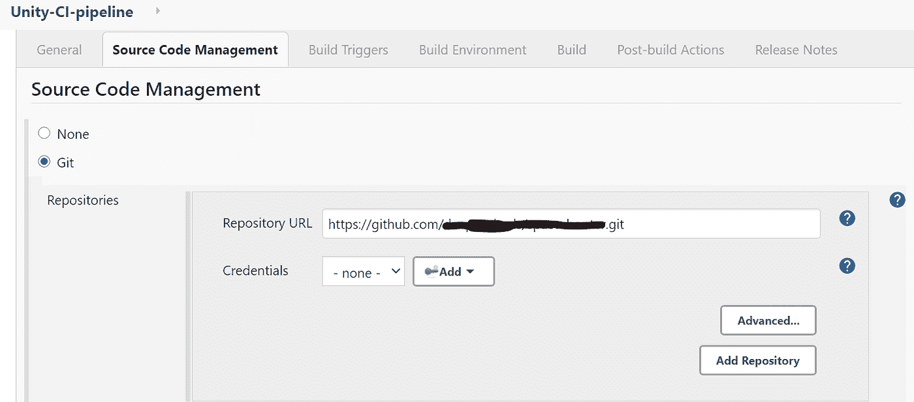

Link Repository in pipeline

*   **为构建触发器**配置管道。
    您可以根据需要从可用选项中设置构建触发器。如果您希望启用持续集成，请选择“GitHub hook trigger for git SCM polling”。

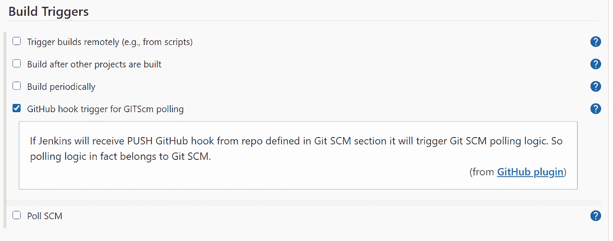

Set up build triggers in your pipeline

*   **添加运行命令行脚本的任务/步骤，输入构建命令**。请注意，在下面的截图中，我使用了“%WORKSPACE%”，这是工作目录的预定义变量。您必须为正在使用的工具更改和使用预定义的工作空间变量。

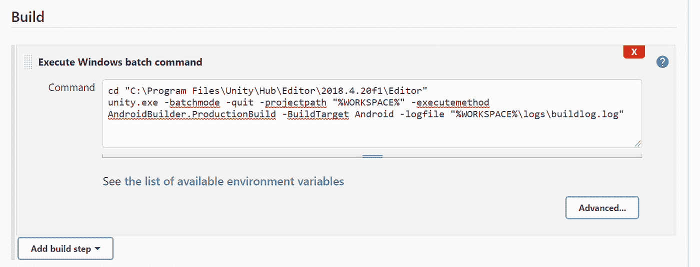

Command Line task for running build

*   **添加另一个命令行任务/步骤来运行测试命令**。

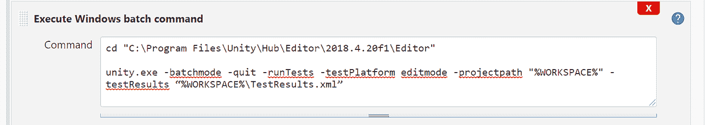

Command Line task for running test in editmode

*   **添加一个发布构建工件的任务**。在要发布的路径中传递生成输出目录的路径。在 Jenkins 中，您可以添加一个构建后操作来归档工件。

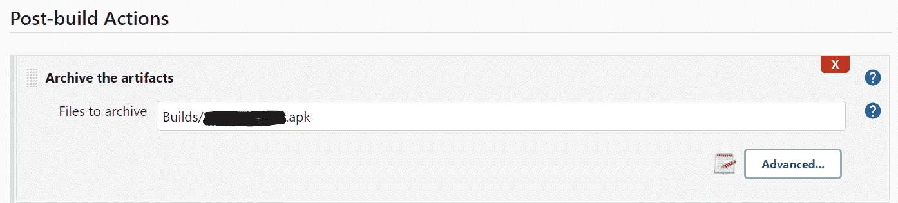

creates an apk file in the Builds folder as Build artifact

## 发布步骤:

*   **创建一个新的发布管道，并将构建工件链接到发布管道**。
    发布管道应该能够获取构建输出文件。在这里，我使用 Azure DevOps 来创建我的 CD 管道。我已经使用 Azure DevOps 上的服务连接将我的 [Jenkins 服务器链接到 Azure DevOps，并使用链接的我的 Jenkins 构建管道输出作为 Azure DevOps 发布管道中的工件。](https://docs.microsoft.com/en-us/azure/devops/pipelines/release/integrate-jenkins-pipelines-cicd?view=azure-devops&tabs=classic#link-jenkins-with-azure-pipelines%20https://docs.microsoft.com/en-)

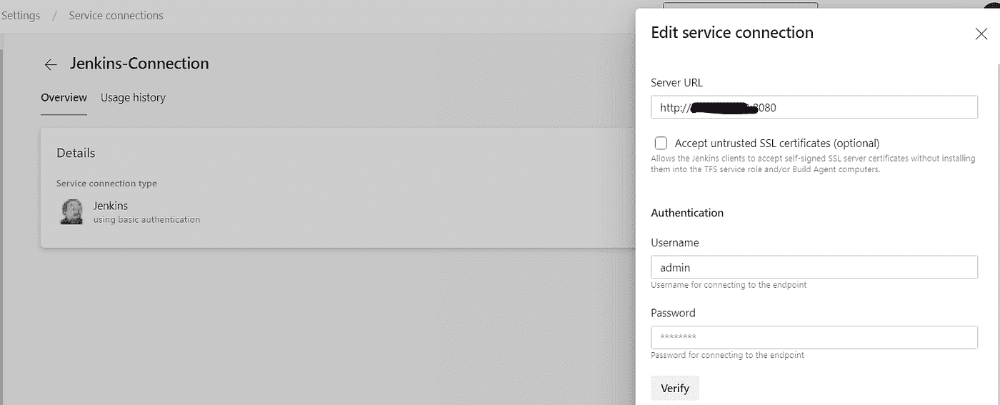

Jenkins service connection on Azure DevOps

*   **安装 VS 应用中心所需的插件/任务**。
    在发布到 App Center 之前，您必须首先安装 VS App Center 所需的任务/插件，并在您的 App Center 应用程序和您的部署工具之间创建一个连接(在本例中为 Azure DevOps pipeline)。为此，您将需要服务器 URL 和 API 应用程序令牌。可以使用此处提供的[步骤创建 API 令牌。](https://docs.microsoft.com/en-us/appcenter/api-docs/)
*   **为 Dev 创建一个新的 stage 并添加一个 Visual Studio App Center 任务**。
    填写您的应用程序的详细信息，例如所有者姓名/用户名、版本、发布说明和分发组详细信息

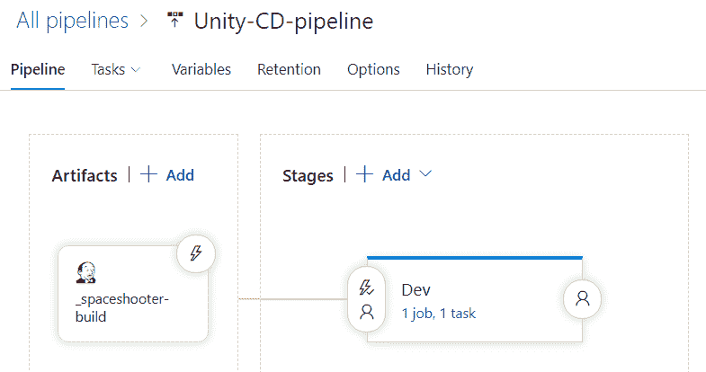

Add artifacts and new stage from the Pipeline section

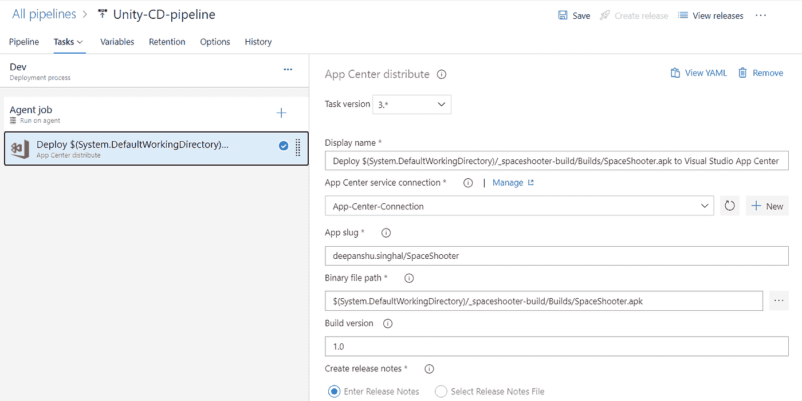

Add a task for distributing on App Center

*   您可以为测试、试运行和生产环境创建类似的发布阶段。
    对于生产，您必须增加一个额外的步骤来签署和调整 apk。有现成的 Android 签名任务，您可以在发布应用程序之前使用这些任务对其进行签名。您可以将您的应用中心配置为[连接到 Play Store](https://docs.microsoft.com/en-us/appcenter/distribution/stores/googleplay#create-a-google-play-connection-in-app-center) 并从您的管道发布到商店。

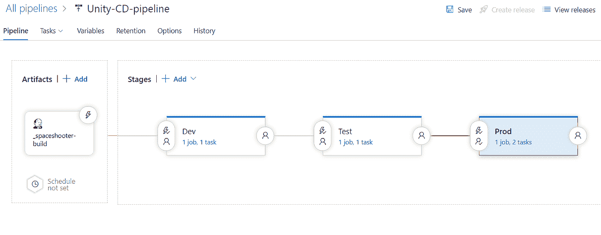

Release pipeline with separate stage for each environment

此外，您可以根据您对构建和发布管道的要求设置 CI/CD、拉式请求、预定触发器，以实现持续集成、交付和部署。这将确保您的更改得到更频繁的测试和部署。

# 结论

我们看到了如何通过为我们的 Unity 项目建立一个构建和发布管道，我们可以不断地发布新版本到一个发布列表，如 App Center，而没有一次又一次手动构建和发布的麻烦。您可以使用不同的 CI 和 CD 工具，就像我们在这里所做的那样，或者只使用一个工具。Jenkins 作为一个构建工具完美地完成了工作，Azure DevOps 提供了一个优秀的多阶段发布功能，具有发布前部署批准，这使得它可以轻松地部署到多个环境。

# 参考

*   [我如何通过命令行或自动构建支持不同的配置来构建特定的播放器…](https://support.unity.com/hc/en-us/articles/115000368846-How-do-I-support-different-configurations-to-build-specific-players-by-command-line-or-auto-build-system-)

值得一读:

*   [使用移动 DevOps 工具的 7 个流程步骤——Bitbar](https://bitbar.com/blog/7-process-steps-with-mobile-devops-tools/)