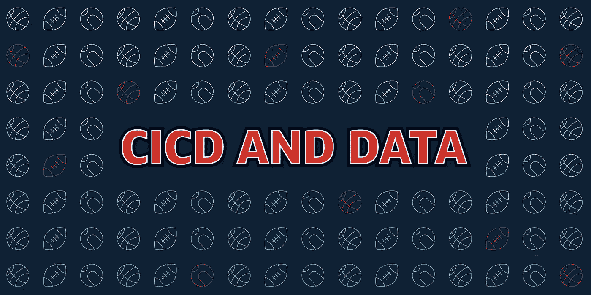

# CICD 和数据

> 原文：<https://medium.com/capital-one-tech/cicd-pipelines-and-data-platforms-758b074b38b1?source=collection_archive---------3----------------------->

## 关于形式服从功能的思考

“CI/CD 管道”这个词最近开始感觉像一个神奇的词。基本的概念实际上是有价值的——自动化的生产流水线使得 MVP 能够更快地上市，在没有组织开销的情况下修复 bug，以及以迭代的方式添加新特性。很难不让想象力天马行空。

我的的确如此。作为一个三人数据产品开发团队的成员，我将 CI/CD 视为一种生活方式。面对是建立管道还是将 33%的开发能力用于生产部署的选择，我的团队决定自动化。

通过收获成熟管道的好处的过程，我有了很多思考空间来找出考虑与数据产品相关的 CI/CD 的最佳方式，并且我已经找到了两种不同的思维方法，其中只有一种指向正确的方向。另一个就没那么好了。

首先，让我们确定什么是正确方向。引用 20 世纪传奇建筑师路易斯·沙利文的话，我们想去一个地方…

# 形式服从功能

你知道什么比头韵更好吗？历史人物的头韵。)

多年来，最流行的数据处理方法是集中式静态仓库，它可以处理用户查询和自动化报告。随着 Apache Kafka、Amazon S3、数据即服务模型以及其他模型的兴起，可用的数据访问模式的数量经历了相对的爆炸式增长。

因此，设计数据平台已经成为一门微妙的艺术——数据的位置、形式和节奏都在决定平台的架构和功能方面发挥着作用。这是非常令人兴奋的，因为这意味着常见的故障，无论是与数据相关的还是其他的，都可以在低于查询级别的自动化流程中反复解决。如果作业因数据加载延迟和意外的空值而失败，而不是简单地退出，则作业的行为会有所不同。

T2:让我换一种说法。想象一下两个玩不同运动的同卵双胞胎，鲍勃和比尔。两人都非常擅长运动，他们都成为各自运动领域的专业人士；鲍勃喜欢足球，比尔喜欢网球。

进行如此不同的运动将会影响他们训练的方式。因为足球非常强调在短时间内产生向前的动力，鲍勃可能会有非常强壮的腿。另一方面，比尔可能会专注于发展他的握力，结果他打球的前臂会变大，甚至与他的另一只手臂相比。尽管他们相同的基因意味着他们从同一个地方开始，但每个双胞胎的职业需求将导致他们产生分歧。

但是，如果鲍勃和比尔非常喜欢对方，以至于他们决定一起在篮球队打球，那该怎么办呢？于是，现在每个双胞胎 50%的时间都花在了篮球赛季的训练上，身体属性自然趋同。

我想提出的假设是，第二种安排将导致 Bob 作为足球运动员回归，而 Bill 作为网球运动员回归。当所有的数据生产者和消费者在同一个平台上运行时，我们就会遇到这种情况。

# 这与 CI/CD 有什么关系(以不好的方式)

任何应用程序，当需求范围过大时，都会变得过度紧张，看起来不稳定，就像一堆电线，随着时间的推移，从整齐的排列变成可怕的混乱。因此，当谈到 CI/CD 时，就有了一个哲学上的岔路口。

沿着一条路径*(就上下文而言，这条路径是有暴风云和听起来邪恶的狼(而不是听起来友好的狼))走下去，*是一种相对容易部署的情况，最终会超出平台的限制。

还记得我前面提到的单片数据仓库吗？这条路直接通向它。

构建新平台总是很难。相比之下，如果添加到现有平台总是很容易，那么您可以看到现有平台是如何变得不堪重负的。想想 CI/CD 的承诺:更快的交付，更快的价值。鉴于这一核心理念，为新的业务需求构建新平台的开发开销是很难说服人的。

*如果 CI/CD 让事情变得如此之快，为什么要花六个月的时间才能启动并运行呢？这里的这个团队有一个使用大部分相同数据的平台…为什么我们不能添加到他们的平台上呢？*

当速度是唯一的卖点时，这些是自然出现的困境，从长远来看，它们有可能导致巨石形成。

# 这与 CI/CD 有何关系(好的方面)

在另一条充满彩虹和阳光的道路上，我们有一个被平台利用的数据环境，这些平台的底层结构反映了它们被构建来解决的数据需求。每次构建都是一个迭代过程。平台和数据彼此结合，每个构建都发挥了它的全部潜力。独石已经成为过去，取而代之的是众多富有弹性的、在幕后互动的专业化产品。

CI/CD 管道是实现这一目标不可或缺的一部分。monoliths 最具破坏性的一个方面是，它们需要一个复杂的支持基础设施——开发人员经常被拉离向前推进的项目，以协助生产实现和修复。生产的自动化管道允许开发人员不断地向前看，在事情破裂之前修复它们。为了拥有一个真正健康的 DevOps 心态，这需要和速度一起支持。

尽管问题是由巨石造成的，但它们似乎有办法解决问题，但它们太大了，无法扭曲；他们不能提供快速迭代的好处。找到与危险的整合环境相对立的 DevOps 的好处是保持前进势头的一个关键方面。

# 结论

大多数人对阴阳的象征意义有粗略的了解，但我发现其中一个引人注目的意象是两边颜色相反的点。白边上的黑点象征着一个老阳变成了一个年轻的阴，反之亦然。

DevOps 可以被框定为小群体自给自足概念的体现。那么，它的相反力量就是中央集权。就像我们的两个运动双胞胎一样，自给自足的团队可能会被追求多个方向的欲望席卷，最终巩固它们对任何人都没有好处。随着开发运维实践在您的组织中的成熟，请注意逻辑上的极端情况。真正高效的团队将会成功，而且必须是正确的团队。

# 有关系的

*   数据的最大列表方法
*   [思考流媒体的三种方式](/capital-one-tech/three-ways-to-think-about-streaming-6cc39b99a56e)

*声明:这些观点仅代表作者个人观点。除非本帖中另有说明，否则 Capital One 不属于所提及的任何公司，也不被其认可。使用或展示的所有商标和其他知识产权都是其各自所有者的所有权。本文为 Capital One 2018。*