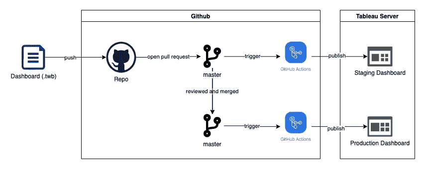
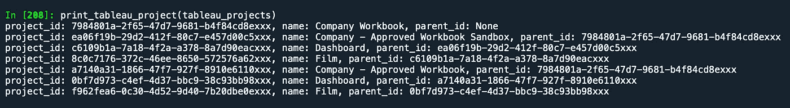
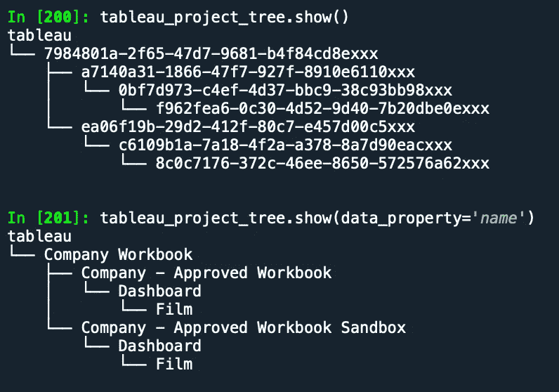
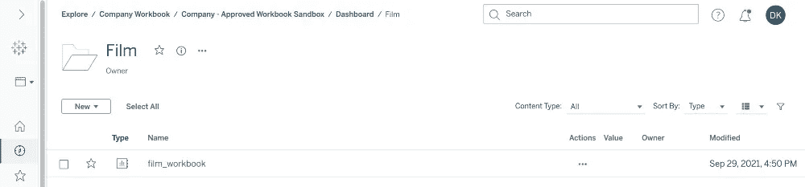
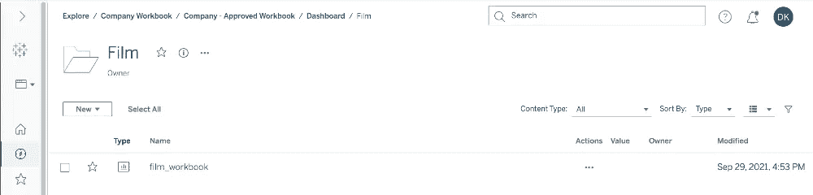

# 用 Github 操作 CICD 你的 Tableau 仪表板

> 原文：<https://medium.easyread.co/cicd-your-tableau-dashboard-with-github-actions-4fe2d336f0be?source=collection_archive---------0----------------------->

## 承诺并推动你的。twb (Tableau 工作簿)文件

Photo by [Mimi Thian](https://unsplash.com/@mimithian?utm_source=medium&utm_medium=referral) on [Unsplash](https://unsplash.com?utm_source=medium&utm_medium=referral)

# 一些背景

**Tableau 是一款用于商业智能行业的数据可视化工具**，主要由我们的数据团队用来创建分析和仪表板。

在创建/开发仪表板时，Tableau 用户通常连接到**数据源/从数据源提取数据，**在**工作簿中创建视图和分析，**和将其从 **Tableau Dekstop** 发布到 **Tableau Server** 以到达他们的受众。

在幕后，发布工作簿是通过**提交*来完成的。twb* 或*。twbx*** 文件由 Tableau 桌面传送到 Tableau 服务器。

> 大多数 Tableau 用户使用*。twbx* 用于离线和简单的分析/仪表板但是当涉及到分析/仪表板有一大组数据 ***。twb* 更可取，因为它只包含 Tableau 的指令和连接信息(不是实际数据)**，这使得它比*更加紧凑和模块化。twbx* 更多关于 [*的信息。twb* 和*。twbx* 此处](https://interworks.com/blog/interworks/2012/01/25/twb-vs-twbx-whats-the-difference/)。

但是整个过程**很少涉及任何观众或同行的反馈**，并且经常不涵盖软件开发所遵循的**控制和 QA** 的需求。

因此，我为希望改进工作簿开发流程的 Tableau 用户创建了一个新流程，增加了一个额外的步骤，**仪表板推广流程**。

Illustration by Author

在这个新流程中，每个仪表板(除了用户沙盒和一次性仪表板)都必须添加到存储库中，经过准备阶段，并在发布到生产环境之前接受审查。

# 怎么

实现这个流程遵循大多数数据平台开发流程。

## 定义它需要什么

除了。twb 文件，**发布工作簿**需要另一个信息，如 Tableau 服务器中工作簿的**名称**以及**项目**工作簿发布到什么，所以我创建了一个元数据文件`workbooks.yml`来存储这些配置。

## 创建一个发布*的 python 脚本。twb* 文件

下一步是创建一个发布任何*的 **python 脚本。twb*** 文件到 tableau 服务器中的任何项目使用给定的参数(名称，项目 id，源文件)。这个过程很简单，只要利用这个 [l](https://help.tableau.com/current/api/rest_api/en-us/REST/rest_api.htm) 库[tableau.github.io/server-client-python](https://tableau.github.io/server-client-python/)

## 这个新工作簿将放在哪个 Tableau 项目中？

因为 tableau 项目名不是唯一的，所以发布是通过简单地将。 *twb* 文件到 Tableau 服务器中的某个 **project_id** 。

但是一个新的问题出现了， **tableau 用户不知道他们所针对的项目的 id 是什么**，引用一些看起来像随机字符串的工作簿根本不是一个好主意(tableau 使用 **UUID** 作为project_id)。考虑到这一点，在发布工作簿时，我使用项目路径作为对目标项目的引用(*例如:公司工作簿/公司批准的工作簿/仪表板/电影*)。

Image By Author

显然，tableau 项目属性只存储了 ***project_id*** 和***parent _ Project _ id****，*而不是**项目路径**，并且据我所知没有 API/库处理这种类型的用例(从给定的 Tableau 项目中获取 **project_path** ，所以我为此创建了一个助手函数。

使用***parse _ projects _ to _ tree()***函数，我正在**将所有 tableau 项目解析成一个树形数据结构**。

> 我正在使用这个树库[https://treelib.readthedocs.io/](https://treelib.readthedocs.io/)，因为它涵盖了我的使用场景，你可以使用你喜欢的其他库或者创建你自己的树模块:)

这是通过使用 ***project_id*** 和***Parent _ project _ id***属性作为 ***子节点*** 和一个 ***父节点*** *，*我还添加了 ***project_name*** 作为 ***节点有效载荷来完成的。***

Image By Author

通过将所有项目定义到一个树中，我可以很容易地基于**项目路径**检索**项目 id** ，简单地通过基于给定的候选节点**遍历树来**匹配给定的*项目路径*和树项目结构**。**

## 添加一些功能…

主要功能完成后，是时候添加一些使工作簿部署更容易的功能了。

***get _ add modified _ files()***用于获取所有*。twb* 文件在当前 pr 和，***comment _ PR()***上发生变化，将在工作簿发布时向当前 PR 发送注释以通知用户。

> 这些只是最初想到的功能，还有更多基于用户反馈和“仍在编码中”的功能，如添加发布选项(**工作表作为选项卡**将视图转换为 Tableau 服务器中的选项卡，**发布特定视图**仅显示已发布工作簿中的选定视图)。

## 包好东西

我将我的 Tableau 工作簿部署项目包装到 **GitHub 操作**中，使用 GitHub 操作**遵循“基础设施即代码”原则**并与 Github 进行了**的高度集成，使其更易于使用，为此我设置了一些所需的参数和环境变量，如`workbook_dir`指定存储库上的工作簿目录、`env`更改目标环境，以及`repo_token`保存访问令牌信息。**

> 如果你想用这个 GitHub 动作，我也会把它提交到 GitHub 市场[github.com/marketplace/actions/tableau-workbook-action](https://github.com/marketplace/actions/tableau-workbook-action)

## 将其与 Github 集成

最后一步是将新创建的 GitHub 动作集成到 Github 工作流中。暂存和生产工作流。

**当**请购单到主文件**打开并且在目录`tableau/workbook/`中检测到文件变更时，可以触发暂存工作流程**。

以及**生产流程**在**主请购单**关闭合并时触发。

## 结果

该样本工作簿结果基于由`tableau-staging-workflows.yml`和`tableau-production-workflows.yml`触发的[表格工作簿操作](http://github.com/marketplace/actions/tableau-workbook-action)发布的`workbooks.yml`配置

Image By Author

Image By Author

# 结论

有了这个新流程，**每个仪表板在发布给他们的受众之前将首先被测试和审核，**和**不同的草稿和版本将被很好地跟踪和管理。**

(自动化的)仪表板部署是一个新概念，可以以多种形式实现。当我需要以一种简单的方式通过 GitHub 改进 **Tableau 工作簿部署时，会采用这种特定的方法，并且可能需要进行一些**改进**或者……另一种方法**值得探索。****

## **感谢阅读！**

如果你喜欢这篇文章，你可以试试我新发表的 **Github Actions** 或者你可以分享这篇文章，这样人们也能找到它。谢谢你。

# **资源**

*   [https://interworks . com/blog/interworks/2012/01/25/tw b-vs-twbx-whats-the-difference/](https://interworks.com/blog/interworks/2012/01/25/twb-vs-twbx-whats-the-difference/)
*   [https://github.com/jayamanikharyono/tableau-workbook-action](https://github.com/jayamanikharyono/tableau-workbook-action)
*   [https://treelib.readthedocs.io/](https://treelib.readthedocs.io/)
*   [https://tableau.github.io/server-client-python/](https://tableau.github.io/server-client-python/)