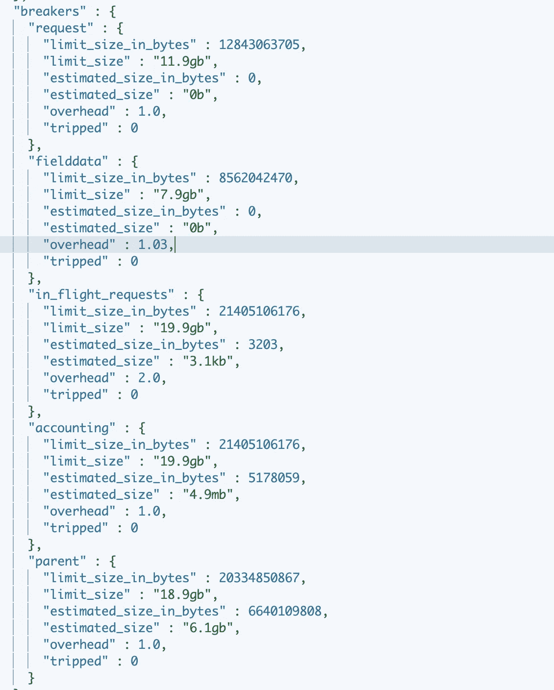

# Solr 和弹性研究中的断路器

> 原文：<https://medium.com/walmartglobaltech/circuit-breakers-in-solr-and-elastic-e568cd7b08fe?source=collection_archive---------5----------------------->

# **什么是断路器？**

Solr 和 Elasticsearch 等搜索产品中添加了断路器，以防止可能导致内存不足错误或节点关闭的操作。断路器的前提是确保更高的服务质量，并且只接受在当前资源配置中可服务的请求负载。


# **断路器在**弹性搜索

弹性研究中的断路器由来已久，但它是基于建议的问题和改进而发展起来的。目前，在 7.x 版本的 Elasticsearch 中，我们有 6 个断路器:

1.  父断路器:父断路器异常是由跨不同类型断路器使用的所有内存的总和引起的。**indexes . breaker . total . use _ real _ memory default = true indexes . breaker . total . limit default = 95% JVM 堆**
2.  字段数据断路器:当索引中的字段数据使用的内存总量超过阈值时，会导致字段数据断路器异常。默认情况下，文本字段上的字段数据设置为 false，但如果在映射中定义了它，则可以使用它:" fielddata": **true。indexes . breaker . field data . limit(默认值=40% JVM 堆)**
3.  请求断路器:当对 elasticsearch 的一个请求试图使用超过指定阈值的内存时，会导致请求断路器异常。**indexes . breaker . request . limit(默认为 JVM 堆的 60%)**
4.  传输中请求断路器:当传输或 HTTP 级别上所有当前活动的传入请求的内存使用量超过某个节点上的特定内存量时，会导致传输中断路器异常。**network . breaker . inflight _ requests . limit(默认为 100%的 JVM 堆)**
5.  账户请求断路器:账户请求断路器异常是由于当请求完成时，内存中保存的东西没有被释放而导致的。**indexes . breaker . accounting . limit(默认为 100%的 JVM 堆)**
6.  脚本编译断路器:当一段时间内的内联脚本编译数量超过阈值时，将触发脚本编译断路器异常。**(默认为 75/5m，即每 5 分钟 75 次)**

# 弹性搜索**断路器状态**

命令检查:

***获取 _ 节点/统计/断路器***

回应:



# **弹性搜索中的断路器异常示例**

```
[2020-11-02T07:11:45,611][WARN ][o.e.a.b.TransportShardBulkAction] [es-data-1-123456] [[tracking-2020.11][8]] failed to perform indices:data/write/bulk[s] on replica [tracking-2020.11][8], node[c3aC_s52RMe0xv0uzp02nQabc], [R], s[STARTED], a[id=Tgwiiu_GREOAnbKl7BI6Mgcv]
org.elasticsearch.transport.RemoteTransportException: [es-data-3-123456][99.123.11.111:9300][indices:data/write/bulk[s][r]]
Caused by: org.elasticsearch.common.breaker.CircuitBreakingException: **[parent]** Data too large, data for [<transport_request>] would be [20293537836/18.8gb], which is larger than the limit of **[20293386240/18.8gb]**, real usage: **[20293530192/18.8gb],** new bytes reserved: [7644/7.4kb], usages [request=49320/48.1kb, fielddata=2665302366/2.4gb, in_flight_requests=2491948/2.3mb, accounting=162036398/154.5mb]
```

关于诊断常见断路器错误[，请参考](https://www.elastic.co/guide/en/elasticsearch/reference/7.x/fix-common-cluster-issues.html#diagnose-circuit-breaker-errors)。此外，还可以查看以下内容:

1.  启用慢速搜索和索引日志。
2.  将 Kibana 默认索引从*(所有索引)更改为最相关的索引。这有助于避免对所有索引运行即席查询。
3.  根据使用情况适当设置每个数据节点的内存设置。建议将虚拟机总内存的 50–70%分配给弹性搜索。
4.  检查并验证我们没有在大量存储桶上聚合的聚合查询。

# Solr 中的断路器

Solr 中的断路器是在 Solr 8.7 版本中引入的。与弹性搜索相比，Solr 中的断路器是相当新的。当集群的稳定性比请求吞吐量更重要时，我们使用断路器。如果启用了断路器，在节点压力高的情况下，请求可能会被拒绝，并显示相应的 HTTP 错误代码(503)。

由客户机来处理这个错误，并可能建立一个重试逻辑。

在 Solr 中，我们有两种断路器:

1.  **基于 JVM 堆使用的断路器**:该断路器跟踪 JVM 堆内存使用，如果堆使用超过分配给 JVM 的最大堆的配置百分比(-Xmx)，则拒绝传入的搜索请求，并返回 503 错误代码。
2.  **基于 CPU 利用率的断路器**:该断路器跟踪 CPU 利用率，如果过去一分钟的平均 CPU 利用率超过可配置的阈值，则触发该断路器。

# Solr 中的电路异常示例


# 摘要

目前，与 Solr 中的断路器相比，Elasticsearch 拥有更多数量的断路器和更多动态选项来控制断路器，从而实现更稳定、更有弹性的搜索服务。

# 参考

1.  [https://www . elastic . co/guide/en/elastic search/reference/7 . x/circuit-breaker . html](https://www.elastic.co/guide/en/elasticsearch/reference/7.x/circuit-breaker.html)
2.  [https://www . elastic . co/guide/en/elastic search/reference/7 . x/fix-common-cluster-issues . html # diagnose-circuit-breaker-errors](https://www.elastic.co/guide/en/elasticsearch/reference/7.x/fix-common-cluster-issues.html#diagnose-circuit-breaker-errors)
3.  [https://solr.apache.org/guide/8_7/circuit-breakers.html](https://solr.apache.org/guide/8_7/circuit-breakers.html)