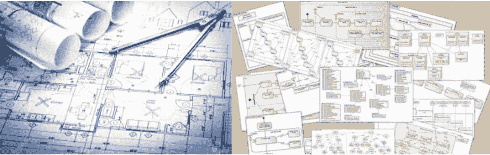
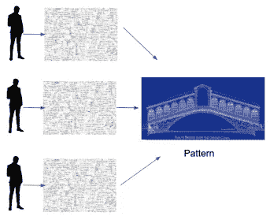
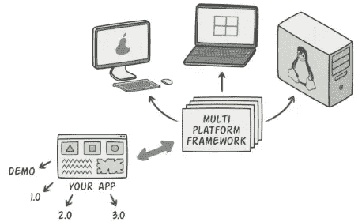
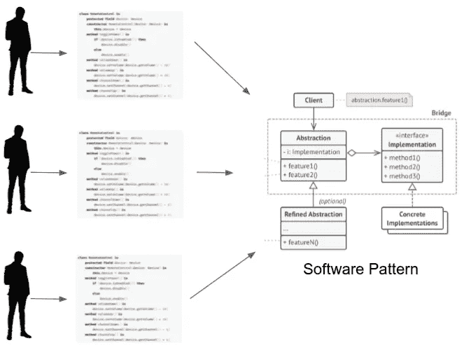

# 民用建筑 vs 软件建筑

> 原文：<https://medium.com/globant/civil-architecture-vs-software-architecture-3ea9973a364a?source=collection_archive---------0----------------------->

首先，让我们从一些基本概念开始:

在过去，土木工程和建筑有明显的区别。但是，今天，土木工程和建筑是同义词。**土木工程**是一门[专业工程](https://en.wikipedia.org/wiki/Regulation_and_licensure_in_engineering)学科，涉及自然环境的设计、建造和维护。

什么是**软件架构**有如此多的含义，像 IEEE、SEI 和其他的大机构用他们自己的术语表达他们自己的概念。

我喜欢这个:

> 软件架构指的是软件系统的基本结构以及创建这种结构和系统的规程。

**重复性问题**

现在让我们来谈谈这些工程师是如何通过他们重复的问题进化的。

**在民用建筑中，**当你需要**建造一座桥梁**每个建筑师都有自己的方程式和解决方案，这种变化在他们分享你的经历时有得有失；这就产生了标准和模式。

现在，**当一个架构师需要建造一座桥梁**时，他们做的第一件事就是**查看模式**并改变他们自己的输入以实现一个有效的模型。

**同样的**发生在软件中，重复的问题出现在不同的项目中，相似的解决方案被发现，但是当你分享你的经验、成功和失败时，软件模式就出现了。

现在，当架构师需要构建一个软件平台时，为了利用每个平台的优势，他们应该做的第一件事是查看软件模式，在这种情况下，是**桥接模式**，以确保他们的问题肯定会得到解决。

**蓝图**

蓝图是制造某物的指南。表达一个话题将如何解决或已经解决。

在民用建筑中有这些:

*   电气蓝图
*   结构蓝图
*   管道蓝图
*   等等

软件架构中有:

*   类图
*   数据模型
*   程序表
*   配置图
*   etc
    (关于 UML 图的简要回顾[，请查看](https://hemer-figueroa.medium.com/sal-de-la-matrix-423bb8fee14c)。)

**结论**

*   民用建筑已经经历了多年的发展，以高质量、高效率地实现其目标。
*   建筑师的角色与民用建筑相关，因为他或她可以表达他们的模型如何以及为什么可以解决问题的愿景。
*   土木建筑中表达的概念已经适应了软件体系结构，这有助于改善企业规模的软件项目。