# 握紧反应钩—第 1 部分

> 原文：<https://medium.com/globant/clasping-the-react-hooks-part-1-5d32af983d3a?source=collection_archive---------0----------------------->

medium.com

我敢肯定，作为一名开发人员，到目前为止，你一定已经收藏了至少十几个网站来了解 React Hooks。在您的项目中或作为 POC 实施。React 钩子已经存在了很长时间了。所以，当然，你一定得了 a！对吗？嗯，不完全是！事实上，大多数开发人员仍然对其实现感到困惑。

在本文的多个部分，我已经尽了最大努力来解释和揭开 React 钩子的神秘面纱。所以，我从这里开始，保持沉迷！

# 但是为什么是钩子？

[https://zbigatron.com/](https://zbigatron.com/)

*您是否曾经遇到过这样的情况:您正在使用功能组件，并且需要某种类型的行为更新，这可以通过组件状态轻松处理，但是由于功能组件内部的状态不可用，您最终将组件更新为类组件？*

*你有没有经历过在不同的生命周期方法中重写类似的代码来实现道具或状态更新所需行为的痛苦？*

*你经历过管理大量代码的痛苦和重用组件逻辑的困难吗？*

如果你是 React 开发人员，这些都是你每天必须面对的常见问题，不是吗？

*挺让人沮丧的吧？*

*如果我告诉你* ***钩子*** *是把我们从所有这些问题中解救出来的东西。它让我们可以使用功能组件中的所有 React 特性，而不必将其更新为类组件。是不是很神奇？*

# 好吧，好吧，但是钩子是什么？😵

根据 React 的官方文档:

> **钩子**是 React 16.8 中新增的特性。它们允许您使用状态和其他 React 特性，而无需编写类。

换句话说， **React 钩子**是 javascript 函数，通过为我们提供使用 React 所有特性的特权，例如**状态、副作用、可重用逻辑、生命周期、上下文、**等，来解决我们在使用功能组件时遇到的各种问题。**功能组件内部。**

除此之外，钩子还让我们把所有相关的代码组织在一起，不像类组件，所有相关的代码通常保存在不同的生命周期方法中，很难理解。通过使用钩子，所有的生命周期方法都可以用一个钩子来代替，减少了代码的行数和复杂性，使我们的代码更具可读性。

我们稍后会更详细地了解这一点。

此外，由于钩子是常规的 JavaScript 函数，您可以将**内置钩子**与您自己的**自定义钩子**结合起来。

定制钩子是我们可以创建来重用组件逻辑的东西。这使我们能够通过在应用程序中共享可重用的逻辑来降低复杂性。

## 引入钩子还有几个原因。其中一些列举如下:

***避免处理‘这个’关键词***

要使用类，你必须理解**‘this’**关键字在 javascript 中的工作方式，这与它在其他语言中的工作方式非常不同。

人们可以在 React 中学习属性、状态和单向数据流，但很难实现类组件。

**功能组件中的*状态***

以前我们只能在**类组件**中使用状态。但是，有了**钩子**，我们现在可以使用 **useState** 钩子在功能组件中使用状态。

***热重装带类***

还观察到**类**不能很好地缩小，使得**热重装**非常不可靠。因为你不再需要和类一起工作，所以你不会面临这些问题。

***复用组件的逻辑***

定制钩子允许我们在不改变组件层次结构的情况下重用组件的逻辑。

***向后兼容***

React 钩子是 100%向后兼容的，可以和我们现有的代码一起工作。如果您一直在使用 React，并且一直在使用基于类的组件，那么不必急于转向钩子。钩子是可选的，在使用钩子时，你不必重写完整的代码，相反，你可以只对一些组件使用钩子。

> 但是，在开始使用钩子之前，有几件事情你应该记住——**钩子不能用于类，你应该在处理功能组件的时候使用钩子。你应该在顶层调用钩子，这意味着不应该在循环、条件、嵌套函数等内部调用它**

# 让我们从我们的第一个 React 钩子开始，试着用一些例子来理解它

# 使用状态挂钩

状态..！！好的，如果你已经处理过类组件，你必须熟悉 **setState()** ，它安排组件状态的更新，当状态改变时，组件重新呈现。

但是我们不能在**功能组件**中有**状态或 setState()** ，这就是 **useState** 钩子出现的地方。

❓❓怎么样

行..我们将看到一个使用 **setState()** 的例子，然后我们将看到如何使用 **useState** 钩子重写它。

cheezburger.com

下面是一个计数器的例子，其中计数初始化为零，每次点击按钮，计数器的值增加 1。

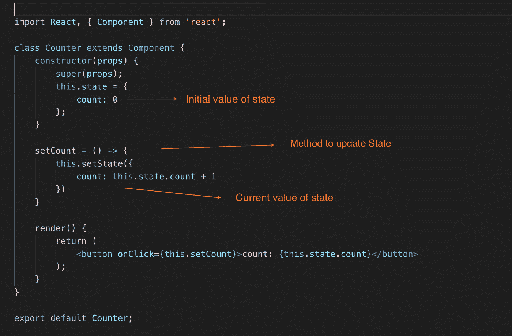

在上面的例子中，你可以看到，我们首先在构造函数中使用 **this.state** 初始化了 **count** 值，然后在单击按钮时我们调用了 **setCount()** 方法来更新状态，并且在其中我们使用了 **setState()** 方法来将计数值更新为**current value+1**；

现在，我们可以使用 **useState** 钩子重写上面的例子，如下所示

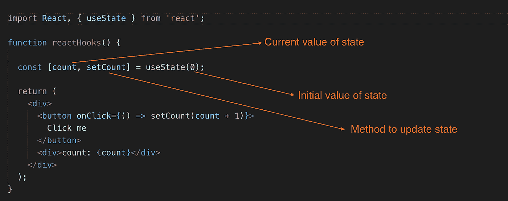

正如您在这里看到的，通过在功能组件中使用 **useState** 函数，代码行已经减少了很多，现在可读性更好了。

同样在**类**中，状态总是一个对象，但是有了**钩子**，状态不一定是一个对象，它可以是任何类型。

语法:

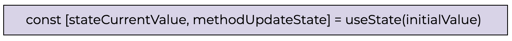

> 使用 useState 钩子**状态的初始值，更新状态的方法，以及状态的当前值**一切都可以写在一行代码中。这种语法被称为 [**数组析构**](https://www.freecodecamp.org/news/array-destructuring-in-es6-30e398f21d10/) 这是 ES6 的特性之一。

## 使用 State 的前一个值

有时我们需要访问状态的先前值来更新当前状态，这可以通过在先前的例子中向 **useState** 传递一个函数来完成。这个函数将访问以前的值，并返回一个更新的值。

下面是一个计数器组件的例子，它使用 useState 钩子用状态的前一个值更新状态

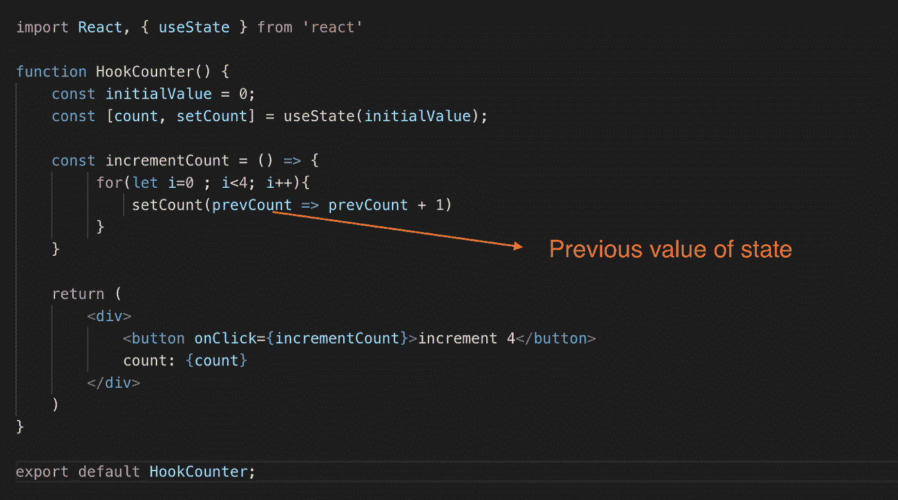

## 对对象使用状态

现在我们将看到另一个例子，当我们的状态是一个对象时，它使用了 **useState 钩子**。让我们根据 firstName 和 LastName 字段中输入的值来打印一个人的全名。

我们将从状态中获取值，并在输入字段改变时更新它。

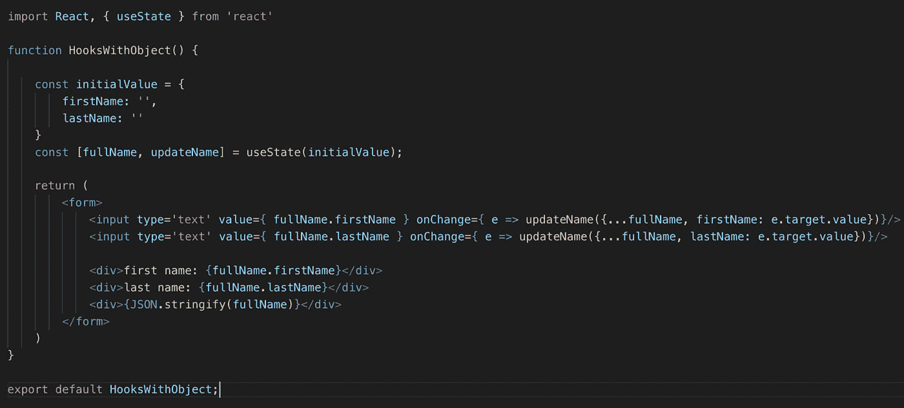

在上面的例子中，state 对象包含 firstName 和 lastName 属性，一旦用户在输入字段中输入内容，这些值就会更新。

现在，您可能已经注意到，我们在 onChange 函数中使用带有 fullName 的 spread 操作符来合并状态，即{…fullName}。这是因为与 setState()不同， **useState 钩子不会自动合并状态对象**。因此，我们必须通过使用**扩展操作符**来进行**手动合并**，正如你在上面的例子中看到的。

> 当处理**对象或数组**时，一定要确保扩展你的状态变量，然后调用 setter 函数

# 使用效果挂钩

**useEffect** 钩子让我们在功能组件中执行副作用和生命周期方法的所有特性。

它还让我们将所有相关的代码组织在一起，不像类中所有相关的代码都保存在不同的生命周期方法中。

这里有一个例子:

考虑将文档标题更新为当前的输入字段值，在初始渲染时，我们希望将标题设置为状态的初始值，所以这段代码放在 **componentDidMount** 中，它将在组件生命周期中只执行一次，然后这个文档标题将在以后更新。

为此，将在 **componentDidUpdate 中编写相同的代码。**每次组件更新时都会调用这个生命周期方法，它非常适合更新文档标题。

此外，让我们看看计时器的另一个副作用，它在特定的时间间隔内记录一些字符串值，然后在卸载时清除它。

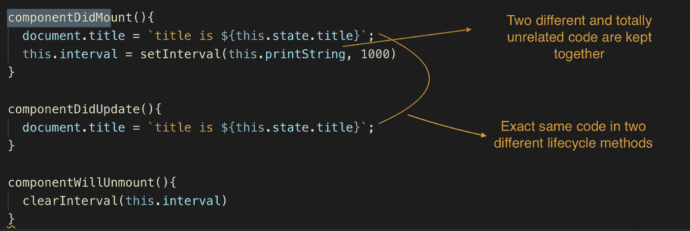

这里你可以看到相同的代码在两个不同的生命周期方法中出现两次，不相关的代码也在一个生命周期方法中保存在一起。有点奇怪，对吧？

使用**使用效果挂钩**可以解决这个问题。让我们看看怎么做。

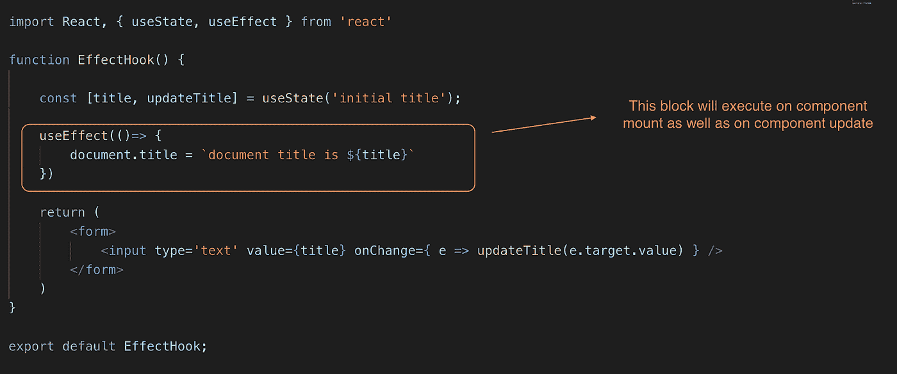

在上面的例子中，你可以看到我们是如何用一个名为 **useEffect** Hook 的函数取代了两个生命周期方法的使用。

现在问题来了，是否可能在挂载期间只执行一次这个函数，如果我们想在只有特定属性/状态更新的情况下有条件地执行它呢？？答案是肯定的，有条件地执行是可能的。

为了有条件地运行 useEffect，我们需要传递一个额外的参数，它是一个数组。在这个数组中，我们指定需要监视的属性或状态。那么只有当这些状态或属性被更新时，这个函数才会被执行。

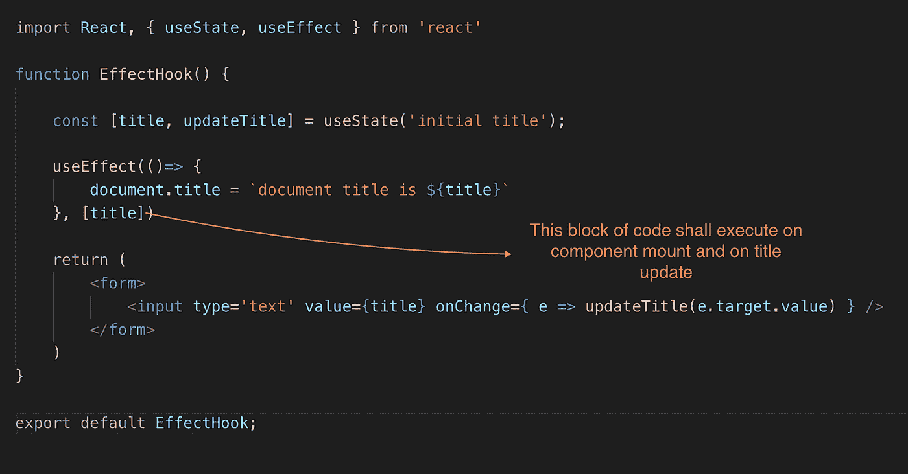

如果只想在组件挂载上运行 useEffect，可以传递一个空数组，而不是传递任何属性或状态。

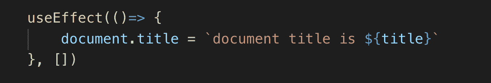

我们已经看到如何用 **useEffect** 钩子替换**componentidmount()**，**componentiddupdate()**。现在我们来看看如何使用 **useEffect** 替换 **componentWillUnmount()** 。

要使用 useEffect 钩子在组件卸载时执行任何操作，传递给 useEffect 的函数可以返回另一个函数，该函数将在组件卸载时执行。所以，我们返回的是一个清理函数。

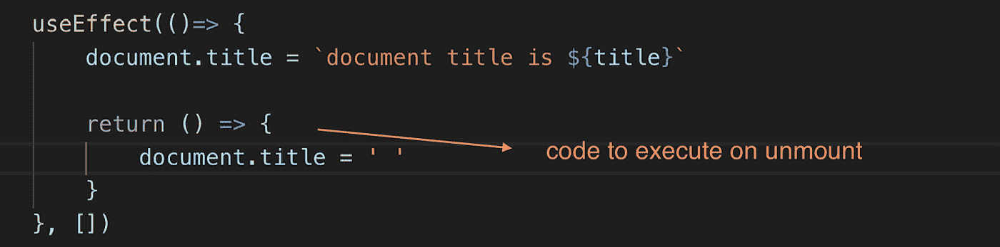

## 使用 useEffect 提取数据

UseEffect 挂钩也可以用于数据提取。下面是一个例子，其中 useEffect 函数使用 Axios 从 API 获取数据，在获取响应数据后，调用 setData 方法更新状态值。

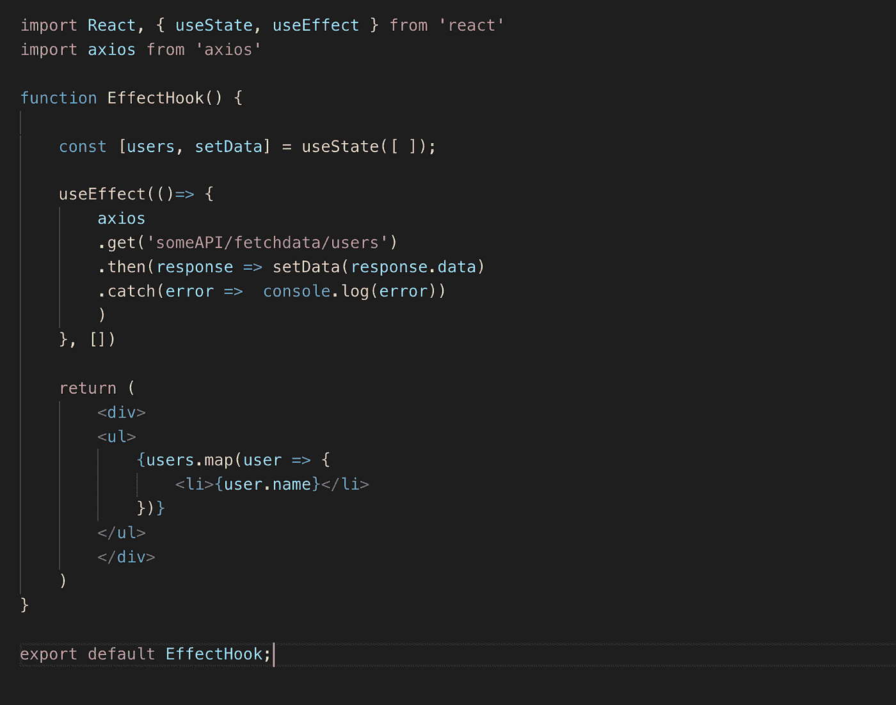

> 到目前为止，在 Effect Hook 下，我们已经看到，我们实际上可以替换所有的生命周期方法，处理副作用并通过只使用 **useEffect** 函数来执行数据获取。

这几乎是 React Hooks 的第 1 部分！！

让我们总结一下到目前为止我们在这一部分看到的内容:

- *什么是反应钩*

*——为何推出*

*-我们如何使用钩子用功能组件替换类组件*

*-使用带有示例的状态挂钩*

*-使用效果挂钩示例*

我希望这篇文章能帮助你理解 **React Hooks** 的一些基本概念。

在接下来的部分中，我们将讨论:

*   用户教育
*   减速器与用户减速器
*   使用 useReducer 获取数据
*   useRef
*   使用回调
*   使用备忘录
*   使用上下文
*   定制挂钩

# 敬请关注即将推出的部分！！😌 👋