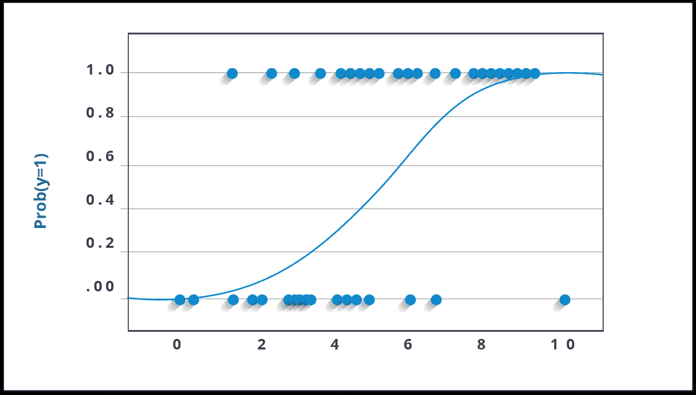

# 你在生活中实际使用的五大分类算法

> 原文：<https://medium.com/edureka/classification-algorithms-ba27044f28f1?source=collection_archive---------0----------------------->


Classification Algorithms — Edureka

***分类算法*** 的思路相当简单*。*你通过分析训练数据集来预测目标类。

本博客讨论以下概念:

*   什么是分类？
*   分类与聚类算法
*   分类算法中的基本术语
*   分类算法的应用
*   分类算法的类型
*   逻辑回归
*   决策图表
*   朴素贝叶斯分类器
*   k 最近邻
*   SVM

# 什么是分类？

我们使用训练数据集来获得更好的边界条件，这些边界条件可以用于确定每个目标类。一旦确定了边界条件，下一个任务就是预测目标类。整个过程被称为分类。

## **目标类示例:**

*   分析客户数据，预测他是否会购买电脑配件**(目标类别:是或否)**
*   根据颜色、味道、大小、重量等特征对水果进行分类**(目标类别:苹果、橙子、樱桃、香蕉)**
*   根据头发长度进行性别分类**(目标类别:男性或女性)**

让我们用使用头发长度的性别分类来理解分类算法的概念(决不是我试图用性别来刻板化，这只是一个例子)。为了使用毛发长度作为特征参数来分类性别**(目标类别)**，我们可以使用任何分类算法来训练模型，以提出一些边界条件集合，这些边界条件可以用于使用毛发长度作为训练特征来区分男性和女性。在性别分类的情况下，边界条件可以是适当的头发长度值。假设**区分边界**毛发长度值为 15.0 cm，那么我们可以说，如果毛发长度**小于 15.0 cm** ，那么性别可以是男性或者女性。

# 分类算法与聚类算法

在聚类中，其思想不是像在分类中那样预测目标类，而是更多地试图通过考虑最满意的条件来对同类事物进行分组，**同一组中的所有项目都应该是相似的，没有两个不同组的项目应该是不相似的。**

## **分组项目示例:**

*   同时对相似语言类型的文档进行分组**(相同语言的文档为一组。)**
*   分类新闻文章时**(同一新闻类别(体育)文章为一组)**

让我们以头发长度为例来理解性别聚类的概念。为了确定性别，可以使用不同相似性度量来对男性和女性进行分类。这可以通过找到两个头发长度之间的相似性来完成，并且如果相似性较小**(头发长度的差异较小)**，则将它们保持在同一组中。同样的过程可以继续下去，直到所有的头发长度适当地分为两类。

# 分类算法中的基本术语

*   **分类器:**将输入数据映射到特定类别的算法。
*   **分类模型:**分类模型试图从给定的用于训练的输入值中得出一些结论。它将预测新数据的分类标签/类别。
*   **特征:**特征是被观察现象的个体可测量属性。
*   **二元分类:**分类有两种可能结果的任务。**例如:性别分类(男/女)**
*   **多类分类:**两类以上的分类。在多类分类中，每个样本被分配给一个且仅一个目标标签。动物可以是猫或狗，但不能同时是猫和狗。
*   **多标签分类:**将每个样本映射到一组目标标签(不止一个类别)的分类任务。一篇新闻可以同时涉及运动、人物和地点。

# 分类算法的应用

*   垃圾邮件分类
*   银行客户贷款支付意愿预测。
*   癌症肿瘤细胞鉴定。
*   情感分析
*   药品分类
*   人脸关键点检测
*   汽车行驶中的行人检测。

# 分类算法的类型

分类算法可以大致分为以下几类:

*   ***线性分类器***

1.  逻辑回归
2.  朴素贝叶斯分类器
3.  费希尔线性判别式

*   ***支持向量机***

1.  最小二乘支持向量机

*   ***二次量词***
*   ***内核估计***

1.  k 近邻

*   ***决策树***

1.  随机森林

*   ***神经网络***
*   ***学习矢量量化***

下面给出了一些流行的分类算法的例子。

# 逻辑回归

尽管这个名字可能令人困惑，但你可以放心。逻辑回归是一种分类，而不是回归算法。它根据给定的一组独立变量估计离散值**(二进制值，如 0/1、是/否、真/假)**。简单来说，它基本上是通过将数据拟合到一个 ***logit 函数*来预测事件发生的概率。**因此，又称 ***logit 回归*** 。获得的值将总是位于 0 和 1 之间，因为它预测了概率。

让我们试着通过另一个例子来理解这一点。

假设你的数学考试有一道算术题。它只能有两种结果，对吗？要么你解决它，要么你不解决它(这里我们不假设方法的要点)。现在想象一下，给你一个大范围的总数，试图理解你已经很好地理解了哪些章节。这项研究的结果大概是这样的——如果给你一个基于三角学的问题，你有 70%的可能解决它。另一方面，如果是一道算术题，你得到答案的概率只有 30%。这就是逻辑回归给你提供的。

如果我必须做数学计算，我会将结果的对数概率建模为预测变量的线性组合。

```
odds= p/ (1-p) = probability of event occurrence / probability of event occurrence ln(odds) = ln(p/(1-p)) logit(p) = ln(p/(1-p)) = b0+b1X1+b2X2+b3X3....+bkXk)
```

在上面给出的等式中， *p* 是感兴趣特征出现的概率。它选择最大化观察样本值的可能性的参数，而不是最小化误差平方和的参数(就像普通回归一样)。



现在，你们很多人可能会想，为什么要拿一根木头？为了简单起见，我们姑且说这是复制阶跃函数的最好的数学方法之一。我可以对此进行更深入的探讨，但这将违背我写这篇博客的目的。

## r 代码:

```
x <- cbind(x_train,y_train)
# Train the model using the training sets and check score
logistic <- glm(y_train ~ ., data = x,family='binomial')
summary(logistic)
#Predict Output
predicted= predict(logistic,x_test)
```

为了改进模型，可以尝试许多不同的步骤:

*   包括交互术语
*   移除功能
*   规范技术
*   使用非线性模型

# 决策树

现在， ***决策树*** 是目前为止我最喜欢的算法之一。它具有多种多样的特征，有助于实现分类和连续因变量，是一种监督学习算法，主要用于分类问题。该算法所做的是，根据最重要的属性将种群分成两个或更多同类集合，使各组尽可能不同。


在上图中，你可以看到人口根据多种属性被分为四个不同的组，以识别“他们是否会玩”。

## r 代码:

```
library(rpart)
x <- cbind(x_train,y_train)
# grow tree 
fit <- rpart(y_train ~ ., data = x,method="class")
summary(fit)
#Predict Output 
predicted= predict(fit,x_test)
```

# 朴素贝叶斯分类器

这是一种基于预测器之间独立性假设或所谓的*贝叶斯定理*的分类技术。简单来说， ***朴素贝叶斯分类器*** 假设一个类中特定特征的存在与任何其他特征的存在无关。

例如，如果一个水果是红色的，圆形的，直径约为 3 英寸，它就可以被认为是苹果。即使这些特征相互依赖或依赖于其他特征的存在，朴素贝叶斯分类器也会考虑所有这些属性，以独立地影响该水果是苹果的概率。

建立贝叶斯模型很简单，尤其是在巨大数据集的情况下。除了简单之外，朴素贝叶斯也被认为优于复杂的分类方法。

贝叶斯定理提供了从 **P(c)** 、 **P(x)** 和 **P(x|c)** 计算后验概率 **P(c|x)** 的方法。后验概率的表达式如下。


这里，

*   ***P* ( *c|x* )是*类* ( *目标*)给定*预测器* ( *属性*)的后验概率。**
*   ***P* ( *c* )是*类*的先验概率。**
*   ***P* ( *x|c* )为似然，即*预测器*给定*类*的概率。**
*   ***P* ( *x* )是*预测器*的先验概率。**

让我们通过一个例子来更好地理解这一点。因此，这里我有一个天气的训练数据集，即晴天、阴天和雨天，以及相应的二元变量“Play”。现在，我们需要根据天气情况对球员是否上场进行分类。让我们按照以下步骤来执行它。

**步骤 1:** 将数据集转换成频率表

**第二步:**通过查找**阴概率= 0.29** 和**出牌概率为 0.64** 这样的概率，创建一个似然表。


**第三步:**现在，使用朴素贝叶斯方程计算每一类的后验概率。具有最高后验概率的类是预测的结果。

**问题:**天气晴朗玩家就会玩，这种说法正确吗？

我们可以使用上面讨论的方法来解决它，所以**P(Yes | Sunny)= P(Sunny | Yes)* P(Yes)/P(Sunny)**

这里我们有 **P (Sunny |Yes) = 3/9 = 0.33** ， **P(Sunny) = 5/14 = 0.36** ， **P( Yes)= 9/14 = 0.64**

现在， **P(是|晴)= 0.33 * 0.64 / 0.36 = 0.60** ，概率较高。

朴素贝叶斯使用类似的方法来预测基于各种属性的不同类别的概率。该算法主要用于文本分类和多类问题。

## r 代码:

```
library(e1071)
x <- cbind(x_train,y_train)
# Fitting model
fit <-naiveBayes(y_train ~ ., data = x)
summary(fit)
#Predict Output 
predicted= predict(fit,x_test)
```

# KNN (k-最近邻)

***K 最近邻*** 是一个简单的算法，用于分类和回归问题。它基本上存储所有可用的案例，以通过其 k 个邻居的多数投票对新案例进行分类。分配给该类的事例在通过距离函数(欧几里德、曼哈顿、闵可夫斯基和汉明)测量的 K 个最近邻中最为常见。

前三种距离函数用于连续变量，而汉明距离函数用于分类变量。如果 **K = 1** ，则该案例被简单地分配给其最近邻的类别。有时，在执行 kNN 建模时，选择 K 是一个挑战。


举一个我们现实生活中的例子，你就会很容易理解 KNN。如果你暗恋班上的一个女孩/男孩，而你对他/她一无所知，你可能想和他们的朋友和社交圈谈谈，以获得他们的信息！

## r 代码:

```
library(knn)
x <- cbind(x_train,y_train)
# Fitting model
fit <-knn(y_train ~ ., data = x,k=5)
summary(fit)
#Predict Output 
predicted= predict(fit,x_test)
```

## 选择 KNN 之前需要考虑的事项:

*   KNN 计算量很大
*   变量应该被规范化，否则更高范围的变量可能会使它产生偏差
*   在使用 kNN 之前，更多地在预处理阶段工作，比如离群点、噪声去除

# SVM(支持向量机)

在该算法中，我们将每个数据项绘制为 n 维空间中的一个点(其中 n 是您拥有的特征的数量)，每个特征的值是特定坐标的值。

例如，如果我们只有个人的两个特征，如身高和头发长度，我们将首先在二维空间中绘制这两个变量，其中每个点有两个坐标(这些坐标称为**支持向量**


现在，我们将找到一些*线*来分割两个不同分类的数据组之间的数据。这将是一条线，使得两组中的每一组离最近点的距离最远。


在上面的例子中，将数据分成两个不同分类组的线是蓝色的*线，因为两个最近的点离这条线最远。这一行是我们的*量词*。然后，根据测试数据在线两边的位置，这就是我们可以将新数据分类的类别。*

## r 代码:

```
library(e1071)
x <- cbind(x_train,y_train)
# Fitting model
fit <-svm(y_train ~ ., data = x)
summary(fit)
#Predict Output 
predicted= predict(fit,x_test)
```

就这样，我们到了这篇文章的结尾。如果你想查看更多关于 Python、DevOps、Ethical Hacking 等市场最热门技术的文章，你可以参考 Edureka 的官方网站。

请留意本系列中的其他文章，它们将解释数据科学的各个方面。

> *1。* [*数据科学教程*](/edureka/data-science-tutorial-484da1ff952b)
> 
> *2。* [*数据科学的数学与统计*](/edureka/math-and-statistics-for-data-science-1152e30cee73)
> 
> *3。*[*R 中的机器学习*](/edureka/machine-learning-with-r-c7d3edf1f7b)
> 
> *4。* [*机器学习算法*](/edureka/machine-learning-algorithms-29eea8b69a54)
> 
> *5。*[*R 中的线性回归*](/edureka/linear-regression-in-r-da3e42f16dd3)
> 
> *6。*[*R 中的逻辑回归*](/edureka/logistic-regression-in-r-2d08ac51cd4f)
> 
> *7。* [*随机森林中的 R*](/edureka/random-forest-classifier-92123fd2b5f9)
> 
> *8。* [*决策树中的 R*](/edureka/a-complete-guide-on-decision-tree-algorithm-3245e269ece)
> 
> *9。* [*机器学习入门*](/edureka/introduction-to-machine-learning-97973c43e776)
> 
> *10。* [*朴素贝叶斯在 R*](/edureka/naive-bayes-in-r-37ca73f3e85c)
> 
> *11。* [*统计与概率*](/edureka/statistics-and-probability-cf736d703703)
> 
> *12。* [*如何创建一个完美的决策树？*](/edureka/decision-trees-b00348e0ac89)
> 
> *13。* [*关于数据科学家角色的 10 大误区*](/edureka/data-scientists-myths-14acade1f6f7)
> 
> *14。* [*顶级数据科学项目*](/edureka/data-science-projects-b32f1328eed8)
> 
> *15。* [*数据分析师 vs 数据工程师 vs 数据科学家*](/edureka/data-analyst-vs-data-engineer-vs-data-scientist-27aacdcaffa5)
> 
> 16。 [*人工智能类型*](/edureka/types-of-artificial-intelligence-4c40a35f784)
> 
> 17。 [*R vs Python*](/edureka/r-vs-python-48eb86b7b40f)
> 
> 18。 [*人工智能 vs 机器学习 vs 深度学习*](/edureka/ai-vs-machine-learning-vs-deep-learning-1725e8b30b2e)
> 
> *19。* [*机器学习项目*](/edureka/machine-learning-projects-cb0130d0606f)
> 
> 20。 [*数据分析师面试问答*](/edureka/data-analyst-interview-questions-867756f37e3d)
> 
> *21。* [*面向非程序员的数据科学和机器学习工具*](/edureka/data-science-and-machine-learning-for-non-programmers-c9366f4ac3fb)
> 
> *二十二。* [*十大机器学习框架*](/edureka/top-10-machine-learning-frameworks-72459e902ebb)
> 
> *23。* [*用于机器学习的统计*](/edureka/statistics-for-machine-learning-c8bc158bb3c8)
> 
> *24。* [*随机森林中的 R*](/edureka/random-forest-classifier-92123fd2b5f9)
> 
> *25。* [*广度优先搜索算法*](/edureka/breadth-first-search-algorithm-17d2c72f0eaa)
> 
> *26。*[*R 中的线性判别分析*](/edureka/linear-discriminant-analysis-88fa8ad59d0f)
> 
> *27。* [*机器学习的先决条件*](/edureka/prerequisites-for-machine-learning-68430f467427)
> 
> *28。* [*互动 WebApps 使用 R 闪亮*](/edureka/r-shiny-tutorial-47b050927bd2)
> 
> *29。* [*机器学习十大书籍*](/edureka/top-10-machine-learning-books-541f011d824e)
> 
> 三十。 [*无监督学习*](/edureka/unsupervised-learning-40a82b0bac64)
> 
> *31。* [*10 本最好的数据科学书籍*](/edureka/10-best-books-data-science-9161f8e82aca)
> 
> *32。* [*监督学习*](/edureka/supervised-learning-5a72987484d0)

*原载于 2019 年 1 月 17 日*[*【www.edureka.co】*](https://www.edureka.co/blog/classification-algorithms)*。*