# 机器学习中的顶级分类算法

> 原文：<https://medium.com/edureka/classification-in-machine-learning-2402675b7817?source=collection_archive---------0----------------------->


机器学习和统计中的分类是一种监督学习方法，其中计算机程序从提供给它的数据中学习，并进行新的观察或分类。在本文中，我们将详细了解机器学习中的分类。本博客涵盖了以下主题:

1.机器学习中的分类是什么？

2.机器学习中的分类术语

3.分类算法

*   逻辑回归
*   朴素贝叶斯
*   随机梯度下降
*   k-最近邻
*   决策图表
*   随机森林
*   人工神经网络
*   支持向量机

4.分类器评估

5.算法选择

6.用例- MNIST 数字分类

# 机器学习中的分类是什么

分类是将一组给定的数据分类的过程，它可以在结构化或非结构化数据上执行。该过程从预测给定数据点的类别开始。这些类通常被称为目标、标签或类别。

分类预测建模的任务是逼近从输入变量到离散输出变量的映射函数。主要目标是确定新数据将属于哪个类/类别。

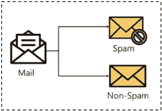

让我们用一个简单的例子来理解这一点。

心脏病检测可以被识别为一个分类问题，这是一个二元分类，因为只能有两类，即患有心脏病或没有心脏病。在这种情况下，分类器需要训练数据来理解给定的输入变量如何与类相关。并且一旦分类器被精确地训练，它可以被用于检测特定患者是否有心脏病。

由于分类是一种监督学习，甚至目标也提供有输入数据。让我们熟悉一下机器学习术语的分类。

# 机器学习中的分类术语

*   **分类器** —这是一种用于将输入数据映射到特定类别的算法。
*   **分类模型** —该模型对给定用于训练的输入数据进行预测或得出结论，它将预测数据的类别或种类。
*   **特征** —特征是被观察现象的一个可测量的个体属性。
*   **二元分类**——这是一种有两种结果的分类，例如——对或错。
*   **多类分类** —具有两个以上类别的分类，在多类分类中，每个样本被分配给一个且仅一个标签或目标。
*   **多标签分类** —这是一种将每个样本分配给一组标签或目标的分类。
*   **初始化** —这是分配分类器用于
*   **训练分类器**—sci-kit learn 中的每个分类器使用 fit(X，y)方法来拟合用于训练训练 X 和训练标签 y 的模型
*   **预测目标** —对于未标记的观察值 X，predict(X)方法返回预测的标签 y
*   **评估** —这基本上意味着对模型的评估，即分类报告、准确度分数等。

**分类中学习者的类型**

*   **懒惰的学习者** —懒惰的学习者简单地存储训练数据并等待直到测试数据出现。使用存储的训练数据中最相关的数据来完成分类。与渴望学习的人相比，他们有更多的预测时间。Eg — k 近邻，基于案例的推理。
*   **渴望型学习者** —渴望型学习者在获得用于预测的数据之前，基于给定的训练数据构建分类模型。它必须能够致力于适用于整个空间的单一假设。由于这个原因，他们花了很多时间在训练上，而花了很少的时间在预测上。决策树，朴素贝叶斯，人工神经网络。

# 分类算法

在机器学习中，分类是一个受监督的学习概念，它基本上将一组数据分类成类。最常见的分类问题有—语音识别、人脸检测、手写识别、文档分类等。它可以是二元分类问题，也可以是多类问题。机器学习中有一堆机器学习算法用于分类。让我们来看看机器学习中的那些分类算法。

## 逻辑回归

它是机器学习中的一种分类算法，使用一个或多个独立变量来确定一个结果。用一个二分法变量来衡量结果，这意味着**它将只有两种可能的结果**。

逻辑回归的目标是找到因变量和一组自变量之间的最佳拟合关系。它优于其他二元分类算法，如最近邻法，因为它定量地解释了导致分类的因素。

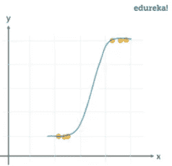

**优缺点** 逻辑回归专门用于分类，它有助于理解一组自变量如何影响因变量的结果。

逻辑回归算法的主要缺点是，它仅在预测变量为二元时有效，它假设数据没有缺失值，并假设预测值相互独立。

**用例**

*   识别疾病的风险因素
*   单词分类
*   天气预报
*   投票申请

## 朴素贝叶斯分类器

这是一种基于**贝叶斯定理**的分类算法，其给出了预测器之间独立性的假设。简而言之，朴素贝叶斯分类器假设一个类中特定特征的存在与任何其他特征的存在无关。

即使这些特征相互依赖，所有这些属性都独立地影响概率。朴素贝叶斯模型易于制作，对于相对较大的数据集尤其有用。即使使用简单的方法，朴素贝叶斯也比机器学习中的大多数分类方法都要好。下面是实现朴素贝叶斯定理的贝叶斯定理。

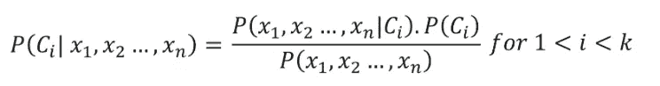

**优缺点**

朴素贝叶斯分类器需要少量的训练数据来估计必要的参数以获得结果。与其他分类器相比，它们的速度非常快。

唯一的缺点是众所周知他们是一个糟糕的估计者。

**用例**

*   疾病预测
*   文件分类
*   垃圾邮件过滤器
*   情感分析

## 随机梯度下降

这是一种非常有效和简单的方法来拟合线性模型。当**样本数据数量很大**时，随机梯度下降特别有用。它支持不同的损失函数和分类惩罚。

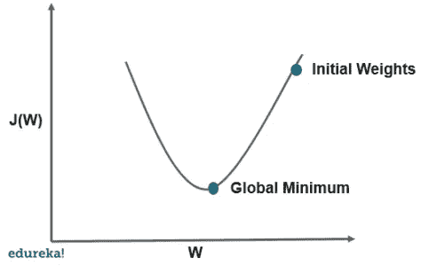

随机梯度下降是指计算每个训练数据实例的导数，并立即计算更新。

**优缺点**

唯一的优点是易于实现和高效，而随机梯度下降的主要缺点是它需要许多超参数，并且对特征缩放敏感。

**用例**

*   物联网
*   更新参数，例如神经网络中的权重或线性回归中的系数

## k-最近邻

**将训练数据对应的所有实例存储在 n 维空间**是一种懒惰学习算法。它是一个**懒惰学习算法**，因为它不专注于构建一个通用的内部模型，而是致力于存储训练数据的实例。

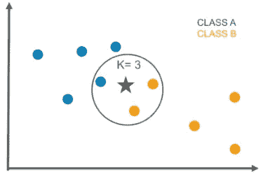

根据每个点的 k 个最近邻的简单多数投票来计算分类。它是受监督的，并采用一堆标记点，并用它们来标记其他点。要标注新点，它会查看最接近该新点的已标注点，也称为其最近邻点。它拥有这些邻居的投票，因此大多数邻居拥有的标签就是新点的标签。“k”是它检查的邻居数量。

**优缺点**

该算法实现起来非常简单，并且对噪声训练数据具有鲁棒性。即使训练数据很大，也是相当高效的。KNN 算法的唯一缺点是不需要确定 K 的值，与其他算法相比，计算成本相当高。

**用例**

*   工业应用程序，与其他应用程序相比寻找相似的任务
*   手写检测应用
*   图像识别
*   视频识别
*   股票分析

## 决策图表

决策树算法以**树结构**的形式建立分类模型。它利用了 if-then 规则，这些规则在分类上是同样详尽和互斥的。该过程继续将数据分解成更小的结构，并最终将其与增量决策树相关联。最终的结构看起来像一棵有节点和叶子的树。使用训练数据一次一个地顺序学习**规则**。每次学习规则时，覆盖规则的元组被移除。该过程在训练集上继续，直到达到终止点。

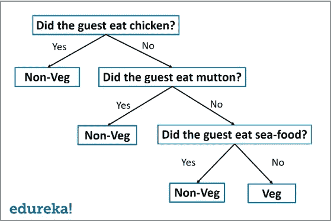

该树是以自顶向下的递归分治法构建的。一个决策节点将有两个或多个分支，一个叶子代表一个分类或决策。决策树中对应于最佳预测器的最顶端节点称为根节点，决策树的最大优点是它可以处理分类数据和数值数据。

**优缺点**

决策树具有易于理解和可视化的优点，它也只需要很少的数据准备。决策树的缺点是它会创建复杂的树，可能无法有效地进行分类。它们可能相当不稳定，因为即使是数据中的简单变化也会阻碍决策树的整体结构。

**用例**

*   数据探索
*   模式识别
*   金融学中的期权定价
*   识别疾病和风险威胁

## 随机森林

随机决策树或随机森林是一种用于分类、回归等的**集成学习方法**。它通过在训练时构建大量决策树来运行，并输出作为各个树的类或分类或均值预测(回归)的模式的类。

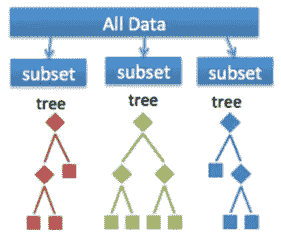

随机森林是一种元估计量，它在数据集的各种子样本上拟合许多树，然后使用平均值来提高模型预测性质的准确性。子样本大小始终与原始输入大小相同，但样本通常是替换绘制的。

**优缺点**

随机森林的优点是，由于减少了过度拟合，它比决策树更准确。随机森林分类器的唯一缺点是实现起来非常复杂，并且在实时预测时非常慢。

**用例**

*   工业应用，如确定贷款申请人是高风险还是低风险
*   用于预测汽车发动机中机械部件的故障
*   预测社交媒体分享分数
*   绩效分数

## 人工神经网络

一个神经网络由神经元组成，这些神经元以**的方式分层排列**，它们接受一些输入向量并将其转换成输出。该过程涉及每个神经元接受输入，并对其应用通常是非线性函数的函数，然后将输出传递给下一层。

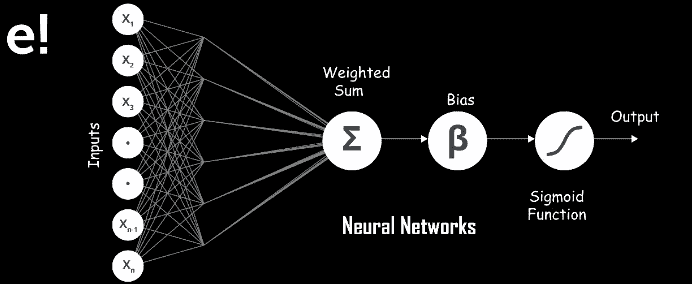

一般来说，网络应该是前馈的，这意味着单元或神经元将输出馈送到下一层，但不涉及对前一层的任何反馈。

权重被应用于从一层传递到另一层的信号，并且这些权重在训练阶段被调整以使神经网络适应任何问题陈述。

**优缺点**

它对噪声数据有很高的容忍度，能够对未经训练的模式进行分类，对于连续值的输入和输出，它表现得更好。人工神经网络的缺点是，与其他模型相比，它的解释能力较差。

**用例**

*   笔迹分析
*   黑白图像的彩色化
*   计算机视觉过程
*   基于面部特征为照片添加字幕

## 支持向量机

支持向量机是一个分类器，它将**训练数据表示为空间**中的点，这些点被尽可能宽的间隙分成不同的类别。然后，通过预测新点属于哪个类别以及它们将属于哪个空间，将新点添加到空间中。

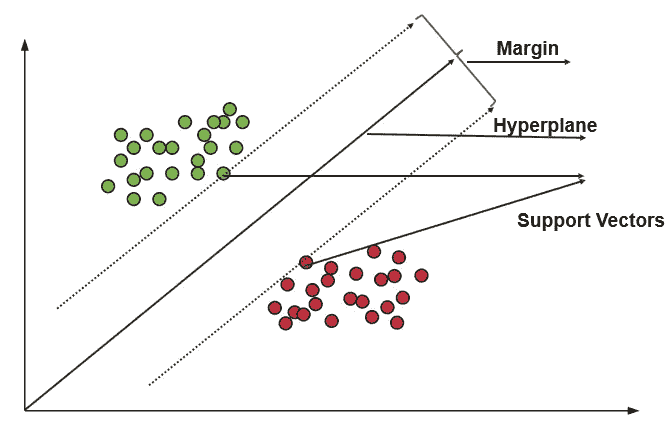

**优缺点**

它在决策函数中使用了训练点的子集，这使得它的存储效率高，并且在高维空间中非常有效。支持向量机的唯一缺点是该算法不直接提供概率估计。

**用例**

*   用于比较股票在一段时间内表现的商业应用
*   投资建议
*   要求准确性和效率的应用分类

# 分类器评估

任何分类器完成后最重要的部分是评估，以检查其准确性和效率。有很多方法可以评估一个分类器。让我们看看下面列出的这些方法。

**维持方法**

这是评估分类器最常用的方法。在这种方法中，给定的数据集被分成两部分，分别作为测试集和训练集的 20%和 80%。

训练集用于训练数据，而未知测试集用于测试其预测能力。

**交叉验证**

过度拟合是大多数机器学习模型中最常见的问题。可以进行 k 倍交叉验证来验证模型是否完全过度拟合。

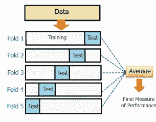

在这种方法中，数据集被随机划分为 **k 个互斥的**子集，每个子集的大小相同。其中，一个用于测试，另一个用于训练模型。所有 k 个折叠都发生相同的过程。

**分类报告**

分类报告将给出以下结果，这是使用 cancer_data 数据集的 SVM 分类器的样本分类报告。

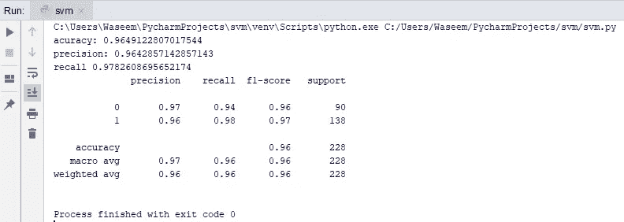

1.  **精度**

*   准确度是正确预测的观测值与总观测值的比率
*   True Positive:正确预测事件为正的次数。
*   True Negative:出现次数为负数的正确预测数。

**2。F1-得分**

*   它是精确度和召回率的加权平均值

**3。** **精度和召回**

*   Precision 是检索到的实例中相关实例的分数，而 recall 是已经检索到的相关实例在实例总数中的分数。它们基本上被用作相关性的度量。

**ROC 曲线**

受试者工作特征或 ROC 曲线用于分类模型的视觉比较，其显示了真阳性率和假阳性率之间的关系。ROC 曲线下的面积是模型精确度的量度。

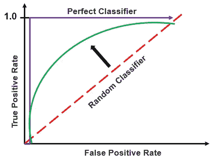

## 算法选择

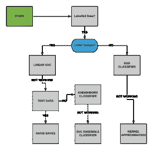

除了上述方法之外，我们还可以遵循以下步骤来为模型使用最佳算法

*   读取数据
*   基于我们的从属和独立特征创建从属和独立数据集
*   将数据分成训练集和测试集
*   使用不同的算法训练模型，如 KNN、决策树、SVM 等
*   清空分类器
*   选择最准确的分类器。

尽管选择最适合您的模型的算法可能需要更多的时间，但准确性是提高模型效率的最佳途径。

让我们来看看 MNIST 数据集，我们将使用两种不同的算法来检查哪一种最适合该模型。

# 用例

**什么是 MNIST？**

这是一组 70，000 个小的手写图像，分别标有它们所代表的数字。每幅图像有将近 784 个特征，一个特征简单地表示像素的密度，每幅图像是 28×28 像素。

我们将在不同分类器的帮助下，使用 MNIST 数据集制作数字预测器。

**加载 MNIST 数据集**

```
from sklearn.datasets import fetch_openml mnist = fetch_openml('mnist_784')
print(mnist)
```

**输出:**

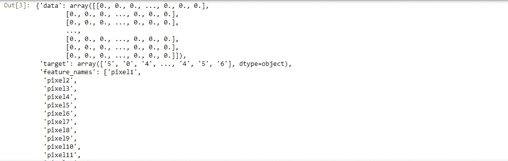

**探索数据集**

```
**import** matplotlib
**import** matplotlib.pyplot as plt
X, y **=** mnist['data'], mnist['target']
random_digit **=** X[4800]
random_digit_image **=** random_digit.reshape(28,28)
plt.imshow(random_digit_image, cmap**=**matplotlib.cm.binary, interpolation**=**"nearest")
```

**输出:**

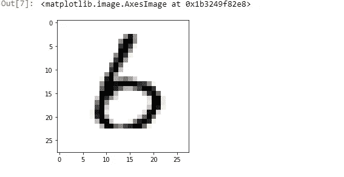

**拆分数据**

我们使用前 6000 个条目作为训练数据，数据集多达 70000 个条目。您可以使用 X 和 y 的形状进行检查。因此，为了使我们的模型记忆高效，我们只将 6000 个条目作为训练集，将 1000 个条目作为测试集。

```
x_train, x_test = X[:6000], X[6000:7000]
y_train, y_test = y[:6000], y[6000:7000]
```

**混洗数据**

为了避免不必要的错误，我们使用 numpy 数组打乱了数据。基本上提高了模型的效率。

```
import numpy as np
shuffle_index = np.random.permutation(6000)
x_train, y_train = x_train[shuffle_index], y_train[shuffle_index]
```

**使用逻辑回归创建数字预测器**

```
y_train = y_train.astype(np.int8)
y_test = y_test.astype(np.int8)
y_train_2 = (y_train==2)
y_test_2 = (y_test==2)
print(y_test_2)
```

**输出:**

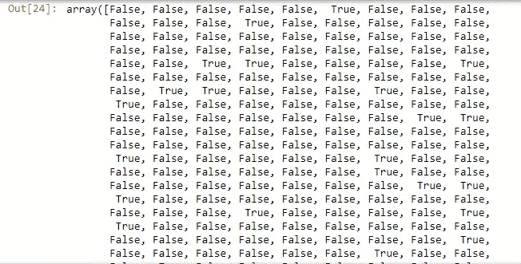

```
from sklearn.linear_model import LogisticRegression
clf = LogisticRegression(tol=0.1)
clf.fit(x_train,y_train_2)
clf.predict([random_digit])
```

**输出:**

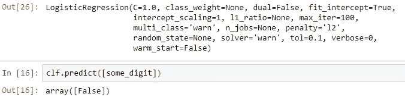

**交叉验证**

```
from sklearn.model_selection import cross_val_score a = cross_val_score(clf, x_train, y_train_2, cv=3, scoring="accuracy") a.mean()
```

**输出:**

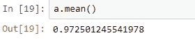

**使用支持向量机创建预测器**

```
from sklearn import svm cls = svm.SVC()
cls.fit(x_train, y_train_2)
cls.predict([random_digit])
```

**输出:**

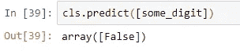

**交叉验证**

```
a = cross_val_score(cls, x_train, y_train_2, cv = 3, scoring="accuracy") a.mean()
```

在上面的例子中，我们能够制作一个数字预测器。由于我们预测的是数据中所有条目中的数字是否为 2，因此我们在两个分类器中都得到了 false，但是交叉验证显示了使用逻辑回归分类器而不是支持向量机分类器更好的准确性。

这就把我们带到了本文的结尾，在这里我们学习了机器学习中的分类。我希望你清楚本教程中与你分享的所有内容。

如果你想查看更多关于 Python、DevOps、Ethical Hacking 等市场最热门技术的文章，你可以参考 Edureka 的官方网站。

请留意本系列中的其他文章，它们将解释数据科学的各个方面。

> *1。* [*数据科学教程*](/edureka/data-science-tutorial-484da1ff952b)
> 
> *2。* [*数据科学的数学与统计*](/edureka/math-and-statistics-for-data-science-1152e30cee73)
> 
> *3。* [*线性回归 R*](/edureka/linear-regression-in-r-da3e42f16dd3)
> 
> *4。* [*机器学习算法*](/edureka/machine-learning-algorithms-29eea8b69a54)
> 
> *5。*[*R 中的逻辑回归*](/edureka/logistic-regression-in-r-2d08ac51cd4f)
> 
> *6。* [*分类算法*](/edureka/classification-algorithms-ba27044f28f1)
> 
> *7。* [*随机森林中的 R*](/edureka/random-forest-classifier-92123fd2b5f9)
> 
> *8。* [*决策树中的 R*](/edureka/a-complete-guide-on-decision-tree-algorithm-3245e269ece)
> 
> *9。* [*机器学习入门*](/edureka/introduction-to-machine-learning-97973c43e776)
> 
> 10。 [*朴素贝叶斯在 R*](/edureka/naive-bayes-in-r-37ca73f3e85c)
> 
> *11。* [*统计与概率*](/edureka/statistics-and-probability-cf736d703703)
> 
> *12。* [*如何创建一个完美的决策树？*](/edureka/decision-trees-b00348e0ac89)
> 
> *13。* [*关于数据科学家角色的十大神话*](/edureka/data-scientists-myths-14acade1f6f7)
> 
> *14。* [*顶级数据科学项目*](/edureka/data-science-projects-b32f1328eed8)
> 
> 15。 [*数据分析师 vs 数据工程师 vs 数据科学家*](/edureka/data-analyst-vs-data-engineer-vs-data-scientist-27aacdcaffa5)
> 
> *16。* [*人工智能的种类*](/edureka/types-of-artificial-intelligence-4c40a35f784)
> 
> *17。*[*R vs Python*](/edureka/r-vs-python-48eb86b7b40f)
> 
> *18。* [*人工智能 vs 机器学习 vs 深度学习*](/edureka/ai-vs-machine-learning-vs-deep-learning-1725e8b30b2e)
> 
> *19。* [*机器学习项目*](/edureka/machine-learning-projects-cb0130d0606f)
> 
> *20。* [*数据分析师面试问答*](/edureka/data-analyst-interview-questions-867756f37e3d)
> 
> *21。* [*面向非程序员的数据科学和机器学习工具*](/edureka/data-science-and-machine-learning-for-non-programmers-c9366f4ac3fb)
> 
> *22。* [*十大机器学习框架*](/edureka/top-10-machine-learning-frameworks-72459e902ebb)
> 
> *23。* [*统计机器学习*](/edureka/statistics-for-machine-learning-c8bc158bb3c8)
> 
> 24。 [*随机森林中的 R*](/edureka/random-forest-classifier-92123fd2b5f9)
> 
> *25。* [*广度优先搜索算法*](/edureka/breadth-first-search-algorithm-17d2c72f0eaa)
> 
> *26。*[*R 中的线性判别分析*](/edureka/linear-discriminant-analysis-88fa8ad59d0f)
> 
> 27。 [*机器学习的先决条件*](/edureka/prerequisites-for-machine-learning-68430f467427)
> 
> *二十八。* [*互动 WebApps 使用 R 闪亮*](/edureka/r-shiny-tutorial-47b050927bd2)
> 
> *29。* [*机器学习十大书籍*](/edureka/top-10-machine-learning-books-541f011d824e)
> 
> *30。* [*监督学习*](/edureka/supervised-learning-5a72987484d0)
> 
> *31。* [*10 本最好的数据科学书籍*](/edureka/10-best-books-data-science-9161f8e82aca)
> 
> *32。* [*机器学习使用 R*](/edureka/machine-learning-with-r-c7d3edf1f7b)

*原载于 2019 年 12 月 4 日*[*https://www.edureka.co*](https://www.edureka.co/blog/classification-in-machine-learning/)*。*