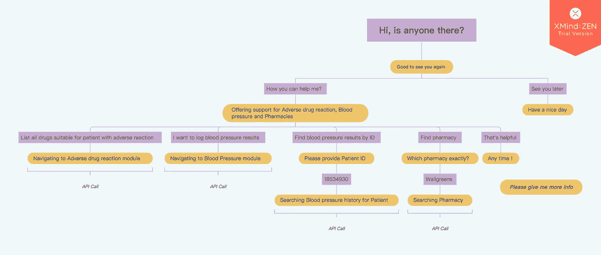
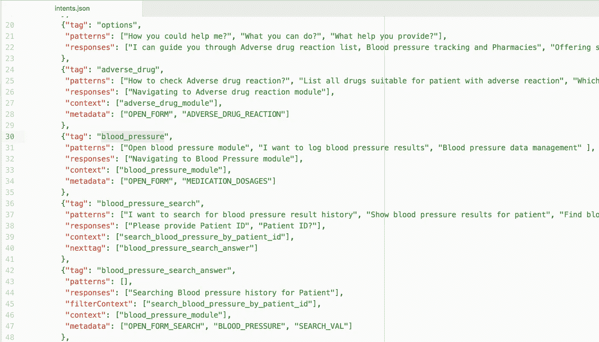
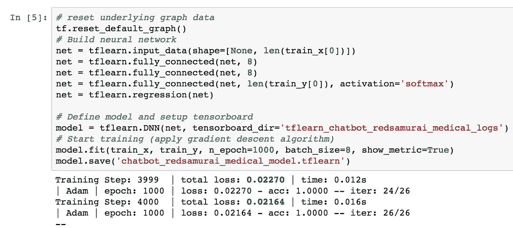
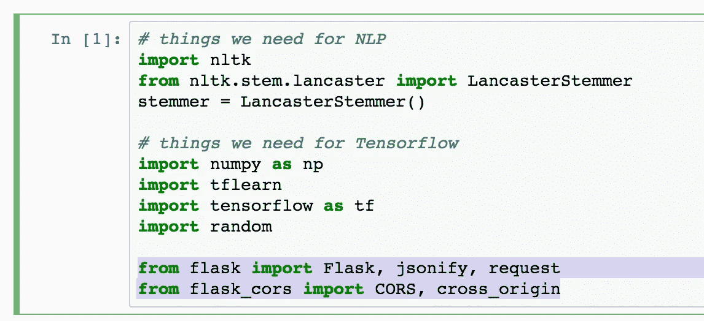
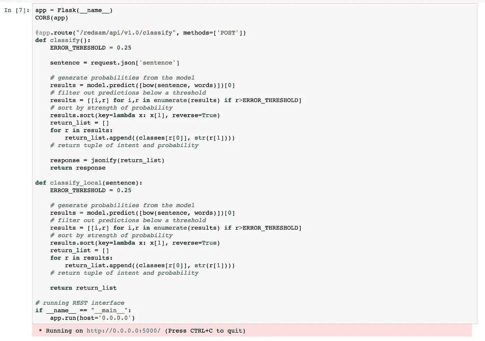
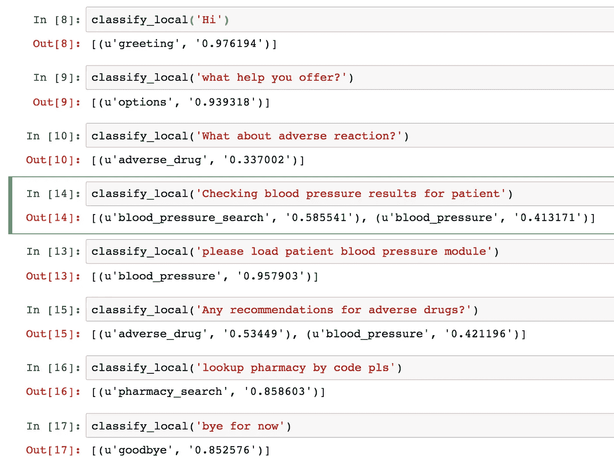
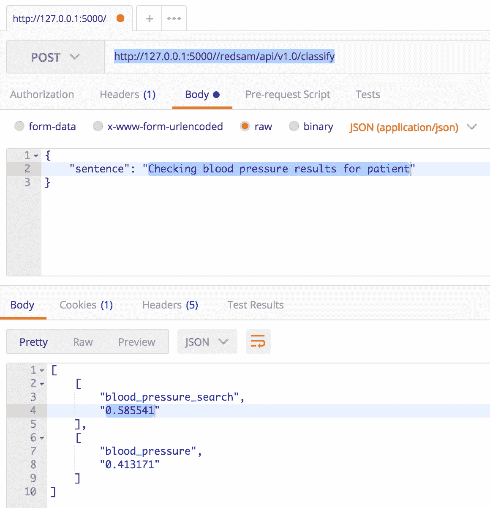

# 分类—使用 TensorFlow 的机器学习聊天机器人

> 原文：<https://medium.com/oracledevs/classification-machine-learning-chatbot-with-tensorflow-f40a3874d162?source=collection_archive---------0----------------------->

当你想创建聊天机器人时，首先要创建可视的对话流。这样的流程将有助于定义正确的意图集以及对话路径。否则很容易迷失在对话转换中，这将导致聊天机器人实现失败。我们的医疗聊天机器人系统不做任何决定，而是帮助用户使用企业系统。它获取用户输入，并在对话期间导致特定的 API 调用——最终触发企业系统执行一个或另一个动作。如果用户正在查找患者血压结果，聊天机器人将打开带有患者 ID 的血压模块。如果用户想编辑或查看血压结果，聊天机器人将加载血压结果模块，没有参数。这种聊天机器人在大型复杂的企业系统中非常有用，这有助于更快地接纳新用户，而无需额外的系统使用培训。聊天机器人的可视对话流示例:

会话意图可以记录在 JSON 文件中。您应该列出与标签、响应和上下文信息对应的对话模式。聊天机器人不仅仅是机器学习和用户输入处理，非常重要的是处理对话上下文流，通常这是在机器学习领域之外的另一个模块中完成的。我们以后会调查的。具有神经网络的机器学习负责允许聊天机器人根据用户输入计算标签概率。换句话说，机器学习有助于根据预定义的意图模式，为当前句子带来最佳匹配的标签。只要我们获得了意图标签的概率—我们知道用户想要什么，我们就可以设置对话上下文，并在下一个用户请求中—基于当前上下文做出反应:

TensorFlow 运行神经网络，根据提供的意向列表进行训练。每次训练运行可能会产生不同的学习结果，您应该检查*总损失*值-值越低，学习结果越好。您可能会多次进行培训，以获得最佳的学习模式:

TensorFlow 可以保存学习到的模型，以供分类 API 重用。调用分类 API 的 REST 接口作为单独的 TensorFlow 模块开发。REST 由安装在 TensorFlow 运行时中的 Flask 库处理:

分类函数从 REST 调用中获取用户输入，并通过 TensorFlow 模型运行它。比阈值定义的概率更高的结果被收集到有序数组中并返回。对于 TensorFlow 运行时中的本地测试，我们有不带 REST 注释的分类函数:

让我们看看分类是如何工作的，分类的结果将驱动聊天机器人的下一步行动。每个分类请求返回匹配的标签和概率。用户输入与意图中定义的模式不相同，这就是匹配概率可能不同的原因——这是机器学习的核心部分。基于学习模型，用 TensorFlow 构建的神经网络假定当前用户输入的最佳标签。

用户输入“检查患者的血压结果”。该输入可以与标签 blood_pressure_search 和 blood_pressure 相关，但是分类决定第一个选项的概率更高，这是正确的。类似于用户输入“对不良药物有什么建议？”：

通过 REST 端点，我们可以在 TensorFlow 环境之外调用分类函数。这将允许我们在 TensorFlow 之外维护对话上下文:

有用的资源:

*   TensorFlow 笔记本和 intents JSON 可在 [GitHub](https://github.com/abaranovskis-redsamurai/redsamchatbot/tree/master/v2) 资源库中获得。
*   关于使用 TensorFlow 的[上下文聊天机器人的精彩文章](https://chatbotsmagazine.com/contextual-chat-bots-with-tensorflow-4391749d0077)
*   我之前的帖子是关于红色武士[聊天机器人](http://andrejusb.blogspot.lt/2018/02/say-hello-to-red-samurai-contextual.html)

*原载于 2018 年 3 月 3 日*[*andrejusb.blogspot.com*](https://andrejusb.blogspot.lt/2018/03/classification-machine-learning-chatbot.html)*。*