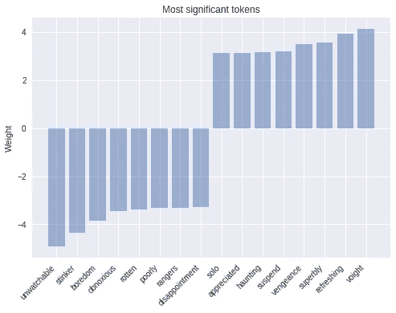
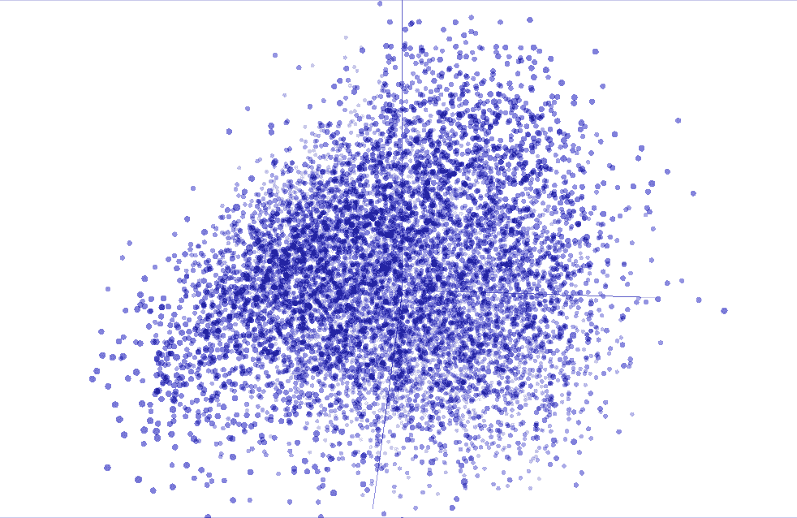
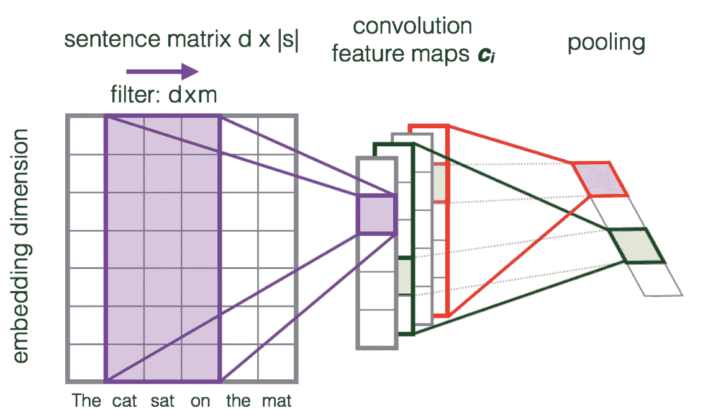
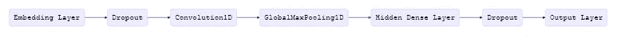
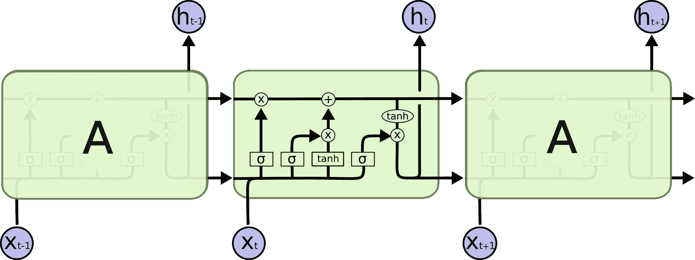
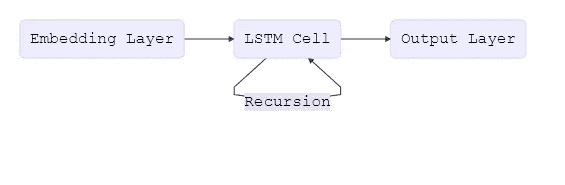
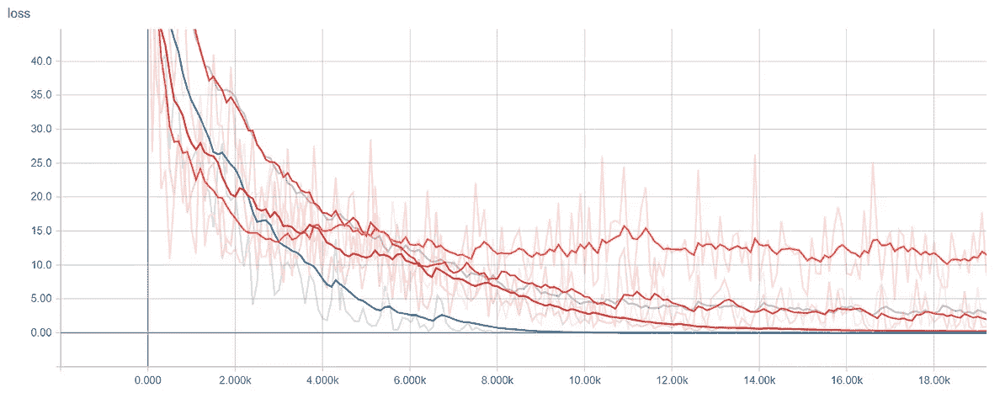
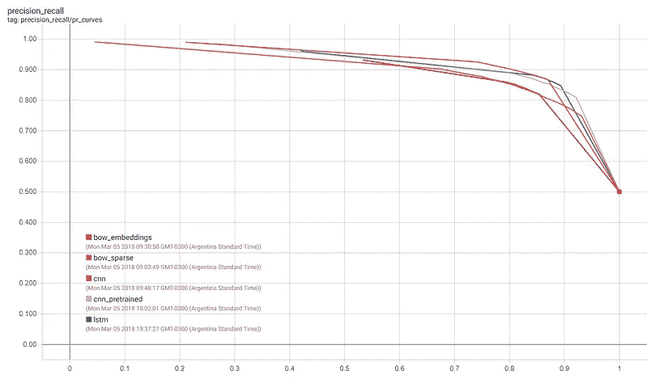

# 用张量流估计器分类文本

> 原文：<https://medium.com/google-developer-experts/classifying-text-with-tensorflow-estimators-408316a4492e?source=collection_archive---------2----------------------->

*由 Sebastian Ruder 和 Julian Eisenschlos 发布，谷歌开发专家*

你好。在这篇文章中，我们将向你展示如何使用 TensorFlow 中的估值器对文本进行分类。以下是我们将要讨论的内容的概要:

*   使用数据集加载数据。
*   使用预先设定的评估工具建立基线。
*   使用单词嵌入。
*   用卷积和 LSTM 层构建自定义估值器。
*   加载预训练的单词向量。
*   使用 TensorBoard 评估和比较模型。

欢迎来到介绍张量流数据集和估计量的博客系列的第 4 部分。你不需要阅读所有以前的材料，但如果你想更新以下任何概念，看一看。[第 1 部分](https://developers.googleblog.com/2017/09/introducing-tensorflow-datasets.html)关注预制的估算器，[第 2 部分](https://developers.googleblog.com/2017/11/introducing-tensorflow-feature-columns.html)讨论特性列，[第 3 部分](https://developers.googleblog.com/2017/12/creating-custom-estimators-in-tensorflow.html)如何创建定制的估算器。

在第 4 部分中，我们将在上述基础上解决自然语言处理(NLP)中的另一类问题。特别是，本文演示了如何使用自定义张量流估计器、嵌入和 [tf.layers](https://www.tensorflow.org/api_docs/python/tf/layers) 模块来解决文本分类任务。在这个过程中，我们将学习 word2vec，并将学习转移作为一种技术，在标记数据是稀缺资源时引导模型性能。

我们将向您展示相关的代码片段。[这是一个完整的 Jupyter 笔记本，你可以在本地运行，也可以在](https://github.com/eisenjulian/nlp_estimator_tutorial/blob/master/nlp_estimators.ipynb)[谷歌实验室](https://goo.gl/fXsCra)运行。普通的`.py`源文件也可以在[这里](https://github.com/eisenjulian/nlp_estimator_tutorial/blob/master/nlp_estimators.py)得到。请注意，编写代码是为了演示估算器如何工作，而不是为了获得最佳性能。

# 任务

我们将使用的数据集是 IMDB [大型电影评论数据集](http://ai.stanford.edu/~amaas/data/sentiment/)，它由 25，000 条用于训练的高度极性电影评论和 25，000 条用于测试的评论组成。我们将使用这个数据集来训练一个二元分类模型，能够预测评论是正面还是负面的。

举例来说，以下是数据集中的一条负面评价(2 星):

> 现在，我喜欢意大利恐怖电影。越奶酪越好。然而，这不是奶酪意大利。这是放了一周的意大利面酱和腐烂的肉丸。从各个层面来看，这都是业余时间。没有悬念，没有恐怖，只有四处散落的几滴血提醒你，你其实是在看一部恐怖片。

*Keras* 为导入数据集提供了一个方便的处理程序，该数据集也可以作为一个序列化的 numpy 数组`.npz`文件在这里下载[。对于文本分类，标准做法是限制词汇表的大小，以防止数据集变得过于稀疏和高维，从而导致潜在的过拟合。出于这个原因，每个评论都由一系列单词索引组成，从 4(数据集中最常用的单词: **the** )到 4999，对应于 **orange** 。索引 1 代表句子的开始，索引 2 被分配给所有未知的(也称为*词汇外*或 *OOV* )标记。这些索引是通过对管道中的文本数据进行预处理而获得的，该管道首先对每个句子进行清理、归一化和标记化，然后建立字典，按频率对每个标记进行索引。](https://s3.amazonaws.com/text-datasets/imdb.npz)

在我们将数据加载到内存中之后，我们将每个句子用 0 填充到一个固定的大小(这里:200)，这样我们就有两个 25000×200 的二维数组分别用于训练和测试。

# 输入功能

评估框架使用*输入函数*将数据管道从模型本身中分离出来。有几个助手方法可以用来创建它们，不管你的数据是在一个`.csv`文件中，还是在一个`pandas.DataFrame`文件中，也不管它是否适合内存。在我们的例子中，我们可以对训练集和测试集都使用`Dataset.from_tensor_slices`。

我们混洗训练数据，并且不预定义我们想要训练的时期的数量，而我们只需要测试数据的一个时期用于评估。我们还添加了一个额外的`"len"`键，它捕获原始的未填充序列的长度，我们将在后面使用。

数据集可以通过逐个记录地流式传输来处理内存不足的源(在这种情况下不需要),而`shuffle`方法使用一个`buffer_size`从固定大小的集合中连续采样，而无需将整个内容加载到内存中。

# 建立基线

尝试基本基线来开始任何机器学习项目都是一个很好的实践。越简单越好，因为拥有一个简单而健壮的基线是准确理解我们通过增加额外的复杂性在性能方面获得多少的关键。很可能一个简单的解决方案就足以满足我们的需求。

记住这一点，让我们从尝试一个最简单的文本分类模型开始。这将是一个稀疏线性模型，它为每个标记赋予一个权重，并将所有结果相加，而不考虑顺序。由于这个模型不关心单词在句子中的顺序，我们通常称之为*单词袋*方法。让我们看看如何使用`Estimator`来实现这个模型。

我们首先定义用作分类器输入的特征列。正如我们在[第 2 部分](https://developers.googleblog.com/2017/11/introducing-tensorflow-feature-columns.html)中看到的，`categorical_column_with_identity`是这个预处理文本输入的正确选择。如果我们输入原始文本令牌，其他`feature_columns`可以为我们做很多预处理。我们现在可以使用预制的`LinearClassifier`。

最后，我们创建了一个简单的函数来训练分类器，并创建了一条精确召回曲线。由于我们的目标不是在这篇博文中最大化性能，我们只训练我们的模型 25，000 步。

选择简单模型的好处之一是它更容易解释。一个模型越复杂，就越难检查，也越像一个黑箱。在本例中，我们可以从模型的最后一个检查点加载权重，并查看哪些令牌对应于绝对值最大的权重。结果看起来像我们预期的那样。



正如我们所看到的，具有最大正面权重的令牌(如“刷新”)显然与正面情绪相关，而具有较大负面权重的令牌无疑会引发负面情绪。一个简单但强大的改进方法是根据令牌的 [tf-idf](https://en.wikipedia.org/wiki/Tf%E2%80%93idf) 分数对其进行加权。

# 嵌入

我们可以增加复杂性的下一步是单词嵌入。嵌入是稀疏高维数据的密集低维表示。这允许我们的模型学习每个令牌的更有意义的表示，而不仅仅是索引。虽然单个维度没有意义，但当从足够大的语料库中学习时，低维空间已被证明可以捕捉时态、复数、性别、主题相关性等关系。我们可以通过将现有的 feature 列转换成一个`embedding_column`来添加单词嵌入。模型看到的表示是每个令牌嵌入的平均值(参见[文档](https://www.tensorflow.org/api_docs/python/tf/feature_column/embedding_column)中的`combiner`参数)。我们可以将嵌入的功能插入到一个预装的`DNNClassifier`中。

对于敏锐的观察者来说，注意:`embedding_column`只是一种将完全连接的层应用于令牌的稀疏二进制特征向量的有效方式，该向量乘以取决于所选组合器的常数。这样做的直接后果是，在`LinearClassifier`中直接使用`embedding_column`是没有意义的，因为两个连续的线性层之间没有非线性，不会增加模型的预测能力，当然，除非嵌入是预先训练好的。

我们可以使用 TensorBoard，通过使用 [t-SNE](https://en.wikipedia.org/wiki/T-distributed_stochastic_neighbor_embedding) 来可视化我们投射到 R 中的 50 维单词向量。我们期望相似的词彼此接近。这是一种检查模型权重和发现意外行为的有用方法。



在这一点上，一种可能的方法是更深入，进一步添加更多完全连接的层，并调整层大小和训练功能。然而，这样做我们会增加额外的复杂性，忽略句子中的重要结构。词不是生活在真空中，意义是由词和它的邻居组成的。

卷积是利用这种结构的一种方式，类似于我们如何为[图像分类](https://www.tensorflow.org/tutorials/layers)建模显著的像素集群。直觉告诉我们，某些单词序列，或者说 *n-grams* ，不管它们在句子中的整体位置如何，通常都有相同的意思。通过卷积运算引入结构先验允许我们对相邻单词之间的相互作用进行建模，从而给我们提供了一种更好的方式来表示这种意义。

下图显示了形状为 *d* × *m* 的过滤器矩阵 *F* 如何滑过每个 3 克的记号窗口以构建新的特征图。之后，通常使用一个*池*层来合并相邻的结果。



Source: [Learning to Rank Short Text Pairs with Convolutional Deep Neural Networks](https://www.semanticscholar.org/paper/Learning-to-Rank-Short-Text-Pairs-with-Convolution-Severyn-Moschitti/452f7411af7d471dd3ba84c2b06b2aaffc38cdb9) by **Severyn** et al. [2015]

让我们看看完整的模型架构。丢弃层的使用是一种正则化技术，使模型不太可能过度拟合。



正如在以前的博客文章中所看到的，`tf.estimator`框架提供了一个高级 API 来训练机器学习模型，定义`train()`、`evaluate()`和`predict()`操作，处理检查点、加载、初始化、服务、构建图形和开箱即用的会话。有一小群预制的估算器，就像我们之前使用的那些，但是最有可能的是你需要[构建你自己的](https://www.tensorflow.org/extend/estimators)。

编写一个定制的评估器意味着编写一个返回`EstimatorSpec`的`model_fn(features, labels, mode, params)`。第一步是将特征映射到我们的嵌入层:

然后我们使用`tf.layers`顺序处理每个输出。

最后，我们将使用一个`Head`来简化`model_fn`最后一部分的编写。head 已经知道如何计算预测、损失、train_op、指标和导出输出，并且可以跨模型重用。这也用于预先制作的估计值，并为我们提供了跨所有模型的统一评估函数的好处。我们将使用`binary_classification_head`，这是一个使用`sigmoid_cross_entropy_with_logits`作为罩下损失函数的单标签二进制分类头。

运行这个模型和以前一样简单:

# LSTM 网络公司

使用`Estimator` API 和相同的模型`head`，我们还可以创建一个使用*长短期记忆* ( *LSTM* )细胞代替卷积的分类器。诸如此类的递归模型是 NLP 应用程序的一些最成功的构件。LSTM 按顺序处理整个文档，用它的单元格递归遍历序列，同时将序列的当前状态存储在其内存中。

与 CNN 相比，递归模型的一个缺点是，由于递归的性质，模型变得更深更复杂，这通常产生更慢的训练时间和更差的收敛性。LSTMs(以及一般的 rnn)可能会遇到收敛问题，如梯度消失或爆炸，也就是说，通过足够的调整，它们可以获得许多问题的最先进的结果。根据经验，CNN 擅长于特征提取，而 rnn 擅长于依赖于整句意思的任务，如问题回答或机器翻译。

每个单元一次处理一个令牌嵌入，并基于可微分计算来更新其内部状态，该可微分计算取决于时间 *t* 处的嵌入向量 *x* 和时间*T1*处的先前状态 *h* 。为了更好地理解 LSTMs 是如何工作的，你可以参考 Chris Olah 的[博客文章](https://colah.github.io/posts/2015-08-Understanding-LSTMs/)。



Source: [Understanding LSTM Networks](https://colah.github.io/posts/2015-08-Understanding-LSTMs/) by **Chris Olah**

完整的 LSTM 模型可以用下面的简单流程图来表示:



在这篇文章的开始，我们填充了 200 个标记的所有文档，这是构建一个合适的张量所必需的。但是，当文档包含的单词少于 200 个时，我们不希望 LSTM 继续处理填充标记，因为它不会添加信息并降低性能。出于这个原因，我们还想为我们的网络提供原始序列被填充之前的长度。在内部，模型将最后一个状态复制到序列的末尾。我们可以通过在输入函数中使用`"len"`特性来做到这一点。我们现在可以使用与上面相同的逻辑，简单地用我们的 LSTM 单元替换卷积、池化和扁平化层。

# 预训练向量

我们之前展示的大多数模型依赖单词嵌入作为第一层。到目前为止，我们已经随机初始化了这个嵌入层。然而，[许多](https://arxiv.org/abs/1607.01759) [先前的](https://arxiv.org/abs/1301.3781) [工作](https://arxiv.org/abs/1103.0398)已经表明，使用在大的未标记语料库上预先训练的嵌入作为初始化是有益的，特别是当只在少量的标记样本上训练时。最流行的预训练嵌入是 [word2vec](https://www.tensorflow.org/tutorials/word2vec) 。通过预先训练的嵌入来利用来自未标记数据的知识是 [*迁移学习*](http://ruder.io/transfer-learning/) 的一个实例。

为此，我们将向您展示如何在`Estimator`中使用它们。我们将使用另一个流行模型 [GloVe](https://nlp.stanford.edu/projects/glove/) 的预训练向量。

将向量从一个文件加载到内存后，我们使用与词汇表相同的索引将它们存储为一个`numpy.array`。创建的数组形状为`(5000, 50)`。在每个行索引处，它都包含一个 50 维向量，表示在我们的词汇表中相同索引处的单词。

最后，我们可以使用一个定制的初始化函数，并在`params`对象中将它传递给我们的`cnn_model_fn`，不做任何修改。

# 跑步冲浪板

现在我们可以启动 TensorBoard，看看我们训练的不同模型在训练时间和性能方面如何相互比较。

在一个终端，我们运行

```
> tensorboard --logdir={model_dir}
```

我们可以可视化训练和测试时收集的许多指标，包括每个模型在每个训练步骤的损失函数值，以及精度-召回曲线。这对于选择哪个模型最适合我们的用例以及如何选择分类阈值当然是最有用的。



Training loss across steps on the left and Precision-Recall curves on the test data for each of our models on the left

# 获得预测

为了获得对新句子的预测，我们可以在`Estimator`实例中使用`predict`方法，这将为每个模型加载最新的检查点，并对未知的例子进行评估。但是在将数据传递到模型之前，我们必须清理、标记和映射每个标记到相应的索引，如下所示。

值得注意的是，检查点本身不足以做出预测；为了将保存的权重映射到相应的张量，用于构建估计器的实际代码也是必要的。将保存的检查点与创建它们的代码分支相关联是一个很好的做法。

如果您对以完全可恢复的方式将模型导出到磁盘感兴趣，您可能希望研究一下 [SavedModel](https://www.tensorflow.org/programmers_guide/saved_model#using_savedmodel_with_estimators) 类，它对于通过使用 [TensorFlow Serving](https://github.com/tensorflow/serving) 的 API 来服务您的模型或者使用 [TensorFlow.js](https://js.tensorflow.org/) 将它加载到浏览器中特别有用。

在这篇博文中，我们探讨了如何使用估计器进行文本分类，特别是对于 IMDB 评论数据集。我们训练并可视化了我们自己的嵌入，以及加载预训练的嵌入。我们从简单的基线开始，向卷积神经网络和 LSTMs 发展。

有关更多详情，请务必查看:

*   一个 [Jupyter 笔记本](https://github.com/eisenjulian/nlp_estimator_tutorial/blob/master/nlp_estimators.ipynb)可以在本地运行，或者在[协同实验室](https://goo.gl/fXsCra)运行。
*   这篇博文的完整[源代码](https://github.com/eisenjulian/nlp_estimator_tutorial/blob/master/nlp_estimators.py)。
*   张量流[嵌入](https://www.tensorflow.org/programmers_guide/embedding)导轨。
*   TensorFlow [单词的矢量表示](https://www.tensorflow.org/tutorials/word2vec)教程。
*   关于如何设计语言管道的*NLTK*处理原始文本章节。

在接下来的帖子中，我们将展示如何使用渴望执行来构建模型，处理内存不足的数据集，在 Cloud ML 中进行训练，以及使用 TensorFlow 服务进行部署。

感谢阅读！如果你愿意，你可以通过 [ruder.io](http://ruder.io/) 和 [@eisenjulian](https://twitter.com/eisenjulian) 找到我们。将您的所有反馈和问题发送给我们。

[](https://www.twitter.com/eisenjulian) [## 朱利安·艾森施洛斯(@艾森朱利安)|推特

### 朱利安·艾森施洛斯的最新推文(@艾森朱利安)。数学、NLP、深度学习*联合创始人@BotMaker_io *…

www.twitter.com](https://www.twitter.com/eisenjulian) [](https://twitter.com/seb_ruder) [## 塞巴斯蒂安·鲁德(@seb_ruder) |推特

### Sebastian Ruder 的最新推文(@seb_ruder)。NLP，深度学习博士生@insight_centre *研究…

twitter.com](https://twitter.com/seb_ruder) 

*原载于 2018 年 3 月 7 日*[medium.com/tensorflow](/tensorflow/classifying-text-with-tensorflow-estimators-a99603033fbe)*。*