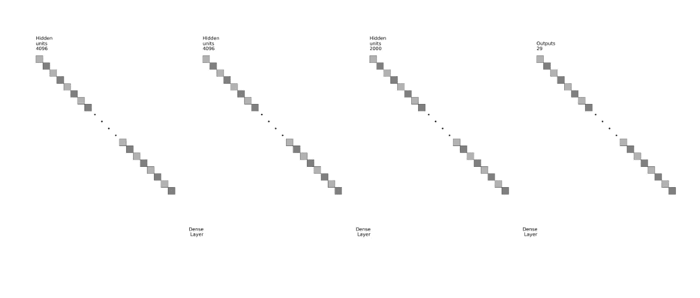
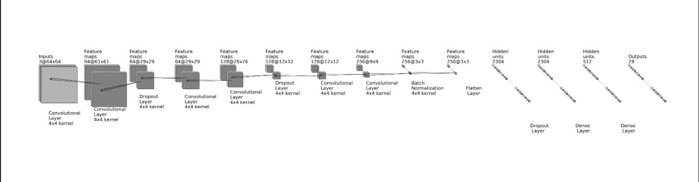
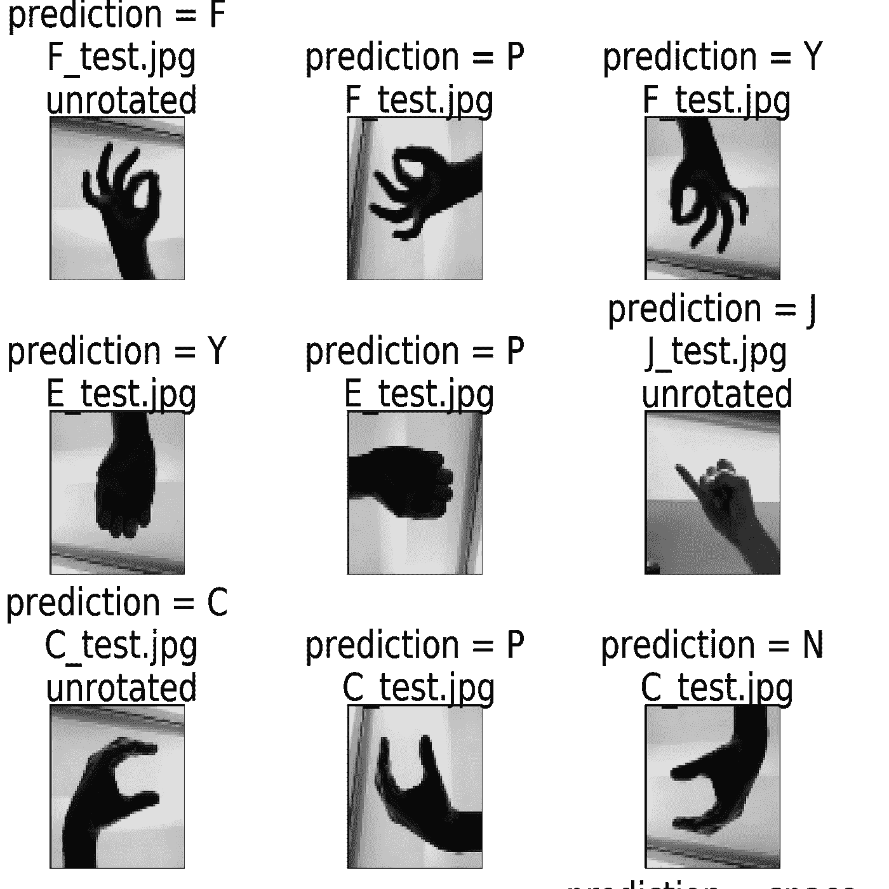
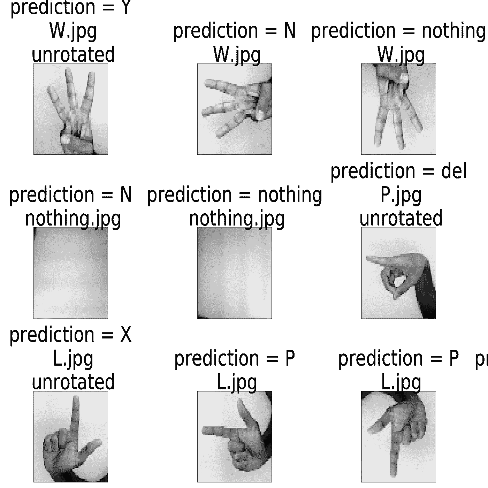
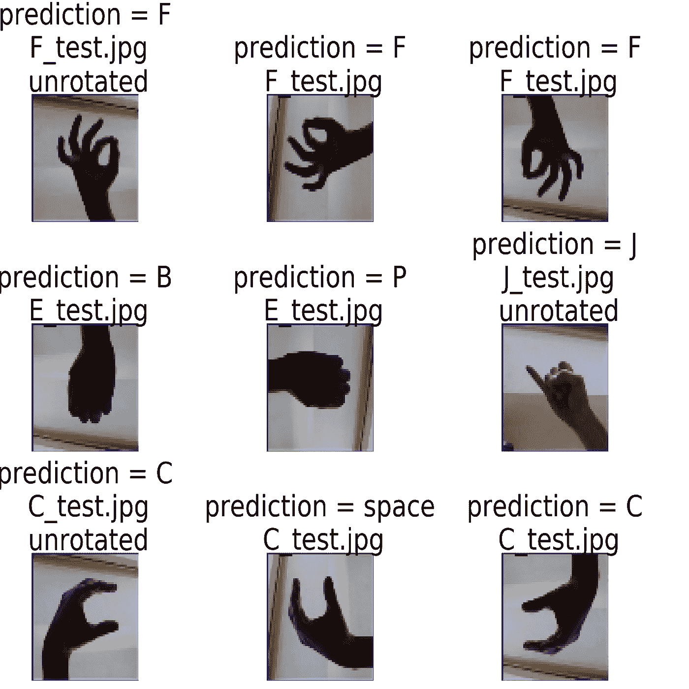
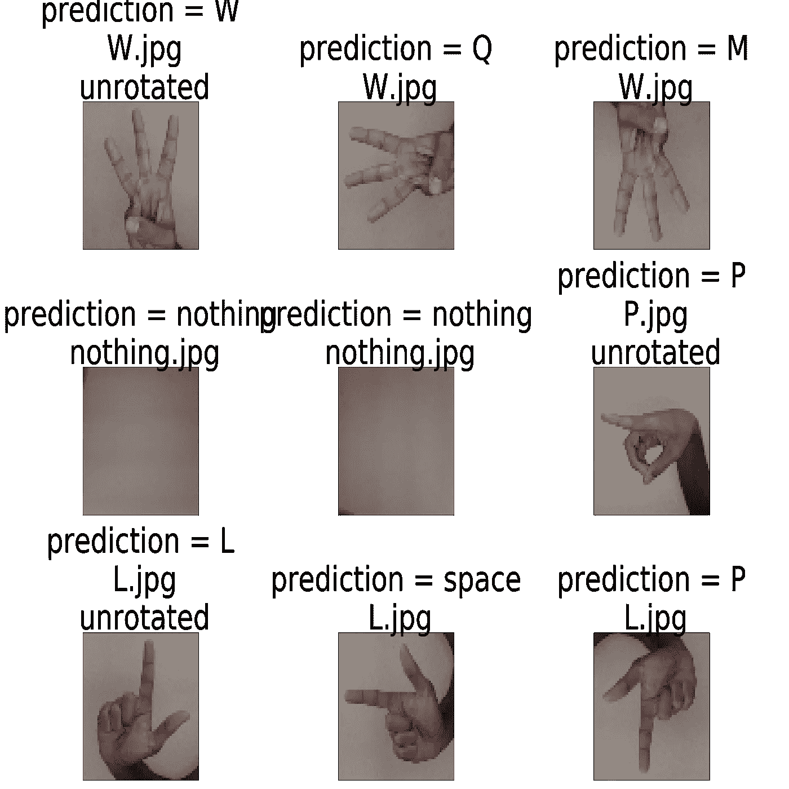

# 使用机器学习对美国手语字母表进行分类

> 原文：<https://medium.com/quick-code/classifying-the-asl-alphabet-using-machine-learning-83037ac463e6?source=collection_archive---------6----------------------->

这个项目的目的是对来自 [Kaggle 数据集](https://www.kaggle.com/grassknoted/asl-alphabet)的美国手语字母表的图像进行分类，并建立一个能够以高精度对图像进行分类的神经网络。

数据

美国手语字母数据集包含 87，000 幅图像，跨越 29 个类别，每个类别包含 3，000 幅图像。这些类别中的 26 个是字母 A-Z，另外 3 个是表示*无*、*空格*和*删除*的符号。这 87，000 幅图像被分成 78，300 幅作为训练数据输入模型，8，700 幅作为验证数据。除了将数据分割成训练和验证数据之外，还使用了一个生成器来增强图像(旋转、横向移动等)。)使得数据变得不那么相似，模型将不得不进行概括，而不仅仅是记忆某些图像。

方法

[代码](https://www.kaggle.com/insaan21/convolutional-model)的布局方式是将所有工作分解成函数，在代码末尾按顺序调用这些函数。训练、验证和测试数据都通过两个模型运行，一个由完全连接的层组成，另一个是卷积神经网络，因此所有函数都运行两次(每个模型一次)并编写，以便根据模型类型处理数据并相应地通过模型运行。全连接模型是具有两个隐藏层的标准深度学习模型，输入层具有 4096 个节点，以便接受灰度 64*64 图像。卷积神经网络改编自使用 GPU 运行 Kaggle 内核的[，增加了批量归一化、丢失和内核正则化，以试图减少过拟合。](https://www.kaggle.com/dansbecker/running-kaggle-kernels-with-a-gpu)

模特们

Fully Connected Neural Network Representation

Convolutional Neural Network Representation

Keras 被用来创建模型，因为它比 Tensorflow 或从头开始创建神经网络等其他选项更有效，并且它给出的结果也比这两个好得多。

结果

模型中监控的主要度量是验证损失，因为主要目标是让模型在预测数据和概化方面表现最佳，所以添加了一个功能，该功能可以保存具有最低验证损失的时段的权重，并使用这些权重加载模型。全连接网络的最低确认损失是 0.15，卷积神经网络的最低确认损失是 0.37。全连接网络的最大验证准确率为 94%，卷积模型的最大验证准确率为 92%。虽然全连接网络具有更低的验证损失和更高的准确性，但输入全连接模型的数据是灰度的，没有被增强，这使得模型更容易学习模式，因为训练数据似乎是从一系列连拍照片中的同一只手获得的。另一方面，由于卷积模型中的训练数据比全连接模型中的更多样，即使它具有更高的验证损失，它仍然学会了更好地概括，这在针对外部数据的结果中显示(我的手的图片)。

在用训练数据训练模型之后，它被输入了两组测试数据，一组来自数据集，另一组是我自己手的一组图像。两组数据也进行了旋转，以观察模型对旋转图像的表现。如上所述，在这两种情况下，模型在数据集的测试数据上表现得非常好，因为该数据也是在相同的光照下从同一只手获得的。两个模型都预测了 29 类测试数据中的 28 类。然而，与我自己的手的照片相比，完全连接的结果并不太好:完全连接的模型没有成功地正确预测我自己的手的任何照片，以至于它只是随机猜测字母，而卷积模型则更成功(它预测了 29 个未旋转类别图像中的 10 个)，至少它不是随机猜测的，它很容易在相似的符号之间混淆，并且比其他人多预测了几个类别。发生这种情况是因为输入模型的数据非常相似，以至于模型开始完全记住图像，而不是仅仅试图学习每个字母的手形，这导致它对外部数据的预测能力非常低。此外，无论是数据集的测试数据还是我自己的测试数据，这两个模型都无法预测旋转的图像。我对为什么会发生这种情况的猜测是，字母表的符号很大程度上取决于方向，稍微改变符号的方向就可以改变其字母值(例如，字母 I 和 J)，因此该模型无法理解旋转的符号。

Fully Connected Neural Network Results against my own Test Data

Convolutional Neural Network Results against Database Test Data

Convolutional Neural Network Results against my own Test Data

结论

虽然该模型在给定的数据集上表现良好，但结果并不能转化为更真实的场景，还需要进一步的工作来确定如何获取类似的数据并将其推广到任何情况。下一步将是使用更好的增强技术来改变灯光和背景，而不仅仅是移动和旋转图像。此外，使用预处理技术可以检测图像中的手并将其从图像中剔除，从而不再保留背景和其他干扰，这可能是有帮助的，因为对于这种类似的训练数据，类似的背景可能在模型的过拟合中起作用。这可以通过实现对象检测算法来实现，例如 [Mask R-CNN](https://arxiv.org/abs/1703.06870) 和 [RetinaNet](https://arxiv.org/abs/1708.02002) 。进一步研究对象检测算法可以看到[这里](https://github.com/facebookresearch/Detectron)。实现诸如特征选择、F 分数选择和递归特征消除之类的附加方法有助于找到样本中最重要的特征并消除其他特征，这将进一步有助于提高训练速度并减少过拟合。

学习和经验

这个项目是我第一次深入研究机器学习的世界，到目前为止，我与这个主题相关的知识范围一直是在 youtube 上看到不同类型的人工智能视频，每当出现机器学习和人工智能的话题时，就听到神经网络。所以当我开始这个项目时，我根本不知道如何着手建立一个神经网络，更不用说编码了。此外，尽管我以前有过 Java 编程经验，但我从未使用过 Python，所以我必须先学习 Python，然后才能开始学习手头的主题。然而，这并没有花费我太多的时间去学习不同的语法，因为主要的概念是一样的。只有当我充分掌握了 Python 语法之后，我才能继续学习机器学习。由于我对机器学习一无所知，我决定从头开始学习基本的机器学习方法，如线性回归和 K-最近邻，这些方法出奇地简单，因为它们依赖于基本的几何知识，如直线的斜率截距形式和欧几里德距离，使它们易于理解和编码。在那之后，我开始学习支持向量机，这是我陷入了相当长一段时间。尽管我理解了最佳分离超平面和支持向量的概念，但它背后的数学很难理解。因为我在学校还没有学过微积分，像梯度和使用拉格朗日乘数这样的东西远远超出了我目前的知识范围。然而，麻省理工学院的开放式课程有这个[关于支持向量机](https://youtu.be/_PwhiWxHK8o)的很棒的视频，它以一种公式推导对我有意义的方式解释了算法，我没有完全迷失。不过，我确实花了很长时间才理解 SVM 氏症。我花了大约一周半的时间学习 SVM，并学习用 Python 实现它们。之后终于到了神经网络。为了理解神经网络，我用了 Michael Nielsen 的免费在线书籍[神经网络和深度学习](http://neuralnetworksanddeeplearning.com/chap1.html)，这本书真的很透彻，让我很好地掌握了神经网络。一些数学问题我仍然不知道，但是解释足够透彻，我可以理解发生的事情的要点。我花了更少的时间来理解神经网络，而不是 SVM 氏症，只是因为在了解 SVM 氏症后，我已经有了一些复杂的数学经验，如使用梯度。然而，我想说实际上编码神经网络比 SVM 的要麻烦得多，仅仅是因为运行一个神经网络需要时间。起初，我试图在 Jupyter 笔记本中运行原始 tensorflow 代码，而不使用 Keras。我悲惨地失败了:我不仅得到了糟糕的结果，而且由于我的笔记本电脑没有一个好的 GPU，运行一个模型花费了很长时间。因此，经过几次尝试后，我决定切换到 Keras，并使用内置 GPU 功能的 Kaggle 内核将是最有效的选择，并给我最好的结果。现在，即使 Keras 是一个使用起来非常简单的库，它仍然需要大量关于神经网络的知识才能充分发挥它的潜力。从头开始学习神经网络帮助我做了一些调整，如果没有这些调整，我的模型可能会失败或无法正常工作。此外，学习如何正确地预处理数据，我认为这是所有机器学习中最复杂的部分之一，是另一项主要技能，如果不从头学习神经网络的工作方式，我就无法做好。甚至在启动神经网络之前，算法也在帮助我创建模型方面发挥了很大作用，因为它们给了我一个非常需要的机器学习基础，这使得我启动神经网络后变得容易得多。总而言之，我不认为我在这个旅程中学到的任何东西是浪费，因为即使我没有在这个项目中直接使用它，我也肯定会在未来的项目中使用它。