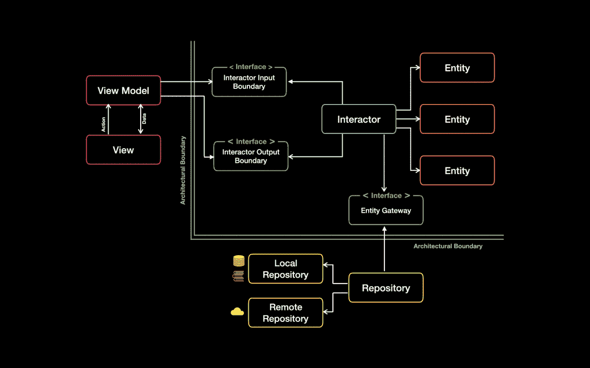
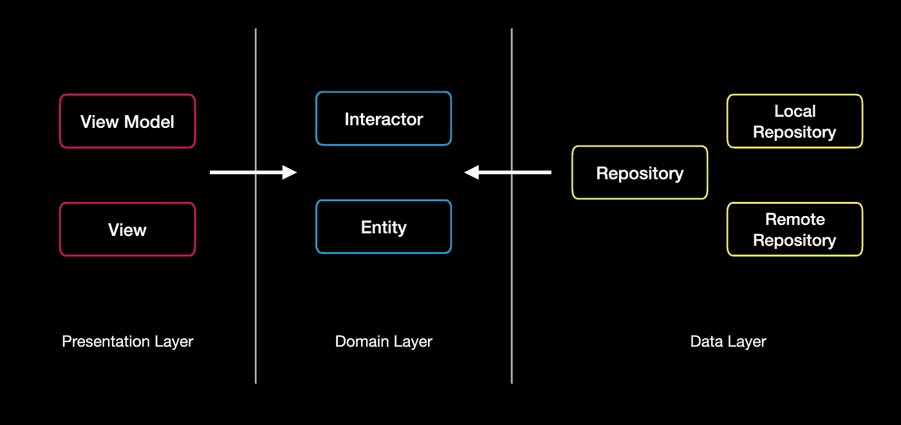

# 干净的移动架构:生存还是毁灭

> 原文：<https://medium.com/globant/clean-architecture-for-mobile-to-be-or-not-to-be-2ffc8d46e402?source=collection_archive---------1----------------------->

作为一名 Android 开发人员，一名技术爱好者，我总是在学习一些新的东西，这些东西可以帮助我创建组织良好、可维护和可扩展的代码库。

最近，我尝试使用 Clean 架构开发一个完整的应用程序，随着应用程序的完成，我现在花一些时间来分析 Clean 架构的影响。所以让我们开始寻找这个时代问题的答案的旅程，干净的建筑:生存还是毁灭🤔

## 快速概述:什么是干净的架构？

为了理解这个概念，我看了几次我们敬爱的鲍伯·马丁叔叔的视频。基于此，我们可以将我们的整个系统划分为域、数据&表示层。

**表示层:**这一层包括你的活动、片段、视图模型等。主要是 UI 相关的东西。

**数据层:**这一层包括你的数据库、共享偏好、网络通话、位置相关服务等。

**领域层:**这包括用例和实体。这一层包含了整个业务逻辑。整个应用程序将围绕这一层发展。

## 依赖性规则

正如您在下图中看到的，表示和数据层将始终依赖于域层。领域层需要独立于表示层和数据层。

我们可以很容易地找到解释使用干净架构的好处的博客，但是对于它所带来的缺陷和限制却很少提及。我将主要关注使用 Clean 架构的缺陷和限制，我希望它能帮助你做出正确的架构选择。

首先，如果你仔细听 Bob 叔叔的演讲，你会很快意识到他建议我们将干净的架构应用到整个系统，即后端和前端。此外，他说用户界面层使用 MVP 或 MVVM 架构。我们开发的移动应用程序只不过是我们系统的用户界面。

在选择干净的架构之前，您必须考虑以下几点，以避免复杂性和编写样板代码的开销。

## 我们可以删除域层或使其可选吗？

我知道这句话会引起很多人的惊讶。通常，所有复杂的业务逻辑都在后端处理。除了一些验证和简单的数学计算，前端没有太多需要处理的东西。

在我参与的项目中，我们有大约 100 个用例，其中 90 个用例只有访问存储库层的代码。剩下的 10 个用例主要是针对用户以不同形式输入的验证数据。同样，在这 10 个用例中，没有一个用例得到重用。

类似于我们的项目，如果复杂的业务逻辑由服务器处理，那么你应该认真考虑使用 MVP 或 MVVM 式的架构。在这种类型的项目中，干净的架构将要求你创建大量的样板代码、用例、映射器、实体和测试用例等。编写这些类容易出错，而且非常耗时。

同样，如果你的项目有严格的截止日期，人们会找到实现功能的捷径。我已经看到了表示层中使用的数据实体，这将违反依赖规则。有人可能会说应该通过代码审查来避免它，但是当你有不切实际的目标和在线工作时，大多数有道德的人也会选择捷径。在决定架构时，请不要错过考虑截止日期。

对于一些项目，可能有少量业务逻辑可以重用。在这种情况下，即使使用 MVP 或 MVVM，我们也可以为它创建一个公共类，是否称之为用例将由您决定。

通过移除领域层，我的意思是使用 MVP 或 MVVM，通过使其可选，我的意思是创建一类可重用的业务逻辑。

## 层的依赖流和分离怎么办？

在使用 MVVM 或 MVP 时，我们可以使用存储库模式来确保数据和 UI 层的解耦。它将解决数据库中不断变化的 API 和结构修改的问题。

在我 5 年的职业生涯中，我看到 API 的变化比 UI 更频繁。API 需要为各种渠道提供支持，如移动、web 等。随着我们的进展，API 的定义肯定会有一些变化。UI 的美观变化不需要对存储库返回的实体做任何改变，视图层可以轻松处理这些。

所以我可以说，我们可以使用 MVP 或 MVVM 来实现期望的依赖流和层分离。

## 框架和第三方库呢？

你可以肯定地说一段你无法控制的代码，这将使你的生活更加艰难。通常，这些是我们正在使用的库和框架。

库或框架创建者不断尝试更新他们的库，以添加新的特性并增强它。这样做的结果是，在这个过程中会有阻碍性的改变，这将迫使你改变相关的代码，或者在最坏的情况下，由于兼容性问题而切换到另一个库。

为了克服这一点，我们可以使用一个类或接口来隐藏这种依赖性，这样单个类实现的变化将导致整个代码库的变化。这个概念是一个独立的东西，我们可以用任何类型的架构甚至不用任何架构来实现它。

在寻找这个抽象的候选对象时，要考虑库变化的频率、依赖于它的类的数量、如果有一些突破性的变化所需要的工作量。

例如，在我的一个项目中，我们开始使用改型 1.9，在改型 2.0 发布后不久。更新最新版本后，一切都坏了。由于没有合适的架构，我们必须对几乎所有的活动进行修改。这种在代码库中具有广泛影响力的库是它的首选。类似地，我们可以从互联网上抽象出用于加载图像的库，例如 Glide、Picasso 等。

另一方面，我使用了一个库 MPChart 来显示图表。它在整个应用程序中只使用一次，在 UI 中也是如此，所以抽象它没有任何意义。

## 会有层次和界限吗？

在 MVP 或 MVVM 中，我们可以轻松地创建数据和表示层。甚至我们可以在它们之间有一个清晰的建筑边界。如果您在前端没有大量的业务逻辑，就没有必要有域层。两层可以满足您的需求，并且可以创建可伸缩的应用程序。

## 我们能把关注点和责任分开吗？

关注点分离说一个组件应该只有一个改变的理由——一个责任。属于数据库的类应该与 UI 或网络组件无关。他们应该被隔离。这可以通过 MVP 或 MVVM 和存储库模式轻松实现。

我们可以把 UI 做得很笨，它不应该包含应用程序逻辑，但它将负责格式化，并决定如何把它们呈现给用户。查看模型或演示者可以帮助我们做到这一点。

## 可维护性呢？

在可维护性下，我主要考虑两个因素，易于更改和添加新功能。对于小型项目，复杂的业务逻辑在后端处理。你会发现许多重复的实体，为每一层你创建一个单独的实体，但在引擎盖下，他们都是相似的。它将增加 APK 的大小和内存占用。

在这样的项目中进行更改将会产生更大的影响，因为不同层中的类需要针对单个更改进行修改。这将是一项重复而无聊的任务。即使有了 MVP 或 MVVM，如果足够小心，我们也可以通过构造代码来轻松添加新功能。

## 可测性呢？

使用 mocking 框架和测试库，我们可以让用 MVP 或 MVVM 架构编写的代码 100%可测试。通过模仿行为依赖类，我们可以增加执行时间。

我并不是说干净的架构对移动应用程序开发没有好处。我只是想让你们从另一个角度看问题。

干净的架构并不是满足所有架构需求的金子弹解决方案，不要被社区的趋势冲昏头脑而做出决定。对于大多数项目来说，MVP 或 MVVM 足以创建可扩展和可维护的代码库。

你应该根据项目的性质来决定。例如，如果你的项目很大很复杂，在前端有很多业务逻辑，那么干净的架构会带来明显的好处。

另一方面，对于更小和更简单的项目，您将最终编写更多的代码，增加所有层的复杂性，在这个过程中投入更多的时间。

让我们不要让治疗比疾病更糟糕。考虑以上几点，做出明智的决定。我希望你会发现它们有用。如果你觉得我在博客中遗漏了什么，请在评论中告诉我。