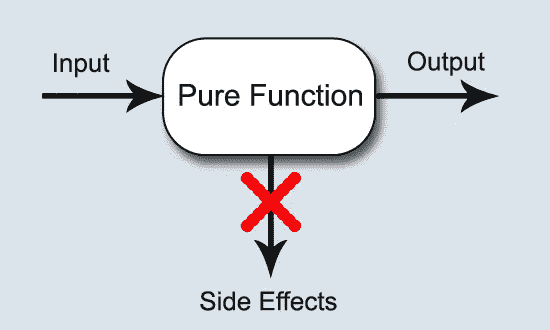
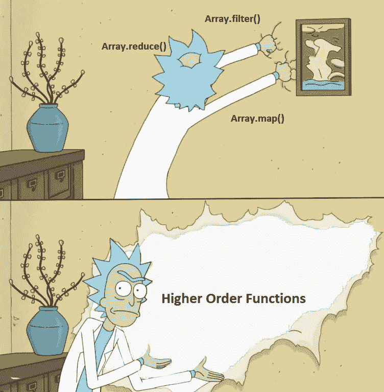

# JS Bifrost——带有 JS 函数的高效代码

> 原文：<https://medium.com/globant/cleaner-code-with-javascript-functions-d08d3bb37836?source=collection_archive---------1----------------------->

## 了解纯函数和高阶函数来编写最先进的代码！

欢迎来到 JS Bifrost，这是您通向上帝级 JavaScript 坚实基础的道路。这是该系列的第一篇文章。这篇文章是关于如何利用 JavaScript 函数生成高效代码的。


编程的技巧是将一组需求分解成一组*功能*和*数据结构*。

函数是编程的关键组成部分之一。它们被定义为执行特定的任务，并在被调用时反复执行。简单明了，对吧？

但是…


> JavaScript 最棒的地方是它的函数实现。它几乎把一切都做对了。但是，正如您应该预料到的那样，JavaScript 并没有完全正确。— **道格拉斯·克洛克福特，JavaScript:精彩部分**

JavaScript 一直都是这样的！！

让我们从一个非常实际的角度来探索函数，这样我们就在利用 JavaScript 的能力方面领先一步。

函数主要用于:

*   **动作**:一个函数用于执行一系列**动作**，这些动作在我们的代码中是多余的。因此它也被称为**程序**。在需要执行特定过程(动作序列)的地方，可以调用它任意次。
*   **关联**:函数**根据其设计执行的动作，将** *(映射)* 输入关联到输出。
*   **内部通信**:一个功能也可用于**通过输入和输出操作与系统的其他部分**进行交互。

理解了函数的用法之后，让我们来讨论两种类型的函数，你应该知道这两种类型的函数可以用来编写更干净有效的代码。

# 纯函数

纯粹的功能:

*   总是为相同的输入提供相同的输出。
*   不会产生副作用。

如果一个函数满足这两点，它就是一个纯函数。



因此，纯函数是关于映射的。它会接受输入，如果输入重复，它会给你同样的输出，否则它会给你相应的输出。这意味着，如果一组输入存在一组输出，纯函数将输入映射到输出。

> 一个纯函数独立于程序执行过程中的任何状态或数据变化。它必须只依赖于它的输入。

我们用一个例子来理解纯函数。

下面是一个简单的问候函数，它将人名作为输入。

```
const greeting = "Hello"const greet = *person* => `${greeting} ${person}!`;console.log(greet("Ashmit")); // "Hello Ashmit!"
```

你可能认为这将每次在相同的输入上给出相同的输出！是的，没错！

但是它并不独立于函数之外发生的任何事情。如果我们将变量“greeting”更改为“Howdy ”,即使我们没有更改“greeting”函数的输入，输出也会发生变化。

```
const greeting = "Howdy"const greet = *person* => `${greeting} ${person}!`;console.log(greet("Ashmit")); // "Howdy Ashmit!"
```

一个纯函数应该**独立于任何外部可变状态**。它应该只依赖于它的输入。上面的场景使我们的功能变得不纯，因为它与外部可变世界的*交互*，这被称为**副作用**。

让我们来详细看看，对于纯函数，副作用实际上意味着什么。

## 副作用

副作用是函数内部与外界的任何交互。这可能是任何事情，从改变存在于函数外部的变量，或者从函数内部调用另一个方法，到从函数外部访问变量。

注意:如果一个纯函数调用一个纯函数，这不是副作用，调用函数仍然是纯的。

让我们把**不纯的**‘greet’函数变纯，稍微修改一下。我们知道，纯粹的功能应该只依赖于输入，即使外面的世界着火了，它也应该工作。所以我们会这样做，

```
const greeting = "Hello"const greet = (*greeting*, *person*) => `${greeting} ${person}!`;console.log(greet(greeting, "Ashmit"));// "Hello Ashmit!"
```

现在我们的函数‘greet’是纯**的**，因为它**只依赖于它的输入**。它总是以相同的输入给出相同的输出。

## 纯函数的好处

*   纯函数一旦创建就可以立即测试，并且有助于维护和重构代码。
*   纯函数的输出可以被**记忆**，因为它们对于相同的输入总是给出相同的输出。这在**动态编程**中证明非常有用，在动态编程中，最佳子结构是必须的。

纯函数的一个非常重要的用例是在**Redux**(react js 的状态管理)中。**减速器必须始终是纯函数**,因为减速器对状态执行动作。如果对于应用状态的相同动作状态来说，还原剂是不纯的，那么它将产生不同的结果，因此将不能达到它的目的！
(顺便说一句，如果你还不知道 ReactJS，我强烈推荐你去学)

# 高阶函数

JavaScript 中广泛使用高阶函数。如果你用 JavaScript 编程已经有一段时间了，你可能已经在不知不觉中使用它们了。



在 JavaScript 中，函数是**第一类公民**，我说的*第一类*，是指函数被视为值。所以它们也可以作为值传递。

**高阶函数**是承担其他函数的函数，要么将它们作为自变量，要么返回它们。因为 JavaScript 支持一级函数，所以我们利用这个工具来创建高阶函数。

> 高阶函数允许我们抽象出*动作*，而不仅仅是值。

将另一个函数作为参数通常被称为 ***回调函数*** ，因为它被高阶函数回调。这是 JavaScript 大量使用的一个概念。

让我们用一个处理数组时经常使用的函数的例子来理解高阶函数- **Array.prototype.map()。**

***Map()*** 返回一个新数组，其中填充了对调用数组中的每个元素调用提供的函数(回调)的结果。基本上， *map()* 接受一个函数作为输入，并对数组的每个元素执行该函数。它返回一个用结果值填充的新数组。

让我们看一个简单的例子。

```
const double = n => n * 2; // Callback functionconsole.log([1, 2, 3, 4].map(double)); // [2, 4, 6, 8]
```

这里， *map()* 将“double”函数作为输入，使其成为高阶函数。同样，如果一个函数返回一个函数，那么它将是一个高阶函数。

## 使用高阶函数的好处

*   我们可以创建更小的函数，只处理一部分逻辑。
*   我们可以用不同的更小更简单的函数来组合复杂的函数。这增加了代码的可重用性，减少了错误，使我们的代码更容易阅读和理解。

像纯函数一样，Redux 中也使用高阶函数。减速器只是一个函数，所以当我们将这种模式应用于减速器时，我们称它们为**高阶减速器**。

当你不得不在你的每一个减速器中复制逻辑时，这变得非常麻烦。**高阶减速器**通过在开关的默认情况下返回减速器，帮助我们减少负载。这样，我们可以将调用代理到原始的缩减器。由于 reducers 是纯函数，这创造了一个美丽的组合，产生了一个处理复杂代码的块，它具有纯函数的所有优点，但是更高阶。

# 结束语

编写干净高效的代码是当前的需要。我们的代码应该精确有效。最大限度地利用语言的特性本身就是一个挑战。

> 写干净的代码是你必须做的，这样你才能称自己为专业人士。没有任何合理的借口可以让你不尽力而为。罗伯特·c·马丁，《干净的代码:敏捷软件工艺手册》

纯函数和**高阶函数**是 JavaScript 的两个这样的特性，它们将函数提升到了一个新的水平，为我们提供了交付清晰、干净和高效代码的工具。我们必须尽可能地将这些整合到我们的代码中，以提高我们编写的代码的质量。

*观看此空间，通过****“JS 彩虹桥”在通往“神级 JavaScript”的道路上取得更多进步。***

## 参考资料:

[](https://eloquentjavascript.net/) [## 雄辩的 JavaScript

### 各种艺术家的插图:封面和章节插图。像素艺术在第 7 章和…

eloquentjavascript.net](https://eloquentjavascript.net/) [](https://www.digitalocean.com/community/tutorials/redux-higher-order-reducers) [## Redux | DigitalOcean 中的高阶减速器

### 在重置 Redux 状态中，我们看到了一种通过创建根 reducer 来重用 reducer 逻辑以重置状态的方法。但是…

www.digitalocean.com](https://www.digitalocean.com/community/tutorials/redux-higher-order-reducers)