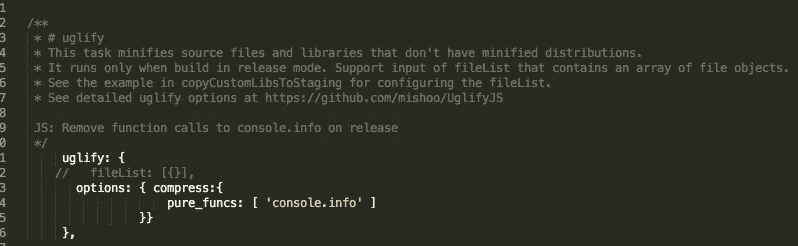

# 使用 JET 构建脚本清理编译代码

> 原文：<https://medium.com/oracledevs/cleaning-your-compiled-code-with-the-jet-build-script-f37f4492f1f8?source=collection_archive---------1----------------------->

这个标题听起来不太吉利，但我的意思是，当你发布应用程序进行部署时，可能有些方法你不想在那里结束。

例如，您可能有一些开发方法，如日志记录，您不希望在您的生产环境中使用。

杰特再一次把它和工具包一起从包里拿出来。我们可以使用作为搭建过程的一部分提供给我们的构建脚本简单地做到这一点。

对于我的例子，我删除了我的“所有常见的”console.info 语句。

因此，在以下文件中:

```
Pre v4.0
$JET_PROJECT/scripts/grunt/config/oraclejet-build.jsv4.0 Onwards
$JET_PROJECT/scripts/config/oraclejet-build.js
```

您将找到文件的`#uglify`部分。这个文件包含了很多有用的东西，比如将第三方库从 node_modules 目录复制到你的 src 中。

无论如何，回到我们为什么在这里。被发送到丑进程的`options`对象(仅在发布时，如注释所示！)可以提供一个包含要移除的方法的`compress`对象。

这些都很罗嗦，所以让我们看看实际情况，因为它真的胜过千言万语:



以下是您可以复制和粘贴的代码:

```
uglify: {
   // fileList: [{}],
   options: { compress:{
     pure_funcs: [ ‘console.info’ ]
   }}
 },
```

因此，这意味着您可以将尽可能多的 console.info 片段放入代码中，而不用担心它们会出现在产品中。

我发现这非常有用，大大加快了部署的速度。

再次感谢 JET toolkit！