# 闭包是 Go 的泛型

> 原文：<https://medium.com/capital-one-tech/closures-are-the-generics-for-go-cb32021fb5b5?source=collection_archive---------0----------------------->

## 围棋系列之二

你如何解决 Go 泛型的问题？

Go 是一种具有有意限制的特性集的语言；其中一个特性是省略了用户定义的泛型类型和函数。概括地说，人们使用泛型有两个目的。

最常见的请求是通用数据结构。有时候，我们需要比切片或地图更复杂的东西。在 Go 中，您有两种选择——要么您可以为您需要的每种类型反复编写数据结构(或者使用代码生成器来节省一些输入),要么您需要根据*接口{}* 来定义您的数据类型，并在它们从结构中返回时强制转换值。

泛型的另一个用途是功能性的。有时，您需要对不同的数据类型运行相同的算法，而不仅仅是存储不同种类的值。与一般的数据结构不同，有一种方法感觉像是这种用法的必经之路*。*

# **检验中的仿制药**

作为一个例子，让我们看看 LGTM 的一个分支 Checks-Out，它是一个开源项目，帮助团队通过 Github 执行代码审查策略。你可以在 https://github.com/capitalone/checks-out 找到结账处。作为与 Github 集成的一部分，check-Out 调用几个 Github APIs 来返回不同事物的列表，包括团队和用户。

例如，下面是最初的*getteamembers*函数:

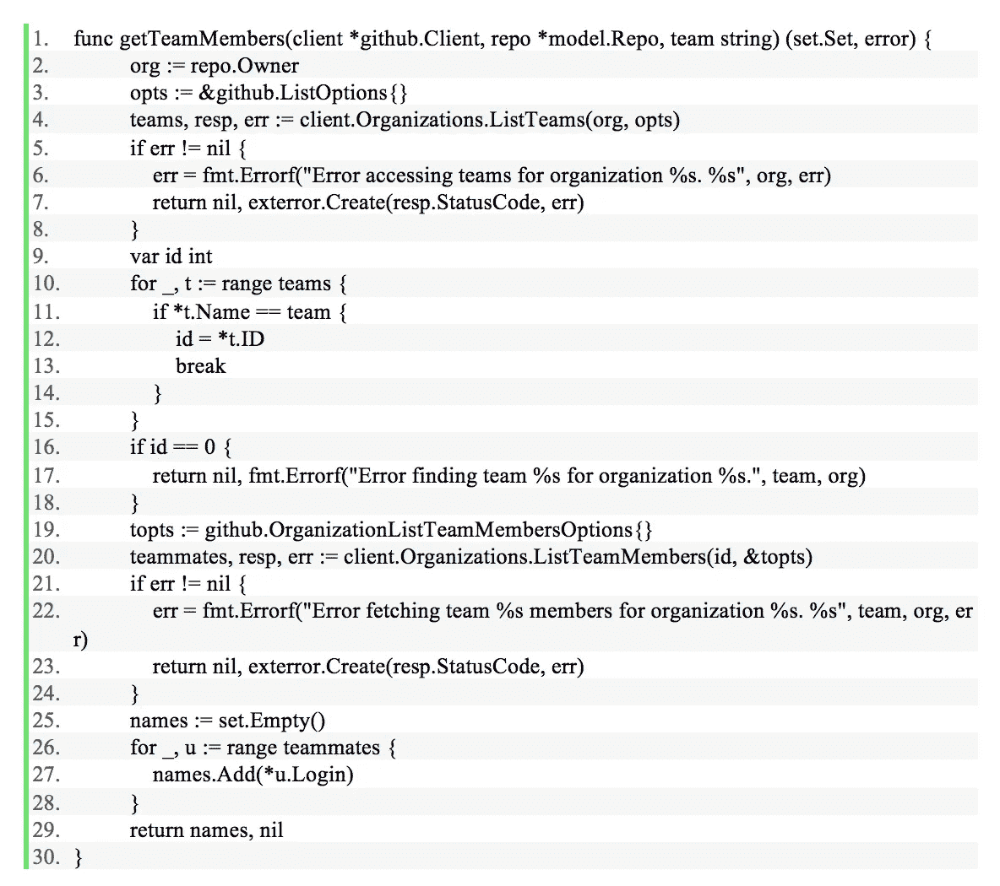

# **一种不是很干的溶液**

这段代码运行良好，直到一个新的签出用户试图在一个有 45 个团队的组织中注册一个项目。原来所有的 *List** API 调用实际上都是分页的，页面大小为 30。新用户有三分之一的团队没有被加载，这导致在引用第二页上的团队时出现错误。

当这种情况发生时，我们必须为签出添加分页支持。

我们的第一次修复是这样的:

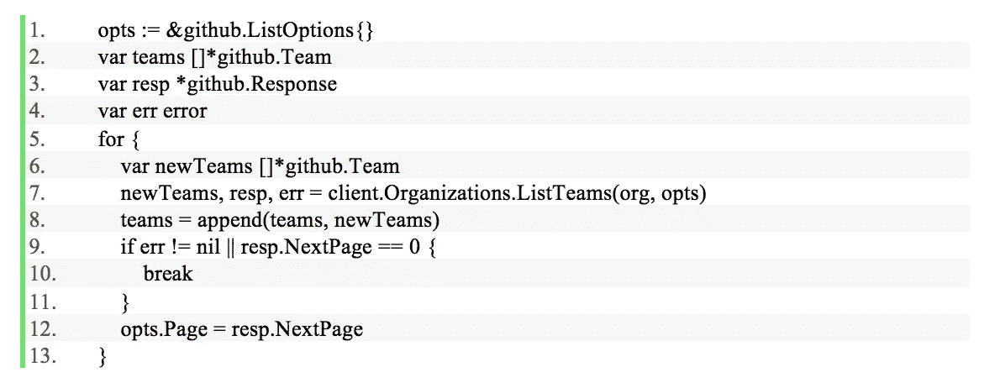

并且:

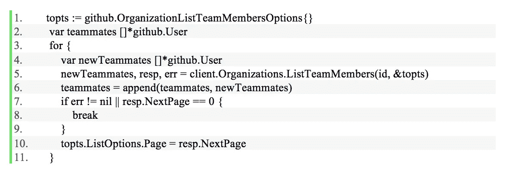

虽然这种方法修复了 bug，但是它确实使代码变得更长了，并且重复了很多次。有办法解决这个问题吗？

ListTeams 和 *ListTeamMembers* 都以非常相似的方式分页，但是它们期望不同的参数并返回非常不同的数据。如果这些是代码中唯一需要分页的地方，我们可能会让它保持原样。但是代码中还有另外十个位置有相同的问题。我们不想一遍又一遍地重复微小变化的分页代码。

# **快速绕道去 Java**

在过去的二十年中，我大部分时间都在用 Java 编程。在 Java 中，您可以用一个如下所示的泛型方法来解决这个问题:

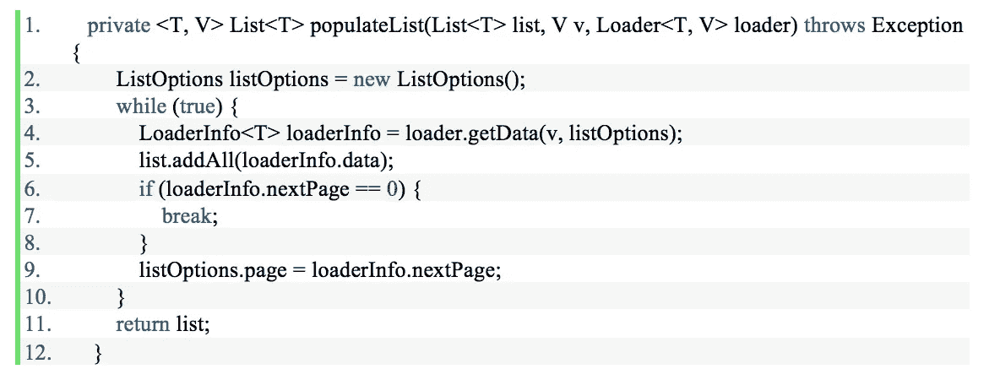

最初的空*列表*作为一个参数传入，同时传入的还有用于进行远程调用的数据。 *Loader* 是一个界面，看起来像:

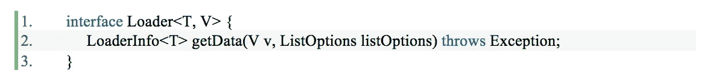

与 Go 不同，我们不能从一个 Java 方法返回多个值，所以 *LoaderInfo* 被创建为一个简单的包装类:

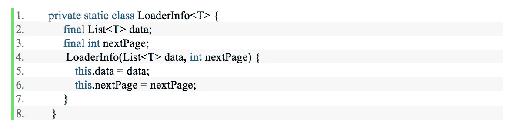

有了这些代码，我们就可以将所有团队拉下来:

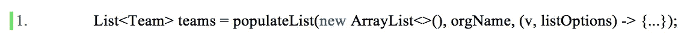

我们可以通过以下方式拉下团队中的所有用户:

这个解决方案表明泛型的力量不仅仅是类型安全的容器；泛型允许您在多种数据类型上抽象相同的算法。

# **返回去**

但是 Go 没有泛型。我们如何优雅地解决这个分页问题？

我们可以使用*接口{}* 作为传递无类型输入和输出参数的一种方式，但是这没有抓住要点。它创建了需要强制转换的丑陋代码，并颠覆了帮助我们编写正确代码的类型系统。

再看两个 GitHub API 调用，有一些数据类型是相同的。都有 **github。ListOptions* 作为输入参数(在 *ListTeams* 的情况下是直接的，在 *ListTeamMembers* 中是嵌入的结构)，它们都返回* *github。响应*和*错误*。 ***有没有一种方法可以传递相同的参数，同时仍然引用不同的参数？***

Go 中最强大的特性之一是闭包。闭包看起来像是在函数内部声明的函数:

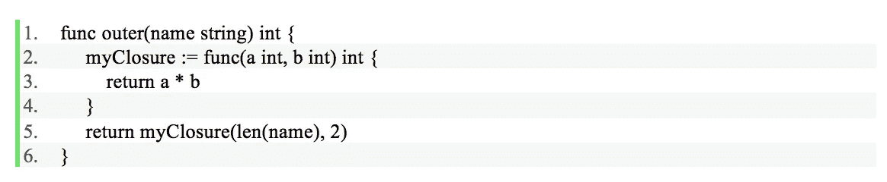

用“hello”作为参数调用 outer 将返回 10:

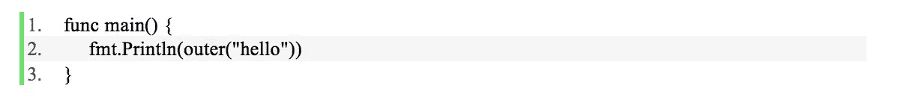

**你可以在**[**https://play.golang.org/p/U3HV-0nvTB**](https://play.golang.org/p/U3HV-0nvTB)亲自尝试一下

起初，在一个函数中声明另一个函数似乎很愚蠢。为什么要拆分逻辑？闭包的力量来自两件事。首先是它们引用和修改外部函数中声明的变量的能力。其次，闭包可以传递给其他函数，甚至可以从它们的声明函数返回。当与对局部变量的引用相结合时，这会导致一些有趣的行为:

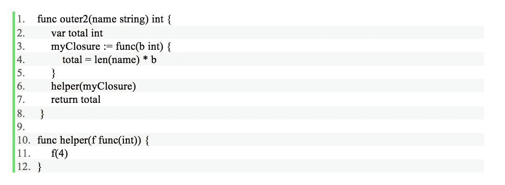

调用 *outer2* 返回 20:

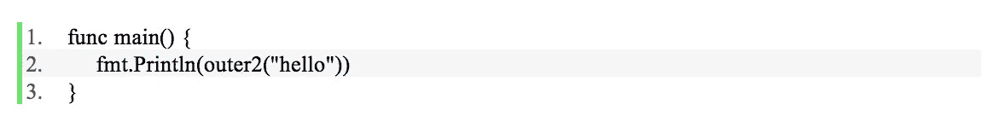

代码可以在[https://play.golang.org/p/dNmhg_6x9T](https://play.golang.org/p/dNmhg_6x9T)运行

看*外 2* 。当 *myClosure* 被传递给 helper 并从那里被调用时，它的局部变量 *total* 被修改。在 helper 中没有对总计*的引用，但是使用闭包允许对其进行修改。就像 Go 中的*结构*一样，闭包也有状态。这个州为我们的问题提供了解决方案。*

# **将所有这些放在一起**

使用闭包技术，我们可以生成我们需要的类型的切片，并在传递给执行分页循环的函数的闭包中修改该切片。我们的闭包需要一个参数，即 **github。ListOptions* 拥有当前页面信息，并返回两个值，一个 **github。回应*和无处不在的*错误*。该函数如下所示:

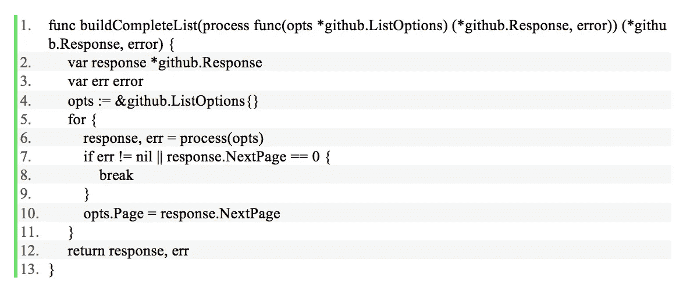

随后的代码如下所示:

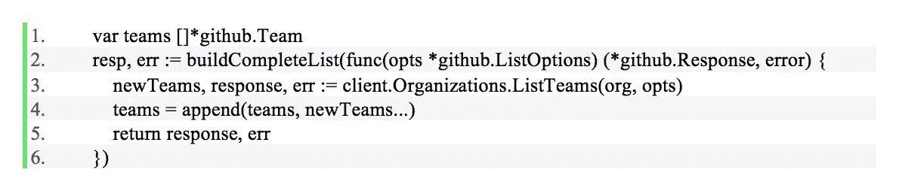

和

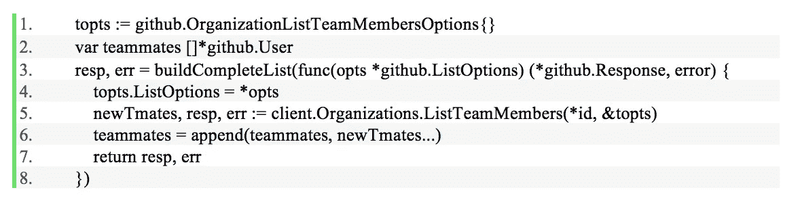

我们做的最后一个改变是分解代码，让所有的团队都进入自己的功能。除了*getteamembers*，还有一个函数需要一片 **github。团队*，我们不再重复自己，而是再次分享代码:

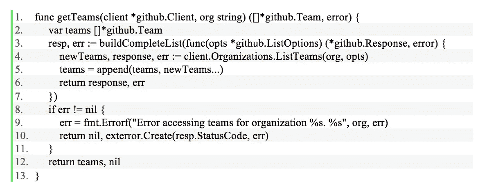

我们的*getteamembers*函数的最终版本是:

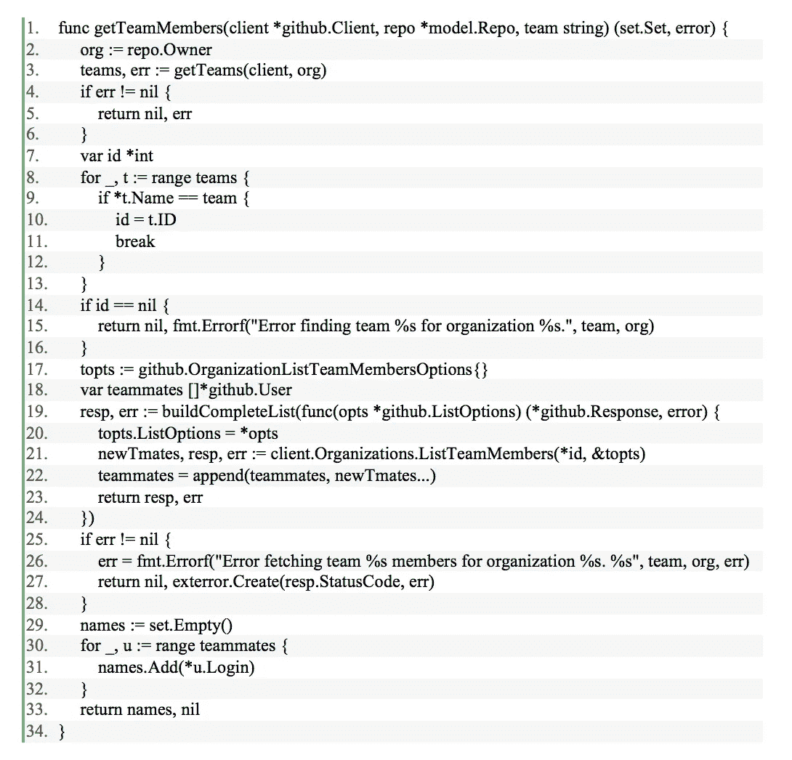

# **用闭包排序**

闭包法可以用在 Go 代码中的很多地方，在这些地方你会用到其他语言中的泛型。再比如排序。为了使用*排序。Sort* 函数，你需要给它传递一个 *sort 的实现。接口*接口。您可以使用以下代码，而不是每次需要对切片进行排序时都创建一个新类型:

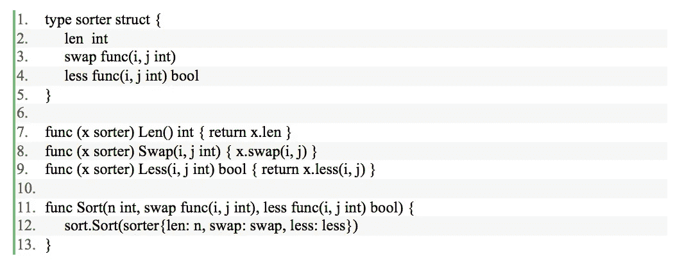

然后排序方式:

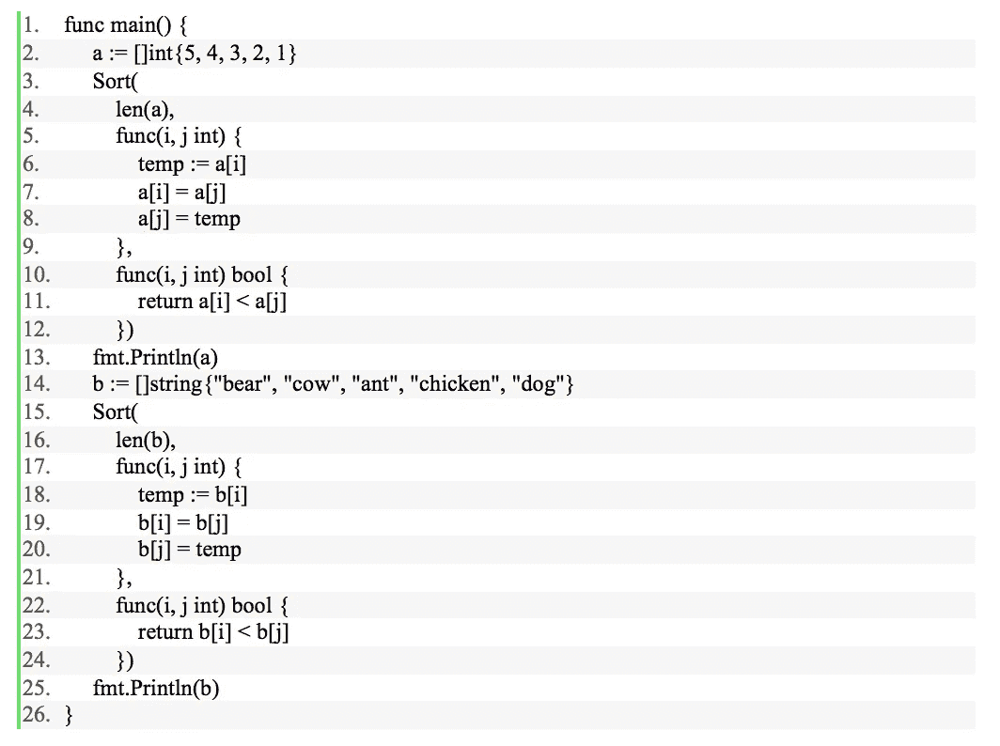

在[https://play.golang.org/p/hYMcQ81AvN](https://play.golang.org/p/hYMcQ81AvN)尝试一下

Go 1.8 中增加了这种技术的一个变种，即新的*排序。切片*功能。

# **半条面包**

那么这是否意味着我们在 Go 中根本不需要泛型呢？不完全是。我们可以对通用函数进行抽象，但是我们仍然不能获得额外的用户定义的通用数据结构。

使用闭包代替泛型的最大缺点是它们会产生副作用。现代软件开发不鼓励副作用，因为它们使得对数据流进行推理变得更加困难。当程序的函数只依赖于作为参数传入的数据，并且只修改在函数中创建的数据时，测试和理解程序会更容易。当一个函数依赖于设置在程序中其他地方的数据，并修改非本地数据时，就存在一个需要记录的看不见的依赖性。

当您传递闭包时，您可能会将本地状态转换成非本地数据。这些数据需要被管理。如果没有适当的锁定，就不能从多个 goroutines 调用它。没有办法知道传入的函数是一个闭包；你需要理解闭包是如何流过你的程序的。

在上面的代码中，不清楚如何正确使用 *buildCompleteList* ，因为该方法的输入和输出参数并不指示数据是如何创建或存储的。您需要查看函数的现有用法，看看传递给 *buildCompleteList* 的闭包是否在它们声明的函数中修改了变量。

然而，这并没有让闭包变得糟糕；这只意味着你需要在适当的时候使用它们，并且要小心。我们可以使用它所拥有的工具来帮助我们解决这个限制，而不是在 Go 中寻找泛型

***声明:以上观点仅代表作者个人观点。除非本帖中另有说明，否则 Capital One 不属于所提及的任何公司，也不被其认可。使用或展示的所有商标和其他知识产权均为其各自所有者所有。本文为 2017 首都一。***

# **附加链接**

*   [在 Go 中构建无界通道](/capital-one-developers/building-an-unbounded-channel-in-go-789e175cd2cd)
*   [在 Go 中构建 REST API](https://developer.capitalone.com/blog-post/building-a-serverless-rest-api-in-go/)