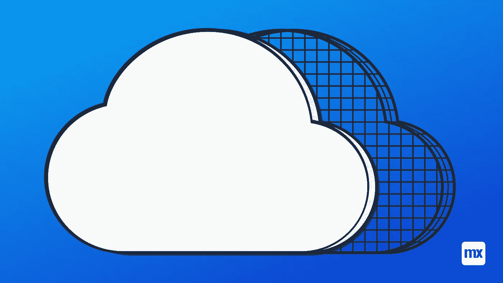
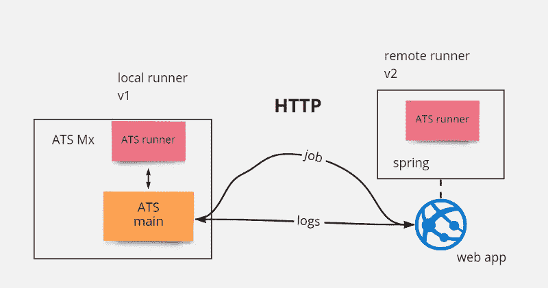
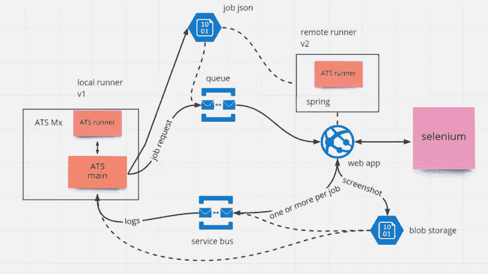
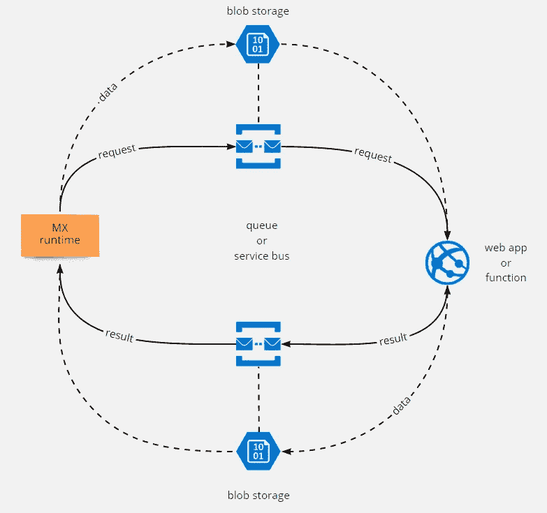

# 云架构模式

> 原文：<https://medium.com/mendix/cloud-architecture-patterns-a2b8bd6eb326?source=collection_archive---------1----------------------->

# 作为一个与 Mendix 合作多年的人，我非常清楚 Mendix 云产品的痛点。它可能是僵化的，定制有时可能是有限的。两年多前，当我加入智能数字工厂团队时，我们决定将计算负载转移到另一家云提供商，以获得更多控制和灵活性。从那时起，我们已经成功地将工厂的一些关键组件迁移到 Azure cloud。

在这篇博文中，我想分享我们是如何做到这一点的，并为寻求将其工作负载迁移到云的其他开发人员提供指导。首先，让我介绍一下基本概念。

**云和蔚蓝基础知识**

云的基本思想是，亚马逊、微软或谷歌等云提供商将其服务器出租给其他公司和个人，而不是购买前期成本高昂的服务器。多年来，这一基本理念不断发展，现在提供商除了租赁硬件之外，还提供许多产品和服务。

Azure 的一些流行和重要的服务是:

*   [虚拟机](https://docs.microsoft.com/en-us/azure/virtual-machines):最基本的，完全自由地安装和运行任何东西。
*   Web App s :托管 Web App 环境，支持多种语言:Java、Nodejs 等。).
*   [功能](https://docs.microsoft.com/en-us/azure/azure-functions/):自动扩展的无服务器产品，只需要最少的代码。
*   [Blob 存储](https://docs.microsoft.com/en-us/azure/storage/blobs/):用于存储音频、图像和视频等大文件(> 1 MB)。
*   [队列存储](https://docs.microsoft.com/en-us/azure/storage/queues/storage-queues-introduction):针对[生产者-消费者](https://en.wikipedia.org/wiki/Producer%E2%80%93consumer_problem)场景发送短消息。
*   [服务总线](https://docs.microsoft.com/en-us/azure/service-bus-messaging/service-bus-messaging-overview):类似于队列，但是更快，有更好的保证

Extra(在帖子中未使用，但值得一提):

*   [表存储](https://docs.microsoft.com/en-us/azure/storage/tables/table-storage-overview) —基于可伸缩文档的存储(想想 MongoDB)，不适合作为主数据库
*   [Kubernetes](https://docs.microsoft.com/en-us/azure/aks/intro-kubernetes) —托管集群，与虚拟机完美结合

大多数服务都有一个现收现付的计划，这意味着客户只需为服务运行的时间付费。一般来说，任何服务都可以随时启动和停止。

将计算迁移到云的一些重要原因是:

*   可扩展性和弹性:说应用程序能够对负载变化做出反应和适应，例如更多的用户活动，这是一个很好的说法。想象一下，应用程序中的一个组件接近(或预计达到)其极限，更多的负载将导致性能下降或更糟。在云中，我们可以利用他们的服务和庞大的基础设施来按需扩展该组件，并且独立于我们应用程序的其余部分。
*   对环境的控制:Mendix 平台对运行应用程序的服务器的控制非常有限。例如，根本不可能安装二进制可执行文件、操作系统库或特定版本的 Java 或另一种类似 Node 的语言。甚至不可能配置数据库。对于其他云服务，特别是虚拟机，但也包括功能和某种程度上的 web 应用程序，可以更自由地配置和安装其他程序。
*   成本:Mendix 平台托管可能非常昂贵，在某些情况下，将产生大量负载的组件转移到云上可能更具成本效益。尤其是当组件在短时间内需要大量资源或者负载可变时。

**VMs vs Web App vs 功能:如何选择**

这些是主要的计算服务。以下是何时使用哪种方法的快速经验法则:

*   功能:对于短时间的异步工作负载，可使用此功能，最长可达 10 分钟。
*   Web 应用:用于响应时间至关重要的长期运行或同步工作负载
*   VMs:与 Web 应用程序相同，但是需要额外的二进制文件或库。

功能和 Web 应用都应该优先于虚拟机。有了这些，就不需要使用 Java 或者 Node 进行安装，部署 app 代码就足够了。此外，对可伸缩性、弹性、可用性等的主要关注都是默认的，或者是一次性的。

即使没有工作要做，虚拟机和 Web 应用程序也一直“开着”(并相应地计费)，功能更像 Mendix 沙盒。当没有请求时，该函数进入睡眠状态。一有请求进来，这个函数就被“唤醒”来服务这个请求。这意味着使用一个函数要便宜得多，这取决于它的使用频率。然而，与 Mendix 沙盒一样，唤醒该函数可能需要一段时间，这就是为什么它们不适合响应时间需要在一秒钟以内的快速调用。

这可以通过选择所谓的“热启动”功能来解决，这意味着该功能的一个实例总是在运行并准备好为请求服务。自然，这带来了更高的成本。[你可以在这里阅读更多详情](https://azure.microsoft.com/nl-nl/blog/understanding-serverless-cold-start/)。

理论到此为止。让我们看一些真实的例子。

**举例 A: ATS Runner**

ATS runner 是 ATS 中的一个组件，它处理单个测试用例的执行，并协调测试套件的执行。我们正在将它迁移到云中，这样我们就可以独立于 Mendix 平台对其进行扩展。它已经达到了极限，由于计划中的新功能，我们预计它将不再能够以可接受的性能工作，除非迁移到云并进行扩展。

我们决定使用网络应用而不是功能，因为:

1.  一项工作可以持续几个小时。
2.  一项工作的资源需求很难预测。有些作业非常小，而其他作业则需要大量内存和 CPU 来执行，这可能非常昂贵。有了 Web 应用程序，我们可以更好地控制如何挑选工作，以最佳地利用机器资源。

**示例 B:模型获取**

该组件使用 Node.js 库(MendixSDK)来访问某个 API 并处理其数据。这是在云中实现的，因为在 Mendix 运行时，我们不能运行 Node.js 脚本。与此相反，在云中我们可以使用任何合适的语言。我们选择在这里使用函数是因为:

1.  检索平均需要几分钟的时间，所以在 10 分钟之内是合适的。
2.  可以是异步的；我们多等几秒钟不会有任何损失。

**常见架构模式**

在决定使用功能还是 Web 应用之后，下一步就是找出如何将它们连接到你的 Mendix 应用。看一个具体的例子会有所帮助，比如 ATS Runner。

ATS runner 的简单混合架构如下所示:

在 KISS 方式中，我们可以将 runner 组件(一段 java 代码)用 spring 容器(Java 的服务器框架)包装起来，并将其作为一个 Web 应用程序托管在 Azure 中。主组件和运行程序之间的通信现在将通过 HTTP 进行，而不是通过方法调用直接在同一台机器上进行。这是将组件移动到云中的最少工作。

乍一看，它似乎应该工作——直到你意识到互联网和这两个组件都不是 100%可靠。一些可能出错的事情有:

*   远程运行程序不可达:作业请求可能会丢失。
*   ATS main 不可达:日志未送达。
*   互联网是不可靠的:工作或日志可能会丢失，到达多次，或者是无序的。

这些都是可以解决的问题。我们可以引入重试来确保消息不丢失，作为确认来确保它们被处理，或者我们可以添加某种序列编号来确保顺序和幂等令牌防止重复。但是添加所有这些会使我们的代码变得复杂，并且与我们的业务逻辑无关。这听起来真的像是一个横跨我们整个技术堆栈的[交叉问题](https://en.wikipedia.org/wiki/Cross-cutting_concern),应该以一种系统的方式来解决，而不是通过在每个集成点都投入更多的代码来解决问题。

这是其他 Azure 服务(如存储)发挥作用的地方。

**Azure 队列和服务总线的好处**

通过使用 Azure 队列存储或服务总线，可以消除上述许多问题:

*   可用性:Azure 队列具有非常高的可用性，因此消息不会丢失。Azure 存储 SDK 内置了重试机制和各种错误处理。
*   有保证的传递:服务本身保证消息至少传递一次(最多一次)，即使在有多个侦听器/消费者的情况下。
*   重试:这些内置于队列服务中。每次从队列中读取(弹出)消息时，消费者需要在完成全部处理后删除它。如果没有收到这个删除信号，Azure 将在一段可配置的时间后自动将消息重新插入队列。这可以重复可配置的次数。非常旧的消息也可以通过使用生存时间属性来自动删除。
*   交付顺序:Service Bus 进一步保证了每个会话的交付顺序，其中会话是用户定义的结构。在 ATS 的情况下，一个会话就是一个作业。来自一个作业的日志按顺序传送，而来自不同作业的日志可以按任何顺序并行传送。

但是等等，还有更多:

*   速率限制:如果使用者有可用的资源(RAM 和 CPU)，他们可以从队列中读取更多的消息，否则就暂停，直到资源可用。生产者可以以任意速率向队列中写入任意多的消息，而不需要关心消费者的能力。
*   负载平衡:一个队列/服务总线可以有多个监听器。因此它可以充当自组织负载平衡器。如果一个消费者在资源方面达到了极限，那么它可以暂停从队列中读取消息，让其他消费者来获取它们。

**Azure 队列和服务总线的局限性**

但是，当处理队列时，这并不是一帆风顺的。主要的限制是使用队列会降低速度。因此，这种方法只适用于响应时间不是主要问题的情况，并且可以容忍几百毫秒的延迟。队列尤其会有相当大的延迟，尽管服务总线在这方面要好得多，但它们仍然比直接 HTTP 通信慢。

另一个主要限制是队列的消息大小最大为 64 KB(高级版为 256 KB ),而服务总线的消息大小最大为 256 KB (1 MB)。这并不可怕，但 ATS 中的单个图像很容易就比这个大。为了克服这一限制，队列和服务总线通常与 Blob 存储相结合。因此，在我们的例子中，runner 将文件(图像)上传到 Blob 存储，然后在队列消息中发送上传文件的 ID (URL)。ATS main 从队列消息中读取信息，并根据需要下载文件。

通过将所有这些结合在一起，我们最终得到了以下架构:

这可以推广到任何 Mendix 应用程序和云中运行的组件。

在这个图中，我们看到 Mendix 运行时向请求队列(或服务总线)发送请求。此外，如果请求中需要任何大型数据，这些数据会预先存储在 Blob 存储中，并通过 URL 链接到消息中。

云中的 Web 应用程序或功能从队列中读取请求并处理它们。

然后将结果发送到结果队列。同样，更多的数据可以存储在 Blob 存储中，在消息中链接，然后从 Mendix 运行时检索，以便在 UI 中使用。

最后，我要说的是，尽管这篇文章谈论的是 Azure，但这些基本服务是所有流行的云提供商的产品的一部分。因此，上面的架构也可以应用于其他云，可能只需要替换标签。

希望你喜欢这篇文章，并希望它能帮助你构建更好、更具扩展性的应用程序！

# 阅读更多

*   [https://www . mendix . com/evaluation-guide/app-life cycle/mendix-cloud-overview/](https://www.mendix.com/evaluation-guide/app-lifecycle/mendix-cloud-overview/)
*   【https://www.mendix.com/cloud/ 号
*   【https://en.wikipedia.org/wiki/Cloud_load_balancing 
*   [https://docs . Microsoft . com/en-us/learn/paths/az-900-describe-cloud-concepts/](https://docs.microsoft.com/en-us/learn/paths/az-900-describe-cloud-concepts/)

*来自发布者-*

如果你喜欢这篇文章，你可以在我们的 [*媒体页面*](https://medium.com/mendix) *或我们自己的* [*社区博客网站*](https://developers.mendix.com/community-blog/) *找到更多类似的内容。*

*希望入门的创客可以注册一个* [*免费账号*](https://signup.mendix.com/link/signup/?source=direct) *，通过我们的* [*学苑*](https://academy.mendix.com/link/home) *获得即时学习。*

有兴趣加入我们的社区吗？你可以加入我们的 [*Slack 社区频道*](https://join.slack.com/t/mendixcommunity/shared_invite/zt-hwhwkcxu-~59ywyjqHlUHXmrw5heqpQ) *或者想更多参与的人，看看加入我们的* [*遇见 ups*](https://developers.mendix.com/meetups/#meetupsNearYou) *。*