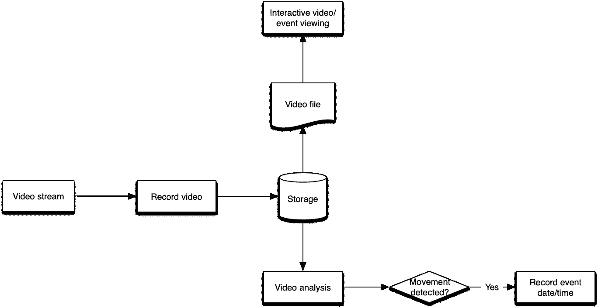
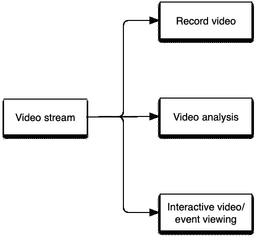

# 云摄像机——复制视频流

> 原文：<https://medium.com/oracledevs/cloud-camera-replicating-a-video-stream-9ec6f9e81c79?source=collection_archive---------6----------------------->


*Photo from* [*https://pixabay.com/photos/roads-split-fork-divided-dirt-320371/*](https://pixabay.com/photos/roads-split-fork-divided-dirt-320371/)

对于那些第一次加入我的人，我写了一篇[文章](/oracledevs/cloud-camera-simulating-a-source-4e710299606a)，分享了[如何模拟一个摄像机镜头](/oracledevs/cloud-camera-simulating-a-source-4e710299606a)。这不是什么革命性的东西，但它是未来工作的基石之一。至少对于某些用例来说，这是另一个需要的关键功能。

# 基本原理或缺乏基本原理

为什么要复制一个视频流呢？对于某些用例，延迟视频馈送是可以接受的。这是非实时环境的理想选择，在非实时环境中，延迟不是真正的问题。例如，如果我把一个摄像头对准一个喂鸟器，我可能会想看看什么种类的鸟正在喂鸟器。我不在乎在喂食器那里看到它们，只是一个“视频日志”，我可以随时查看，看看谁访问了喂食器(包括任何邻居的猫，寻找免费的一餐)。对于这个用例来说，类似下面的内容可能是完全可以接受的:



Non-real-time use-case potential flow

显而易见的是，分析发生在之后*，一个流被保存到存储中，这意味着会有一些滞后(延迟)。观看视频流也是如此。这只有在*保存到存储器后*才有可能。是的，延迟观看。*

从线性的、高层次的角度来看，事情大致是这样的:


Non-real-time use-case high-level flow

所有事情都是连续发生的(一个接一个)。对于上面的非实时用例来说，这是很棒的。别担心。也许我会每周查看一次活动(以及相关的保存视频)，寻找亮点和不足。

在其他情况下，视频事件反馈需要尽可能即时。最小化延迟是实时用例的关键驱动因素。让我们考虑一下安全摄像头的情况。也许我正在监视我的前门，并希望在送货时得到提醒，这样我就可以将包裹从我的前廊拿下来。我不希望一个包裹在外面放上几个小时，而是希望能迅速得到提示。我还需要能够在任何时间点看到摄像头馈送(不管是否检测到活动)。

这是我们想要的:



Real-time use-case high-level flow

注意到并行活动的发生了吗？再见串行进程，你好并行化！我们需要观看服务看到的和录制服务保存的完全一样。任何类型的分析都应该查看视频流中完全相同的帧(时间点)。每个服务应该查看视频流的相同时间点。无需等待流被保存到存储设备后再进行查看，只需查看在该确切时间点保存的同一实时流即可！

# 这听起来很容易

是的，乍一看，这听起来超级简单。向它扔一个负载平衡器！哦，等等…不，那不行。负载平衡器将流量转移到多个进程中的一个进程。我们需要所有进程同时获得相同的数据。嗯…好吧，回到绘图板。

# 连接与否，这是一个问题

值得提醒您的是，UDP 是所选的传输协议，因为它有几个可取的特性。参见本系列的[最后一篇文章](/oracledevs/cloud-camera-simulating-a-source-4e710299606a)，了解为什么使用 UDP 而不是 TCP 的更多细节。

# iptables 来拯救？

原来 iptables 有克隆包的能力。这叫做[球座](https://ipset.netfilter.org/iptables-extensions.man.html#lbDU)。它还明确表示这是为本地目标… TEE 似乎没有改变目的地 IP 地址。这意味着，除非您的目标(目的地)以混杂模式侦听(这通常需要一个定制的应用程序来拦截/处理数据包)，否则它们将被丢弃。这是因为它们将被寻址到一个没有分配给接收机器的网卡的 IP 地址。你可以在互联网上找到很多尝试使用 iptables 解决这类问题的例子(这里有一个例子)。

作为一个潜在的解决方案，我们可以编写一个工具，以混杂模式监听并处理(接收、重定向到实时查看器等。)给我们的小包。如果我们采用这种类型的解决方案，几乎每个接收视频的服务都必须以这种方式编写。

iptables TEE 的另一个挑战是它将发送到一个目的地。看到一些好玩的[这里](https://www.cyberciti.biz/faq/how-to-use-iptables-with-multiple-source-destination-ips-addresses/)和[这里](https://unix.stackexchange.com/questions/553832/where-does-the-packet-cloned-by-iptables-mod-tee-go-after-cloning)(或者上面的链接)。嗯，这是个问题！可以肯定地说，iptables TEE 对于这个包复制用例来说是*而不是*可行的解决方案。

# 什么有用？

首先，功劳归功劳:我没有想到这个解决方案。我只是在重复别人精心制作的东西。点击查看[。](https://unix.stackexchange.com/questions/553334/setting-up-udp-packets-to-two-different-destinations-using-iptables-and-prerouti)

在我的例子中，我想在端口 8100 接收一个 UDP 流，然后将它重新分发到端口 8101 和 8102。下面是在 OCI 实例上执行的命令:

```
$ socat -U - udp4-recv:8100 | tee >(socat -u - udp4-datagram:127.0.0.1:8101) | socat -u - udp4-datagram:127.0.0.1:8102
```

顺便提一下，在 OCI 服务器上运行两个 VLC 实例，一个监听 udp/8101，另一个监听 udp/8102(都在本地主机上)。两人都收到了视频！

# 回到实时用例

让我们回到门廊监控摄像头。假设我们有三种服务:

1.  录像机
2.  视频分析器
3.  视频浏览器

服务#1 将负责将视频流保存(保存)到存储位置。这可能是 OCI 对象存储、数据库、文件系统或其他位置。

服务#2 可以实时查看视频馈送并寻找任何要记录的事件。它可能只是将事件记录到系统日志、数据库、发送电子邮件警报和/或其他内容。

服务#3 可以显示摄像机馈送的当前视图。这不是查看视频档案(已经保存的流)，而是查看当前的提要。

所有三个服务将在任何给定的时刻获得流的精确副本，这有助于减少解决方案的延迟。从另一个角度来看，通过复制流，我们能够提高响应能力。

# TCP 呢？

如果我们的用例要求使用 TCP，这种简单的数据包复制就不起作用了。我们需要更复杂的东西，至少要处理 TCP 连接的管理。

# 亲自尝试一下

我假设你有一个 OCI 账户。如果你没有，你真的应该[注册](https://www.oracle.com/cloud/free/#always-free?source=:ex:tb:::::WWMK220126P00009&SC=:ex:tb:::::WWMK220126P00009&pcode=WWMK220126P00009)一个。如果你想要一步一步的指导，请参见[该指南](/oracledevs/create-an-oracle-always-free-cloud-account-bc6aa82c1397)，否则请继续完成 [OCI 注册](https://www.oracle.com/cloud/free/#always-free?source=:ex:tb:::::WWMK220126P00009&SC=:ex:tb:::::WWMK220126P00009&pcode=WWMK220126P00009)流程。

我是在 [OCI 云相机预建环境](https://github.com/oracle-devrel/terraform-oci-cloud-camera)下构建的。如果您部署这个[解决方案](https://github.com/oracle-devrel/terraform-oci-cloud-camera)，使用通过这个例子创建的计算形状，您就可以在您自己的 OCI 租赁中遵循它！

默认情况下不会安装 socat，所以您需要安装它:

```
$ dnf install -y socat
```

现在您可以尝试一下了:

```
$ socat -U - udp4-recv:8100 | tee >(socat -u - udp4-datagram:127.0.0.1:8101) | socat -u - udp4-datagram:127.0.0.1:8102
```

要退出，请键入 CTRL+C。这没问题，但让我们这样做，使它默认运行，并且更容易打开(和关闭)。

# 自动化这项工作

我引用了这个伟大的 [how-to](https://linuxconfig.org/how-to-write-a-simple-systemd-service) 来创建一个基本的 systemd 服务。其他一些有用的参考包括[这个](https://www.shellhacks.com/systemd-service-file-example/)、[这个](https://linuxconfig.org/how-to-create-systemd-service-unit-in-linux)、[这个](https://www.how2shout.com/linux/how-to-create-a-systemd-service-unit-file-in-linux/)和[这个](https://www.howtogeek.com/67469/the-beginners-guide-to-shell-scripting-the-basics/)(等等)。编辑新文件:

```
$ sudo nano /usr/lib/systemd/system/udp_duplicator.service
```

将以下内容放入其中:

```
[Unit]
Description=UDP packet duplicator
After=network.target[Service]
Type=simple
ExecStart=bash -c "socat -U - udp4-recv:8100 | tee >(socat -u - udp4-datagram:127.0.0.1:8101) | socat -u - udp4-datagra$
Restart=on-failure[Install]
WantedBy=multi-user.target
```

现在让它默认启动:

```
$ sudo systemctl enable udp_duplicator.service
```

如果你愿意，你可以用手点燃它:

```
$ sudo systemctl start udp_duplicator
```

就是这样！要查看它的运行情况，您可以在 OCI 实例上启动 VLC 并打开 udp://@:8101。流到 UDP 端口 8100 上的 OCI 计算实例公共 IP，您应该会看到视频流！大概，在端口 8102 上做同样的事情。

显然，按照这种设置方式，您需要为您想要使用的任何端口修改服务文件。它确实在我的环境中工作，并且产生了看起来可行的解决方案！

# 结论

虽然这并不复杂，但并不像我最初预期的那样简单。因为使用了 UDP，所以并没有想象中那么难。在这一点上，我们有一个解决方案，我们应该能够专注于即将到来的项目的其他方面。直到下一次，保持位流！