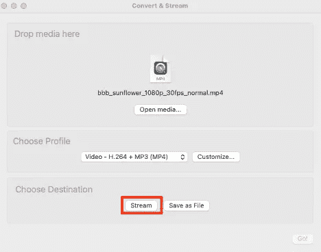
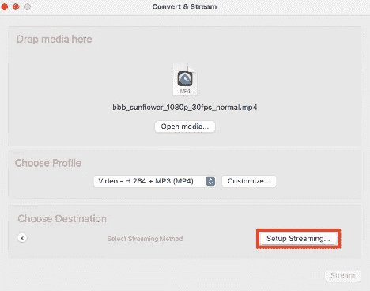
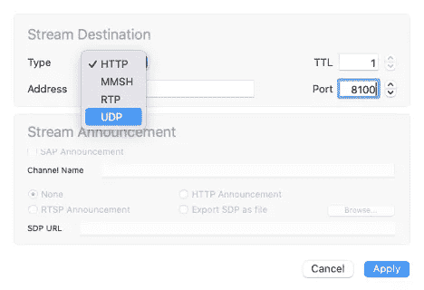
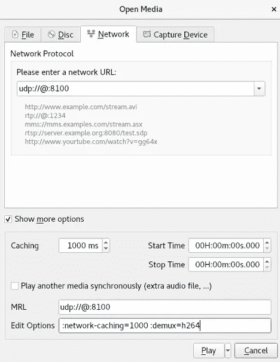

# 云相机-模拟源

> 原文：<https://medium.com/oracledevs/cloud-camera-simulating-a-source-4e710299606a?source=collection_archive---------7----------------------->


这里发生了一点有趣的事情，计划中的几个即将到来的项目都依赖于接收和处理摄像头馈送的“东西”。当我们谈论相机时，我们主要关注的是通常与 Raspberry Pis 和其他嵌入式平台一起使用的真正便宜的低功耗相机。相机本身不一定是我们今天在许多智能手机上熟悉的高清数百万像素的奇迹，因为低成本和低功耗是选择相机的一些主要因素。

不管用什么样的摄像机，我们都需要获取视频，并用它做一些事情。我们将把它发送到一个 OCI 环境中，在那里我们可以分析它、保存它、查看它，等等。跟着我们，你也能做到！；)

# 硬件问题

如果你在过去的一年半时间里一直生活在岩石下，那么全球供应链是相当混乱的。这意味着获得一些基本的电子元件，如 [Raspberry Pi 4 Model B](https://www.raspberrypi.com/products/raspberry-pi-4-model-b/) (至少一个 8GB RAM)是一项艰巨的任务(除非你想从利用这种情况的人那里支付过高的价格)。大多数供应商和零售商只是缺货。最近有没有试过买一台最新的游戏机？是啊……那你全都知道了！这让我开始关注非 Pi 平台(比如 ESP32，我的同事[克里斯·本森](https://chrisbensen.medium.com/)推荐我看一看)。

# 软件是答案

在此期间，我不想因为没有硬件而耽误事情。我们中有几个人的项目从根本上依赖于接收(和处理)视频源的核心能力。

当然，有硬件当然很好，但是我决定需要一个软件解决方案，这样云(OCI)解决方案就可以被精心制作。这篇文章有点意识流，讲述了我所做的一些决定，以及我如何着手模拟一个源(使用软件)。

# 决定决定决定

必须做出一些根本性的决定，主要是:

网络协议

编码类型

让我们更详细地看一下每一项。

# 网络协议

TCP 是用于许多应用的主要传输层(OSI 模型中的第 4 层)协议。TCP 是一个面向连接的协议，并且内置了一些[拥塞管理功能](https://en.wikipedia.org/wiki/TCP_congestion_control)。对于许多场景来说，这些都是有益的，有助于应用程序以高效的方式运行。对于其他用例，这是有害的。视频流就是这种情况。

UDP 是无连接的，不会像 TCP 那样“喋喋不休”。UDP 更像是一种“打了就跑”的协议，允许应用程序尽可能快地发送数据报，而无需进一步考虑。拥堵？UDP 不关心…它甚至不知道这件事！损失？同样，UDP 对此一无所知。这有好有坏。纵观整个互联网，拥塞可能是一个因素。延迟是另一个通配符。是啊，这应该很有趣！

做出了推进联合民主党的决定。如果/当拥塞/丢失发生时，我们必须处理它，流中可能会有间隙。这比使用 TCP 更好，因为这几乎肯定会对数据流产生负面影响(拥塞管理和回退本身很可能是一个反复出现的主题，这是不可取的)。

# 编码

有几种不同类型的编码可供使用。典型的权衡包括带宽与质量，以及对编码/解码/代码转换操作的 CPU 的影响。 [H.264](https://en.wikipedia.org/wiki/Advanced_Video_Coding) 是一个非常通用的编码标准。幸运的是，一些常见的平台(如 [Raspberry Pi 相机](https://www.raspberrypi.com/documentation/accessories/camera.html#libcamera-vid)工具)支持 H.264，以及其他一些编解码器(如 motion JPEG、YUV420 等。).由于 H.264 的广泛采用，以及较低的带宽要求(由于它提供的良好压缩), H.264 被选为这个项目的首选编解码器！

# 回到软件

有不同的工具(如 [ffmpeg](https://ffmpeg.org/ffmpeg.html) )可以让你流式传输视频。 [VLC](https://www.videolan.org/vlc/) 提供了一个 GUI，也提供了很好的跨平台支持。为了让源和接收者都非常容易，我选择使用 VLC。好的方面是，不管 H.264 流是来自 VLC、Pi 相机还是任何其他兼容的源，因为我们使用的是 H.264，所以用任何其他设备/软件替换该源应该很容易。

# 准备好云环境

使用位于[https://github.com/oracle-devrel/terraform-oci-cloud-camera](https://github.com/oracle-devrel/terraform-oci-cloud-camera)的 Terraform 项目，将环境部署到 OCI。遵循项目自述文件中的说明(使用 OCI 资源管理器、Terraform CLI、OCI 云壳等。)在您的 OCI 租赁中部署 OCI 环境。

# *获得一个 OCI 永远免费账户*

如果你今天还没有 OCI 帐户，[在这里](https://www.oracle.com/cloud/free/#always-free?source=:ex:tb:::::WWMK220126P00008&SC=:ex:tb:::::WWMK220126P00008&pcode=WWMK220126P00008)注册一个[的](https://www.oracle.com/cloud/free/#always-free?source=:ex:tb:::::WWMK220126P00008&SC=:ex:tb:::::WWMK220126P00008&pcode=WWMK220126P00008)。使用一个永远免费的帐户，你不用花一分钱，但可以跟着一起加入乐趣！如果你想快速浏览一下如何做到这一点，请查看[克里斯的教程](/oracledevs/create-an-oracle-always-free-cloud-account-bc6aa82c1397)。

# 测试它

虽然任何 mp4 文件都可以使用，但我用[大巴克兔子](https://peach.blender.org/download/)进行了测试(使用你喜欢的)。

# 设置信号源

我在源码上启动了 VLC，然后进入*文件* > *转换/流*。在对话框中，我将大兔兔 mp4 文件拖放到*将媒体放在这里*区域。在*选择配置文件*下，选择*视频— H.264 + MP3 (MP4)* 。最后，我点击了*选择目的地*区域中的*流*按钮。



然后点击*设置流…* 按钮:



选择 *UDP* 作为类型，输入 *8100* 作为端口(至少这是我选择使用的端口)，并输入您的 OCI 实例的公共 IP 地址(这显示为 Terraform apply 操作的输出):



最后点击*应用*(关闭对话框)，然后点击*流*按钮开始流。

# 在 OCI 观看视频

连接到 OCI 计算实例的 GUI。您需要通过 SSH 会话将 VNC 隧道连接到 OCI 计算实例。这对你来说可能不一样，但我基本上是这么做的:

```
$ ssh -i <path_to_ssh_private_key> -L 5901:localhost:5901 opc@<oci_instance_public_ip>
```

这建立了一个 SSH 会话，tcp/5901 通过该会话建立隧道。这(tcp/5901)恰好是我们的 VNC 服务器正在监听的，允许我们使用 VNC 客户端并连接到 *vnc://localhost:5901* 。您需要输入您的 VNC 密码，然后您应该连接并准备继续。

不考虑 VNC 连接，让我们在 OCI 实例上启动 VLC(在 VNC 会话中)，然后转到*媒体* > *开放网络流……*。在对话框中，打开 *udp://@:8100* 。点击*显示更多选项*复选框，将 *:demux=h264* 添加到*编辑选项*文本框中。



点击*播放*按钮，观看视频！

# 结论

不要对滞后(延迟)感到震惊和敬畏。这相当糟糕(至少在我的测试中)。部分原因是地理因素(物理距离和由此产生的延迟)以及我试图通过 VNC 会议观看视频的事实(这可能会引入相当大的延迟)。不太理想，但肯定表明我们的流正在到达 OCI 实例！

现在，如果我能得到一些硬件！:)不管怎样，在这一点上，我们已经准备好从一个真实的摄像机接收一个流…这是另一个故事，另一个时间。