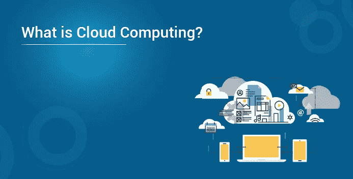
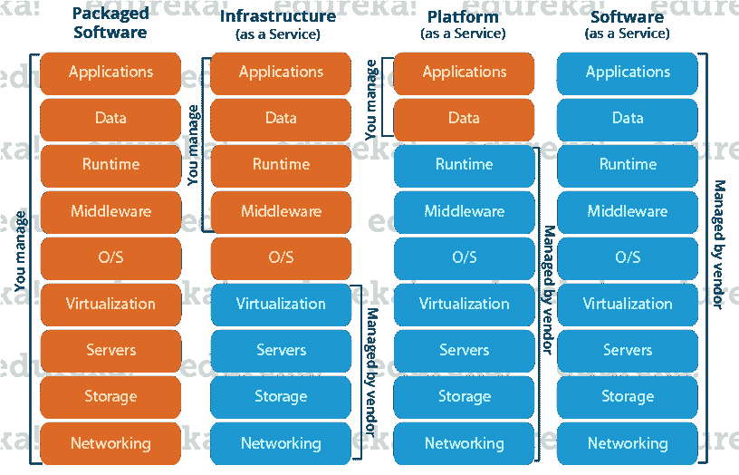
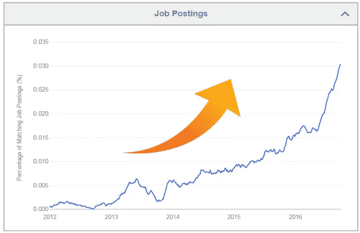

# 什么是云计算？

> 原文：<https://medium.com/edureka/cloud-computing-aa3f05f84571?source=collection_archive---------0----------------------->

云计算通常被称为“云”，简单来说就是通过互联网而不是你自己的硬盘来存储或访问你的数据和程序。

现在的一切都搬到了云上，在云端运行，从云端访问，或者可能存储在云端。因此，所有经济领域对认证云架构师的需求都在增长。

# 这片云到底在哪里？

因此，要回答这个什么是云计算博客中的问题，它就在你的互联网连接的另一端的某个地方，你可以在那里存储你的文件，并且可以从世界上的任何地方访问。这对您来说可能是件大事，主要有三个原因:

*   您不必为此维护或管理任何基础架构。
*   它的容量永远不会用完，因为它实际上是无限的。
*   你可以从任何地方访问你的基于云的应用，你只需要一个可以连接到互联网的设备。

**这一切是如何开始的？**

虽然互联网诞生于 20 世纪 60 年代，但直到 20 世纪 90 年代，互联网服务于商业的潜力才被发现，这导致了该领域的更多创新。随着互联网的传输速度和连接性变得更好，它让位于一种新型的公司，称为应用服务提供商(ASP)。

ASP 采用现有的业务应用程序，并使用他们自己的机器为业务运行它们。客户将每月支付费用，通过 ASP 的系统在互联网上开展业务。

但直到 20 世纪 90 年代末，我们今天所知的云计算才出现，并导致了这个关于什么是云计算的博客。

由于它只是增长，最近*商业内幕*报道，

云计算服务在过去两个季度中同比增长了近 80%，2015 年的收入有望达到 78 亿美元，是 2012 年 18 亿美元销售额的四倍。

很有趣，不是吗？

现在你有了一个公平的想法，云是什么，只要想想你在网上的所有日常活动，你就会意识到你在网上做的很多工作都是基于云的。就像你的社交媒体互动都在云上，你在网上存储的任何东西都是云，你在线支付电费，在线购物，一切！

现在**它是如何工作的，**让我们通过*一个例子*来理解它:

因此，有一个基于云的应用程序叫做客户关系管理器(CRM)。该软件在所有销售组织中广泛使用，以提高灵活性、生产率和降低成本。

它的使用方式是这样的；现场销售代表需要访问连接到互联网的移动设备，然后他可以检索客户信息，而不管他在哪里。此外，他可以随时更新信息，因此不需要回到办公室来更新交易信息。

销售经理还可以监控他们联网设备上的一切，并知道哪些交易可以成交，哪些不可以成交。这一切都发生在移动中！

最精彩的部分？你不必购买任何机器或管理任何种类的软件，这一切都将由运行该应用程序的云公司来处理。酷吧？

让我们继续深入了解“*什么是云计算*”，并了解其架构:

现在，当您问什么是云计算时，答案是广义的。因此，它提供的服务分为三种不同的模式，让我们逐一讨论:

*   SaaS
*   PaaS
*   IaaS

# SaaS(软件即服务)

在这项服务中，云提供商将其拥有的应用程序或软件租赁给其客户。客户可以在任何连接到互联网的设备上使用网络浏览器、应用程序等工具访问该软件。

**例如，**Salesforce.com 向其客户提供基于云基础设施的 CRM(客户关系管理器)并收取费用，但该软件仅由 salesforce 公司所有。

# 平台即服务

在此服务中，云提供商让客户能够使用云提供商提供的编程语言、工具等部署客户创建的应用程序。客户无法控制底层体系结构，包括操作系统、存储、服务器等。

**例如，**这项服务只有在你是开发者的情况下才有意义，因为这项服务为你提供了一个开发应用的平台，比如谷歌应用引擎。

# IaaS(基础设施即服务)

在这项服务中，云提供商向客户提供虚拟机和其他资源作为服务，他们将用户从物理机、位置、数据分区等中抽象出来。如果用户想要一台 Linux 机器，他得到了一台 Linux 机器，他就不用担心安装操作系统的物理机器或系统的网络，很简单。

**比如** AWS(亚马逊 Web 服务)就是 IaaS，像 ***AWS EC2*** 。

下图总结了基础架构即服务、平台即服务和 SaaS 的区别

我们现在已经了解了服务模型，一旦您提供了服务，接下来就是部署，现在让我们来讨论部署模型:

*   公共云
*   私有云
*   混合云

# 公共云

在公共云部署模式中，部署的服务对公众开放，一般公共云服务是免费的。从技术上来说，公共云和私有云可能没有什么区别，但安全参数却大不相同，因为公共云是任何人都可以访问的，所以存在更多的风险因素。

# 私有云

私有云只为单个组织运营，它可以由同一组织或第三方组织来完成。但通常，当您使用自己的云时，成本会很高，因为硬件会定期更新，安全性也必须得到检查，因为新的威胁每天都会出现。

# 混合云

混合云由私有云和公共云的功能组成。怎么会？

**让我们通过一个例子来理解:**假设有一家研究公司，他们有一些已发布的数据，还有一些仍在研究阶段的数据。现在任何仍在研究中的东西都应该保密，对吗？虽然你的云提供商可能有最先进的安全功能，但它仍然对公众开放，因此容易受到网络攻击。

因此，为了解决这一风险，您可以在您公司的服务器上保持正在处理的数据，这些服务器的访问由公司控制，您在公共平台上发布的数据，这种类型的安排将是混合云。

我想现在你一定对什么是云计算有了一个公平的想法。让我们继续了解云的目标受众，也就是您，现在您可以将云视为个人或企业，让我们从两个角度来看。

# 消费者 v/s 业务

让我们在这里谈谈消费者，我们这些在中小型办公室工作的人，经常使用互联网，对我们来说，云可能是 Google Drive 或 DropBox。

但是，对于组织和企业来说，这是一个完全不同的场景，因为云是 SaaS，他们可能希望在云上使用软件，或者可能是 PaaS，他们可能希望在云环境提供的环境上构建应用程序，或者他们可能希望利用云服务作为基础架构，他们将出租整个虚拟机并以自己的方式进行配置，这将是 IaaS。

现在你可能会疑惑，公司真的用云计算吗？当然，根据流行博客网站 PCMag 的数据，云计算在 2016 年创造了 1270 亿美元，到 2020 年可能达到 5000 亿美元。

令人印象深刻，不是吗？现在，为什么人们或企业要转向云呢？应该有些好处吧？

让我们来看看云计算有哪些优势:

*   **快速实施**
    如果你在那里开发或实施一个应用程序，有时需要几个月甚至几年的时间来启动和运行应用程序，有了云，你可以缩短时间，让事情变得更快。
*   **即时可扩展性**
    借助云资源，您可以根据需要随时扩大或缩小资源和用户的数量，云容量永远不会耗尽！
*   **随处访问**
    构建在云上的应用程序设计为可以从任何地方访问，您只需要在移动设备上连接互联网。
*   **没有前期成本** 以前部署应用程序时，您必须购买必要的硬件、构建架构、购买软件许可证等，但有了云，所有这些成本都大大降低了，在某些情况下甚至没有了。
*   **免维护**
    传统上，您必须用最新版本修补软件，升级硬件，并在硬件层面排除系统故障，但有了云，您不必担心硬件的维护，一切都将由您的云提供商管理。
*   **更好的安全性** 一项独立研究发现，一家中等规模的公司每年会丢失大约 260 台笔记本电脑，这不是公司的金钱损失，但笔记本电脑上的数据非常有价值，有了云，您不必担心这一点，您的所有数据都存储在一个集中的安全位置。

**现在，您如何开始？**

有大量的云提供商可供选择。让我们来看看最突出的例子。

*   Azure: 这是微软在 2010 年建立的云计算平台。
*   **AWS:** Amazon Web Services 是亚马逊在 2006 年推出的云计算平台。

你会选择哪一个？

当你看到这两个名字的时候，你会想到这个问题。

好吧，让我们试着为你解答这个问题。

AWS 和微软 Azure 是云计算行业的两大巨头，但 AWS 仍然比 Azure 更大。大多少？

AWS 的服务器容量是其所有竞争对手服务器容量总和的 6 倍。

此外，与 2010 年推出的微软 Azure 相比，AWS 早在 2006 年就开始了其云之旅，因此在服务方面，AWS 的服务模式更加成熟。亚马逊拥有世界上最大的数据中心，这些数据中心战略性地分布在全球各地。

当我们看到 Azure 时，它的容量远不及亚马逊，但微软一直在努力实现亚马逊提供的那种服务和灵活性。例如，2014 年，微软推出了一个名为 *Zone Redundant Storage* 的冗余存储选项，与亚马逊提供的服务不相上下。

再来说说一个更重要的参数，比如**定价**。

亚马逊按小时计费，这意味着你将使用你的实例的小时数，这样做的缺点是，如果你在 2.5 小时后停止你的实例，你将被收取整个 3 小时的费用。

对于这一点，Azure 有一个不同的方案，可能会吸引客户，他们按分钟向你收费，即你使用实例的分钟数，但当你比较 AWS 和 Azure 的小时价格时，AWS 更便宜。

*例如*一个 AWS m3.large 实例一小时 0.133 美元，Azure(一个中型 VM)中的等效实例一小时 0.45 美元。

总结到这里，亚马逊成为赢家！

所以现在这样来看，如果你想在云计算行业进行*职业转变*，哪种服务更有可能被需求，AWS 对吗？

让我们看看分析学是怎么说的，

图 1 .此图显示了来自 Indeed.com 的 AWS 解决方案架构师的招聘信息

想成为 AWS 解决方案架构师？

要成为解决方案架构师，您需要广泛的知识和对 AWS 服务的亲身体验。

这是关于你的职业生涯，现在让我们回到什么是云计算，我们讨论了几乎所有关于云计算的事情，但让我们诚实地理解，这个世界上没有什么是好的。关于云计算已经说了很多，有好有坏。我们几乎涵盖了所有好的部分。

让我们来听听关于云计算的一些**有趣的争论**。

有些人说将你的业务完全转移到云端可能不是一个好主意。嗯，这有点道理，因为如果您的云提供商经历了停机，在这种情况下，您的业务也会遭受损失。

这实际上发生在我们自己的 AWS 上，2012 年，当时由于北弗吉尼亚的一场电力风暴导致停电，亚马逊服务器因此经历了宕机，因为 Instagram、Pinterest 和 Instagram 等大公司也经历了宕机，因为它们在 AWS 上托管服务。

当我们谈论云计算时，另一个经常出现的争论是，**谁拥有云上的数据**？

是你的还是托管你数据的公司？有些人可能会说，你放在云上的数据是你的，但使用他们的工具生成的数据是谁的呢？

因此，当您迁移到云时，这些事情是有风险的，但是当我们将这些缺点与优点进行比较时，它们会更重要，所以这就是为什么会有迁移到云的重大转变。

是对是错，只有时间会证明。

我希望你喜欢这个什么是云计算教程。如果你想查看更多关于人工智能、DevOps、道德黑客等市场最热门技术的文章，你可以参考 Edureka 的官方网站。

请留意本系列中解释云的各个方面的其他文章。

> *1。* [*AWS 教程*](/edureka/amazon-aws-tutorial-4af6fefa9941)
> 
> *2。* [*AWS EC2*](/edureka/aws-ec2-tutorial-16583cc7798e)
> 
> *3。*[*AWS Lambda*](/edureka/aws-lambda-tutorial-cadd47fbd39b)
> 
> *4。* [*AWS 弹性豆茎*](/edureka/aws-elastic-beanstalk-647ae1d35e2)
> 
> *5。* [*AWS S3*](/edureka/s3-aws-amazon-simple-storage-service-aa71c664b465)
> 
> *6。* [*AWS 控制台*](/edureka/aws-console-fd768626c7d4)
> 
> *7。* [*AWS RDS*](/edureka/rds-aws-tutorial-for-aws-solution-architects-eec7217774dd)
> 
> *8。* [*AWS 迁移*](/edureka/aws-migration-e701057f48fe)
> 
> *9。*[*AWS Fargate*](/edureka/aws-fargate-85a0e256cb03)
> 
> *10。* [*亚马逊 Lex*](/edureka/how-to-develop-a-chat-bot-using-amazon-lex-a570beac969e)
> 
> *11。* [*亚马逊光帆*](/edureka/amazon-lightsail-tutorial-c2ccc800c4b7)
> 
> *12。* [*AWS 定价*](/edureka/aws-pricing-91e1137280a9)
> 
> *13。* [*亚马逊雅典娜*](/edureka/amazon-athena-tutorial-c7583053495f)
> 
> *14。* [*AWS CLI*](/edureka/aws-cli-9614bf69292d)
> 
> *15。* [*亚马逊 VPC 教程*](/edureka/amazon-vpc-tutorial-45b7467bcf1d)
> 
> *15。*[*AWS vs Azure*](/edureka/aws-vs-azure-1a882339f127)
> 
> *17。* [*内部部署 vs 云计算*](/edureka/on-premise-vs-cloud-computing-f9aee3b05f50)
> 
> 18。 [*亚马逊迪纳摩 DB 教程*](/edureka/amazon-dynamodb-tutorial-74d032bde759)
> 
> 19。 [*如何从快照恢复 EC2？*](/edureka/restore-ec2-from-snapshot-ddf36f396a6e)
> 
> *二十。* [*AWS 代码提交*](/edureka/aws-codecommit-31ef5a801fcf)
> 
> *21。* [*使用亚马逊 ECS*](/edureka/docker-container-in-production-amazon-ecs-19857ce96f25) 在生产中运行 Docker

*原载于 2018 年 11 月 30 日*[*https://www.edureka.co*](https://www.edureka.co/blog/what-is-cloud-computing/)*。*