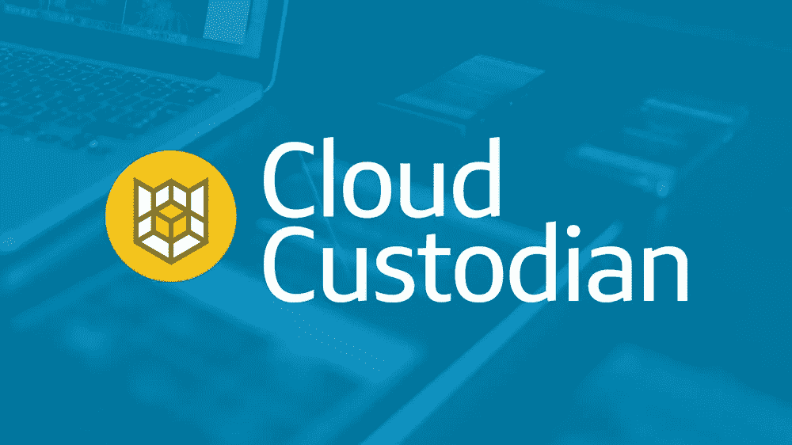

# 设计下一代云治理

> 原文：<https://medium.com/capital-one-tech/cloud-custodian-9d90b3160a72?source=collection_archive---------2----------------------->

## 云托管人

## 对云治理的需求

亚马逊网络服务的采用正迅速成为大公司的主流。越来越多的企业正在寻求通过消除传统数据中心的限制来降低成本、加快上市速度并实现创新。

随着组织增加其公共云的规模，管理其帐户的成本、合规性和运行状况的复杂性也在增加。虽然可以利用现有的公司治理模型来提供监督，但它们通常缺乏集成的云工程专业知识来实现企业使用模式的预期变化。

 [## 里士满项目

### 我关于人才转型、云计算和帮助企业成功的故事

cloudrumblings.io](https://cloudrumblings.io/the-richmond-project-f4ce7949d9e8) 

## 规模的挑战

AWS 上的大多数企业实现将由部署到多个 VPC 的应用程序集合组成，包含在一个帐户结构中，并与一个地理区域相关联。企业管理的大量 AWS 帐户通常是由其组织结构、计费考虑因素、访问管理策略和架构原则驱动的。

理想情况下，利用先进的 CI/CD 技术实现交付渠道的自动化，将推动您每个客户的应用程序群实现一致和合规的部署。实际上，对于许多处于云采用早期阶段的企业来说，交付渠道的优化将与从传统数据中心的“转移和提升”迁移同时进行。

因此，迁移到云的组织管理着大量成熟度和合规性水平各不相同的 AWS 客户。独特的雪花模式的数量将因责任转移到采用 DevOps 的本地 AppDev 团队而增加，每个团队都由咒语授权— *“你构建它，你运行它。”*

## 设计下一代云治理

为了应对这一挑战，IT 企业组织将受益于在其治理结构中嵌入一个专门的工程角色—云托管工程师。

> 云托管工程师负责整合云管理的许多临时工程职责，重点关注管理企业客户群的策略和控制的自动化

云托管工程师是一个基于其开源名称的高级工程角色。[云托管开源](https://developer.capitalone.com/opensource-projects/cloud-custodian/)工具为工程师提供了一个轻量级的灵活框架，用于大规模部署云管理策略和控制。

组织可以使用云托管来管理他们的 AWS 环境，以确保安全和运营策略的卫生，对不符合要求的资源进行清理，以及实施成本管理控制。

云治理工程转化为以下能力:编纂策略、放大对已定义控制的合规性的反馈，以及自动执行可应用于整个车队的纠正措施。

## 云托管工程师

基础设施即代码(IaC)为组织提供了有效管理和自动监督虚拟数据中心的能力。云托管工程师可以利用 IaC 的力量来实现企业合规性，以符合期望的最终状态模式。

*   **操作控制:**组织需要建立一个健壮的框架来管理和跟踪部署的 AWS 服务的操作配置。云托管工程师将会遇到的常见问题包括陈旧的 Amazon 机器映像(AMIs)、孤立的 EBS 卷以及部署的服务没有启用弹性选项。
*   **安全策略:**虽然大多数 AppDev 团队会将安全策略集成到他们的云形成模板(CFT)中，但必须建立机制来早期检测和补救不合规的工作负载。云托管工程师应该警惕加密服务和许可访问控制列表的缺失。
*   **监控限制:**即使有云的弹性，资源也是有限的。一个账户内的每项服务都有特定的限制，需要了解并密切监控。除了跟踪 AWS 服务限制，云托管工程师还应该仔细审查 CIDR 块的分配和 IP 地址的利用情况。
*   **成本优化:**AWS Trusted Advisor 等资源管理工具使云托管工程师能够识别未充分利用的资源，并洞察购买预留容量的机会。将这些功能集成到由工程思维驱动的云治理框架中可以产生更高的回报，因为使用模式可以更容易地优化。
*   **宣传和教育:**云托管工程师非常适合直接与工程社区接触，以征求反馈并提供指导。虽然管理开发人员的策略和控制可能是出于好意，但是与用户的定期检查提供了检查当前模式、共享最佳实践和适应新需求的机会。

随着企业 IT 转向利用云，采用、迁移和转型的复杂性要求强有力的治理。

对您的成功至关重要的是确保高级工程专业知识与[云治理模型或云卓越中心(CCoE)](/aws-enterprise-collection/your-enterprise-s-flywheel-to-the-cloud-67127fe4a369) 紧密集成。这样做将通过策略和控制的自动化，加快您的车队的一致性和合规性。

 [## 您企业的云计算飞轮

### “从理论上来说，理论和实践之间没有区别。实际上是有的。”约吉·贝拉

medium.com](/aws-enterprise-collection/your-enterprise-s-flywheel-to-the-cloud-67127fe4a369) 

## 企业服务的联合模型

将这个角色引入企业时，组织的规模、成熟度和文化是需要考虑的关键因素。中央团队应该为整个企业规定自动化模式吗？不。当企业最佳实践存在时，本地团队应该重复错误并实现低效的雪花模式吗？不会。这是一种平衡，随着企业的成熟和转型，它们需要调整自己的方法。

> 理想情况下，联合交付团队拥有适当数量的本地权限和控制，来设计满足其特定需求的解决方案——但不会以重复工作为代价。

为了鼓励正确的行为，企业服务应该通过内部外包向本地交付团队公开。这种企业服务的方法为联合团队提供了一种机制来设计解决本地挑战的解决方案，同时有助于更大系统的成功。

随着企业服务基于联合交付团队的贡献得到改进和扩展，[云卓越中心(CCoE)的角色可以从创新转向产品管理](https://cloudrumblings.io/werner-against-the-machine-7d208b81e5eb)。CCoE 应确保不断发展的产品符合总体愿景、更广泛的组织考虑因素和外部法规。

 [## 设计您的云卓越中心，以实现持续发展——过渡至关重要

### 借助由致力于变革的代理人支持的精心设计的云计划，以超音速速度加速转型

cloudrumblings.io](https://cloudrumblings.io/werner-against-the-machine-7d208b81e5eb) 

有了像云托管这样的工具，本地“控制”是通过联合配置文件实现的，这些文件决定了企业服务在特定帐户中的执行程度。本地帐户利用中央帐户提供的企业功能，但使用其配置文件作为杠杆来微调本地操作。这种方法为联合团队提供了应用宽松政策或严厉措施的自由裁量权——这取决于他们的特定需求和成熟度。

基于阿德里安·考克克罗夫特的早期影响，我倾向于“把你的猴子变成 11 岁”。使用自动化从一开始就实施正确的行为，而不是试图在云采用的后期阶段修改行为-心理学比技术更难。

# 关于作者

Drew Firment 是云工程总监，热衷于推动云计算的企业采用、迁移和文化转型。在推特上关注 [@drewfirment](https://twitter.com/drewfirment) 。

这篇文章最初出现在[第一资本交易所](https://developer.capitalone.com/blog-post/cloud-custodian-engineering-the-next-generation-of-cloud-governance/)

*欲了解更多关于 Capital One 的 API、开源、社区活动和开发人员文化的信息，请访问我们的一站式开发人员门户网站 DevExchange。*[*https://developer.capitalone.com/*](https://developer.capitalone.com/)