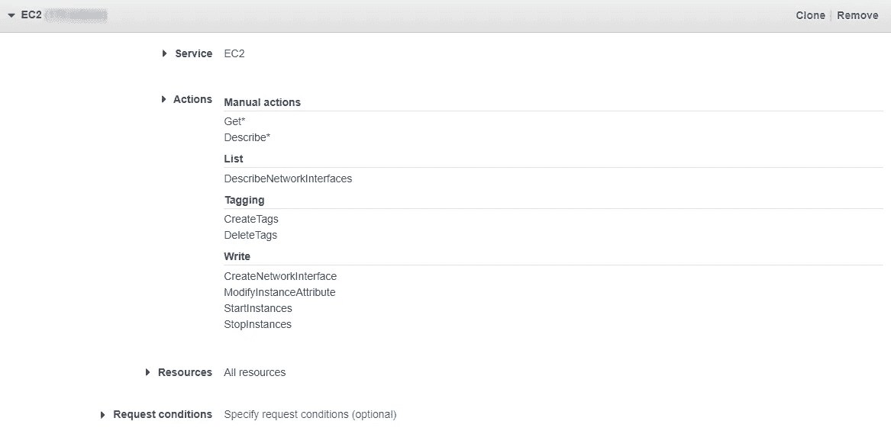
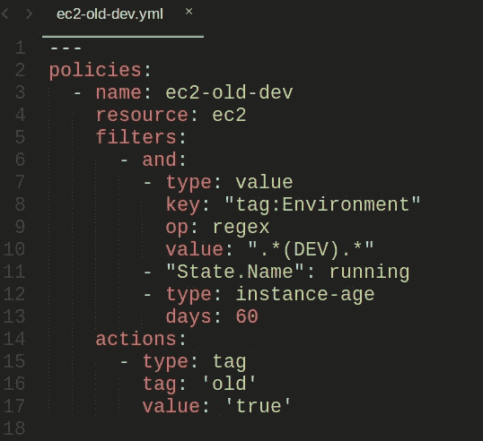
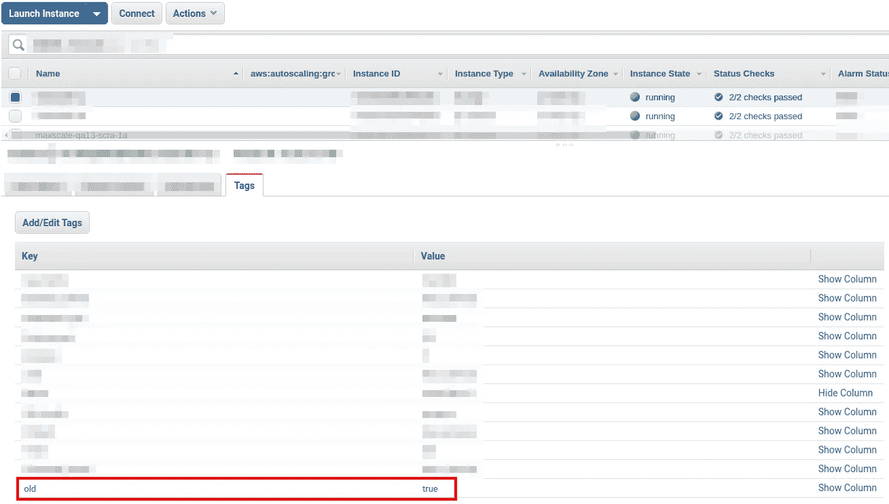

# 云管理员:探索 AWS 云中实例的简单方法

> 原文：<https://medium.com/globant/cloud-custodian-easy-way-to-explore-instances-in-aws-cloud-2544e075303d?source=collection_archive---------0----------------------->


根据您公司的指导原则，较旧的机器可能代表一个漏洞。公司可能更喜欢使用旧的、经过更多测试的代码版本，但是通常认为每台机器都应该有最新的操作系统和软件版本。但是，要更新机器，您需要首先识别它们！如果您使用 AWS 控制台 GUI，并为每个实例花费 20 秒，那么您将花费大约 3 分钟来查找 10 个实例，而 1000 个实例将花费 5 个多小时！所以你需要一个更简单快捷的方法。

云托管是一种工具，可以帮助您在几秒钟内探索并更改云环境。在本文中，我们将通过使用这个工具来重点查找过时的、较旧的机器，这样我们就可以在以后删除、更新或替换它们。

# 入门指南

[云托管](https://cloudcustodian.io/docs/index.html)是一个 Python 工具，它可以统一数十个脚本，组织使用这些脚本来管理支持 AWS、Azure 和 GCP 环境的云帐户。对于这个例子，我们将使用 AWS。对于 Python，官方文档推荐 3.6 版或更高版本。

关于安装过程，请参考此[链接](https://cloudcustodian.io/docs/quickstart/index.html#install-cloud-custodian)，并根据您的操作系统遵循步骤。对于 Linux 系统，我们将首先根据标准用 Python 创建一个虚拟环境，然后安装 c7n 包。

```
python3 –m venv custodiansource custodian/bin/activatepip install c7n
```

您需要设置写入和读取 IAM 权限，以允许云保管者访问。请看这个 [AWS IAM 教程](https://docs.aws.amazon.com/IAM/latest/UserGuide/tutorial_cross-account-with-roles.html)。对于本例，IAM 角色需要对 EC2 资源的读写权限。



IAM Role

## 该政策

要开始使用云托管，我们需要创建一个包含策略的 YAML 文件，该策略包括资源、过滤器和操作。您可以组合过滤器和操作来满足您的需求。

*   资源:这是过滤和应用动作的资源类型(例如 EC2)。
*   过滤器:我们可以使用基于任何标准的过滤器来指定目标资源，例如名称、日期或标签。
*   动作:它定义了云托管者将对过滤的资源做什么。

有关政策的更多信息，请查看此[链接](https://cloudcustodian.io/docs/aws/gettingstarted.html)。在这种情况下，我们需要标记旧的实例。由于我们正在寻找超过 60 天的运行实例，我们将策略文件命名为“ec2-old-dev.yml ”,并将其保存到名为“policies”的文件夹中。



Policy example

“ec2-old-dev.yml”文件将根据一个名为“Environment”的标签过滤所有正在运行的 ec2 资源，该标签包含值“dev”并且超过 60 天。在那些 EC2 资源被过滤后，该策略将创建一个名为“old”的新标签，其值为“true”。

使用以下命令，我们可以确认策略是否准确和一致。

```
custodian validate policies/ec2-old-dev.yaml
custodian.commands:INFO configuration valid:policies/ec2-old-dev.yml
```

现在我们有了策略文件，让我们看看如何使用它。

## **托管运行**

当我们使用 run 命令时，Cloud Custodian 会将资源、过滤器和操作作为输入，将其转换为 API 调用。

要运行该策略，我们需要指定一些参数。

*   `-s`:保存结果的路径。
*   策略文件:要执行的策略。
*   区域:执行的区域。

示例:

```
custodian run \
-s output policies/ec2-old-dev.yml \
--cache-period 0 \
--region=us-west-1 \
--profile=your-profile
```

这个命令将创建一个名为“output”的文件夹，另一个名为“ec2-old-dev”的文件夹，以及一个名为“resources.json”的文件。

*   `--region=us-west-1`:这是政策将适用的地区
*   `--profile=your-profile`:包含 AWS 环境访问权限的概要文件。
*   `--cache-period`:我们可以使用这个选项来最小化 API 调用。默认选项将在本地存储数据 15 分钟。

策略被应用，那些符合过滤器的正在运行的实例有一个名为“old”的新标记，其值为我们在策略中指定的“true”。

我们可以在 AWS 控制台中检查所有这些 EC2 资源上的新标记。



EC2 instance tagged

## **托管报告**

或者，您可以基于前面的命令创建一个报告，并获得您需要的所有信息。命令报告需要一些参数。

*   `-s`:这与“运行”命令中的参数相同。report 命令指定“resources.json”文件的位置。
*   策略文件:来自“运行”命令的相同策略。
*   区域:运行上一个命令的区域。
*   `--no-default-fields`:从报告中删除默认字段。
*   `--field`:要包含在报表中的字段。例:`--field ID=ImageId`

示例:

```
custodian report -s /output policies/ec2-old-dev.yml \
--region=us-west-1 \
--profile=your-profile \
--no-default-fields \
--field ID=ImageId
```

您将从终端上的前一个命令中得到一个结果。只有经过筛选的资源和指定的字段，在本例中只有 ImageId。

该命令的结果将是

```
“ID”
“i-AAABBB”
“i-CCCDDD”
“i-EEEFFF”
```

选项“`--field ID=ImageId`”将创建一个名为“ID”的列，并将只提供存储在“ImageId”上的信息。此外，名为“`--no-default-fields`”的选项将从报告中移除默认值，并从“字段”参数中仅获取必需的字段。

我们可以通过在命令末尾添加“`> results.csv`”将输出保存为 CSV 文件。

如果您想保存历史或制作音频文件，保管人报告非常有用，因为您可以通过电子邮件发送文件或在任何通信渠道上共享文件

现在我们有了一个根据规范过滤的实例列表，我们可以决定是更新它还是替换它。

例如，我们可以决定停止标记为“old”且值为“true”的所有实例。为了实现这个目标，我们有几个选项，对于这个例子，我们将使用 AWS CLI 和这个脚本

```
aws ec2 stop-instances --instance-ids $(aws ec2 describe-instances --query ‘Reservations[].Instances[].InstanceId’ --filters “Name=tag:old,Values=true” --output text) --region=us-west-1 --profile=your-profile
```

您还可以创建一个 Jenkins 作业，该作业将基于标记停止所有实例，请查看此[链接](https://www.thegeekdiary.com/how-to-stop-and-start-ec2-instance-using-jenkins/)了解更多信息。

# 摘要

云托管是一个灵活的工具，可以帮助您根据需要探索和修改 AWS 环境。

在本文中，您可以验证如何以一种简单快捷的方式探索基础设施并做出改变。

有关该工具的更多信息，请访问[官方文档](https://cloudcustodian.io/)。