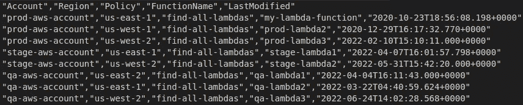

# 云管理员—我希望一开始就知道的事情

> 原文：<https://medium.com/globant/cloud-custodian-things-i-wish-i-knew-at-the-beginning-2743cf948066?source=collection_archive---------0----------------------->

**简介**

云托管是一个开源工具，最初是一家美国金融公司的项目，后来成为由社区维护的 CNCF 项目。您可以将云托管定义为云治理和合规性的平台，在某种意义上，它允许您使用相似的语法和策略与三大云服务提供商进行交互。

你可以找到相当多的文档和文章解释如何开始使用云托管，我特别推荐一篇由 [Jean-Brice GACHOT](/@jbgachot?source=post_page-----d8e468fb4ab4--------------------------------) 撰写的文章，标题为[云托管——云治理的概述和部署](/manomano-tech/cloud-custodian-overview-and-deployment-of-cloud-governance-d8e468fb4ab4)，这对于理解如何让托管在 AWS 多帐户架构上运行非常有帮助。[官方文档](https://cloudcustodian.io/docs/index.html)也非常具有描述性，包括所有 CC 特性和示例策略，以指导您完成使用云托管可以做的所有事情。该文档对于每个想要实现托管的人来说都是一个很好的起点，但是本文将更侧重于提供我们在实现云托管时发现的特征的提示。虽然我在这里展示的一些东西可以在官方文档中找到，但我想浓缩一些我们发现的怪癖和解决方案。

本文将回顾以下部分:

*   **快速查找资源**
*   **缓存周期设置为 0 的测试**
*   **不要忘记先进行一次测试**
*   **JMS path 查询和函数**
*   **结论**

**快速查找资源**

当你已经为多账户托管执行正确地设置了你的 [c7n-org，包括角色和区域，当你需要获得多个账户或区域的快速库存或资源列表时，它会是一个方便的工具。它还可以提供一些调查孤立或遗留资源的信息。例如，这个基本策略提供了许多有趣的信息:](https://cloudcustodian.io/docs/tools/c7n-org.html)

Simple lambda policy to retrieve all resources

输出:


resources.json from output folder



CSV comma separated list from c7n-org report command

在这里，我能够检索关于 AWS lambda 函数的信息，这使我能够快速识别未知的孤立 IAM 角色，我需要找到与哪个资源相关联。您可能会争辩说，通过 AWS CLI 或其任何 SDK 都可以实现相同的结果，您可能是对的，但是当您设置了适当的云托管多帐户多区域时，您不需要摆弄凭据和区域，您只需要在策略上写几行，就可以立即获得您需要的所有信息。另一个优点是，您可以用一种简单的 yaml 语法格式处理保管人策略中的不同值和过滤器。

**缓存周期设置为 0 的测试**

假设您开始测试云托管策略，比方说评估您的资源是否设置了正确的标签。您首先对已经知道没有正确标记的资源运行策略，策略有效地列出了这些资源，您修复一个或几个资源并重新运行策略，它们应该从报告中删除，对吗？不，你仍然会得到和测试开始时一样的结果。我绞尽脑汁想弄清楚到底发生了什么，结果发现云保管人将默认缓存值设置为 15 分钟，因此它将保留一个临时文件夹，并向您显示该文件夹的结果，而不是实际的实时资源状态，这样做是为了显示报告，比在云上来回移动和检索元数据更快。但是，当您尝试测试策略的效果以及在资源上完成的修复时，您希望获得实际的实时结果，因此在测试策略时，请确保将缓存周期设置为 0:

```
custodian run -s output-folder my-first-policy.yml --cache-period=0
```

**不要忘了先用预演来测试！**

让我们举一个例子，看看一个使用无效 ami 终止 EC2 实例的策略

Example policy to terminate EC2 instances using invalid AMIs

此策略有一个非常激进的操作，即终止不符合的实例。这里我可以给你几条建议:首先，先在一个独立的 dev 或沙盒帐户上测试这一点，其次，在第一次检查哪些资源将受到策略操作的影响时，总是使用模拟运行。

```
custodian run -s output-folder ec2-invalid-ami.yml --dryrun
```

模拟运行标志将在不实际执行操作的情况下运行策略，为您提供策略可以删除的资源列表。一个额外的措施是使用本地测试的替代凭证，这不允许破坏性的非预期动作。在听到公司因错误执行政策而破坏生产资源的恐怖故事后，我再怎么强调控制政策的测试和执行方式的重要性也不为过。

**JMS path 查询和函数**

当你开始更深入地研究云托管的资源过滤功能时，你会发现它是一个非常有用的工具，可以方便地获取资源信息。Cloud Custodian 使用 JMESPath 查询从 json 输出中正确地过滤资源信息。

ECS service policy with JMESPath query

在此策略中，我们使用关键过滤器来查找 AWS ECS 服务部署的上次更新时间，但是字段 *deployments[]。updatedAt* 不能针对年龄值类型运行，您需要将日期类型转换为年龄值类型可以比较的字符串。在这种情况下，我们可以使用 JMESPath *to_string* 函数来获取适当的数据格式并过滤年龄值。

**结论**

云托管是一个方便的工具，允许跨多个帐户和服务实施治理和合规性。开始的时候可能会有一些障碍，你需要一路克服。如果您面临特殊的需求或用例，您也可以在[云托管 Gitter](https://gitter.im/cloud-custodian/cloud-custodian) 社区上发布您的问题，在那里您可以找到能够帮助您解决问题的专家。