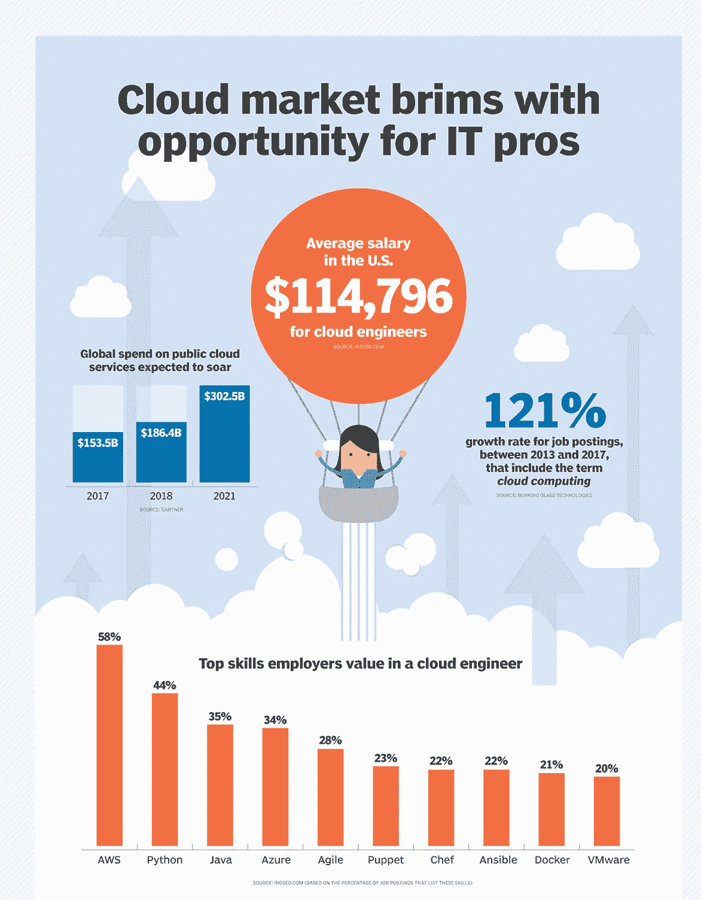
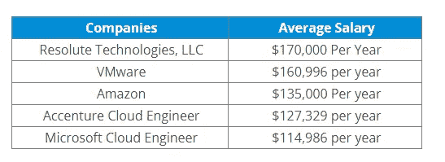
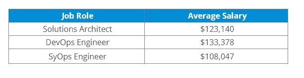
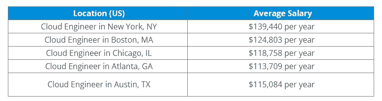
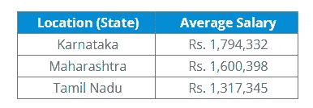
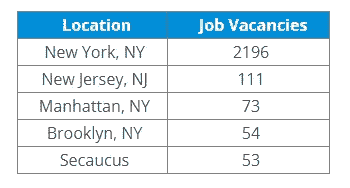
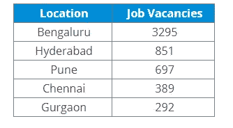
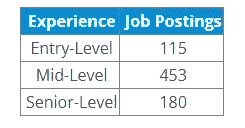

# 云工程师工资:你需要知道的一切

> 原文：<https://medium.com/edureka/cloud-engineer-salary-all-you-need-to-know-57fc05b3c3b1?source=collection_archive---------0----------------------->

在我最近的一些文章中，我强调了为什么一个人应该选择**云计算**作为职业，以及**如何成为一名云工程师？**该领域处于鼎盛时期也确保了该领域的工作会给你带来丰厚的报酬。这篇文章特别关注**云工程师工资**，并回答了围绕这个话题的大部分问题。

# 云工程师工资

让我们用一个数字来开始这场讨论。根据 ZipRecruiter 的数据，云工程师的平均工资从 10.4 万美元到 14.5 万美元不等，最高可达 25 万美元。现在，请注意，让我们来看看一些与云工程师工资相关的统计数据。

## 云采用趋势

据 IDC 称，到 2019 年，将近一半的“IT 支出”将基于云。到 2020 年，**支出将达到 60–70%**包括所有软件、服务和技术。这应该会让你对未来几年的云计算有一个大致的了解。

如果以上几点不能说服您，那么以下是 Rightscale 提供的关于公共云支出的一些统计数据:

*   26%的企业每年在公共云上花费超过 600 万美元，而 52%的企业每年花费超过 120 万美元
*   20%的企业计划在 2018 年将公共云支出增加一倍以上，71%的企业将公共云支出增长 20%以上

下图显示了 tech target 根据他们的研究提出的一些要点:

那么**我们看到这种激增的原因是什么？以下是一些重要的例子:**

*   资源利用的灵活性
*   成本效益
*   低风险
*   数据完整性和安全性
*   简化协作

这些原因巩固了云的采用趋势，从而使**云工程**成为一个抢手的职业。

# 一些主要招聘者提供的薪水

那么有没有大公司招聘云工程师呢？根据 indeed.com 的调查，这里列出了美国一些主要招聘者的平均工资，数字确实指向高工资水平(请注意，下面的列表是一个暂定列表，可能会有其他公司最终支付更高的工资，但不在此列):

# 根据工作角色的工资

让我们也来看看一些关于云计算的**角色**以及相关的薪资。作为云工程师，你可能会承担很多角色。然而，以下是根据工资级别列出的一些主要问题:

# 每个地点的工资

另一个重要的问题是，不同地区的工资差别有多大。这是 indeed.com 按美国不同地区列出的云工程师的薪水清单

让我们也考虑一下雇佣云工程师的主要的**印度邦**，看看根据工资等级提供的平均工资

# 职位空缺

以下是 indeed.com 的职位空缺列表。(请不要这样，这些职位空缺实际上是在。还有其他的招聘网站，所以实际人数应该很高)

这个数字对印度 IT 业来说越来越好。这是根据 indeed.com 的**印度城市**列表

# 基于经验的工资

另一个重要的指标是，候选人拥有的相关经验(T7 ),薪酬也可能因组织而异。这就是为什么让我们看看 indeed.com 上的职位招聘数量，看看分布情况如何:

我相信我们已经涵盖了可能与云工程师薪酬相关的所有基础，尤其是我希望您关注的那些。这就把我们带到了这篇关于‘云工程师工资’的文章的结尾。我希望这篇文章能帮助你澄清所有的疑问，我希望你对这个问题有一个更清晰的观点和理解。如果你想查看更多关于 Python、DevOps、Ethical Hacking 等市场最热门技术的文章，那么你可以参考 [Edureka 的官方网站。](https://www.edureka.co/blog/?utm_source=medium&utm_medium=content-link&utm_campaign=how-to-become-a-cloud-engineer)

请留意本系列中解释 Azure 其他方面的其他文章。

> *1。* [*蔚蓝教程*](/edureka/azure-tutorial-5a97e30ee9a7)
> 
> *2。* [*蔚蓝门户*](/edureka/azure-portal-all-you-need-to-know-about-the-azure-console-8ade1effa474)
> 
> *3。* [*天蓝色收纳教程*](/edureka/azure-storage-tutorial-an-introduction-to-azure-storage-dae8fd8f555c)
> 
> *4。* [*蔚蓝专用网*](/edureka/azure-virtual-network-securing-your-applications-using-vpc-744eba3aa5b1)
> 
> *5。* [*Azure DevOps 教程*](/edureka/azure-devops-cf755fb334ae)
> 
> *6。* [*天青板*](/edureka/azure-boards-ce093b2688bb)

*原载于 2021 年 9 月 17 日*[*【https://www.edureka.co】*](https://www.edureka.co/blog/how-to-become-a-cloud-engineer/)*。*