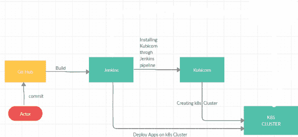
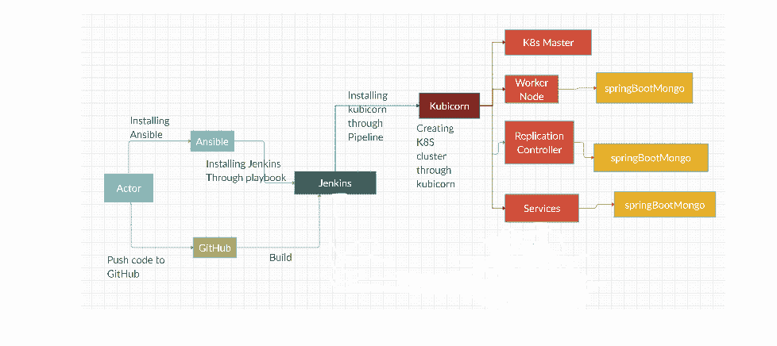
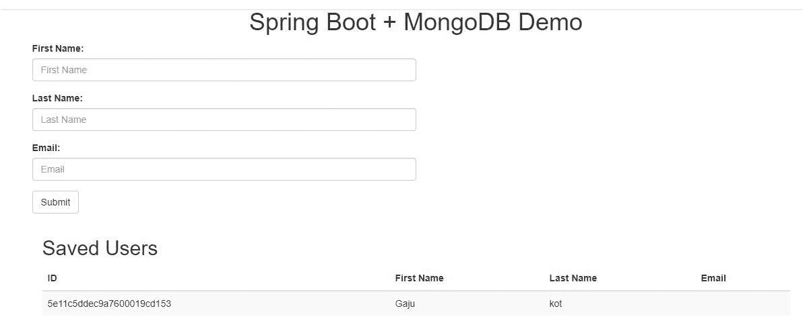

# 云互操作性，第 1 部分:在 AWS 中构建应用程序

> 原文：<https://medium.com/globant/cloud-interoperability-part1-building-apps-in-aws-22cf2266011c?source=collection_archive---------2----------------------->

# **使用 Kubicorn 和 Jenkins 在 K8s 上部署应用**

本文是关于使用 Kubicorn 创建 Kubernetes 集群和使用 Jenkins CI/CD 在 Kubernetes 上部署应用程序。本文档重点介绍 AWS 中的基础架构创建。然而，相同的设置可以在其他一些众所周知的公共云平台中复制，如 Azure、GCP 等。

**kubi corn 简介**

Kubicorn 是一个 Kubernetes 基础设施管理工具。它用于以云本地方式管理基于 kubernetes 的基础设施。这是一个免费的开源项目。该项目由云原生计算基金会(CNCF)支持，并试图为云原生基础架构提供一些独特的东西:

它有模块化的组件，是 Go 中可出售的库，具有灵活性和可伸缩性。它提供了一种可靠的方法来引导和管理您的基础架构软件。使用 Kubicorn，用户可以声明式地创建新集群，修改和扩展它们。

**先决条件**

*   詹金斯
*   Ansible
*   库比科恩
*   开源代码库

**高液位流量描述**



Diagram: High level flow

根据高级流程图，Actor 将**Spring boot 应用程序库提交到 GitHub。一旦所有的推送都完成了，Jenkins 将触发 spring boot repository 的工作并构建代码。然后通过 Go 命令安装 Kubicorn。K8s 主节点和工作节点的配置是通过 Kubicorn 实现的。最后，在 K8s 集群上部署 spring boot 应用程序使用了 Jenkins pipeline 中的 kubectl 命令。**

****详细流程描述****

****

**Diagram: Detailed flow**

**根据详细的流程图，Actor 将代码推入 GitHub。所有推送完成后，Jenkins 会自动触发构建设置。使用 GO 命令安装 Kubicorn。K8s 集群将通过 Kubicorn create 和 apply 命令创建。**

**Spring boot 应用程序是通过 Jenkins 构建的。Kubicorn 是通过 Jenkinsfile 安装的。K8s 集群是使用 Kubicorn 创建的，在 K8s 集群上部署 Spring boot 应用程序使用的是 Jenkins Pipeline。最后，K8s 集群通过 Jenkins 管道自动创建 pod、服务和复制控制器。**

****CICD 使用 Jenkins 创建 Kubicorn 并在 Kubernetes 集群上部署 Spring-boot 应用的步骤****

****安装步骤****

1.  ****安装 Ansible****

**在 AWS 中安装 t2.medium 实例(CPU Core 2，RAM 8GB)以便安装 Ansible，因为 GO 安装至少需要 4GB RAM 和 2 个 CPU Core。**

```
apt update
apt install openjdk-8-jdk
apt-add-repository ppa:ansible/ansible
apt update
apt install ansible -y
Ansible -- version
```

**2.**安装詹金斯服务器****

**通过 Ansible playbook 安装 Jenkins 和 ssh-key-gen，如下所示:**

**詹金斯安装的可行剧本 :-**

```
--- 
- hosts: localhost
  tasks: 
    - name: "ensure the Jenkins apt repository key is installed"
      apt_key: "url=[https://pkg.Jenkins.io/debian-stable/Jenkins.io.key](https://pkg.Jenkins.io/debian-stable/Jenkins.io.key) state=present"
      become: true - name: "ensure the repository is configured"  
      apt_repository: "repo='deb [https://pkg.Jenkins.io/debian-stable](https://pkg.Jenkins.io/debian-stable) binary/' state=present"
      become: true - name: "ensure Jenkins is installed"
      apt: "name=Jenkins update_cache=yes"
      become: true

    - name: "ensure Jenkins is running"
      service: "name=Jenkins state=started"
```

**以上行动手册用于使用 Ansible 行动手册安装 Jenkins 服务器。按照第一项任务，它将检查是否安装了 Jenkins apt 存储库密钥，配置 Jenkins apt 密钥，通过 apt 命令安装 Jenkins，然后启动 Jenkins 服务。**

****ssh-key-gen 的可行剧本****

```
---
- hosts: localhost
  become_user: Jenkins
  become: yes
  - name: Exchange Keys between servers
  tasks:
  - name: SSH KeyGen command
    tags: run
    shell: ssh-keygen -q -b 2048 -t rsa -N "" -C "creating SSH" -f ~/.ssh/id_rsa creates="~/.ssh/id_rsa"
```

**上述剧本用于 Jenkins 和 kubernetes 主服务器之间的无密码认证。**

****3。在 AWSCLI 的 AWS 中创建 IAM 角色，如下图所示****

```
#######tasks/main.yml 
##==================
---
 - name: Ensure pip is installed
   apt:
     name: python-pip
     update_cache: yes
     state: latest
 - name: pip install awscli
   pip:
     name: awscli
     state: latest
 - name: Ensure .aws directory under user home for awscli config
   file:
     path: "/var/lib/{{ item.username }}/.aws"
     state: directory
     owner: "{{ item.username }}"
     group: "{{ item.username }}"
     mode: 0755
     when: item.get('state', 'present') == 'present'
     with_items: "{{ awscli_users }}"
 - name: Copy awscli config to remote server
   template:
     src: awscli_config.j2
     dest: "/var/lib/{{ item.username }}/.aws/config"
     owner: "{{ item.username }}"
     group: "{{ item.username }}"
     mode: 0644
     when: item.get('state', 'present') == 'present'
     with_items: "{{ awscli_users }}"######templates/awscli_config.j2.yml 
###===================================
[default]
output = {{ item.awscli.aws_output_format }}
region = {{ item.awscli.aws_region }}
aws_access_key_id = {{ item.awscli.aws_access_key_id }}
aws_secret_access_key = {{ item.awscli.aws_secret_access_key }}########vars/main.yml 
###========
---
awscli_users:
- username: Jenkins
state: present
awscli:
aws_region: us-west-2
aws_output_format: json # format can be 'text','table' and 'json'
aws_access_key_id: 'XXXXXXXXXXXXXX'
aws_secret_access_key: 'XXXXXXXXXXXXXXXXXXXXXXXXXX'###site.yml
###============================
--- 
- hosts: localhost
  roles: 
    - awscli
```

**上面的剧本是在 ubuntu 中安装 pip。然后通过 pip 命令安装 AWSCLI，确保。awsCLI 配置和权限的用户主目录下的 AWS 目录是 755，然后将 AWSCLI 配置复制到远程服务器(这里我使用的是神牙模板/动态模板，权限应该是 644)。在神牙模板中，指定输出格式、区域、aws_access_key_id 和密钥 id(它用于对 aws 服务的编程 API 访问。您可以在 AWS 管理控制台中管理您的访问键)最后，将角色定义为 awscli。**

**4.**通过 Jenkins 管道安装 kubi corn****

```
pipeline{
agent any
stages{
stage("Installing Kubicorn Through Go"){
steps {
sh "sudo snap install go --classic"
sh "go version"
sh "go get github.com/Kubicorn/Kubicorn"
}
}
stage("Link File"){
steps {
script {
try{
sh label: '', script: '''sudo rm /usr/local/bin/Kubicorn
sudo ln -s /var/lib/Jenkins/go/bin/Kubicorn /usr/local
/bin/Kubicorn'''
}
catch(Exception e){
sh label: '', script: 'sudo ln -s /var/lib/Jenkins/go
/bin/Kubicorn /usr/local/bin/Kubicorn'
}
sh "Kubicorn version"
}
}
}
stage("Kubicorn Creation"){
steps {
sh "Kubicorn create K8s${env.BUILD_NUMBER} --profile aws"
sh "sed -i 's/\"size\":\"t2.xlarge\"/\"size\":\"t2.medium\"/g' /var/lib/Jenkins
/workspace/ksjob/_state/K8s${env.BUILD_NUMBER}/cluster.yaml"
}
}
stage("Kubicorn Apply"){
steps {
sh "Kubicorn apply K8s${env.BUILD_NUMBER}"
}
}
stage("Find Ip_address and Deploy apps on K8s") {
steps {
script {
def ipaddress = sh(script: "aws ec2 describe-instances --filters 'Name=tag:Name,Values=K8s1.
master' --query 'Reservations[*].Instances[*].PublicIpAddress'
--output=text", returnStdout: true).trim()
sh "ssh -o StrictHostKeyChecking=no -i /var/lib/Jenkins/.ssh/id_rsa ubuntu@${ipaddress} \"
git clone [https://github.com/gajuk/spring-mongo-app.git\](https://github.com/gajuk/spring-mongo-app.git\)""
sh "ssh -o StrictHostKeyChecking=no -i /var/lib/Jenkins/.ssh/id_rsa
ubuntu@${ipaddress} \"kubectl apply -f /home/ubuntu/spring-mongo-app/springBootMongo.yml\""
}
}
}
stage("Remove and Add Security Group for Master") {
steps {
script {
def sgid = sh(script: "aws ec2 describe-security-groups --filters 'Name=tag:Name,
Values=K8s1.master*' --query 'SecurityGroups[*].{ID:GroupId}' 
--output=text", returnStdout: true).trim()
sh "aws ec2 revoke-security-group-ingress --group-id ${sgid} 
--protocol all --cidr 10.X.X.X/24" (this range will vary based on VPC CIDR range selection)
sh "aws ec2 authorize-security-group-ingress --group-id ${sgid} 
--protocol all --cidr 0.0.0.0/0"
}
}
}
stage("Remove and Add Security Group for Worker") {
steps {
script {
def sgid = sh(script: "aws ec2 describe-security-groups --filters 'Name=tag:Name,
Values=K8s1.node*' --query 'SecurityGroups[*].{ID:GroupId}' 
--output=text", returnStdout: true).trim()
sh "aws ec2 revoke-security-group-ingress --group-id ${sgid} 
--protocol all --cidr 10.X.X.X/24" (this range will vary based on VPC CIDR range selection)
sh "aws ec2 authorize-security-group-ingress --group-id ${sgid} 
--protocol all --cidr 0.0.0.0/0"
}
}
}
}
}
```

**完成所有步骤后，上面的 Jenkins 管道将显示如下部署输出:**

****

**Deployment output**

****Spring boot 代码部署步骤****

*   **通过 GO 命令安装 Kubicorn。**
*   **使用 Kubicorn 创建 K8s 集群。**
*   **使用 Jenkins 管道访问 K8s 主服务器，并使用 kubectl 命令部署 spring boot 应用程序。**

****优点****

*   **Kubicorn 是声明式的、API 驱动的方法**
*   **它创建和供应虚拟机并设置 Kubernetes**
*   **它可以扩展和处理集群升级**
*   **它可以与任何云提供商和任何操作系统或映像兼容**
*   **根据云提供商的可用选项，用户可以通过提供引导脚本来定义如何配置实例和集群。**

# ****结论****

**本文简要介绍了如何安装 Kubicorn、通过 Jenkins pipeline 部署 spring boot 应用程序以及通过 Ansible playbook 安装 Jenkins。AWSCLI 用于访问 K8s 主服务器 IP 地址。kubernetes 的安装和配置是通过 Kubicorn create and apply 命令完成的。Kubicorn 为我们创建了 K8s 集群，并通过 Jenkins 为 spring boot 应用程序完成了持续集成和持续部署。**

****参考文献****

**[http://Kubicorn.io/](http://kubicorn.io/)**

**[http://Kubicorn.io/documentation/aws-walkthrough.html](http://kubicorn.io/documentation/aws-walkthrough.html)**