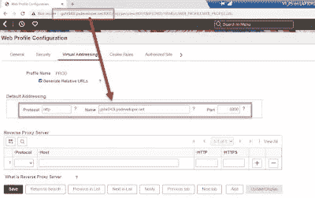

# 云管理器 14 和 PeopleTools 8.60

> 原文：<https://medium.com/version-1/cloud-manager-14-peopletools-8-60-410a1d6ab78c?source=collection_archive---------0----------------------->

Photo by [Zan](https://unsplash.com/@zanilic?utm_source=unsplash&utm_medium=referral&utm_content=creditCopyText) on [Unsplash](https://unsplash.com/s/photos/software?utm_source=unsplash&utm_medium=referral&utm_content=creditCopyText)

10 月 14 日星期五，甲骨文在 OCI 发布了 PeopleTools 8.60，我们第一版的用户自然渴望得到这个激动人心的版本。自 [PeopleTools 8.57](https://blogs.oracle.com/peoplesoft/post/peopletools-857-is-now-available-to-download-to-your-site) 以来，Oracle 一直使用 PeopleSoft Cloud Manager 平台来提供软件，8.60 也不例外。

如果您没有在 Oracle Cloud Infrastructure (OCI)中运行 PeopleSoft，那么很可能您没有 PeopleSoft Cloud Manager (PCM)(注意:PCM 仅在 OCI 上运行)。但是，PeopleSoft Cloud Manager 对于希望尽早获得新的 PeopleTools 版本的组织来说具有重要价值，您无需等到将整个 PeopleSoft 系统迁移到 OCI 就可以开始利用 Cloud Manager。我写了[几篇博客](https://i-like-trains.blogspot.com/search/label/Cloud%20Manager)来讲述我多年来使用 PCM 的经历，我强烈推荐它。在 OCI 安装 PCM 非常简单，如果你对它感兴趣，无论你身在何处，第 1 版[的团队都会非常乐意提供帮助。](https://www.version1.com/erp-pps-peoplesoft-cloud-hosting/)

这里有一些重要的东西，你可能会觉得有用。

**(1) PeopleTools 8.60 只能使用 PeopleSoft Cloud Manager 下载和访问。**我想这是甲骨文鼓励客户看一看 OCI。在 Oracle 云基础设施上运行 PeopleSoft 有一个令人信服的理由，但这不是这篇博客文章的内容。实际上，我将在即将于 12 月 7 日举行的 [Pathlock PeopleSoft 创新日就这个主题发表演讲](https://get.pathlock.com/webinar-10-reasons-why-oci-creates-real-value-for-peoplesoft-clients)如果您有兴趣了解更多信息，可以免费注册。

**(2)云管理器必须在版本 14 上才能访问工具 8.60 频道。**云管理器中有一个非常酷的自动更新功能，所以如果你在使用 CM 13，并且需要获得 CM 14，只需点击“魔法按钮”即可。我在这里写了关于[自动更新过程的博客](https://i-like-trains.blogspot.com/2021/12/peoplesoft-cloud-manager-13.html)。或者你可以使用甲骨文的这些指令从甲骨文云市场安装一个新的 CM 14 实例[。](https://docs.oracle.com/en/applications/peoplesoft/cloud-manager/index.html#InstallationTutorials)

Magic Upgrade Button

**(3)当前的 PeopleSoft 图像(HCM 044、FSCM 045 和 CS 027)在 PeopleTools 8.59 上发布**。这意味着您需要使用云管理器来执行 PeopleTools 升级以升级到 8.60。既然 8.60 已经正式发布，我预计未来版本的更新映像将会从 8.60 开始发布。

下面有一个简短的视频，展示了我的一个 HCM 043 环境从 8.59.10 升级到 8.60.01。

**(4) CM14 可能无法提供新的环境。在 HCM 043 发布后，这种情况开始在新的 CM 环境中发生。如果您遇到这种情况，那么 [MOS 文档 ID 2902243.1](https://support.oracle.com/epmos/faces/DocContentDisplay?id=2902243.1) 可能会有所帮助。**

MOS Doc ID 2902243.1 Resolution

**(5)执行 8.60 升级比以前的升级需要更多的 Linux 交换空间**。如果发生这种情况，升级到 8.60 将会失败，并出现以下错误:

检查交换空间:410 MB 可用，500 MB 需要。失败<<<<
一些需求检查失败。在继续安装之前，您必须满足这些要求，

最简单的修复方法是在使用 OCI 控制台开始目标环境的云管理器升级之前，将目标 Linux 实例的形状更改为 VM.Standard2.2。这将 OCPU 增加到 2，并显式分配更多的交换空间。一旦你完成升级，你可以把形状降低到 1 OCPU。当然，使用 Flex 形状可能更好，这样您可以分配更多的内存，同时仍将 OCPU 级别保持在 1。

**(6)10 月发布的** [**用于 PeopleTools 的 CPU**](https://www.oracle.com/security-alerts/cpuoct2022.html#AppendixPS)**中有一项新的安全特性，它会影响使用公共 DNS 条目或位于负载平衡器或代理之后的环境。可以在 [MOS DocID 2904753.1](https://support.oracle.com/epmos/faces/DocContentDisplay?id=2904753.1) 中读取分辨率。如果您刚刚使用云管理器将 8.59 环境升级到 8.60，那么当您尝试登录到升级后的环境时，将会出现错误**

**您的 URL 必须包含域“. xxx.xxx”单击登录到 PeopleSoft 重试。**

**即使你的 URL 包含正确的域名，你也会得到这个。**

****

**Signin Error Caused by Oracle October CPU**

**解决此问题/功能的方法是将主机名添加到 Web 配置文件的虚拟寻址部分。在我的例子中，我通常不会使用虚拟寻址，因为我的 web 服务器没有负载平衡器或代理。然而，随着最近的“安全增强”，我似乎做到了。**

****

**MOS Doc ID 2904753.1 Resolution**

****(7) Elasticsearch 和 Kibana 可能无法启动。**如果您的云管理器环境有一个 ELK 节点，那么将在 8.60 升级过程中对其进行升级和修补。如果您使用云管理器来**启动**环境，那么 Elastic 和 Kibana 也将被启动。但是，如果使用 OCI 控制台启动计算实例，那么 Elastic 和 Kibana 将不会自动启动。我不知道为什么所有的 PeopleSoft 中间层组件都使用 Linux 服务，而 ELK 没有。只有通过云管理器启动环境，ELK 才会启动。**

****

**ELK will only start if you start using CM**

# **最后**

**PeopleTools 8.60 中有一些令人兴奋的新功能，我希望很快就能分享我的一些想法和经验。**

**PeopleSoft Cloud Manager 是快速访问 8.60 等新版本的真正变革者。随着未来几周和几个月补丁的发布，我将能够快速地将它们应用到我的环境中进行测试和持续的研究和学习。**

**Graham Smith 是 Version 1 的管理顾问。**

***原载于*[*https://i-like-trains.blogspot.com*](https://i-like-trains.blogspot.com/2022/11/cloud-manager-14-and-peopletools-860.html)*。***