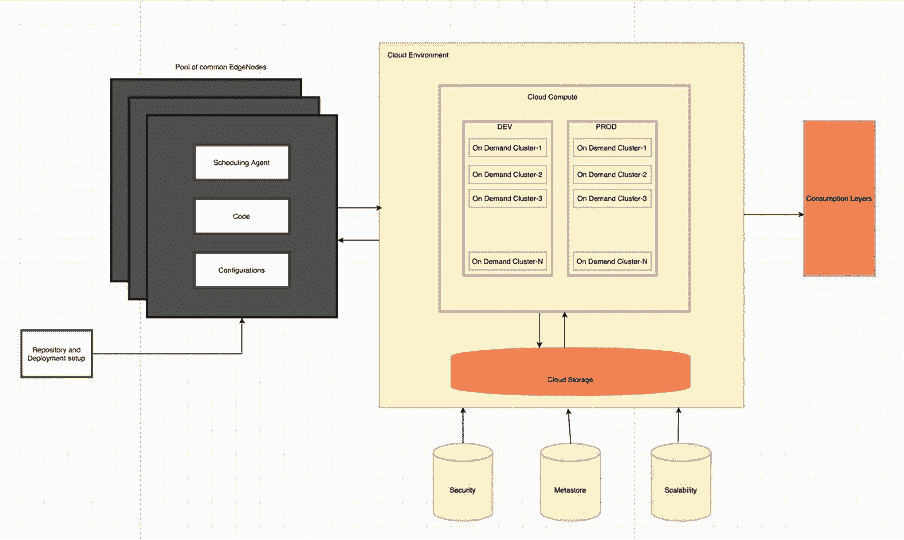

# 面向具有按需集群的企业分析环境的云迁移

> 原文：<https://medium.com/walmartglobaltech/cloud-migration-for-enterprise-analytics-environment-with-on-demand-clusters-fb6c9638079a?source=collection_archive---------3----------------------->

这篇博客是由[斯里达尔·丽卡拉](https://medium.com/u/b4a06d6c3926?source=post_page-----fb6c9638079a--------------------------------)共同撰写和研究的

我们是一个数据团队。我们将大部分精力用于构建从运营系统到决策支持基础设施的数据管道。这里描述了我们从内部环境到云环境的旅程:

 [## 为企业分析环境迁移到云的优势

### 介绍

medium.com](/walmartglobaltech/advantages-of-migrating-to-cloud-for-enterprise-analytics-environment-648d18c9c33d) 

这是我们云之旅的第一阶段。

**第一阶段的挑战:**

在第一阶段，我们主要有基于时间的集群。集群在特定时间扩大到最大容量，随后又缩小。这种方法有一些缺点:

**灵活性:**

这种方法不太灵活。如果出现任何延迟，生产支持团队需要采取特别措施，以确保所需的能力在额外的时间段内可用。这增加了更多的操作挑战。

**成本:**

从成本角度来看，备用节点有额外的负担，备用节点是全天保持活动状态的最小数量的节点。因此，即使集群处于空闲状态，全天也会产生一定的成本。

**边缘节点的可用性:**

尽管云环境中的数据保证在 99%的时间内可用，但边缘节点却不能。边缘节点出现故障并影响数据可用性、SLA 并最终影响业务的可能性非常小。

**资源:**

每个集群有一个专用的边缘节点，并且安装某些许可的软件，如调度工具，进一步增加了成本，因为每个边缘节点必须利用新的许可证来使用该产品。

为了克服这些挑战，并使我们的流程更加稳健、经济高效和灵活，我们计划在云之旅的第二阶段利用临时集群。

**第二阶段**

**短暂的集群:**

临时集群是按需创建的，一旦应用程序被执行，它们就被完全终止。每当一个特定的进程必须运行时，它首先创建具有适当容量的集群，运行必要的作业，并最终终止集群。应用程序还可以触发进一步的放大/缩小操作。这有效地使集群操作(如创建/删除/扩展)成为应用程序团队设计和管理的 ETL 管道的一部分。

**创建短暂集群:**

由于集群操作与 ETL 管道集成在一起，明智地创建集群变得非常重要。在创建集群之前，必须进行彻底的分析，以确定合适的容量。创建大量具有更高容量的集群可能会导致资源浪费。

如果 ETL 管道的数量有限，那么可以为每个管道创建一个集群。如果有大量管道，那么可以为一组管道创建一个集群。

必须在管道之间建立适当的依赖关系，以便在第一个管道运行之前创建集群，并在最后一个管道完成之后终止集群。

应用程序团队可以定义管道的规模，从单个作业或应用程序 id 到多个作业。可以根据主题领域或执行时间对流程进行分组。

同时运行的管道可以在不同的集群上触发，以避免并发。在进程运行非常频繁的情况下(半小时、四分之一小时、流等)。)可以考虑持久集群。

**边缘节点池:**

我们正在考虑的另一个体系结构变化是避免每个群集都有专用的边缘节点，而是有一个边缘节点池。这些边缘节点将是公共的，由所有团队使用并集中管理。

池中的每个节点都将安装所有必需的应用程序，并且可以访问应用程序代码。将有一种负载平衡机制，它将在所有边缘节点之间公平地分配负载。

足够级别的访问控制也将到位，因此特定的代码将只由相应的团队访问。

这不仅确保了软件许可被明智地使用，还确保了边缘节点的高可用性。

**为了成功实施，**我们需要满足以下要求:

为了拥有有效的按需机制，应该规划足够的容量。

应建立一个程序，确保资源在各组之间的有效分配。

应定义创建、删除、扩大/缩小集群的简单有效的流程。

定义有效的负载平衡机制，以支持边缘节点池的概念。

应该建立正确的访问协议，以确保在无缝访问代码时有必要的业务限制。

需要建立一个无缝且简单的流程来建立环境和提交流程。

**附录:**

我们在第一阶段和第二阶段观察到的自动缩放的一些统计数据:

