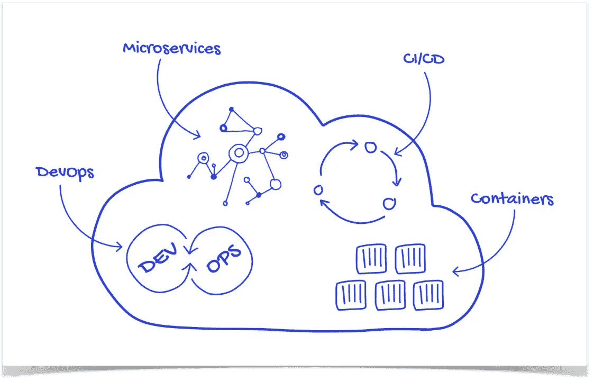
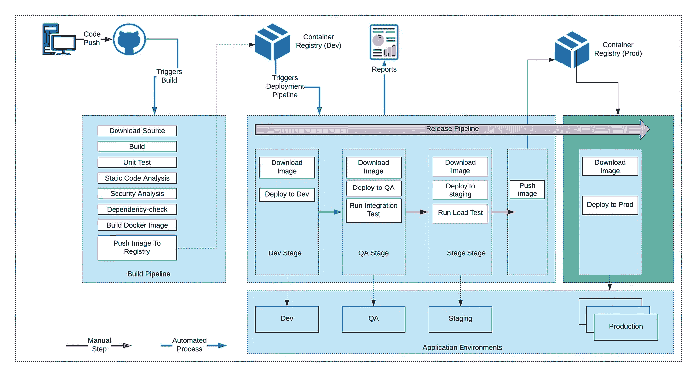

# 云原生应用架构

> 原文：<https://medium.com/walmartglobaltech/cloud-native-application-architecture-a84ddf378f82?source=collection_archive---------0----------------------->

# **简介**

Cloud native 是一种将应用程序构建为微服务并在容器化的动态编排平台上运行它们的方法，该平台充分利用了云计算模型的优势。云原生是关于如何创建和部署应用，而不是在哪里。这些技术使组织能够在现代动态环境(如公共云、私有云和混合云)中构建和运行可扩展的应用程序。这些应用从头开始构建，设计为松散耦合的系统，针对云规模和性能进行了优化，使用托管服务并利用连续交付来实现可靠性和更快的上市时间。总体目标是提高速度、可伸缩性以及利润。

速度——各种规模的公司现在都看到了能够快速行动并将想法快速推向市场的战略优势。这里，我们的意思是从几个月到几天甚至几个小时，把一个想法投入生产。实现这一点的一部分是企业内部的文化转变，从大爆炸项目过渡到更多的增量改进。从本质上讲，云原生战略是关于处理技术风险的。过去，我们避免危险的标准方法是缓慢而小心地移动。云原生方法是通过采取小的、可逆的和低风险的步骤来快速移动。
可扩展性—随着企业的发展，从战略上来说，有必要在更多位置使用更广泛的设备支持更多用户，同时保持响应能力、管理成本和不超出
利润—在云基础设施的新世界中，战略目标是随着新客户的上线，只在需要时支付额外资源。支出从前期资本支出(购买新机器以期待成功)转移到 OPEX(按需购买额外的服务器)。

# CNCF 的角色

[Cloud Native Computing Foundation](https://www.cncf.io/)是一个位于 Linux Foundation 中的开源软件基金会，包括 Google、IBM、Intel、Box、Cisco 和 VMware 等知名公司，致力于实现云原生计算的普及和可持续发展。云原生计算使用开源软件堆栈将应用部署为微服务，将每个部分打包到自己的容器中，并动态编排这些容器以优化资源利用率。根据为什么需要 CNCF 的常见问题——公司意识到他们需要成为一家软件公司，即使他们不从事软件行业。例如，Airbnb 正在改革酒店业，更多传统酒店正在努力竞争。云原生支持 IT 和软件更快地移动。采用云原生技术和实践使公司能够在内部创建软件，允许业务人员与 IT 人员密切合作，跟上竞争对手并向客户提供更好的服务。

# 云原生设计原则

## 设计为松散耦合的微服务

微服务是一种将单个应用程序开发为一套小型服务的方法，每个应用程序都在自己的进程中运行，并使用 HTTP 等轻量级协议进行通信。这些服务是围绕业务功能构建的，并且可以由完全自动化的部署机器独立部署。

## 使用一流的语言和框架开发

云原生应用的每个服务都是使用最适合该功能的语言和框架开发的。云原生应用是多语言的。服务使用多种语言、运行时和框架。例如，开发人员可以基于在 Node.js 中开发的 WebSockets 来构建实时流服务，同时选择 Python 来构建基于机器学习的服务，并选择 spring-boot 来公开 REST APIs。开发微服务的细粒度方法允许他们为特定的工作选择最佳的语言和框架。

## 围绕用于交互和协作的 API

云原生服务使用基于表述性状态转移(REST)等协议的轻量级 API 来公开其功能。内部服务使用 Thrift、Protobuff、GRPC 等二进制协议相互通信，以获得更好的性能

## 无状态且可大规模扩展

云原生应用将其状态存储在数据库或其他外部实体中，因此实例可以来来去去。任何实例都可以处理请求。它们不依赖于底层基础设施，这允许应用程序以高度分布式的方式运行，并且仍然保持其状态独立于底层基础设施的弹性本质。从可伸缩性的角度来看，架构非常简单，只需向集群添加商用服务器节点，就可以扩展应用程序

## 架构核心的弹性

根据墨菲定律——“任何能失败的事情都会失败”。当我们将此应用于软件系统时，在分布式系统中，会发生故障。硬件可能会出现故障。网络可能会出现暂时性故障。很少情况下，整个服务或区域可能会经历中断，但即使是这些也必须进行规划。弹性是系统从故障中恢复并继续运行的能力。这不是关于*避免*故障，而是以避免停机或数据丢失的方式响应故障。弹性的目标是在出现故障后将应用程序恢复到完全正常的状态。弹性提供了以下优势:

*   高可用性—应用程序能够在健康的状态下持续运行，而不会出现长时间的停机
*   灾难恢复—应用程序从罕见但重大的事件中恢复的能力:非暂时性的大规模故障，如影响整个地区的服务中断

使应用程序具有弹性的主要方法之一是通过冗余。HA 和 DR 通过多节点集群、多区域部署、数据复制、无单点故障、连续监控等方式实施。

以下是实现弹性的一些策略:

*   重试暂时性失败-暂时性失败可能是由于网络连接暂时中断、数据库连接断开或服务繁忙时超时造成的。通常，暂时的失败可以通过重试请求来解决
*   跨实例的负载平衡—随处实施集群。无状态应用程序应该能够通过向群集中添加更多节点来进行扩展
*   适度降级—如果服务失败且没有故障转移路径，应用程序可能能够适度降级，同时仍能提供可接受的用户体验
*   抑制高用量租户/用户—有时少量用户会造成过度负载。这会对其他用户产生影响，降低应用程序的整体可用性
*   使用断路器——断路器模式可以防止应用程序重复尝试可能失败的操作。断路器包装对服务的调用，并跟踪最近故障的数量。如果失败计数超过阈值，断路器开始返回错误代码，而不调用服务
*   应用补偿交易。补偿事务是撤消另一个已完成事务的影响的事务。在分布式系统中，很难实现强事务一致性。补偿事务是一种通过使用一系列较小的、单独的事务来实现一致性的方法，这些事务可以在每个步骤中撤消。

弹性测试——通常弹性测试不能像测试应用程序功能那样进行(通过运行单元测试、集成测试等等)。相反，您必须测试端到端工作负载在故障条件下的表现，这些故障条件只是间歇性地出现。例如:通过崩溃进程、过期证书、使相关服务不可用等方式注入故障。像[混沌猴](https://github.com/Netflix/chaosmonkey)这样的框架可以用于这样的混沌测试。

## 打包成轻量级容器并进行编排

容器使得将应用程序隔离到共享操作系统内核的小型轻量级执行环境中成为可能。通常以兆字节来衡量，容器使用的资源比虚拟机少得多，并且几乎可以立即启动。Docker 已经成为容器技术的标准。它们提供的最大优势是便携性。

使用 Kubernetes 部署云原生应用程序，Kubernetes 是一个开源平台，旨在自动部署、扩展和管理容器化应用程序。最初由谷歌开发的 Kubernetes 已经成为部署云原生应用的操作系统。这也是 CNCF 大学首批毕业的几个项目之一。

## 使用 CI/CD 的敏捷开发和自动化

DevOps,“开发”和“运营”的合并描述了实现快速敏捷开发和可扩展的、可靠的运营所需的组织结构、实践和文化。DevOps 是一种文化、协作实践和自动化，它将开发和运营团队联系在一起，使他们在改善客户体验、更快地响应业务需求以及确保创新与安全和运营需求之间的平衡方面保持一致。现代组织相信开发和运营人员和职责的合并，以便一个 DevOps 团队承担两种职责。这样，你只有一个团队负责开发、部署和运行生产中的软件。

Continuous Integration & Continuous Delivery

持续集成(CI)和持续交付(CD)是一组操作原则，使应用程序开发团队能够更频繁、更可靠地交付代码变更。CI 的技术目标是建立一种一致的、自动化的方法来构建、打包和测试应用程序。有了集成过程中的一致性，团队更有可能更频繁地提交代码变更，这导致了更好的协作和软件质量。

持续交付从持续集成结束的地方开始。CD 自动向选定的基础架构环境交付应用程序。它提取由 CI 构建的包，部署到多个环境中，如开发、QA、性能，运行各种测试，如集成测试、性能测试等，最后部署到生产环境中。连续交付通常在管道中有很少的手动步骤，而连续部署是一个完全自动化的管道，它自动化了从代码签入到产品部署的整个过程。

## 弹性—动态放大/缩小

云原生应用通过在使用高峰期间使用增加的资源来利用云的弹性。如果你的基于云的电子商务应用程序遇到使用高峰，你可以设置它使用额外的计算资源，直到高峰消退，然后关闭这些资源。云原生应用可以根据需要根据增加的资源和规模进行调整。