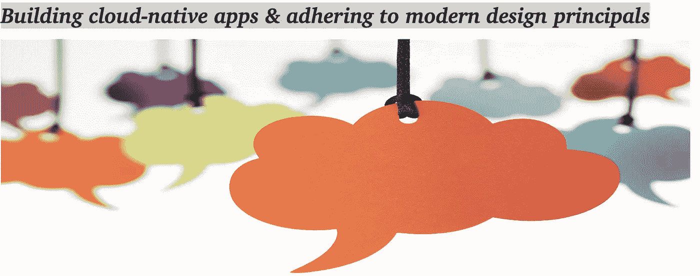
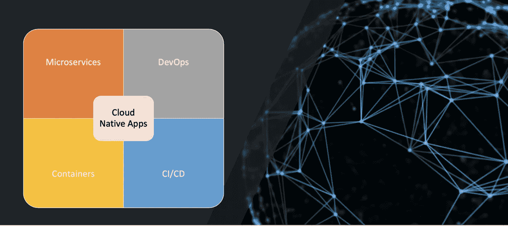

# 云原生架构基础

> 原文：<https://medium.com/walmartglobaltech/cloud-native-architecture-fundamentals-ac13f979916d?source=collection_archive---------0----------------------->

# 云原生概述

云原生在很短的时间内成为了软件行业的热门词汇和最大趋势，但在我们谈论云原生应用程序之前，让我们首先了解更多关于云计算的基础知识。

简而言之，云计算是通过互联网(“云”)交付计算服务，包括服务器、存储、数据库、网络、软件、分析和智能，以提供更快的创新、灵活的资源和规模经济。您通常只需为您使用的云服务付费，从而帮助您降低运营成本、更高效地运行基础架构，并随着业务需求的变化而扩展。通常，您以三种方式使用云计算:IaaS、PaaS 和 SaaS。对于这个博客的范围来说，上面的信息应该足够开始了。

Cloud-Native 是构建和部署应用程序的方式或方法，它使用各种云计算模型来充分利用云计算服务。云原生原则和架构可帮助您更快、更好地构建应用，并缩短生产路径。它是关于实现整体速度、规模、敏捷性和竞争优势。

与推动我们行业的持续宣传不同，云原生是实实在在的。想想云原生计算基金会( [CNCF](https://www.cncf.io/) )，这是一个由 200 多家大公司组成的团体，其宗旨是让云原生计算在各种技术和云堆栈中无处不在。作为最有影响力的开源团体之一，它主持了 GitHub 中许多发展最快的开源项目。其中包括 Kubernetes、Prometheus、Helm、Envoy 和 gRPC 等项目。

# 云原生架构的四大支柱

**1。微服务**

云原生系统采用微服务，这是一种用于构建现代应用程序的流行架构风格。构建为一组分布式的小型独立服务，通过共享结构进行交互。微服务具有以下共同特征:

面向领域的方法在更大的领域环境中实现特定的业务能力。

每个微服务都应该独立自主地开发和部署。

每个微服务都是独立的，封装了自己的数据存储技术(SQL、NoSQL)和编程语言/工具。

每个微服务都在自己的进程中运行，并使用标准通信协议(如 HTTP/HTTPS、gRPC、WebSockets 或 AMQP)与其他服务进行通信。

**2。容器**

如今，容器化已经成为一种非常流行的应用部署技术。容器提供了可移植性，并保证了跨环境的一致性。通过将所有内容封装到单个包中，我们将微服务及其依赖项与底层基础架构隔离开来。

Kubernetes/K8s 是 Google 构建的一个容器编排和管理系统。大规模运营时，容器编排至关重要。调度、联网、监控、故障转移等是编排引擎的常见编排任务。

**3。DevOps**

DevOps 创造了一种文化和环境，在这种文化和环境中，构建、测试和发布软件可以快速进行。它帮助您自动化平台供应和应用程序部署过程。因此，它使基础架构和部署保持一致，并提供可重复的特性。云原生应用应由 Jenkins、Dockers 和 Kubernetes 等 DevOps 工具管理。

**4。CI/CD**

持续集成和持续交付有助于您频繁发布产品并加速上市过程。同时，这使您能够通过自动化不断地将增量软件变更转移到生产中。连续交付使得发布软件的行为更加健壮和可靠，因此，组织可以更频繁地交付软件，风险更小，并更快地获得客户反馈。

# 实施云原生应用的最佳实践和指南

**现代设计，12 因素应用**

1. ***代码库*** —在修订控制中跟踪一个代码库，部署多个代码库

2. ***依赖*** —显式声明并隔离依赖

3. ***配置*** —在环境中存储配置

4. ***后台*** ***服务*** —将后台服务视为附属资源

5. ***构建、发布、运行***——严格分离构建和运行阶段

6. ***进程*** —将 app 作为一个或多个无状态进程执行

7. ***端口绑定*** —通过端口绑定导出服务

8. ***并发*** —通过流程模型向外扩展

9.

**10. ***开发/生产奇偶校验*** —保持开发、试运行和生产尽可能相似**

**11. ***日志*** —将日志视为事件流**

**12. ***管理流程*** —将管理任务作为一次性流程运行**

****API 是应用程序通信的唯一媒介****

**应用程序使用 API 进行通信。当您构建一个应用程序时，我们应该考虑在相同的生态系统中运行的应用程序将如何使用它，并从设计 API 策略开始。一个好的 API 设计使得 API 容易被应用开发者和外部利益相关者使用。在实现任何代码之前，从使用 OpenAPI 规范记录 API 开始是一个很好的实践。一些好的开源工具有 [APICURIO](https://www.apicur.io/) 、 [Swagger](https://swagger.io/tools/swagger-ui/) 等，可以用于设计和开发。**

****认证和授权****

**安全是一个广泛的领域，因为它包括操作系统、网络和防火墙、数据和数据库安全、应用程序安全以及身份和访问管理。但是这里让我们从应用程序的角度来关注安全性。API 提供了对企业生态系统中的应用程序的访问。因此，您应该确保这些构建模块能够解决应用程序设计和构建过程中的安全问题。**

*****传输中的数据*** :使用 TLS1.2 帮助保护传输中的数据。您可能希望为您的业务应用程序使用 mutual TLS。如果在 Kubernetes 引擎上使用 Istio/Linkerd 之类的服务网格，这将变得更加容易。**

*****应用和最终用户安全* :** 传输安全有助于为传输中的数据提供安全保护，并建立信任。但最佳实践是添加应用程序级安全性，根据消费者身份来控制对应用程序的访问。消费者可以是其他应用程序、用户界面、供应商、合作伙伴等。您可以使用 API 密钥(用于消费应用程序)、基于认证的身份验证和授权、JSON Web 令牌(jwt)交换或安全断言标记语言(SAML)来实施安全性。OAuth 2.0 是授权的行业标准协议。**

****一些关键的设计考虑事项****

**除了十二因素方法论提供的指导，在设计分布式系统时，还有几个关键的设计决策必须做出。**

****弹性**:在分布式架构中，当服务 B 不响应来自服务 A 的网络调用时会发生什么？或者说，当服务 C 暂时不可用，其他消费者的服务被屏蔽时会发生什么？**

****服务到服务通信**:前端客户端和任何消费者应用程序将如何与后端核心服务通信？**

**您会允许直接通信吗？或者，您会用提供灵活性、控制和安全性的网关外观来抽象后端服务吗？**

**后端核心服务相互通信的正确方式是什么？**

**您会允许直接 HTTP 调用导致耦合并影响性能和敏捷性吗？或者您会考虑实现事件驱动架构，并使用 Kafka 或 RabbitMQ 之类的流平台将服务解耦。**

*****数据分布*** *:* 在微服务中，通过设计，每个微服务都封装了自己的数据，这意味着每个服务都有自己的数据库，允许通过使用 API 的公开接口进行操作。如果是，您如何跨多个服务查询数据或实现事务？**

**在当今的多云环境中，云原生部署是实现业务增长和灵活性的前进之路。**

**谢谢，学习愉快！！**