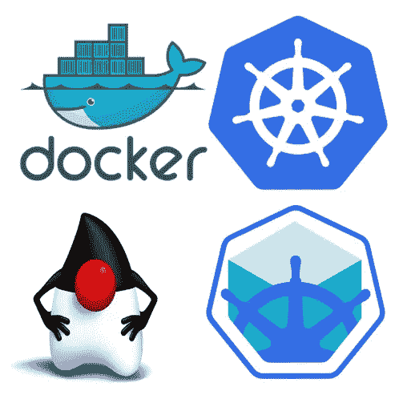

# 使用 Kubernetes、Spring Boot、Docker 和 Minikube 的云原生 Java

> 原文：<https://medium.com/oracledevs/cloud-native-java-with-kubernetes-spring-boot-docker-and-minikube-8c997e38f2d?source=collection_archive---------0----------------------->

[Cloud-native Java](https://developer.oracle.com/java/)

华雷斯少年

## 介绍

这篇博客文章是关于安装、配置和测试本地 [Kubernetes](https://kubernetes.io/) (K8s)开发环境和 Docker Desktop、Chocolatey 和 Minikube 的基本分步指南。这样的软件组件将允许您拥有一个 Kubernetes 环境来测试您的部署…