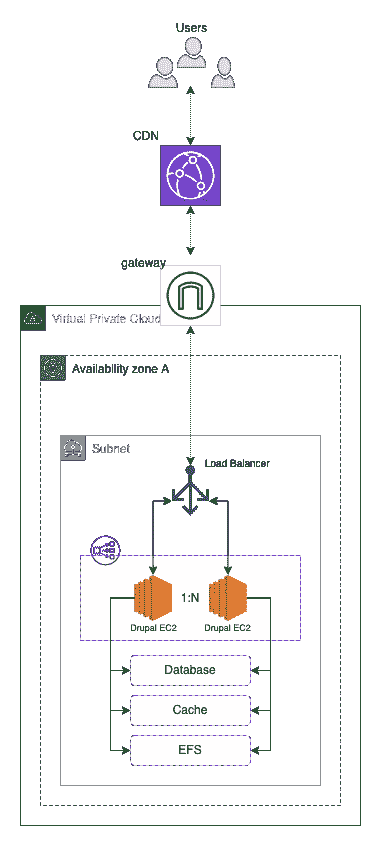
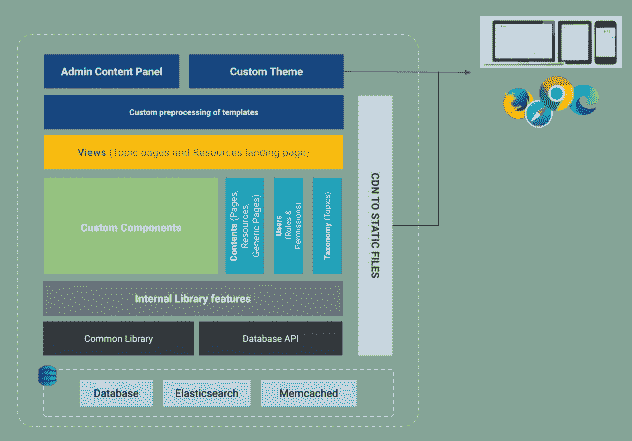
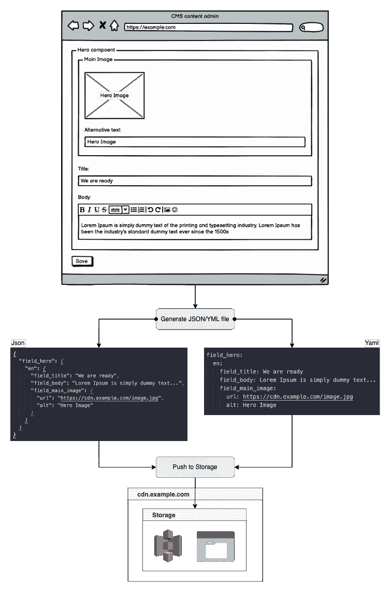
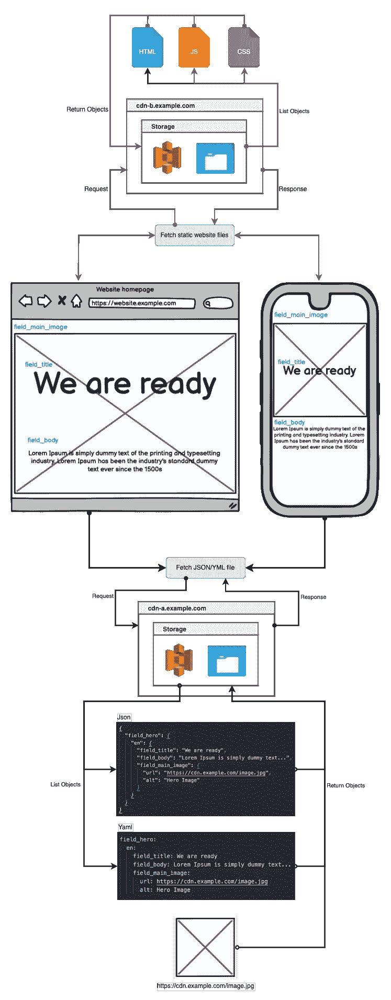

# 减少 CMS，实现高可用性、高性能和高并发性

> 原文：<https://medium.com/globant/cms-less-for-high-availability-performance-and-concurrency-2fbd2bf1a830?source=collection_archive---------0----------------------->

向公众开放的活动通常有成千上万的并发用户，如果需要一些内容/组件管理员(CMS ),通常会考虑使用具有自动缩放、前端缓存(CDN)、Memcache 或 Redis 上的数据保存以及 WAF 的基础架构。以及其他工具。

例如基础设施

例如整体拱形 CMS

# 为什么 CMS 少？

当有必要构建一个静态网站时，可以使用这一概念，该网站需要可管理的组件，而不直接依赖于使用 JSON/YAML 文件作为数据提供者并存储在 CDN 中的内容管理系统(CMS)。较少使用 CMS 的主要优势在 CMS 离线时很明显，因为静态网站不会受到影响，会继续正常工作。这样做的主要目的是一直使用 CDN。

没有必要考虑为 CMS 创建复杂的基础设施，因为这只会用于创建/更新 CDN 中的数据结构和资产。

在某种形式上，基本思想是具有高内聚和低耦合，但跨越所有应用程序行为。一个用于编辑活动的完全解耦的 CMS 和一个支持所有并发性的渐进式 Web 应用生成器。

# 为什么这里用的不是无头？

其目的还在于降低基础设施的运营成本。当网站有大量并发用户时，使用具有由单片 CMS 公开的 API 的无头策略可能是一个昂贵的选择，因为它需要具有负载平衡的基础设施来处理从静态网站发送的所有请求。

# CMS Less 如何工作？

内容管理系统使用 JSON/YAML 文件及其资产(图像、文档或视频)将内容数据的所有组件发送到使用 Amazon Cloudfront、Azure CDN 或任何类似工具创建的 CDN。

静态网站可以使用 Vue.js、React、Gatsby、Angular 等工具开发。以及其他工具。该工具负责:

*   消费 CMS 推送至 CDN 的 JSON/YAML 文件和资产。
*   使用组件拆分静态网站的结构，以设置从 CDN 提供的数据/文件。

要完美实现这一点，请记住以下事项:

*   数据提供商和静态网站之间的通信是 CDN 到 CDN 的。
*   组件镜像，每个可管理的项目都应该有一个前端镜像。

# 利弊

## 赞成的意见

*   高性能。
*   高可用性。
*   基础设施成本低。
*   使用任何工具开发静态网站。
*   支持同时用户并发。
*   与 CMS 没有直接联系。
*   后端和前端并行开发。

## 骗局

*   发布前没有内容预览(这并不意味着不可以开发，只是需要更多的实现时间)。
*   到目前为止，网站个性化和细分还没有在这种方法中实现。
*   前端和后端开发人员之间必须有良好的同步，以避免开发团队中的瓶颈或不平衡的任务。

# 未来的工作

使用 CMS Less 的网站个性化和细分是吸引潜在受众的自然活动放大。这个提议的解决方案是面向使用可以与个性化和分段一起工作的组件。

如何实现它，是一个明显的机会，增加更多的能力，以 CMS 更少的方法。