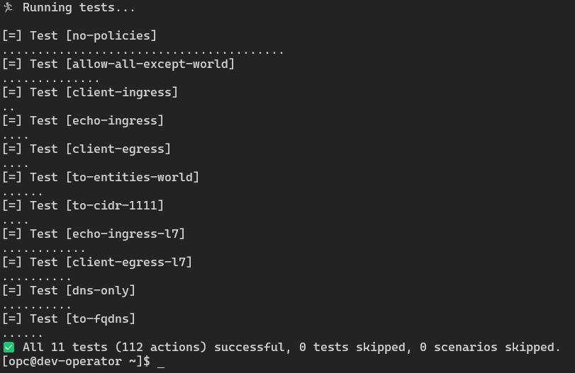

# Kubernetes 在 Oracle Cloud 上与 Cilium CNI 和 OKE 联网

> 原文：<https://medium.com/oracledevs/cni-adventures-with-kubernetes-on-oracle-cloud-cilium-5c6f011746d5?source=collection_archive---------0----------------------->

直到最近，当你使用 OKE 处理你的 Kubernetes 工作负载时，你的 pod 网络的唯一网络选项是你尊敬和友好的邻居 CNI，[法兰绒](https://github.com/flannel-io/flannel)。法兰绒比较简洁。它只处理你的 pod 网络，对做其他事情不感兴趣。

然而，Kubernetes 用例在复杂性、多样性和其他*关系方面已经爆炸了。结果，我们见证了 CNI 寒武纪大爆发。现在至少有 [25 个](https://kubernetes.io/docs/concepts/cluster-administration/networking/)，最近我们通过[发布我们的 VCN 本地 pod 网络](https://blogs.oracle.com/cloud-infrastructure/post/announcing-vcn-native-pod-networking-for-kubernetes-in-oci)加入了这个派对。这个词很拗口，所以为了简洁起见，我称它为" **NPN。**“NPN 使 Kubernetes pods 能够拥有来自 VCN 子网的 IP 地址。想象一下，您的 Kubernetes pods 与您的虚拟机或裸机节点或其他工作负载位于同一网络中。那是 NPN。

NPN CNI 提供的可能性是巨大的，我们已经在努力在 terraform-oci-oke 中增加对它的支持。由于我还没有完全掌握这一点的重要性，我将避免对此发表意见，以便您可以同时阅读我的同事 Ajay 和 Greg 的[博客公告](https://blogs.oracle.com/cloud-infrastructure/post/announcing-vcn-native-pod-networking-for-kubernetes-in-oci)或[文档](https://docs.oracle.com/en-us/iaas/Content/ContEng/Concepts/contengpodnetworking_topic-OCI_CNI_plugin.htm)以了解更多细节。

我前面提到过，法兰绒是精简和简单的，只关心豆荚的网络。嗯，大部分是。如果你在 OCI 管理你自己的 Kubernetes 集群，并且有额外的需求，例如网络策略，你可能会从[列表中选择另一个 CNI](https://kubernetes.io/docs/concepts/cluster-administration/networking/)，例如[OCI 的 ClusterAPI 默认安装 Calico](https://oracle.github.io/cluster-api-provider-oci/networking/infrastructure.html)。由于 OKE 是一项托管服务，您不能随便选择一项服务来代替法兰绒。相反，您可以部署另一个 CNI，它 1)与法兰绒共存良好，2)提供网络策略功能。使用 Calico 进行网络策略是[与 OKE](https://docs.oracle.com/en-us/iaas/Content/ContEng/Tasks/contengsettingupcalico.htm) 的良好记录。它已经使用[有一段时间了](https://lmukadam.medium.com/installing-and-using-calico-on-oracle-container-engine-oke-c61c12608cb6)，它也是[地形模块上的一个选项](https://github.com/oracle-terraform-modules/terraform-oci-oke/blob/main/docs/instructions.adoc#installing-calico)。

但是今天我们将探索一种新的 CNI:纤毛。你会问，为什么是纤毛？首先，我的队友舍伍德·泽恩已经谈论它很久了。事实上，他一直没有停止谈论这件事。另一方面，我想探索它的一些特点，特别是 eBPF。


在本文中，我们将了解以下内容:

1.  如何在 OKE 上部署纤毛作为 CNI
2.  如何使用 Cilium 实现 Kubernetes 网络策略
3.  利用哈勃、普罗米修斯和格拉夫纳的可观测性

## 在 OKE 上安装纤毛作为 CNI

使用您认为合适的任何方式来配置 OKE 集群:OCI 控制台快速创建、 [Terraform OKE 模块](https://github.com/oracle-terraform-modules/terraform-oci-oke)或命令行。如果您使用 OCI 控制台，请确保选择自定义创建>法兰绒覆盖:


在这一点上，如果您只是好奇并想尝试一下，您可以为 API 端点分配一个公共 IP 地址。如果您仍然希望使用私有端点，那么您需要能够在某个时候访问您的 API 服务器(至少对于本文来说是这样)。如果是这种情况，[检查您的集群访问选项](https://docs.oracle.com/en-us/iaas/Content/ContEng/Tasks/contengdownloadkubeconfigfile.htm)或者您可以使用 [Terraform OKE 模块](https://github.com/oracle-terraform-modules/terraform-oci-oke)并使用 instance_principal 启用操作员主机。

对于节点池，请确保至少有一个包含至少两个工作节点的节点池。这是因为默认情况下，纤毛部署 2 个副本。如果您使用的是 [Terraform OKE 模块](https://github.com/oracle-terraform-modules/terraform-oci-oke)，您可以使用以下要点中的示例代码:

[https://gist . githubusercontent . com/Hyder/030 C2 c 66 BD 07 B1 CD 65 DD 27 e 8009844 b 1/raw/4 f 0 a 38 e 61 f 91d 95 AC 9 ff 1 a 89 eead 8478 ad 4815 EB/cluster . TF](https://gist.githubusercontent.com/hyder/030c2c66bd07b1cd65dd27e8009844b1/raw/4f0a38e61f91d95ac9ff1a89eead8478ad4815eb/cluster.tf)

在 terraform.tfvars 中填入值，运行 terraform init 并应用，然后等待集群创建完成。从这里开始，我假设您正在使用 [Terraform OKE 模块](https://github.com/oracle-terraform-modules/terraform-oci-oke)，并且您已经启用了操作员。ssh 到操作员，并检查您是否能够到达 API 服务器。请注意操作主机上 kubectl 的方便的缩写别名(k，h ):

```
[opc@dev-operator ~]$ k get nodes
NAME          STATUS   ROLES   AGE   VERSION
10.0.108.37   Ready    node    54m   v1.23.4
10.0.93.111   Ready    node    54m   v1.23.4
```

添加 cilium helm repo 并在本地生成清单以供编辑:

```
helm repo add cilium https://helm.cilium.io/
helm show values cilium/cilium > cilium.yaml
```

修改 cilium.yaml 并将默认值更改为以下值:

```
containerRuntime:
  integration: crio
hubble:
  tls:
    enabled: false
hubble:
  relay:
    enabled: true
hubble:
  ui:
    enabled: true
ipam:
  mode: "kubernetes"
clustermesh:
  useAPIServer: true
```

安装纤毛:

```
helm install cilium cilium/cilium --namespace=kube-system -f cilium.yaml
```

下载 cilium cli:

```
CILIUM_CLI_VERSION=$(curl -s https://raw.githubusercontent.com/cilium/cilium-cli/master/stable.txt)
CLI_ARCH=amd64
if [ "$(uname -m)" = "aarch64" ]; then CLI_ARCH=arm64; fi
curl -L --fail --remote-name-all https://github.com/cilium/cilium-cli/releases/download/${CILIUM_CLI_VERSION}/cilium-linux-${CLI_ARCH}.tar.gz{,.sha256sum}
sha256sum --check cilium-linux-${CLI_ARCH}.tar.gz.sha256sum
sudo tar xzvfC cilium-linux-${CLI_ARCH}.tar.gz /usr/local/bin
rm cilium-linux-${CLI_ARCH}.tar.gz{,.sha256sum}
```

并检查状态。此时，您会得到一些错误，因为有些 pod 尚未被 cilium 管理，可能是因为它们在 Cilium 本身运行之前就已启动:

```
[opc@dev-operator ~]$ cilium status
    /¯¯\
 /¯¯\__/¯¯\    Cilium:         OK
 \__/¯¯\__/    Operator:       OK
 /¯¯\__/¯¯\    Hubble:         1 errors
 \__/¯¯\__/    ClusterMesh:    disabled
    \__/
DaemonSet         cilium             Desired: 2, Ready: 2/2, Available: 2/2
Deployment        hubble-ui          Desired: 1, Ready: 1/1, Available: 1/1
Deployment        hubble-relay       Desired: 1, Unavailable: 1/1
Deployment        cilium-operator    Desired: 2, Ready: 2/2, Available: 2/2
Containers:       cilium             Running: 2
                  hubble-ui          Running: 1
                  hubble-relay       Running: 1
                  cilium-operator    Running: 2
Cluster Pods:     2/5 managed by Cilium
Image versions    cilium             quay.io/cilium/cilium:v1.12.0@sha256:079baa4fa1b9fe638f96084f4e0297c84dd4fb215d29d2321dcbe54273f63ade: 2
                  hubble-ui          quay.io/cilium/hubble-ui-backend:v0.9.0@sha256:000df6b76719f607a9edefb9af94dfd1811a6f1b6a8a9c537cba90bf12df474b: 1
                  hubble-ui          quay.io/cilium/hubble-ui:v0.9.0@sha256:0ef04e9a29212925da6bdfd0ba5b581765e41a01f1cc30563cef9b30b457fea0: 1
                  hubble-relay       quay.io/cilium/hubble-relay:v1.12.0@sha256:ca8033ea8a3112d838f958862fa76c8d895e3c8d0f5590de849b91745af5ac4d: 1
                  cilium-operator    quay.io/cilium/operator-generic:v1.12.0@sha256:bb2a42eda766e5d4a87ee8a5433f089db81b72dd04acf6b59fcbb445a95f9410: 2
Errors:           hubble-relay       hubble-relay    1 pods of Deployment hubble-relay are not ready
```

注意只有 2/5 的荚果是由纤毛控制的。我们需要确保它们都由纤毛控制。让我们去猎杀那些没有的。Cilium 非常有用地提供了一个脚本来帮助您识别它们:

```
curl -sLO https://raw.githubusercontent.com/cilium/cilium/master/contrib/k8s/k8s-unmanaged.sh
chmod +x k8s-unmanaged.sh
```

您将得到类似下面的输出:

```
[opc@dev-operator ~]$ ./k8s-unmanaged.sh
Skipping pods with host networking enabled...
error: the server doesn't have a resource type "cep"
kube-system/coredns-5695dcc5cf-44rm6
kube-system/coredns-5695dcc5cf-pwj9g
kube-system/hubble-relay-859488fdc9-h6d75
kube-system/hubble-ui-5cbf89dcff-7nqvj
kube-system/kube-dns-autoscaler-6d89b5d4c-x92wz
```

删除上面的窗格并重新创建它们:

```
kubectl -n kube-system delete pod <pod-name-1> <pod-name-2>
```

再次检查状态，所有指示灯都应该为绿色，并且所有 pod 现在都应该由纤毛管理:

```
cilium status
```


此时，我们可以将法兰绒 daemonset 移除，因为我们不需要它:

```
kubectl delete -n kube-system daemonset kube-flannel-ds
```

让我们横向扩展节点池，使其规模翻倍至 4。我们的纤毛状态应该还是全绿。是的，它是:


我们现在可以运行连通性测试:

```
cilium connectivity test
```

我们所有的测试都应该通过:



现在让我们测试一下 Hubble UI。如果您创建了一个公共集群，并且所有的 kubectl/helm 都是在本地完成的，那么您只需运行 hubble UI，如下所示:

```
cilium hubble ui
```

cilium cli 将自动设置必要的端口转发，并在本地打开浏览器。如果您通过 operator 进行所有的交互，请打开一个新的终端并对其进行 ssh，如下所示，以创建一个隧道:

```
ssh -i ~/.ssh/id_rsa -J opc@<bastion-ip> opc@<operator-ip> -L 8080:localhost:8080 -L 8081:localhost:8081 
```

登录后，获取 Hubble UI pod 的名称，并使用 kubectl 对其进行端口转发:

```
POD_NAME=$(kubectl -n kube-system get pod --selector=k8s-app=hubble-ui  -o jsonpath='{.items[*].metadata.name}')
kubectl -n kube-system port-forward $POD_NAME 8081:8081
```

在您的浏览器上，通过端口 8081:[http://localhost:808](http://localhost:8080)1 访问 Hubble UI。在单独的终端上，再次运行连通性测试，并在 Hubble UI 中选择 cilium-test 名称空间:


纤毛现在在 OKE 完全可以使用。

## 测试网络策略

现在让我们测试一个[拒绝所有的简单网络策略](https://github.com/ahmetb/kubernetes-network-policy-recipes/blob/master/01-deny-all-traffic-to-an-application.md)。运行一个带有标签 *app=web* 的 nginx Pod，并将其暴露在端口 80:

```
kubectl run web --image=nginx --labels="app=web" --expose --port=80
```

运行临时 Pod 并向"*web "*服务发出请求:

```
kubectl run --rm -i -t --image=alpine test-$RANDOM -- sh
If you don't see a command prompt, try pressing enter.
/ # wget -qO- http://web
<!DOCTYPE html>
<html>
<head>
<title>Welcome to nginx!</title>
<style>
html { color-scheme: light dark; }
body { width: 35em; margin: 0 auto;
font-family: Tahoma, Verdana, Arial, sans-serif; }
</style>
</head>
<body>
<h1>Welcome to nginx!</h1>
<p>If you see this page, the nginx web server is successfully installed and
working. Further configuration is required.</p>
<p>For online documentation and support please refer to
<a href="http://nginx.org/">nginx.org</a>.<br/>
Commercial support is available at
<a href="http://nginx.com/">nginx.com</a>.</p>
<p><em>Thank you for using nginx.</em></p>
</body>
</html>
```

我们得到回应。在 Hubble UI 中，我们还可以看到正在转发的流量:


现在，让我们创建一个拒绝所有流量的网络策略:

```
kind: NetworkPolicy
apiVersion: networking.k8s.io/v1
metadata:
  name: web-deny-all
spec:
  podSelector:
    matchLabels:
      app: web
  ingress: []
```

将它保存到 web-deny-all.yaml 并应用它:

```
kubectl apply -f web-deny-all.yamlnetworkpolicy.networking.k8s.io/web-deny-all created
```

在临时窗格中，再次运行命令来访问 nginx，但设置 2s 超时:

```
wget -qO- --timeout=2 http://web
```

这一次，超时了。在 Hubble UI 流日志中，我们还看到流量被丢弃:


Traffic dropped

您可以尝试使用[其他网络策略](https://github.com/ahmetb/kubernetes-network-policy-recipes)或 Cilium 自己的[网络策略教程](https://docs.cilium.io/en/stable/gettingstarted/#network-policy-security-tutorials)来了解使用 Cilium 进行网络策略的可能性。

删除您创建的网络策略，以便我们继续本练习的第 3 部分，例如

```
kubectl delete -f web-deny-all.yaml
```

## 捕获网络指标

我们想做的最后一点是了解我们的网络是如何运作的。首先，我们需要安装普罗米修斯和格拉夫纳。我们将使用 [kube-prometheus-stack](https://artifacthub.io/packages/helm/prometheus-community/kube-prometheus-stack) 。

```
helm repo add prometheus-community https://prometheus-community.github.io/helm-charts

helm repo update

helm show values prometheus-community/kube-prometheus-stack > kube-prometheus-stack.yaml
```

编辑 kube-prometheus-stack.yaml 并更改以下内容:

```
prometheus:
  prometheusSpec:
    serviceMonitorSelectorNilUsesHelmValues: false
```

并使用 helm 安装 kube-prometheus-stack 图表:

```
helm install kps --namespace monitoring prometheus-community/kube-prometheus-stack -f kube-prometheus-stack.yaml --create-namespace
```

接下来，编辑 cilium.yaml 并更改以下内容:

```
prometheus:
  enabled: true
prometheus:
  serviceMonitor:
    enabled: true
operator:
  prometheus:
    enabled: true
operator:
  prometheus:
    serviceMonitor:
      enabled: true
hubble:
  metrics:
    enabled:
    - dns
    - drop
    - tcp
    - flow
    - icmp
    - http
hubble:
  metrics:
    serviceMonitor:
      enabled: true
hubble:
  relay:
    prometheus:
      enabled: true
hubble:
  relay:
    prometheus:
      serviceMonitor:
        enabled: true
```

使用包含以下指标的新配置升级 helm 版本:

```
helm upgrade cilium cilium/cilium --namespace=kube-system -f cilium.yaml
```

部署完成后，将端口转发到 Prometheus 服务:

```
kubectl -n monitoring port-forward svc/kps-kube-prometheus-stack-prometheus 8080:9090
```

并且在另一个终端上连接到 grafana 服务:

```
kubectl -n monitoring port-forward svc/kps-grafana 8081:80
```

要访问 Prometheus UI 以便试验 Prometheus 查询，请在 [http://localhost:8080/](http://localhost:8080/) 上打开浏览器，要访问 Grafana，请在 [http://localhost:8081 上打开浏览器。](http://localhost:8081.)使用默认的 Grafana 用户名&密码登录:admin/prom-operator。然后导入具有以下 id 的仪表板:

*   15513:【https://grafana.com/grafana/dashboards/15513】T4
*   15514:[https://grafana.com/grafana/dashboards/15514](https://grafana.com/grafana/dashboards/15514)
*   15515:[https://grafana.com/grafana/dashboards/15515](https://grafana.com/grafana/dashboards/15515)

在 Prometheus 上，您应该能够看到纤毛指标和目标:


再次运行 cilium 连接测试以生成一些流量:

```
cilium connectivity test
```

在 Prometheus 的图形页面上，输入以下查询并点击执行:

```
sum(rate(cilium_k8s_client_api_calls_total{k8s_app=”cilium”}[1m])) by (pod, method, return_code)
```

你应该能看到这样的图表:


在 Grafana 仪表盘上，您可以找到更多有趣的信息。例如，下面的截图显示了哈勃度量仪表板的一部分


Hubble metrics in Grafana

而下面的示例显示了 Cilium Agent metrics 仪表板的一部分:


Cilium Agent metrics in Grafana

虽然我可以猜测或查看[纤毛监测文档](https://docs.cilium.io/en/stable/operations/metrics/)，但我实际上不知道这些指标中的大多数意味着什么*还是*，但我喜欢我的图表(大部分)是填充的和丰富多彩的。更重要的是，他们告诉我法兰绒和纤毛在 OKE 上共存是可能的，这为我们的用户提供了选择和机会。

## 摘要

CNI 是集装箱技术领域最具竞争力的细分市场之一。不同的玩家有一种或多种渴望，他们创造了一套真正迷人的网络项目。更不寻常的是，它们都遵守 CNI 规范，在某些情况下，共存得相当好，Oracle 现在是 NPN 的成员之一。

在未来几周，我们将更详细地了解 NPN，以帮助用户进行规划和采用，同时完成其在 [Terraform OKE 模块](https://github.com/oracle-terraform-modules/terraform-oci-oke)中的包含。现在，我希望你喜欢这篇关于纤毛的文章。

## 确认

我要感谢以下人员对本文做出的重要贡献:

*   舍伍德·泽恩
*   德文·克劳斯
*   阿维·米勒

## 参考

https://antrea.io/的安特里亚 CNI

https://oracle.github.io/cluster-api-provider-oci/ OCI[集群 API](https://oracle.github.io/cluster-api-provider-oci/)

纤毛文件:【https://docs.cilium.io/en/stable/ 

纤毛舵图:[https://artifacthub.io/packages/helm/cilium/cilium](https://artifacthub.io/packages/helm/cilium/cilium)

法兰绒的工作原理:[https://www.sobyte.net/post/2022-07/k8s-flannel/](https://www.sobyte.net/post/2022-07/k8s-flannel/)

Kube Prometheus Stack Helm 图表:[https://artifact hub . io/packages/Helm/Prometheus-community/kube-Prometheus-Stack](https://artifacthub.io/packages/helm/prometheus-community/kube-prometheus-stack)

Kubernetes 生态系统的状态:第一版、第二版:[https://thenewstack . io/ebooks/Kubernetes/State-of-Kubernetes-Ecosystem-second-edition-2020](https://thenewstack.io/ebooks/kubernetes/state-of-kubernetes-ecosystem-second-edition-2020)

注册我们的[免费等级](https://signup.cloud.oracle.com/?language=en&sourceType=:ex:tb:::::&SC=:ex:tb:::::&pcode=)来玩一把吧。

有问题吗？让我们在[公共开发者松弛通道](https://bit.ly/devrel_slack)上讨论吧！