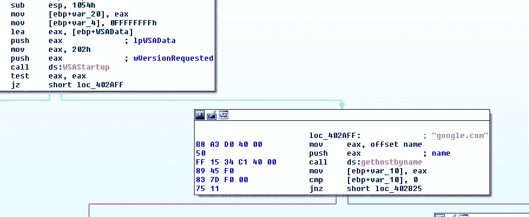
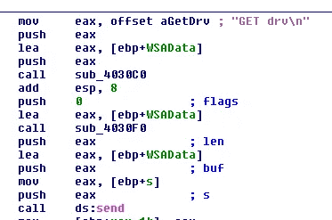
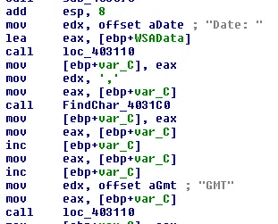
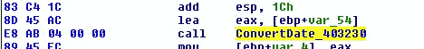
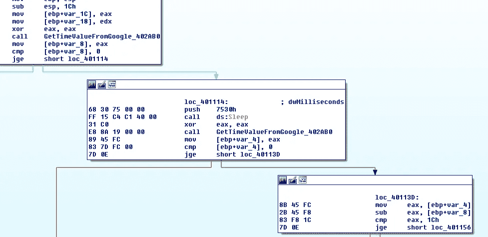
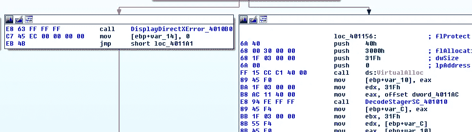
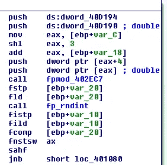
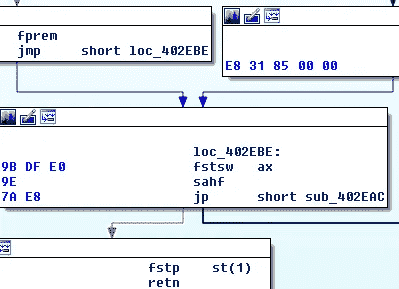

# 利用浮点数学的钴击分级器

> 原文：<https://medium.com/walmartglobaltech/cobaltstrike-stager-utilizing-floating-point-math-9bc13f9b9718?source=collection_archive---------0----------------------->


作者:杰森·里维斯和约书亚·普拉特

# 行动纲要

1.  新的 CobaltStrike stagers 利用浮点助记符[1]来解码 stager 外壳代码。
2.  使用原始套接字和谷歌头的日期值来检查被覆盖的睡眠值，如在一些沙盒爆炸。

# 日期检查

stager 采用了一种有趣的技术来检查是否在受控环境(如沙箱)中被引爆，这可能会覆盖睡眠值，同时它还会检查网络连接。

stager 利用原始套接字通过端口 80 连接到“google.com ”,并发送 GET 请求。



Raw socket to google.com

在包括 Wireshark[2]和 Suricata[3]在内的大多数实用程序中，该请求不被解析为 HTTP 请求，因为它是不完整的，只有一个换行符，没有回车符。



Incomplete request

该请求足以从 web 服务器检索 404 响应，然后恶意软件开始解析日期以外的值，特别是解析日、年和时间值。



Parse values from response

解析出值后，它将其转换为秒，但不考虑月份。



Convert values to seconds



Time Check

上面你可以看到一个休眠调用被两个调用夹在中间，这两个调用是对负责从 google 请求中检索转换后的值的函数的调用，休眠是 30 秒，然后它检查这些值的差值是否小于 28。它正在检查该过程是否花费了不到 28 秒的时间。



Error or decode logic

如果检查失败，则会显示一条假的 DirectX 错误消息，否则将开始对登台程序外壳代码进行解码。

# 外壳代码解码

外壳代码是利用浮点助记符来解码的，从一些参与者的测试来看，这似乎很好地绕过了静态检测引擎。



Decode loop

所涉及的过程开始于使用硬编码的键值对数据表进行浮点模数运算。



fpmod

在取模之后，该值被舍入为一个 int 值。用于解码数据的示例 python 代码如下所示:

```
def fpmod_decode(key, data, l):
 out = ""
 for i in range(l):
  temp = struct.unpack_from('<d', data[i*8:])[0]
  if temp > int(temp%key):
   out += chr((ord(struct.pack('<Q', int(temp%key))[0])+1)&0xff)
  else:
   out += chr((ord(struct.pack('<Q', int(temp%key))[0]))&0xff)
 return out
```

使用我们的解码代码，我们可以快速枚举样本，以解码外壳代码并收集 IOC。

# 妥协的标志

```
cda7edc9414814ef57c31e473ce87e489bcd6f1ed8d81a504e960e184fce1609
abaf70728e6f940195e35e689cae40e0d598f2e85e2c881f8b558a45bb57cce5
7793c2fd34248236e83206fdd01b547436e966bcb6cae21adcbf61550b62daea
5d4fd3e3fef4e46cff33d0772f0c0c2c13ab7ba50cdd95f0761401652bb898de
9ee75f2d28d93c90e2cf0da6d6d0d39fe9c12ce65c7ba6b880cf1c2c94add657
7c047718e71e393bebd8147889087a4d207b125b98099b9effbf78f2291d2a68
603e112de99388f8aea461a539ae57e38ca83faf2bd43984036eb3b7080c24be
aca0a3e30d83e10197ebf1bf0fc2e7557e4e07f45066d6d1b3e997ca78d683f6
6c6e49e0e822618c21d04ffd02ab26a0cb20b296d9d5a4e0cb27a5809a416089
13177de544464a87be341fda62b7c62efd34adc858728893963d5169d2763b1f
b4dceaded7b0184ebefbdac8b6d6af543b19b248a64754ffe8cee02473cefa83adsec[.]pro
manageupdaternetwork[.]com
192.99.250[.]7
192.95.16[.]237
195.123.234[.]60
aloogi[.]com
45.141.86[.]9
185.4.65[.]139
107.181.187[.]96
5.34.179[.]35alert tcp $HOME_NET any -> $EXTERNAL_NET 80 (msg:"CS stager time check 1"; dsize:8; content:"GET drv|0a|"; offset:0; classtype:trojan-activity; sid:9000009; rev:1; metadata:author Jason Reaves;)alert tcp $HOME_NET any -> $EXTERNAL_NET 80 (msg:"CS stager time check 2"; dsize:11; content:"GET driver|0a|"; offset:0; classtype:trojan-activity; sid:9000010; rev:1; metadata:author Jason Reaves;)
```

# 参考

1.  [https://www.felixcloutier.com/x86/index.html](https://www.felixcloutier.com/x86/index.html)
2.  https://www.wireshark.org/
3.  【https://suricata-ids.org/ 