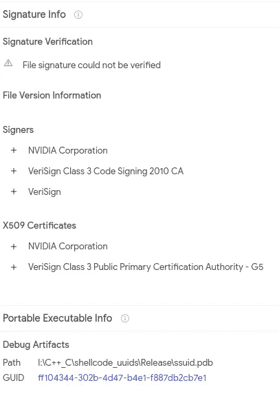

# 钴罢工 UUID 舞台

> 原文：<https://medium.com/walmartglobaltech/cobaltstrike-uuid-stager-ca7e82f7bb64?source=collection_archive---------7----------------------->

作者:杰森·里维斯


CobaltStrike 有很多有趣的 stagerss 和 loaders，我们已经讨论了一些用不同语言编写的 stager 和 loaders，2，3]。我们已经跟踪了一年多，现在它已经验证了船上的 stager 代码，最近我们看到了一个我们用来跟踪此 stager 的 YARA 规则的匹配项:

```
rule cs_hexlified_stager_sc
{
strings:
$a1 = "d2648b52308b" nocase
condition:
all of them
}
```

样本:

```
488d4cbe017c493c66a769ccb203b40cbca3396c654bfff72c1aebeb41f23297
```

然而，我们解码外壳代码的系统失败了，所以我们仔细看了一下，注意到一些有趣的事情，一个是 hexlified 外壳代码被存储为 uuid[4]，另一个是最近由 LAPSUS$[5]泄露的 NVIDIAs cert 签名的样本。



Ref: virustotal.com

通常情况下，要解码外壳代码，我们的解码器会简单地取出已加密的数据并重建它:

```
def decoder(data):
    ret = []
    c2s = []
    blob = re.findall(b'''fce8[0-9a-f]+''', data)
    for val in blob:
        if len(val)%2 >0:
            val = val[:-1]
        temp = binascii.unhexlify(val)
        s = re.findall(b'[ -~]{4,}', temp)
        t = [x.decode('cp1250') for x in s]
        c2s.append(t[-1])
        ret += t return((ret,c2s))
```

因为它是 UUIDs，所以过程仍然很简单，但是我们只需要考虑空白，然后滥用 try/catch 来结束收集:

```
idx = data.find(b'0089e8fc')
t = data[idx:].split(b'\x00')
tt = [x for x in t if x != b'']
sc = b''
c2s = []
ret = []
for val in tt:
    try:
        u = uuid.UUID(val.decode('cp1250'))
        sc += u.bytes_le
    except:
        break
if sc != '':
    s = re.findall(b'[ -~]{4,}', sc)
    t = [x.decode('cp1250') for x in s]
    c2s.append(t[-1])
    ret += t
```

示例中的调试工件将自己称为“shellcode_uuids ”,这也可用于在 VirusTotal 中查找另一个示例:

```
a59ab6c4e69fafc927f666cf1afb31a2851a392cc74336d8a31e15daf1f343ff
```

然而，stagers 看起来是相同的，所以我们可以搜索不同的东西作为支点:

```
content:"0089e8fc-"
```

这导致更多的样本，因为我们已经有了一个解码器，我们可以很容易地为我们已经考虑的样本枚举 IOC，但还有一些其他的混合。例如，与其他样本相比，具有无序 UUIDs 的 GoLang 样本:

```
07122c83922c50b386a060d4fbf21433042118fccf5bc678f78acd377d5dccfe
```

要解码，我们只需找到代码中第一个 UUID 的偏移引用，然后遍历表进行重建:

```
if b'Go build ID' not in data:
    t = data[idx:].split(b'\x00')
    tt = [x for x in t if x != b'']
else:
    pe = pefile.PE(data=data)
    memdata = pe.get_memory_mapped_image()
    idx = memdata.find(b'0089e8fc')
    imgbase = pe.OPTIONAL_HEADER.ImageBase
    val_to_find = struct.pack('<I', imgbase + idx)
    offset = data.find(val_to_find)
    blob = data[offset:]
    tt = []
    done = False
    while not done:
        temp = struct.unpack_from('<I', blob)[0]
        if temp == 0:
            break
        temp -= imgbase
        val = memdata[temp:temp+36]
        tt.append(val)
        blob = blob[16:]
```

解码数据:

```
['49.234.114.124'] [';}$u', 'D$$[[aYZQ', ']hnet', 'hwiniThLw&', 'WWWWWh:Vy', 'QQhP', 'SPhW', 'RRRSRPh', 'SVh-', 'hE!^1', 'QVPh', '/XjDV', 'ebW*', 'User-Agent: Mozilla/5.0 (compatible; MSIE 10.0; Windows NT 6.2; Win64; x64; Trident/6.0; Touch)', 'Lio[', '[E$Y', 'Wetb', '49.234.114.124']
```

还有一些 UUIDs 结构颠倒的其他示例:

```
9bfd19e3e459118981bf8ca009acca84f5f079ad3a7baa5eb6a1b20f97d3e922
```

我们只需要考虑解码后的外壳代码是 16，这意味着我们在最后，我们可能需要颠倒顺序:

```
if len(sc) == 16:
    #reversed
    tt = re.findall(b'''[a-f0-9]{8}\-[a-f0-9]{4}\-[a-f0-9]{4}\-[a-f0-9]{4}\-[a-f0-9]{12}''', data)
    sc = b''
    for val in tt[::-1]:
        try:
            u = uuid.UUID(val.decode('cp1250'))
            sc += u.bytes_le
        except:
            break
```

解码数据:

```
['47.116.23.73'] [';}$u', 'D$$[[aYZQ', ']hnet', 'hwiniThLw&', 'WWWWWh:Vy', 'SPhW', 'RRRSRPh', 'VhuF', 'SVh-', 'hE!^1', 'QVPh', '/jquery-3.3.1.slim.min.js', '5O!P%@AP[4\\PZX54(P^)7CC)7}$EICAR-STANDARD-ANTIVIRUS-T', 'Accept: text/html,application/xhtml+xml,application/xml;q=0.9,*/*;q=0.8', 'Accept-Language: en-US,en;q=0.5', 'Referer: [http://code.jquery.com/'](http://code.jquery.com/'), 'Accept-Encoding: gzip, deflate', 'User-Agent: Mozilla/5.0 (Windows NT 6.3; Trident/7.0; rv:11.0) like Gecko', '5O!P%@AP[4\\PZX54(P^)7CC)7}$EICAR-STANDARD-ANTIVIRUS-TES', '47.116.23.73']
```

## IOCs:

```
144.168.57.182
49.234.114.124
img.googlesoftup.com
7355-120-239-40-185.ngrok.io
132.232.40.201
159.75.127.118
81.68.200.63
150.158.166.73
47.116.23.73
8.142.131.209
172.29.25.27
169.254.41.35
```

## 用户代理:

```
User-Agent: Mozilla/5.0 (Windows NT 10.0; WOW64) AppleWebKit/537.36 (KHTML, like Gecko) Chrome/78.0.3904.108 Safari/537.36 QIHU 360EE
User-Agent: Mozilla/5.0 (compatible; MSIE 9.0; Windows NT 6.1; Win64; x64; Trident/5.0; Avant Browser)
User-Agent: Mozilla/5.0 (compatible; MSIE 10.0; Windows NT 6.2; WOW64; Trident/6.0; ASU2JS)
User-Agent: Mozilla/5.0 (compatible; MSIE 9.0; Windows NT 6.1; Trident/5.0; BOIE9;ENIN)
User-Agent: Mozilla/5.0 (compatible; MSIE 10.0; Windows NT 6.2; WOW64; Trident/6.0; MAARJS)
User-Agent: Microsoft Internet Explorer
User-Agent: Mozilla/5.0 (compatible; MSIE 10.0; Windows NT 6.2; WOW64; Trident/6.0; MATBJS)
User-Agent: Mozilla/5.0 (Windows NT 6.3; Trident/7.0; rv:11.0) like Gecko
User-Agent: Mozilla/5.0 (compatible; MSIE 10.0; Windows NT 6.1; WOW64; Trident/6.0)
User-Agent: Mozilla/5.0 (compatible; MSIE 10.0; Windows NT 6.2; Win64; x64; Trident/6.0; Touch)
User-Agent: Mozilla/4.0 (compatible; MSIE 9.0; Windows NT 6.1; Trident/5.0)
User-Agent: Mozilla/5.0 (compatible; MSIE 10.0; Windows NT 6.2; WOW64; Trident/6.0; Touch; MASPJS)
```

## 哈希:

```
fc16b66c98a897df46a91a4ac913993ef4ebf440250051fef1d3151d5c9faeab
f175df01577971262f662f15e36c633e0dedd6c0fff9c22bcf5f702ddecc05b7
dd4d27b29f656b5ad1f5cd177b138fe011cc98f5383a102c9a363de0a0021226
dd3416fa926a9801928d8dafd595ce6c3f41ad909ef4c25deb1b9b6a928e3749
ca9fcd4be0990d19aff9244f47ad05cb033abe4307c51b7b46b635ecca71c3f5
c916d2ee316491ec643b2b029e4e3acced82eeeb6896d42c9e9693e8d0e495ad
c5c586c5c0ad28761dfaef0d049ed4b862be1398ac2fd75cd04e359170777bd8
bc1936c3a33d4e75603341786227bbe8887a19d7b61926ddbe8875fabd1471fe
a59ab6c4e69fafc927f666cf1afb31a2851a392cc74336d8a31e15daf1f343ff
a3b268e6ecc6d2594d2dfdaeb86c25e9baf337f83659d6a718206474b8c416a1
9bfd19e3e459118981bf8ca009acca84f5f079ad3a7baa5eb6a1b20f97d3e922
8cd86fa95c702dca17ea75893f27ac414e1947fc90ca86bcd38d209ede2ee19b
8c80fa876b01544e85b8588209cefc99827f1a882580778b87274d157b88eda6
8869be33e23370d19c17f33cb5b2e1501b95eafcfd9b71b34bc338f477bc5a3e
80907d4e3519cf212e755b4cc175ce807cf2313ad16d85020f985670be87a4c9
804c3e3709e35949311bae50a1d98d8233c26cf193ff27d439d9da025ab6f94f
6cbe5b78e2c82b3e98fdff531aaf49dd8a7191015af8eb63366eb468693a0532
6237bbef07de46d11d45b4997fc661114f092abcbbe1108b0f6d7508e55e4398
61f47f9b7f68ac996bc3a56c16f7dd4aedbeba6a5d7b46e8406505fc6903524c
588454f02cba40703ed7f6dfe256ecaba3c41bbd80ed1cc0e34ba8d2214c05d0
57c1c1e2f214f4a933fa356219acaec3bb338e6fb15dd6349e6cf04a5289a2e4
53c337b5f52ac1d21ba226e4d027f01a80cc6176cb1d3f1ad1148cf37c8c75eb
488d4cbe017c493c66a769ccb203b40cbca3396c654bfff72c1aebeb41f23297
47df2d7eb512a533511104c939bfa89e6266d3ce9f0ffdced681768e183244a6
44d6dd82e5b7ca8976c50c9165ce822fbef86075a7bde43cfd364e28f30e400c
42d9638489f248f1177b86739d1d9ce2a9f4aa591523cd7655b324853895e857
3ba3aaecbc834da3dba0ec5d20d5c9cb119f27bc660f720f6cc3da929da0e529
398b4205fe8f4d1bf005782bd05730c45c39224c14b2878865dd3d7a255cd20b
38f4167638607dd6a299d3c02ceb984fc4f9d7491d4c25a609186e582e705505
317dc94e847fec42f101709043eff4d705b531b1e1d433f7af1f4ef62185e194
2cfdacdc363ddf146d59add3bf49b49a29df951ff3be4bf35e70c2125b2751d1
2c3db921dd86b801b9e856c28830990311db52b18f3a1f4a100eb84d3aaf55a7
24d66bc81ac389c5580a7de37f531cd89e5dbf97f3048e5164a1cb829d16c51b
24b60dfda87cebafec57f827b0fc534bc3fe3afa178b5f15683fe30bcf4041fe
23084aa205a2a09623752e0fa807c722a9a23c169eb5f7a04fb50a8c4f7a6924
1322219fff925f6081bb38c09d8215b796fbc910003a2df2ad627558479f2cf8
07122c83922c50b386a060d4fbf21433042118fccf5bc678f78acd377d5dccfe
033b1cad6953ad623cbc565fa7afb4751cac1b25f5050dab08646faafff29619
```

## YARA:

```
rule cs_hexlified_stager_sc
{
strings:
$a1 = "d2648b52308b" nocase
condition:
all of them
}
```

# 参考

1:[https://medium . com/walmartglobaltech/investigation-into-the-state-of-nim-malware-14c c543 af 811](/walmartglobaltech/investigation-into-the-state-of-nim-malware-14cc543af811)

2:[https://medium . com/Walmart global tech/trick bot-crews-new-cobalt strike-loader-32 c 72 b 78 e 81 c](/walmartglobaltech/trickbot-crews-new-cobaltstrike-loader-32c72b78e81c)

3:[https://medium . com/walmartglobaltech/investigation-into-the-state-of-nim-malware-part-2-a 28 bffffa 671](/walmartglobaltech/investigation-into-the-state-of-nim-malware-part-2-a28bffffa671)

4:[https://en.wikipedia.org/wiki/Universally_unique_identifier](https://en.wikipedia.org/wiki/Universally_unique_identifier)

5:[https://threat post . com/nvidias-stopped-code-signing-certs-sign-malware/178784/](https://threatpost.com/nvidias-stolen-code-signing-certs-sign-malware/178784/)