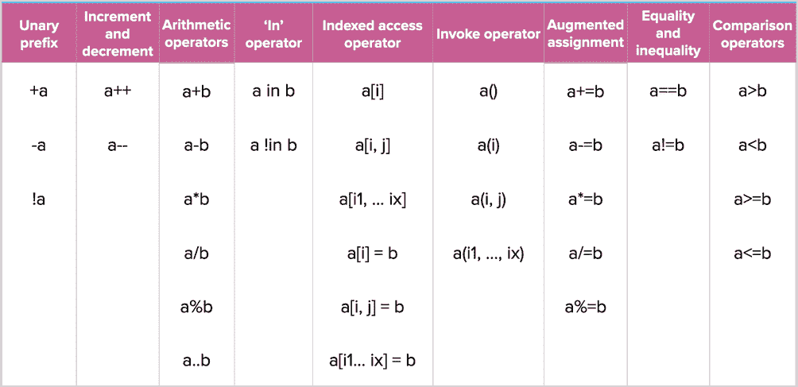

# 带有运算符重载的代码 expressivity++

> 原文：<https://medium.com/androiddevelopers/code-expressivity-with-operator-overloading-ada22a0ca633?source=collection_archive---------0----------------------->


## 科特林词汇

当我们处理可以添加、删除、比较或连接的类型时，我们最终会得到需要反复编写的冗长代码。在 Kotlin 中，借助于[操作符重载](https://kotlinlang.org/docs/reference/operator-overloading.html)，我们可以为这些类型编写更具表现力和简洁的代码。

我像热爱 Android 一样热爱的一件事是在唱诗班唱歌，所以让我们用一个歌手唱诗班的例子来说明运营商重载的好处。假设我们有一个歌手合唱团，我们想在我们的合唱团中增加一名歌手。我们将编写如下所示的代码:

我们会增加一个新的歌手，像这样:

```
choir.addSinger(singer)
```

但是这种操作更适合于`+=`操作符，所以调用它会感觉更自然:

```
choir += singer
```

请继续阅读，寻找答案:

*   如何用[操作符重载](https://kotlinlang.org/docs/reference/operator-overloading.html)在 Kotlin 中实现这个？
*   什么样的操作符可以实现，你可以在 Android 的什么地方利用它们。
*   编写自己的运算符时需要注意的最佳实践。
*   Kotlin 编译器在幕后做什么。

# 运算符重载基础

通过运算符重载，您可以为任何类型的预定义运算符集提供实现。运算符要么通过成员函数重载，要么通过使用相应成员函数的扩展函数重载。例如，`+`操作符可以通过`plus()`函数重载，`+=`操作符可以通过`plusAssign()`函数重载。注意操作者不连锁:如果你过载`+`，`++`也不会被照顾。

要重载一个操作符，你需要在 fun 之前使用 operator 关键字，然后指定你想要重载哪个操作符。如果不使用 operator 关键字，编译器会将其视为普通的 Kotlin 函数，甚至不会编译！

以下是可以在 Kotlin 中重载的操作符:



For a full list of operators that can be overloaded and their corresponding functions, see [here](https://kotlinlang.org/docs/reference/operator-overloading.html).

# 怎么做

好吧，我们开始吧。我们如何让 Kotlin 中的操作符过载？

让我们使用最初例子中的 choir 类；我们需要重载`+=`操作符来添加歌手。

您可以像这样使用运算符:

瞧啊。重载的操作符使得代码更加易读和简洁。

# 您希望重载哪些其他运算符？

为一个自定义类型重载所有的操作符可能没有意义，但是通常你需要不止一个。过度使用会损害可读性，所以花些时间考虑一下你的类型以及什么重载会提高你的代码。

我们重载了`+=`操作符来添加某人到合唱团，但是我们也可能想要查看某个人是否已经是合唱团的成员。为此，让我们重载 contains 操作符，这样我们就可以使用 in 关键字。

# 扩展中的运算符重载

您也可以在扩展函数中使用运算符重载。在这个例子中，我们为 ViewGroup 重载了`+=`操作符:

```
operator fun ViewGroup.plusAssign(other: View) = addView(other)
```

现在向视图组添加视图非常简单！！

```
viewGroup += view
```

# 其他语言的最佳实践

运算符重载也在许多其他语言中使用，包括 C++、Python、Swift 和 PHP。虽然我们现在还没有 Kotlin 的明确的最佳实践，但是我们可以从其他语言中学习一些:

*   简洁并不总是等于更易读的代码。考虑一下，如果添加了运算符重载，您的代码是否真的更易读。
*   如果你重载的结果在语言的上下文中没有意义或者不清楚，你应该使用一个函数来代替。例如，如果你添加了两本书，最终产品会是什么并不明显。会是一本新书吗？它们将如何组合？如果你一定要问，那么你应该用一个函数来代替。
*   如果一个操作符过载，**仔细想想其他操作符，人们可能也会过载**。例如，如果你让`-`过载，你也会想让`-=`过载。在我们的唱诗班示例中，因为我们能够使用`+=`添加歌手，所以我们也应该能够使用`-=`删除歌手。

# 引擎盖下是什么？

运算符重载是通过用标准函数调用重写运算符来实现的。例如，添加合唱团成员的代码是:

如果我们看看反编译的 Java 代码，我们可以看到这是如何工作的:

编译器简单地用一个普通的成员函数调用替换了`+=`。

# 结论

必须小心使用运算符重载；但是当你这样做的时候，它是一个强大的工具，可以让你的代码更有表现力，更简洁。

*   确保使用 operator 关键字，否则 Kotlin 会将您的函数视为普通函数，您的代码将无法编译。
*   检查重载操作符是否真的会使你的代码可读性更好。
*   仔细考虑哪些运算符对重载您的类型有意义。

加入我赞美运营商超载的合唱团吧！

我在唱诗班演唱的额外照片！

