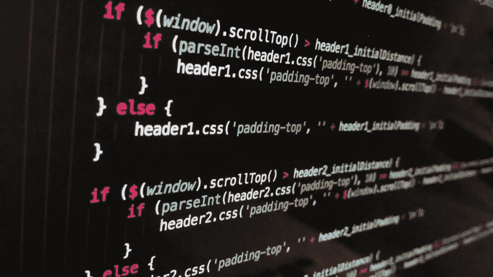
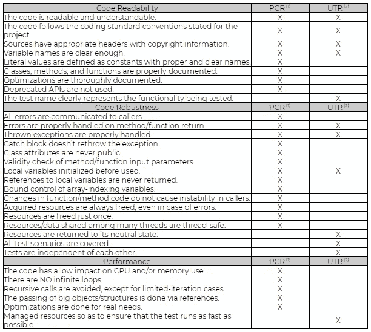

# 代码审查

> 原文：<https://medium.com/globant/code-reviews-5a648ff7b971?source=collection_archive---------0----------------------->

代码审查，或同行代码审查，是有意识地和系统地召集两个或更多的程序员来检查彼此代码中的错误的行为。这种实践已经被反复证明能够加速和简化软件开发的过程，很少有其他实践能够做到这一点。

有同行代码评审工具和软件，但是理解这个概念本身是很重要的。

软件是由人类编写的，所以我们可以很明显地说软件包含错误，但不太明显的是为什么软件开发人员经常依赖手动或自动测试来审查他们的代码，而忽视了人性的另一个伟大天赋:我们自己发现和纠正错误的能力。

无论您是软件开发主管还是程序员，您可能会忽略代码审查或代码检查的巨大好处，这显然是您自己的风险。如果做得正确，代码审查可以节省时间，简化前期的开发过程，并大大减少质量保证团队后期所需的工作量。

代码审查还可以节省资金，特别是通过捕捉可能在测试、生产和直接到最终用户的过程中未被发现的错误类型。

但是，尽管节省时间和金钱是软件开发业务中至关重要的关注点，代码评审也提供了一些额外的、更加以人为中心的 ROI。

鼓励程序员就他们的代码相互交流的工作环境有助于培养更好的交流和友谊，分散对任何一段代码的所有权，并为初级开发人员提供一个宝贵的教育环境。举例来说，这些可以学习更好的方法来编写干净的代码，用有用的快捷方式解决常见问题，并直观地识别任何数量的潜在问题点，如内存泄漏、缓冲区溢出或可伸缩性问题。

综上所述，上面提到的几点应该激励任何开发团队考虑实现一个智能的、战略性的代码评审过程，如果他们还没有这样做的话。通用代码评审方法

# **通用代码审查方法**

# 结对编程

作为极限编程(XP)的标志之一，这种编写软件片段的方法将开发人员放在一起(至少象征性地，也适用于分布式团队)，一起处理相同的代码，从而检查每个同事的工作。这是高级开发人员指导初级学员的好方法，因为代码评审直接发生在编程过程中。

# 挖苦

对于大多数开发人员来说，这比 XP 的结对编程更舒服，这种过时的技术是参与同行代码评审的最简单和最直观的方式。一旦你的代码准备好了，就找一个合格的同事坐在你的工作站前为你检查你的代码，同时向他们解释你为什么要这样写。

# 工具辅助的

我把我最喜欢的放在最后，因为可以说没有比通过基于软件的代码评审工具更简单、更有效的方法了，其中一些工具是基于浏览器的，或者与各种标准 IDE 和 SCM 开发框架无缝集成。

软件工具解决了上述方法的许多限制，以清晰和一致的顺序跟踪同事的评论和对缺陷提出的解决方案，使评审能够异步和非本地地发生，当新的评审进来时向原始编码者发出通知，并保持整个过程有效地进行，没有会议，没有人必须离开他们的办公桌来贡献。

一些工具还允许需求文档被审查和修改，并且，重要的是，还可以生成关键的使用统计，提供过程改进和遵循报告所需的审计试验和审查度量。

以下是最流行的静态代码评审工具(按字母顺序排列)。

*   代码场景
*   合作者
*   严酷的考验
*   格里特
*   开源代码库
*   Trac 同行评审
*   造粒机
*   审查委员会
*   可回顾的
*   罗德码
*   韦拉码
*   视觉专家

# 代码审查的最佳实践

一个成功的代码评审同行评审策略需要在严格记录的过程和一个没有威胁的协作环境之间取得平衡。高度严格的同行评审会扼杀生产力，然而懒散的过程往往是无效的。领导和架构师负责找到一个中间地带，在那里同行评审可以是高效和有效的，同时促进团队成员之间的开放交流和知识共享。

# 指导您进行有效的同行代码评审的技巧

# 一次检查几行代码

在一家世界级软件公司的许多编程团队中进行的一项研究表明，开发人员一次应该审查不超过 200 到 400 行代码(LoC)。大脑只能在一次拍摄中有效地处理这么多信息；超过 400 LoC，发现缺陷的能力减弱。

实际上，在 60 到 90 分钟内审查 200 到 400 个 LoC 应该会发现 70%到 90%的缺陷。因此，如果在代码中存在 10 个缺陷，一个适当进行的审查将会发现其中的 7 到 9 个。

# 从容做

假设别人会发现你没有发现的错误，很容易就能轻松地完成一篇很长的评论。然而，研究表明，当速度超过每小时 500 LoC 时，缺陷密度会显著下降。在有限的时间内，以较慢的速度进行合理数量的代码评审，会产生最有效的代码评审。

# 每次复习时间不要超过 60 分钟

就像你不应该过快地审查代码一样，你也不应该一次审查太长时间。当人们在一段时间内从事任何需要集中精力的活动时，大约 60 分钟后，表现开始下降。研究表明，在一项任务中休息一段时间可以大大提高工作质量。进行更频繁的评审可以减少进行冗长评审的需要。

# 设定目标并获取指标

在实施一个过程之前，你的团队应该决定你将如何衡量同行评审的有效性，并指定一些具体的目标。

通过使用不同的标准开始设置一些指标。这些信息应该给你一个关于你的代码是如何改进的可量化的图像。

实事求是地说，只有自动化或严格控制的过程才能提供可重复的度量。度量驱动的代码审查工具自动收集数据，因此您的信息是准确的，没有人为的偏见。

# 作者应该在评审前注释源代码

作者应该在评审之前对代码进行注释，因为注释指导评审者完成修改，显示首先要查看哪些文件，并为每个代码修改背后的原因辩护。

注释应该针对其他审阅者，以简化过程并提供更多的上下文深度。另一个好处是，作者经常会在同行评审开始前发现额外的错误。在同行评审之前发现的错误越多，缺陷密度就越低，因为总体上存在的错误就越少。

# 使用清单

你团队中的每个人都可能一遍又一遍地犯同样的 10 个错误。特别是遗漏是最难发现的缺陷，因为很难检查不存在的东西。

清单是消除经常犯的错误和应对遗漏发现挑战的最有效的方法。

代码审查清单还为团队成员提供了对每种类型审查的明确期望，并有助于跟踪报告和过程改进的目的。

推荐的清单由三部分组成:

*   **代码可读性**:代码编写和文档记录的整洁程度以及可读性。
*   **代码健壮性**:与:
*   处理意外情况的能力。
*   适当的资源处理。
*   **性能**:包括速度效率和内存管理。

以下是推荐的代码审查清单:

(1) Production Code Review (2) Unit Test Review

# 建立修复发现缺陷的流程

即使在通过时间限制评审、限制每小时评审的 LoC，以及为您的团队命名关键度量来优化您的代码评审过程之后，仍然缺少一个关键的评审步骤。这些漏洞将如何修复？这似乎是显而易见的，但是许多团队并没有一个系统的方法来修复他们辛辛苦苦发现的 bug。

确保缺陷得到修复的最佳方式是使用协作式代码评审工具，该工具允许评审人员记录 bug，与作者讨论它们，并批准代码中的更改。如果没有自动化的工具，在评审中发现的 bug 可能不会记录在团队通常的缺陷跟踪系统中，因为它们是在代码发布到 QA 之前被发现的。

# 培养积极的代码评审文化

同行评审会给人际团队关系带来压力。让每一项工作都受到同行的批评，让管理层评估和度量代码中的缺陷密度是很困难的。因此，为了使同行代码评审成功，领导者在同行评审中创造一种合作和学习的文化是极其重要的。

虽然很容易将缺陷视为纯粹的负面影响，但是每个 bug 都是团队提高代码质量的机会。同行评审也允许初级团队成员向领导学习，甚至让最有经验的程序员改掉坏习惯。

在同行评审中发现的缺陷不是用来评估团队成员的可接受的标准。从同行代码评审中提取的报告不应该在性能报告中使用。如果个人度量标准成为报酬或晋升的基础，开发人员将会对该过程产生敌意，并自然地专注于改进个人度量标准，而不是编写更好的整体代码。

# 拥抱同行评审的潜意识含义

知道别人会检查他们的工作自然会驱使人们生产更好的产品。

上面提到的研究发现，抽查 20%到 33%的代码会以最小的时间开销产生较低的缺陷密度。如果你的代码有 1/3 的机会被要求评审，那就足以激励你去仔细检查你的工作。

# 练习轻量级代码评审

在电子邮件、肩扛、微软 Word、工具辅助以及所有类型的混合之间，有无数种方式来协作地评审代码。然而，为了充分优化您的团队的时间，并有效地度量其结果，推荐一个轻量级的、工具辅助的过程。

上面提到的研究发现，轻量级代码审查花费的时间不到正式审查的 20%,并且发现同样多的 bug。

正式的或重量级的检查平均每 200 LoC 需要 9 个小时。虽然通常是有效的，但是这种严格的过程需要多达六个参与者和数小时的会议来翻阅详细的代码打印件。

# 真实世界的良好实践

下面的实践，来自几个开发人员在多年经验中所做的评论，主要是为了避免在代码审查中可能出现的冲突。重点必须始终放在提高代码质量上，而不是争夺“最佳程序员”奖。

# 代码审查人员的良好实践

*   **问题，而不是陈述:**陈述可以作为指控。如果除了陈述别无选择，请考虑以下替代方案:
*   避免“为什么”的问题:一个以“为什么”开头的问题可能看起来像一个陈述一样具有指责性。
*   一个问题有多种解决方案:代码并不坏，只是因为它与你想象的编码方式不同。
*   **表扬:**不要只批评缺陷，要表扬做得好的事情。
*   **专注于代码，而不是编码员:**关注的是代码的质量，而不是一个人的好坏。

# 开发人员的良好实践

*   代码不是你。虽然你创建了被评审的代码，但是不要把自己放在防御的位置，要努力学习。
*   创建你自己的清单:它必须包括评论者倾向于关注的问题，主要是那些对你更有问题的问题。

# 摘要

当提到提高组织的效率时，代码审查过程起着关键的作用。具体来说，利用正确的代码评审工具可以帮助您在开发周期中消除冗余和缺陷风险。