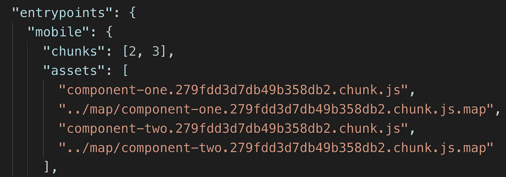
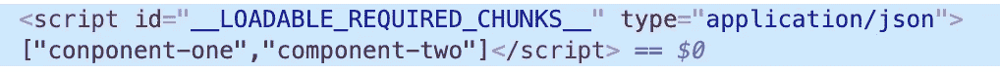

# 代码拆分:优点和挑战

> 原文：<https://medium.com/walmartglobaltech/code-splitting-virtues-and-challenges-ccab03bbc29d?source=collection_archive---------3----------------------->

Image by Gerald Friedrich from Pixabay

日常用户访问数百个网站，只停留几分钟。根据谷歌的研究，如果网页加载时间超过 3 秒，53%的访问会被放弃。哪怕只减少几分之一秒的网页加载时间也会带来收入的增加。

随着 React 和 Webpack 的出现，将所有内容捆绑在一个包中并提供给用户已经成为一种常见的做法。这对第一次使用的用户有很大的负面影响，因为他们得到了大量未使用的代码。如果我们能够只交付与该场景相关的代码片段，我们就可以提高我们站点的性能。代码分割，如果做得正确，可以帮助实现这一点。

两种主要的代码拆分方法是-
1 .反应慵懒悬疑
2。可加载组件

# 反应慵懒而悬疑

这是 React 的官方方法。先说个例子。

Example — Single Bundle

假设我们的 *main.bundle.js* 有两个组件 Header 和 Filter。 *HeaderComponent* 呈现在每个页面上，但 *FilterComponent 却不是这样。*仅当 *isFilterOpen* 开关开启时才呈现。像这样的组件已经成熟，可以从主包中分离出来，形成自己的有条件加载的块。所以，我们分了吧。

Example — Bundle Splitting with React lazy and Suspense

*React.lazy()* 需要一个调用动态导入()作为参数的函数。[动态导入由 Webpack](https://webpack.js.org/guides/code-splitting/#dynamic-imports) 处理。这个导入将我们的 FilterComponent 放在一个单独的块中，这将我们的 *main.bundle* 的大小减少了 50 KB，并且返回一个*承诺。React Lazy* 仅当存在对 React 组件的需求时，才将这个*承诺*解析为 React 组件，在我们的示例中，这个需求由*is filterepon 控制。*

当*is filterepon*变为真时，可能需要一些时间来加载单独的块*。对于这段时间间隔，我们需要回退内容作为填充，类似于加载屏幕。悬念在这里派上了用场。它需要一个后备道具作为填充。*

就是这样！你已经拆分了你的组件，但是等待你可能会遇到一个“页面闪烁”的问题。

React Lazy 为代码分割提供了一个很好的接口，但遗憾的是它只有客户端支持。如果您对一个也进行服务器端渲染的网站使用 React lazy，您会在网站加载时看到闪烁效果。这是因为 React 不知道水合所需的所有分割块，因此它丢失了由服务器端呈现创建的上下文。

如果服务器可以提供关于在服务器端渲染期间使用的分割块的信息，并且如果我们可以让 React hydration 等待所有块加载，那么我们可以避免这种闪烁问题。这正是可加载组件为我们做的。

# 可加载组件

如果你依赖于服务器端渲染，React 建议使用[可加载组件](https://www.smooth-code.com/open-source/loadable-components/docs/server-side-rendering/)来拆分你的组件。可加载组件由四部分组成—
1。[可加载组件函数](https://www.npmjs.com/package/@loadable/component)，工作原理类似 React.lazy.
2。[可加载服务器](https://www.npmjs.com/package/@loadable/server)与 React DOM 服务器
3 协同工作。[可加载的 Babel 插件](https://www.npmjs.com/package/@loadable/babel-plugin)用于转换代码，以实现服务器上的同步加载和客户端上的异步加载。
4。[可加载的 Webpack 插件](https://www.npmjs.com/package/@loadable/webpack-plugin)生成一个扩展的 stats 文件，该文件包含传递给服务器端代码的所有分割块依赖关系的信息。

Sample — Loadable Stats file

Example — Bundle Splitting with Loadable Components

在上面的例子中，您可以看到 React.lazy 和可加载组件之间的相似性。除此之外，服务器端的渲染也需要修改，以增加对可加载组件的支持。

Example — Server-side rendering with Loadable Components

如上所示，可加载组件从 stats 文件创建一个提取器。这个提取器为所需的块创建脚本标签，并在 DOM 中传递它们，如下所示。

现在信息在客户端可用，我们必须让我们的入口组件在水合之前等待这些块。该任务由 *loadableReady()* 函数处理。

Example — Delaying hydration until Loadable Components is ready

一旦加载了所需的块，就调用传递给 *loadableReady()* 的回调。这延迟了客户端主组件的水合，直到我们的状态与服务器端一致，解决了闪烁问题。

我们已经成功地创建了一个单独的块，但它是优化的吗？

# Webpack 的分割块插件

不管您选择 React Lazy 还是 Loadable，您的分割块并不总是不相交的集合。您的程序块很有可能包含重复的代码。这不但不会提高你的表现，反而会降低你的表现。

Webpack4 有一个名为 [SplitChunksPlugin](https://webpack.js.org/plugins/split-chunks-plugin/) 的插件，可以用来删除重复代码。我不能在这篇博文中深入探究这个插件的细节，但是希望在以后的博文中会涉及到。在那之前，你可以阅读 [Webpack 的文档](https://webpack.js.org/plugins/split-chunks-plugin/)。

我希望这篇博客文章可以作为您代码拆分工作的一个良好起点。让我们共同减少互联网上的 JS 膨胀。开心分裂！