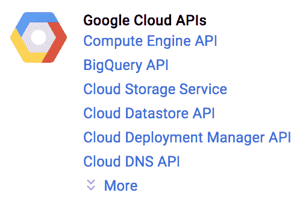

# CodeLab——用 BigQuery 连接 Google 上的操作

> 原文：<https://medium.com/google-developer-experts/codelab-connect-actions-on-google-with-bigquery-db0d1933f467?source=collection_archive---------0----------------------->


最近我创建了一个新的 codelab，教授如何用 BigQuery 连接 AoG，我认为在这里发布它会很好。

但是为什么我需要将 AoG 连接到 BigQuery 呢？

如果说在房地产领域，一切都是为了“位置、位置、位置”，那么我的数字产品就是为了“数据、数据、数据”。如果您计划收集和分析大量数据，您可能应该使用 BigQuery 来完成这项工作。

在这个 codelab 中，我将展示如何收集我们从操作中获得的基本可用数据，以及如何创建一个有助于读取数据的仪表板。

享受实验室

# 1.概观

谷歌上的行动是一个开发者平台，让你可以创建软件来扩展谷歌虚拟个人助理[的功能，跨越 5 亿多种设备，包括智能扬声器、电话、汽车、电视、耳机等。](https://assistant.google.com/)

用户在对话中使用谷歌助手来完成事情，比如购买食品杂货或预定行程(关于现在可能的完整列表，请参见[行动目录](https://assistant.google.com/explore/))。)作为开发人员，您可以使用 Google 上的操作来轻松创建和管理用户与您自己的第三方服务之间愉快而有效的对话体验。

该平台提供基本的分析工具，如活跃用户和中止率。作为开发人员，您可能希望对报告有更多的控制，并创建自己的包含操作数据的分析报告。在这个 codelab 中，你将学习如何将你的动作的所有活动日志存储到 BigQuery 中，以便对其进行分析。

此 codelab 模块是多模块教程的一部分。每个模块可以单独学习，也可以与其他模块一起学习。在每个模块中，您将获得如何根据给定的软件需求构建操作的端到端指导。我们还将教授实现动作的必要概念和最佳实践，为用户提供高质量的对话体验。

这个 codelab 涵盖了使用 Google 上的动作进行开发的中级概念。我们强烈建议您在开始本代码实验室之前，熟悉[Google Assistant(Level 1)](https://codelabs.developers.google.com/codelabs/actions-1/index.html)的构建操作和[Google Assistant(Level 2)](https://codelabs.developers.google.com/codelabs/actions-2/index.html)的构建操作中涵盖的主题。

# 你将建造什么

在这个 codelab 中，您将构建一个使用 BigQuery 记录数据复杂对话操作。

# 你会学到什么

*   如何在 bigQuery 上创建 DB 表？
*   如何将数据从动作加载到 BigQuery。

# 你需要什么

您的环境中必须有以下工具:

*   您选择的 IDE/文本编辑器，如 [WebStorm](https://www.jetbrains.com/webstorm) 、 [Atom](https://atom.io/) 或 [Sublime](https://www.sublimetext.com/) 。
*   安装了 NodeJS、npm 和 git 的运行 shell 命令的终端。
*   一个网络浏览器，比如 [Chrome](https://www.google.com/chrome/) 。
*   关于[GitHub.com 的一个记述。](https://github.com/)(可以免费创建一个。)
*   强烈建议您熟悉 JavaScript (ES6 ),尽管不是必需的，以理解本代码实验室中使用的 webhook 代码。

# 2.这项技术

# BigQuery

BigQuery 是谷歌针对超大型数据集的数据分析服务。它有一个 RESTful API，支持用 SQL 编写的查询。如果您有带纬度和经度值的数据，它们可用于按位置查询您的数据。其优势在于，您可以直观地探索非常大的数据集来查看模式，而无需管理任何服务器或数据库基础架构。使用 BigQuery 强大的可伸缩性和托管基础设施，无论您的表有多大，您都可以在几秒钟内获得问题的答案。

# 3.为当地发展而设立

在[为 Google Assistant (Level 2)](https://codelabs.developers.google.com/codelabs/actions-2/index.html) 构建行动中，您使用了 Dialogflow 和 fulfillment 来快速启动您的第一个行动项目。

对于这个代码实验室，您将从 2 级代码实验室的操作开始。

如果您已经完成了 Google Assistant(Level 2)codelab 的[构建操作，请转到下一步。](https://codelabs.developers.google.com/codelabs/actions-2/index.html)

如果您是从零开始，请执行以下操作:

# 下载您的基本文件

要获得这个 codelab 的基本文件，运行以下命令来克隆 2 级 codelab 的 GitHub 存储库。

git 克隆[https://github.com/actions-on-google/codelabs-nodejs](https://github.com/actions-on-google/codelabs-nodejs)

该存储库包含以下重要文件:

*   level 2-complete/functions/index . js。包含您的 webhook 实现代码的 Javascript 文件。这是您将要编辑的主文件，以便添加附加的操作和功能。
*   level 2-complete/functions/package . JSON*。*该文件概述了 Node.js 项目的依赖关系和其他元数据。对于此 codelab，您可以忽略此文件；如果您想在 Google client library 或其他 Node.js 模块上使用不同版本的操作，您应该只需要编辑这个文件。
*   Level 2-complete/code lab-Level-two . zip。这是 Level 2 codelab 的代理文件。如果您已经完成了 1 级和 2 级代码实验室，您可以放心地忽略此文件。
*   为了清楚起见，将/level2-complete 目录名重命名为/level4。您可以在终端中使用 mv 命令来实现这一点。例如:

```
$ cd codelabs-nodejs
$ mv ./level2-complete ./level4
```

# 设置您的项目和代理

接下来，您需要为 codelab 设置 Actions 项目和 Dialogflow 代理。

1.  打开[动作控制台](https://console.actions.google.com/)。
2.  点击**添加/导入项目**。
3.  键入一个**项目名**，比如“actions-codelab-4”。此名称供您自己内部参考；稍后，您可以为项目设置一个外部名称。
4.  点击**创建项目**。
5.  与其挑选类别，不如点击右上角的**跳过**。
6.  点击**构建您的操作**，然后点击**添加操作**
7.  单击添加您的第一个操作。
8.  在**创建动作**对话框中，选择**自定义意图**，然后点击**构建**启动 Dialogflow 控制台。
9.  在 Dialogflow 控制台的**创建代理**页面中，点击**创建**。
10.  单击左侧导航栏上的齿轮图标。
11.  点击**导出和导入**。
12.  点击**从 Zip 文件中恢复**。


1.  从您之前创建的/level4 目录中上传 codelab-level-two.zip 文件。
2.  输入“恢复”并点击**恢复**按钮。
3.  点击**完成**。

# 部署您的履行

现在，您的操作项目和 Dialogflow 代理已经准备就绪，请执行以下操作，使用 Firebase Functions CLI 部署您的本地 index.js 文件:

1.  在终端中，导航到基本文件克隆的/level4/functions 目录。
2.  使用您设置的操作项目 ID，运行以下命令:

```
firebase use <PROJECT_ID>
```

> 提示:您的动作的项目 ID 可以在动作控制台中的概述>(齿轮图标) >项目设置下找到。


在终端中运行以下命令来安装依赖项。

```
npm install
```

在终端中运行以下命令，将 webhook 部署到 Firebase。

```
firebase deploy
```

> 提示:如果您看到一条错误消息，上面写着“发生了意外错误”，尝试再次运行 firebase deploy 命令。

几分钟后，您应该看到“部署完成！”表明您已经成功地将 webhook 部署到 Firebase。

# 检索部署 URL

您需要向 Dialogflow 提供云函数的 URL。要检索此 URL，请按照下列步骤操作:

1.  打开[火焰基座控制台](https://console.firebase.google.com/)。
2.  从选项列表中选择您的操作项目。
3.  导航到左侧导航栏上的**开发>功能**。如果提示您“选择数据共享设置”，您可以通过点击**稍后再做**忽略此选项。
4.  在**仪表板**选项卡下，您应该会看到一个“dialogflowfirbaseflementation”条目，其 URL 位于**触发器**下。复制此 URL。


# 在 Dialogflow 中设置 URL

现在，您需要更新您的 Dialogflow 代理，以使用您的 webhook 来实现。为此，请按照下列步骤操作:

1.  打开 [Dialogflow 控制台](https://console.dialogflow.com/)(如果您愿意，可以关闭 Firebase 控制台)。
2.  导航至左侧导航栏上的**完成**。
3.  启用 **Webhook** 。
4.  如果您从 Firebase 仪表板复制的 URL 尚未出现，请粘贴它。
5.  点击**保存**。


# 验证您的项目设置是否正确

此时，用户可以通过显式调用您的操作来开始对话。一旦用户在交谈中，他们可以通过提供一种颜色来触发“最喜欢的颜色”的自定义意图。Dialogflow 将解析用户的输入，以提取您的履行所需的信息，即颜色，并将其发送到您的履行。然后，您的订单会自动生成一个幸运数字发送给用户。

> 提示:您可以在本[指南](https://developers.google.com/actions/tools/simulator)中找到关于使用动作控制台模拟器的最新信息。如果您在下面列出的步骤中遇到任何问题，请参考那里。

要在动作控制台模拟器中测试您的动作:

1.  在 Dialogflow 控制台左侧导航中，点击**集成>谷歌助手**。
2.  确保**自动预览更改**已启用，并点击**测试**以更新您的行动项目。
3.  动作控制台模拟器加载您的动作项目。要测试您的操作，请在**输入**字段中键入“与我的测试应用对话”,然后点击 enter。
4.  你应该会看到这样的回复:“你好，为了更好地了解你，我需要从谷歌上得到你的名字。这样可以吗？”
5.  键入“否”。
6.  您应该会看到一个响应:“好的，不用担心。你最喜欢什么颜色？”
7.  键入“蓝色”。
8.  你应该会看到一个回应:“你的幸运数字是 4。”

> 如果您看不到此响应，可能是您的 Firebase 设置有问题。在这种情况下，请尝试重复“部署您的实施”部分下的步骤。

# 4.设置 BigQuery

登录谷歌云平台控制台([console.cloud.google.com](http://console.cloud.google.com/))，选择行动项目。在屏幕的顶部，有一个项目下拉菜单:


# 启用计费

必须对此项目启用计费。一旦启用了计费，您就可以启用 BigQuery API 了。

> 注意:在这个 codelab 中运行的查询不应该收费，但是如果您超过了 [BigQuery 免费等级](https://cloud.google.com/bigquery/pricing)(每月 1TB 的数据查询)，您可能会产生费用。

如何启用计费取决于您是在创建新项目还是在为现有项目重新启用计费。

谷歌提供价值高达 300 美元的 12 个月免费试用谷歌云平台，你可以在 https://cloud.google.com/free/[了解更多细节。](https://cloud.google.com/free/)

# 新项目

创建新项目时，系统会提示您选择要链接到项目的付费帐户。如果您只有一个帐单帐户，该帐户会自动链接到您的项目。

如果您没有计费帐户，您必须创建一个帐户并为您的项目启用计费，然后才能使用许多 Google Cloud Platform 功能。要创建新的计费账户并为您的项目启用计费，请遵循[创建新的计费账户](https://support.google.com/cloud/answer/6288653#new-billing)中的说明。

# 现有项目

如果您有一个临时禁用开单的项目，您可以重新启用开单:

1.  转到[云平台控制台](https://console.cloud.google.com/)。
2.  从项目列表中，选择要重新启用计费的项目。
3.  打开控制台左侧菜单，选择计费。系统会提示您选择一个计费帐户。
4.  点击**设置账户**。

# 创建新的账单账户

要创建新的计费帐户:

1.  转到[云平台控制台](https://console.cloud.google.com/)并登录，如果您还没有帐户，请注册。
2.  打开控制台左侧菜单，选择**计费**
3.  点击**新建计费账户**按钮。(请注意，如果这不是您的第一个帐单帐户，首先您需要打开帐单帐户列表，方法是单击页面顶部附近现有帐单帐户的名称，然后单击管理帐单帐户。)
4.  输入帐单帐户的名称，并输入您的帐单信息。您看到的选项取决于您的帐单邮寄地址所在的国家。请注意，对于美国帐户，您不能在创建帐户后更改纳税状态。
5.  点击**提交**和**启用计费**。

默认情况下，创建计费帐户的人是该帐户的计费管理员。

有关验证银行账户和添加备用支付方式的信息，请参见[添加、删除或更新支付方式](https://support.google.com/cloud/answer/6293589)。

# 启用 BigQuery API

打开谷歌云控制台，点击左侧菜单中的 **API 管理器**项。您可能需要点击左上方的三线图标来打开**产品和服务**菜单。


如果您在仪表板页面上，它也可能在主页上显示为卡片。


在 API 管理器屏幕上，点击主屏幕顶部的**启用 API** 。

将显示 API 列表。



找到并点击 **Google BigQuery API** 。

在 BigQuery 页面上，如果 API 尚未启用，单击 **Enable** 。

# 5.在 BigQuery 中创建数据集和表

# 在 BigQuery 中创建新表

在谷歌云平台控制台([https://console.cloud.google.com/bigquery](https://console.cloud.google.com/bigquery))上进入 BigQuery，选择行动项目。在屏幕的顶部，有一个项目下拉菜单:


在资源下选择您的项目名称，并点击**创建数据集**。

在弹出区域，将“报表”设置为**数据集 ID** ，点击**创建数据集**


在左侧面板中，数据集“reports”将被添加到项目名称下。选择它并点击**创建表格**


将**目的表**中的表名设置为“actionLog”

并将模式更改为“作为文本编辑”

然后将这个 JSON 复制到:

```
[{"description": "Time","name": "time","type": "TIMESTAMP","mode": "REQUIRED"},{"description": "User ID","name": "userId","type": "STRING","mode": "NULLABLE"},{"description": "Conversation ID","name": "conversationId","type": "STRING","mode": "NULLABLE"},{"description": "Intent","name": "intent","type": "STRING","mode": "NULLABLE"},{"description": "Raw text","name": "text","type": "STRING","mode": "NULLABLE"},{"description": "Response Text","name": "responseText","type": "STRING","mode": "NULLABLE"},{"description": "Locale","name": "locale","type": "STRING","mode": "NULLABLE"}]
```

点击**创建表格**

现在是时候设置将数据加载到 BigQuery 的操作了

# 6.将 BigQuery 客户端 API 添加到您的操作中

这个代码实验室使用了 [BigQuery Node.js 客户端 API](https://www.npmjs.com/package/@google-cloud/bigquery)

# 安装客户端库:

```
npm install — save @google-cloud/bigquery
```

# 在 index.js 中设置 BigQuery 连接

在 index.js 的副本中添加以下几行:

```
// Imports the Google Cloud client libraryconst BigQuery = require(‘@google-cloud/bigquery’);// Your Google Cloud Platform project IDconst projectId = ‘YOUR_PROJECT_ID’;const datasetId = ‘reports’;const tableId = ‘actionLog’;// Creates a BigQuery clientconst bigquery = new BigQuery({projectId: projectId,});
```

# 添加报告功能

创建一个向 BigQuery 报告动作活动的新函数。

在这个代码实验室中，你将收集动作提供的所有基本数据，但在你自己的动作中，你可以添加更多你收集的信息(用户名，游戏级别等。)

```
function report(conv, line) {const logInput = {time: bigquery.timestamp(new Date()),userId: conv.user.id,text: conv.input.raw,intent: conv.intent,locale: conv.user.locale,responseText: typeof line === ‘string’ ? line : JSON.stringify(line),conversationId: conv.id,};let dataset = bigquery.dataset(datasetId);let errors = dataset.table(tableId).insert([logInput]);if (errors && errors.length && errors[0].insertErrors) {console.error(‘Bigquery Insert failed’, errors[0].insertErrors);}}
```

# 替换询问和关闭命令

为了在动作中的任何事件上向 BigQuery 发送更新，为 ask 和 close 创建新的函数来报告所有内容。

从添加新功能开始:

```
function ask(conv, line) {
 report(conv, line);
 conv.ask(line);
}function close(conv, line) {
 report(conv, line);
 conv.close(line);
}
```

现在用对新函数的调用替换所有的`conv.ask`和`conv.close`。

```
conv.ask(`OK, no worries. What’s your favorite color?`);
```

到

```
ask(conv, `OK, no worries. What’s your favorite color?`);
```

# 部署和测试

现在您可以部署代码并使用模拟器在 BigQuery 中创建一些日志行。

要在 BigQuery 中检查表，请转到 BigQuery 控制台:【https://console.cloud.google.com/bigquery 

在查询编辑器中键入以下 SQL 查询:

```
SELECT *FROM `YOUR_PROJECT_ID.reports.actionLog`ORDER BY time desc
```

检查您的所有活动是否都记录在表格中。

# 7.奖励—使用 Data Studio 为您的行动创建仪表板

既然已经在 BigQuery 中收集了所有的动作数据，就可以开始从中获取分析和处理信息了。

# 数据工作室

Google Data Studio 让您免费构建带有漂亮数据可视化效果的实时交互式仪表盘。您可以从各种来源获取数据，并在 Data Studio 中创建无限的报告，具有完整的编辑和共享功能。

在本例中，您将创建一个显示一段时间内新用户和返回用户计数的查询。

前往 https://console.cloud.google.com/bigquery[的 BigQuery 控制台](https://console.cloud.google.com/bigquery)

运行以下 SQL 查询:

```
SELECTday2 AS date,users,IFNULL(unique_users, 0) new_users,(users - IFNULL(unique_users, 0)) old_usersFROM (SELECTCOUNT( DISTINCT userId) users,DATE(time) day2FROM`**YOUR_PROJECT_ID**.reports.actionLog`GROUP BYday2) AS totalAllLEFT JOIN (SELECTCOUNT(DISTINCT userId) unique_users,day3FROM (SELECTuserId,MIN(DATE(time)) day3FROM`YOUR_PROJECT_ID.reports.actionLog`GROUP BYuserId )GROUP BYday3ORDER BYday3) uniqueAllONuniqueAll.day3 = totalAll.day2ORDER BYday2
```

在查询结果中，你会得到一个看起来像这样的表格:


点击 DATA STUDIO 中的**浏览**

将打开带有 Data Studio 的新选项卡。

将视图样式从表格更改为组合图


将度量设置为:用户、新用户、旧用户


将排序设置为日期和升序


转到样式选项卡，将堆叠条形图设置为打开。

在系列 1 集合上显示数据标签

在左侧 Y 轴上，将自定义刻度间隔设置为 1


> *这是您在 bigQuery 控制台上运行的查询的图表。它不会随着时间的推移而更新。为了获得实时仪表板，您必须在[https://datastudio.google.com/u/0/navigation/reporting](https://datastudio.google.com/u/0/navigation/reporting)上创建新报告。
> 
> 了解有关 DataStudio 的更多信息:[https://support.google.com/datastudio/answer/6283323?hl=en&ref _ topic = 6267740](https://support.google.com/datastudio/answer/6283323?hl=en&ref_topic=6267740)